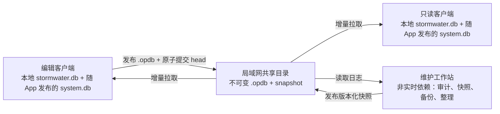
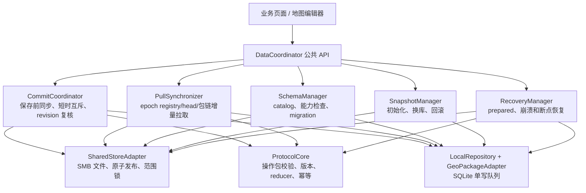
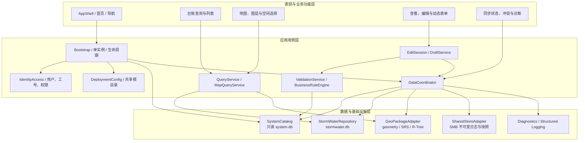
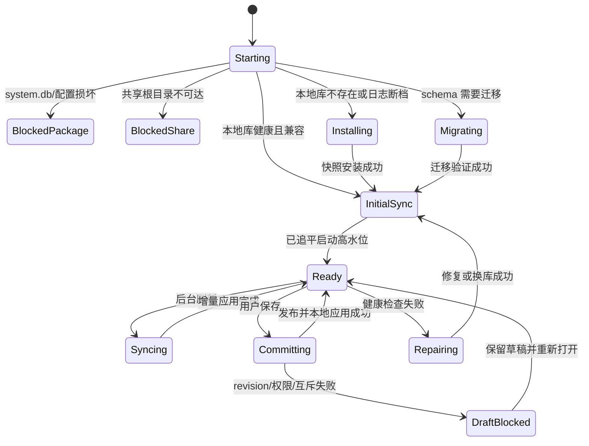
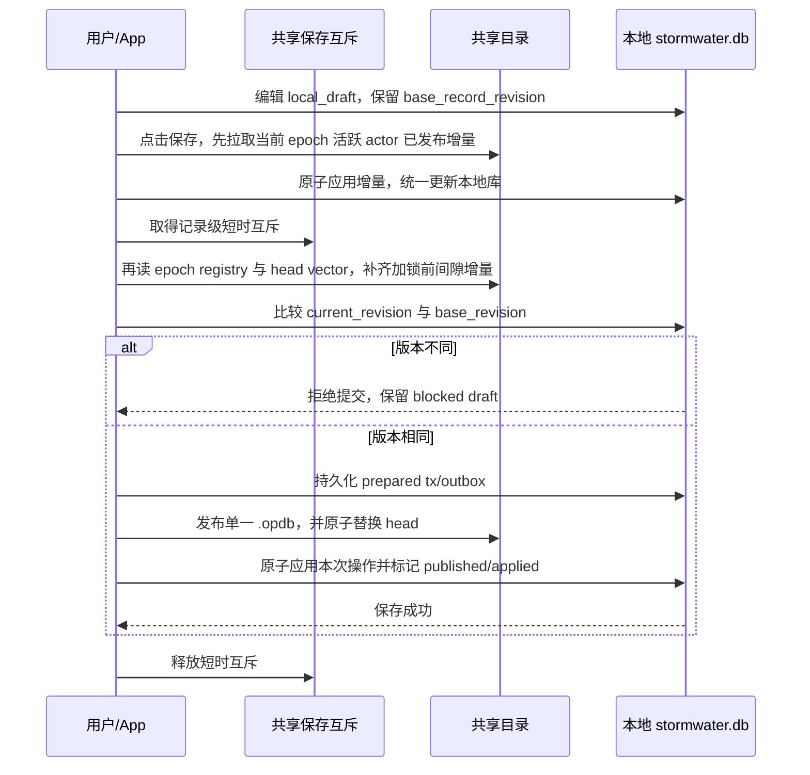
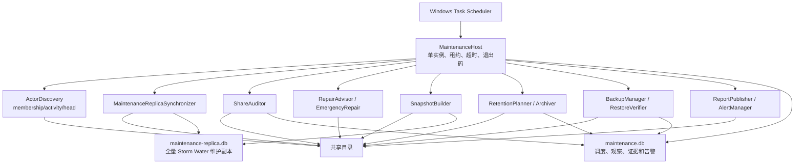

# Storm Water 桌面 App：局域网数据、同步与维护工作站设计

> 文档状态：v1 设计基线，待原型验证后冻结协议
> 最后更新：2026-07-22
> 适用范围：局域网共享磁盘、无常驻数据库/应用服务器、最多 300 个用户、约 100 个同时在线用户、最多 20 个低频编辑用户

## 1. 文档目标

本文定义一套同时支持普通属性数据和点、线、面矢量数据的局域网在线数据架构。客户端使用本地数据库提供查询和编辑性能，但正式保存必须能够访问共享目录，不支持脱离局域网的业务编辑提交。设计覆盖：

- 客户端本地数据库及空间数据结构；
- Storm Water 桌面 App 的业务、查询、地图、编辑、同步和恢复模块；
- 随 App 发布的只读 `system.db` 结构和本地 `stormwater.db` 支撑结构；
- 本地修改、待提交队列和业务事务；
- 共享磁盘上的不可变单文件操作包；
- 增量上传、下载、去重、重试和断点恢复；
- 属性、几何、删除、唯一约束和业务状态冲突；
- 版本化快照、初始化、修复和日志归档；
- 维护工作站的 5 分钟轻量任务、每日快照/审计/备份、周五日志整理和 `maintenance.db`；
- 断网、掉电、磁盘满、进程崩溃和文件损坏时的原子性；
- 性能、可观测性、用户体验、测试和分阶段实施要求。

设计优先级依次为：

1. 不丢数据、不产生静默覆盖；
2. 任何操作都可重试且不会重复生效；
3. 不依赖某一台电脑持续在线；
4. 所有客户端收到相同操作集合后能够确定性收敛；
5. 日常查询和表单编辑使用本地库，保存前必须同步共享增量并复核版本；
6. 优先在提交前拒绝冲突，剩余异常可追踪、可恢复；
7. 支持未来扩展加密，但 v1 暂不加密。

## 2. 已确认的约束与结论

### 2.1 环境约束

- 局域网内不能假设存在持续在线的服务器或数据库服务；
- 可以使用一个可靠的共享目录作为交换和持久化介质；
- 客户端可能随时退出、休眠或异常崩溃；共享根目录不可达时 App 进入明确标识的 `DegradedReadOnly` 状态；
- `DegradedReadOnly` 允许读取本地副本并显示最后成功同步时间，但禁止新建、编辑和正式保存，不提供离线写入；
- 用户总数不超过 300，同时在线通常不超过 100；
- 具有编辑权限的用户不超过 20，典型写入间隔为数分钟到数十分钟；
- 首期至少按 50 张已注册业务表设计；任一业务表都可能达到数百万条，全部业务表合计必须按数千万至上亿条记录进行容量与性能规划；
- 当前数据包括属性和点、线、面矢量数据，不存储栅格、底图和附件；
- v1 数据文件使用 `.db` 后缀，内部保持 GeoPackage/SQLite 结构；
- v1 不使用 SQLCipher，后续可通过数据访问层和迁移工具引入。
- 客户端与维护工作站应使用同一经批准的 Python 主/次版本、同一 lock 文件和同一 ProtocolCore/reducer 包版本；Python 运行时版本仅作为发布诊断元数据，不作为已验证 membership release 或 snapshot 的拒绝条件。协议、schema、协调器包和依赖锁的兼容性仍属于受控发布要求。
- 部署一台维护工作站执行 5 分钟、每日和每周任务，但它不是客户端保存链路中的服务器；停机只延迟快照、审计、备份和整理。

### 2.2 一致性边界

本系统不允许离线写入，但共享盘短暂不可达时允许使用最后一次有效同步的本地副本进行只读查询。用户编辑表单时可以暂存在本地草稿；点击正式保存时必须：同步共享目录当前已发布的增量、取得记录级短时保存互斥、比较 base revision、发布共享操作，然后才确认保存成功。网络恢复后必须先完成权威同步屏障才可离开 `DegradedReadOnly`。该模型显著减少并发冲突，同时保留不可变操作包和 reducer 作为崩溃窗口的安全网。

以下约束仍不能仅靠分散的客户端本地库自动保证：

- 全局连续且无空洞的编号；
- 实时全局唯一的业务字段；
- 库存或余额绝不小于零；
- 同一任务只能被一个用户实时领取；
- 严格串行的审批和状态流转。

此类业务必须采用 UUID、编号段预分配、额度/库存预分配、单记录 owner、暂定状态或人工终审。若必须实时保证，则需要放宽“无协调节点”约束。

## 3. 核心架构决策

### 3.1 不使用共享的活动数据库

客户端不得通过 SMB/NFS 直接打开共享磁盘上的同一个 SQLite/GeoPackage 文件。共享目录中也不维护一个被原地反复修改的 `master.db`。

系统的权威数据由两部分组成：

```text
最新已验证的不可变快照
+ 快照覆盖位置之后的所有由有效 actor head 可达的不可变操作包
```

快照是日志的压缩结果，不是系统运行的唯一依赖。没有维护客户端在线时，编辑、发布和增量同步仍然可以继续。

### 3.2 总体架构



### 3.3 各类数据存储的职责

| 数据 | 位置 | 是否可变 | 职责 |
| --- | --- | ---: | --- |
| `system.db` | 随桌面 App/工作站程序发布 | 否，运行时只读 | Schema Registry、迁移、表单、图层和能力定义 |
| `stormwater.db` | 每台客户端本地 | 是 | 日常查询、编辑、空间索引、待提交队列和旁路同步表 |
| 操作包（`.opdb`） | 共享目录 | 否 | 权威增量历史、跨客户端传输、审计和恢复 |
| 数据快照 | 共享目录 | 否 | 新客户端初始化、修复、日志压缩和长期备份 |
| `maintenance-replica.db` | 维护工作站本地 | 是 | 全量应用操作、完整性检查和快照构建来源；不是 Master |
| `maintenance.db` | 维护工作站本地 | 是 | 调度、首次观察时间、审计、快照、备份、告警和裁剪证据 |

### 3.4 App 数据协调模块

App 必须实现一个进程内单例 `DataCoordinator`（名称可按技术栈调整），统一负责数据提交、更新、同步和恢复。它是 App 内部模块，不是服务器，也不建议在 v1 拆成独立常驻进程。



职责边界：

| 组件 | 主要职责 |
| --- | --- |
| `DataCoordinator` | 生命周期、任务排队、取消、优先级、状态事件和单实例保证 |
| `CommitCoordinator` | 双阶段保存前同步、记录/唯一键保存互斥、严格 revision 比较、prepared/publish/applied 状态机 |
| `PullSynchronizer` | membership/epoch registry/head/操作包链扫描、增量下载、inbox 和 cursor 推进 |
| `SchemaManager` | schema current/release、catalog 白名单、能力协商、migration、fingerprint 和结构漂移检查 |
| `SharedStoreAdapter` | 所有 UNC/SMB 路径访问、原子 rename、flush、哈希、重试和 `LockFileEx` 封装 |
| `ProtocolCore` | 操作包编解码与验证、operation/tx 规则、确定性 reducer 和协议错误码 |
| `LocalRepository` | 业务查询、SQLite 事务、同步系统表和唯一写入队列 |
| `GeoPackageAdapter` | geometry、SRS、GeoPackageBinary、R-Tree 和空间完整性 |
| `SnapshotManager` | 首次初始化、快照选择、下载验证、原子换库和 `.previous` 回滚 |
| `RecoveryManager` | prepared/no-op、孤立 `.part`、发布中断和启动恢复 |
| `Diagnostics` | acknowledgement、指标、审计事件和用户可读状态 |

业务页面只能调用以下类型的应用接口，不得直接写业务表、同步表或共享文件：

```text
open_for_edit(entity_key)
save_local_draft(command)
commit(command)
refresh(reason)
initialize_or_repair()
ensure_schema_current()
get_status()
```

强制规则：

- App 进程内只能存在一个 `DataCoordinator` 和一个 SQLite 写入队列；
- 同一安装实例禁止启动两个进程同时复用同一 actor，本地进程互斥失败时第二个进程只提示已有实例；
- `commit()` 优先于周期刷新，但必须复用 `PullSynchronizer` 实现同步屏障，禁止另写一套同步逻辑；
- 后台 pull 只能在事务边界暂停，不能与快照换库或本地 applied 事务并发；
- SMB 文件复制和等待不能发生在 SQLite 写事务内部；本地写事务必须短小；
- 状态机错误使用稳定错误码，UI 不解析底层 SQLite/SMB 异常文本；
- 客户端与维护工作站使用同一通过依赖锁固定的 ProtocolCore/reducer 包和依赖集；不采用 Rust/Python 双实现。Python 运行时版本会被记录以便诊断，但不会单独阻止已验证 release 或 snapshot 的读取。发布前仍需运行 golden fixtures、随机化收敛测试和升级兼容测试。

### 3.5 Storm Water 桌面端完整模块设计

`DataCoordinator` 是数据一致性核心，但不是整个桌面 App。完整 App 采用四层结构，业务页面不能绕过应用用例层直接访问 SQLite、GeoPackage 或共享目录：



模块职责如下：

| 模块 | 主要功能 | 明确边界 |
| --- | --- | --- |
| `AppShell` | 首页、菜单、窗口、全局通知、当前用户和同步状态展示 | 不读取数据库、不决定同步状态 |
| `Bootstrap` | 进程单实例、包完整性、启动状态机、数据库打开顺序、优雅退出 | 启动失败必须进入明确阻断状态，不能创建空库冒充有效数据 |
| `IdentityAccess` | 从可信登录/部署信息取得 `user_id`、工号、角色和 actor 上下文 | 工号是字符串；不能让用户任意输入其他人的共享目录 |
| `DeploymentConfig` | 读取随 App 发布的共享根目录、产品 ID、环境 ID、刷新周期 | 普通用户只读；配置变化属于部署操作 |
| `SystemCatalog` | 只读访问 `system.db`，解析 schema、表/字段、迁移、表单、图层和 capability | 只描述 App 能力，不保存运行状态 |
| `QueryService` | 分页、过滤、排序、关联查询、导出前数据读取 | 统一过滤 `deleted=1`；禁止页面拼接 SQL |
| `MapQueryService` | bbox/R-Tree 候选查询、属性回查、图层可见范围、选择和定位 | 精确空间运算走 GeoPackage/GEOS 适配层 |
| `DynamicFormService` | 根据 registry 生成通用表单、字典、必填项和只读系统字段 | 专用复杂页面可以覆盖通用表单，但仍提交统一 command |
| `EditSession` | `open_for_edit`、保存 base revision、内存编辑状态和关闭提示 | 编辑期间不占共享锁 |
| `DraftService` | 本地草稿保存、崩溃恢复、被拒绝提交后的输入保留 | 草稿不是已提交业务数据，不参与普通同步 |
| `ValidationService` | 类型、长度、nullable、FK、CHECK、几何类型/SRS 等通用验证 | 规则来自已验证 registry，不执行共享目录下的任意代码 |
| `BusinessRuleEngine` | Storm Water 状态流转、跨字段和经批准的跨表规则 | 规则必须版本化；复杂规则随 App 代码发布 |
| `DataCoordinator` | 提交、拉取、schema、快照、恢复任务的唯一协调入口 | 复用第 3.4 节组件，唯一 SQLite 写队列 |
| `StormWaterRepository` | 查询对象映射、短事务、业务表和旁路同步表 | 所有写入只能由 coordinator 调用 |
| `GeoPackageAdapter` | 点线面编码、SRS、R-Tree 和空间完整性 | 禁止普通 `sqlite3` 代码直接拼装 geometry BLOB |
| `SharedStoreAdapter` | UNC/SMB 路径、原子发布、哈希、范围锁、超时和重试 | 业务模块不能直接读写共享文件 |
| `SnapshotManager` | 首次安装、损坏修复、日志断档换库、`.previous` 回滚 | 换库前保留本机 actor、draft 和未完成 outbox |
| `Diagnostics` | 结构化日志、错误码、性能指标、acknowledgement 和支持包导出 | 默认脱敏，不导出未授权业务数据 |
| `AppUpdateCompatibility` | 检查 App、`system.db`、protocol 和 schema 的兼容矩阵 | 旧版不能理解当前 release 时禁止正式保存 |

Storm Water 的设施台账、检查记录、维护工单等业务功能以 feature package 组织。每个 feature 只提供查询条件、command、业务规则和可选专用 UI；`global_id/record_revision/deleted/geometry_version`、提交、同步、快照和恢复全部复用公共数据模块。

推荐公共用例接口：

```text
bootstrap()
search(table_id, filter, page, sort)
query_map(layer_id, bbox, filter)
open_for_edit(table_id, global_id)
save_draft(edit_session_id, command)
validate(command)
commit(edit_session_id, command)
refresh(reason)
initialize_or_repair()
get_sync_status()
export_support_bundle()
```

### 3.6 桌面端运行状态机和任务优先级



状态规则：

- `BlockedShare` 下不允许查询、编辑或保存业务数据，避免用户把旧本地库误认为当前数据；
- `BlockedPackage/Migrating/Installing/Repairing` 下只开放进度、诊断、重试和退出；
- `Ready` 才开放正式编辑；后台 `Syncing` 可与只读查询并行，但不能与 SQLite applied 写事务或换库并发；
- 调度优先级为“正在完成的本地原子事务 > 用户 commit > 启动/保存同步屏障 > 周期 pull > 维护性 WAL/checkpoint/清理”；
- App 退出时不等待长时间网络操作，安全取消尚未提交 head 的任务；已经原子替换 head 的操作进入恢复流程，不能撤销为未发布。

## 4. 本地数据库格式

### 4.1 文件与连接规则

- `stormwater.db` 是每个客户端自己的可写业务库，内部格式为 GeoPackage 兼容的 SQLite 数据库；
- `system.db` 是随 App 安装包发布和更新的只读能力库，保存该 App 版本支持的 schema registry、migration 定义、capability、动态表单和通用图层配置；
- App 运行时以只读/query-only 方式打开 `system.db`，不得在其中保存 actor、cursor、outbox、migration 执行结果、用户配置或其他运行期状态；升级程序可以替换它，业务运行过程不能修改它；
- `system.db` 表示“该 App 能理解什么”，经验证的共享 `snapshots/current.json` 指针及其所指 snapshot 表示“系统当前启用了什么”；只有指针所声明的 release ID、catalog hash 和 required capabilities 均被本机 `system.db` 支持时，App 才能进入正式保存状态；
- `stormwater.db` 与 `system.db` 使用独立连接，不依赖跨数据库事务；所有必须与业务行原子提交的运行期状态仍放在 `stormwater.db`；
- `.db` 文件名是产品决定，不满足 GeoPackage 对 `.gpkg` 扩展名的标准命名要求；GDAL/OGR 创建和打开时必须显式指定 `GPKG` 驱动；
- 普通属性表与矢量要素表允许共存；
- `gpkg_contents`、`gpkg_geometry_columns`、`gpkg_spatial_ref_sys` 等标准表必须由 GeoPackage-aware 库创建和维护；
- Python `sqlite3` 可处理普通属性和同步表；几何编码、坐标转换和空间索引必须通过统一的 GeoPackage 数据访问适配层完成；
- prepared outbox 与 actor_seq 分配使用一个本地事务且不改业务表；共享发布成功后，业务写入、几何/R-Tree、`applied_operation` 和 outbox applied 状态必须使用同一底层 SQLite 连接和同一事务；
- 本地可使用 WAL；共享目录中的快照和批次不得处于打开写入状态；
- `stormwater.db`、WAL、临时排序文件和迁移工作副本必须位于本机磁盘。启动、同步、导出、索引重建和 schema 迁移前必须检查剩余空间，并按目标最大数据库规模预留 WAL、临时索引和原子换库空间。

推荐连接设置：

```sql
PRAGMA foreign_keys = ON;
PRAGMA journal_mode = WAL;
PRAGMA synchronous = FULL;
PRAGMA busy_timeout = 5000;
```

低频写入场景优先选择 `synchronous=FULL` 保证崩溃安全。只有经过断电测试和明确风险评审后，才能调整为 `NORMAL`。

### 4.2 空间表主键

每个空间要素同时使用本地整数 ID 和全局 UUID：

```sql
CREATE TABLE asset_point (
    fid                 INTEGER PRIMARY KEY,
    global_id           TEXT NOT NULL UNIQUE,
    name                TEXT,
    status              TEXT,
    geometry            BLOB,
    record_revision     TEXT NOT NULL,
    geometry_version    TEXT NOT NULL,
    deleted             INTEGER NOT NULL DEFAULT 0 CHECK (deleted IN (0, 1))
);
```

- `fid` 仅供当前客户端 GeoPackage/R-Tree 使用，不参与跨客户端同步；
- `global_id` 使用 UUID，是同步、外键、审计和业务引用的唯一标识；
- 同一要素在不同客户端可以具有不同 `fid`；
- 每张空间表固定主要几何类型和坐标参考系统；
- 点、线、面原则上分表，不将不相关的几何混装到一个通用表；
- 可能出现多段或多面的业务图层，应在第一版明确使用 `MULTILINESTRING` 或 `MULTIPOLYGON`。

普通非空间业务表同样必须使用 `global_id`，不得依赖本地自增 ID 进行同步。

### 4.3 业务表的系统维护字段

每张加入同步白名单的普通或空间业务表都只保留满足同步正确性所需的最小系统字段：

| 字段 | 要求 | 作用 |
| --- | --- | --- |
| `global_id` | 必选，TEXT/UUID、NOT NULL、UNIQUE、创建后不可修改 | 跨客户端、外键、日志和锁使用的稳定记录身份 |
| `record_revision` | 必选，NOT NULL，业务 UI 只读 | 保存前严格比较所用的不透明修订值，由 reducer 确定性重算，不使用自增数或时间戳 |
| `geometry_version` | 空间表必选，普通表不需要 | 几何字段的独立版本，用于几何变化、冲突和恢复 |
| `deleted` | 本项目所有同步业务表必选，NOT NULL、DEFAULT 0、0/1 CHECK | tombstone；删除时不立即物理删除，防止旧操作使记录复活 |

业务表不增加通用 `created_by/created_at_utc/updated_by/updated_at_utc`。提交人、actor、operation ID 和操作时间保存在不可变 operation 与审计系统表中；如果某张表的业务本身确实需要填报人、检查时间等信息，再把它们作为该表明确的业务字段加入。操作时间仍不作为因果顺序或冲突判断依据。

由于本项目各业务表未来都可能发生删除，统一为所有同步业务表增加 `deleted`，并在 catalog 中启用统一 tombstone 能力。业务删除只能把它从 `0` 改为 `1` 并发布 `delete_entity`，不得直接执行物理 `DELETE`；普通查询由 Repository 自动追加 `deleted=0`。只有某张表在未来被明确冻结为永不删除的 append-only 表时，才可以通过显式 schema policy 和 migration 例外处理，而不在通用逻辑中临时判断。

字段命名应在第一版冻结并在 schema registry 中保留。若希望明显区分内部字段，可以统一使用 Storm Water 的 `sw_` 前缀，例如 `sw_record_revision`、`sw_geometry_version`、`sw_deleted`；本文示例为简洁继续使用无前缀逻辑名。无论采用哪种物理名称，catalog 都必须为其声明稳定 `field_id`、`system_managed=true` 和 `sync_role`，动态表单默认隐藏或只读，业务提交命令不得直接赋值。

以下状态不得放在每一行业务记录中：`dirty/uploaded/sync_status`、actor sequence、操作包 ID、cursor、重试次数、下载状态和临时冲突状态。它们具有本机性或一对多关系，应保存在 `outbox_operation`、`sync_cursor`、`field_version_head`、`conflict`、`applied_operation` 等旁路系统表中，并与业务行在同一个 `stormwater.db` 事务中更新。空间表的 `fid` 也是本地 GeoPackage/R-Tree 技术键，不跨客户端同步。

SchemaManager 在创建新表时根据表类型和 delete policy 自动生成所需核心列、UNIQUE/CHECK/index 约束及隐藏/只读规则；已有表缺少核心列时必须通过显式 migration 补齐，不能在第一次收到 operation 时临时执行 DDL。

### 4.4 同步系统表（物理存放在 `stormwater.db`）

“旁路系统表”表示它们与业务表在逻辑和命名空间上隔离，并不表示放在另一个数据库文件中。以下运行期同步表全部物理存放在本地可写 `stormwater.db`，以便和业务行、几何/R-Tree 在同一 SQLite 事务内原子更新；`system.db` 只保存随 App 发布的只读定义。以下为逻辑结构，字段类型和索引在实现迁移中冻结。

#### `sync_actor`

记录当前“业务用户 × App 安装实例”的同步身份。同一台电脑切换业务用户时必须使用不同 actor；同一用户在不同设备或重装后也必须使用不同 actor：

| 字段 | 含义 |
| --- | --- |
| `actor_id` | 用户安装实例 UUID，重装、换设备或切换用户后必须生成新值 |
| `user_id` | 业务用户标识 |
| `next_actor_seq` | 下一个本地操作序号 |
| `schema_version` | 当前数据库 schema 版本 |
| `created_at_utc` | 实例创建时间 |

`actor_id + actor_seq` 在系统生命周期内唯一。旧 actor 退役后不得复用。

#### `sync_install_state`

保存当前本地库的安装基线，用于启动时与共享快照 manifest 比较。该表为单行逻辑记录：

| 字段 | 含义 |
| --- | --- |
| `installed_snapshot_id` | 本地库最初安装或最近换库所用的快照 ID |
| `installed_snapshot_sha256` | 安装时验证过的快照数据库哈希 |
| `installed_snapshot_coverage` | 安装快照的 actor coverage vector |
| `protocol_version/schema_version` | 本地协议与结构版本 |
| `replication_profile` | 本地数据范围/profile |
| `installed_at_utc` | 快照安装时间，仅用于审计和提示 |
| `last_health_check_at_utc/result` | 最近一次完整健康检查时间和结果 |

`installed_snapshot_id` 只表示本地库的基线，不代表当前数据位置；快照安装后的真实同步进度必须以 `sync_cursor` 为准。

#### schema registry 与 migration 状态

随 App 发布的只读 `system.db` 保存 `sys_schema_release`、`sys_schema_table`、`sys_schema_field`、`sys_schema_geometry` 和 `sys_schema_migration` 等定义，覆盖该 App 支持的一个或多个 schema release。定义必须能确定性导出为规范化 catalog，并计算 `schema_release_id/catalog_hash`。

可写的本地 `stormwater.db` 使用单行 `schema_install_state` 保存当前实际安装的 schema release、schema version、catalog hash、`schema_fingerprint` 和最后验证时间；使用 `schema_migration_history` 保存逐次执行结果，包括 `migration_id`、from/to release、migration checksum、started/completed 时间、状态和稳定错误码。迁移必须幂等；同一 migration ID 的 checksum 不同属于严重部署错误，立即停止业务模式。这样更新 App 时可以安全替换 `system.db`，不会覆盖客户端运行期状态。

#### `outbox_transaction`

| 字段 | 含义 |
| --- | --- |
| `tx_id` | 一次业务事务 UUID |
| `state` | `prepared / packaged / published / applied / compacted / voided / failed` |
| `operation_count` | 事务内操作数 |
| `created_at_utc` | 本地创建时间 |
| `package_id` | 被打入的操作包 |
| `last_error` | 最近发布错误 |

#### `outbox_operation`

| 字段 | 含义 |
| --- | --- |
| `operation_id` | 全局唯一 UUID |
| `tx_id` | 所属业务事务 |
| `tx_index/tx_count` | 操作在完整业务事务中的位置和总数 |
| `actor_id` | 当前安装实例身份 |
| `actor_seq` | 当前 actor 单调递增序号 |
| `protocol_version/schema_version` | 协议与数据结构版本 |
| `entity_type` | 逻辑实体/图层 |
| `entity_id` | 业务 UUID |
| `operation_type` | insert/update/delete/resolve 等 |
| `base_record_revision` | 编辑开始时的记录修订 |
| `payload` | 属性补丁及控制信息 |
| `geometry_blob` | 可选几何二进制 |
| `old_bbox/new_bbox` | 可选空间路由信息 |

#### `local_draft`

保存尚未通过提交前检查、因此不得进入业务物化表和正式 outbox 的本地草稿。典型场景包括：保存互斥暂时不可用、保存前发现记录版本已变化、共享根目录在编辑期间断开。

| 字段 | 含义 |
| --- | --- |
| `draft_id` | 本地 UUID |
| `entity_type/entity_id` | 目标记录 |
| `base_field_versions` | 开始编辑时看到的字段版本头 |
| `payload/geometry_blob` | 用户输入的属性和可选几何 |
| `state` | editing/blocked/rebase_ready/submitted/discarded |
| `block_reason` | save_mutex_timeout/remote_changed/shared_unavailable/policy 等 |
| `created_at_utc/updated_at_utc` | 本地展示和恢复时间 |

草稿不是已提交业务数据，不参与普通同步。快照换库和本地修复时必须与 actor、outbox 一样保留；只有完成重新同步、重新取得权限/锁并通过版本复核后，才能在一个本地事务中转为业务修改和 outbox 操作。

#### `applied_operation`

| 字段 | 含义 |
| --- | --- |
| `operation_id` | 主键，用于幂等去重 |
| `actor_id/actor_seq` | 来源位置 |
| `tx_id` | 来源事务 |
| `result` | applied/conflict/rejected |
| `applied_at_utc` | 本地处理时间 |

#### `inbox_transaction` / `inbox_operation`

保存已经从共享目录完整下载、校验并持久化，但尚未完成 reducer 处理的远程事务和操作。原始内容不可就地改写。

| 字段 | 含义 |
| --- | --- |
| `tx_id/operation_id` | 事务和操作标识 |
| `source_actor_id/actor_seq` | 来源位置 |
| `package_id` | 来源操作包 |
| `state` | received/deferred/terminal |
| `raw_payload/value_blob` | 经验证的原始内容 |
| `defer_reason` | 缺失依赖或版本不兼容原因 |

下载游标与业务应用游标分开，保证“文件已经安全收到”不等同于“业务变化已经完成归约”。

#### `received_package`

记录已经完整验证并持久化的共享操作包，避免断档、重复列举或重启时反复下载同一文件：

| 字段 | 含义 |
| --- | --- |
| `package_id` | 操作包 UUID，主键 |
| `source_actor_id` | 来源 actor |
| `first_seq/last_seq` | 操作包连续序号范围 |
| `sha256` | 已验证的操作包内容哈希 |
| `state` | received/terminal/quarantined |
| `received_at_utc` | 本地接收时间 |

同一 `package_id` 或同一 actor 的相同序号范围再次出现时，哈希相同按幂等处理；哈希不同或序号范围异常重叠时隔离并告警。

#### `field_version_head`

用于字段级并发判断。一个无冲突字段通常只有一行；发生并发时允许同时存在多个版本头：

| 字段 | 含义 |
| --- | --- |
| `entity_type/entity_id` | 记录标识 |
| `field_name` | 字段名；保留名包括 `$geometry`、`$tombstone`、`$owner` |
| `version_operation_id` | 当前字段的一个因果最大版本 |
| `actor_id/actor_seq` | 版本来源和确定性临时排序信息 |
| `value_ref` | 对物化值或冲突值的引用 |

`PRIMARY KEY(entity_type, entity_id, field_name, version_operation_id)`。

应用一个字段操作时：

- 删除该操作明确引用且当前仍存在的 base head；
- 保留所有未被该操作覆盖的并发 head；
- 加入当前 `operation_id` 作为新 head；
- head 数量大于 1 时，字段处于冲突状态；
- `resolve_conflict` 必须引用全部待解决 head，并用一个新 head 替换它们。

这使字段状态成为与到达顺序无关的版本集合，而不是“最后处理的一个值”。

#### `sync_cursor`

每个来源 actor 一行：

| 字段 | 含义 |
| --- | --- |
| `source_actor_id` | 来源 actor |
| `highest_downloaded_seq` | 已完整校验并持久化到 inbox 的最高连续序号 |
| `highest_terminal_seq` | 已得到 applied/conflict/rejected 终态的最高连续序号 |
| `last_package_id` | 最近操作包 |
| `last_sync_at_utc` | 最近成功时间 |

#### `deferred_transaction`

保存因缺失前置操作、schema 版本过新或操作包不完整而暂不能处理的事务。延迟不是冲突；补齐依赖后必须自动重试。

#### `conflict`

| 字段 | 含义 |
| --- | --- |
| `conflict_id` | 由实体、字段和全部并发版本头计算的确定性 SHA-256 |
| `conflict_group_id` | 跨字段/跨表事务冲突的确定性分组 ID |
| `tx_id` | 发生冲突的整个业务事务 |
| `entity_type/entity_id` | 涉及记录 |
| `field_name` | 冲突字段或 `$geometry/$delete/$constraint/$workflow` |
| `head_versions` | 冲突的全部版本头集合 |
| `candidate_values` | 全部候选值或内容引用 |
| `state` | open/resolved/superseded |
| `resolution_operation_id` | 解决操作 |

#### `snapshot_state`

保存当前快照 ID、内容哈希、各 actor 覆盖序号、安装时间和上一个可回滚快照。

### 4.5 记录修订值

字段版本使用结构化 version dot，而不是只有一个 UUID：

```json
{
  "actor_id": "actor-uuid",
  "actor_seq": 1024,
  "operation_id": "operation-uuid"
}
```

`actor_id + actor_seq` 用于连续性、coverage 和判断已压缩历史，`operation_id` 用于内容身份与去重。快照可以通过 coverage 证明某个旧 dot 已经属于已知历史，而不必永久保存所有旧操作正文。

`record_revision` 不使用本地自增数字，也不使用墙上时钟。它由当前所有字段版本确定性计算：

```text
SHA-256(
  按字段名和 version dot 排序后的全部 field version heads
)
```

因此，相同字段版本头集合必然得到相同修订值，与操作到达顺序无关。字段存在多个 head 时，业务表中的临时显示值必须按固定总排序键选择，但该选择只用于物化显示，不代表冲突已经解决。

### 4.6 R-Tree

- 每个需要范围查询的空间表建立 GeoPackage R-Tree；
- R-Tree 是本地派生数据，不进入 outbox，不进入批次，也不参与冲突；
- 插入、更新、删除几何时，业务行、R-Tree 和 outbox 必须同事务更新；
- 提供按图层重建 R-Tree 的维护命令；
- 定期使用 `rtreecheck()` 或等价检查验证索引；
- 精确相交、包含、距离等运算由 GEOS/GDAL 等空间库完成，R-Tree 只负责包围盒候选筛选。

### 4.7 随 App 发布的 `system.db` 结构

`system.db` 是 Storm Water App 安装目录中的只读 SQLite 数据库。表名前缀可在实现时统一冻结；下面使用 `sys_` 表示产品定义表：

| 表 | 主键和关键字段 | 用途 |
| --- | --- | --- |
| `sys_app_package` | 单行；`product_id`、`app_version`、`system_db_version`、`build_id`、`built_at_utc`、`catalog_hash`、`signature_key_id` | 验证该库属于 Storm Water、与可执行文件和 registry 匹配 |
| `sys_capability` | `capability_id + capability_version`、`enabled` | 声明支持的字段类型、geometry、migration、operation/reducer 能力 |
| `sys_schema_release` | `schema_release_id`、`schema_version`、`protocol_version`、`catalog_hash`、`min_app_version`、`required_capabilities_json` | 保存该 App 可理解的一个或多个 release |
| `sys_schema_table` | `release_id + table_id`、`physical_table`、`kind`、`sync_enabled`、`edit_policy`、`delete_policy`、`replication_profile`、`reducer_policy`、`dependency_order` | 注册业务表及其同步/冲突策略 |
| `sys_schema_field` | `release_id + field_id`、`table_id`、`physical_column`、`logical_type`、`sqlite_type`、`nullable`、`default_json`、`system_managed`、`sync_role`、`conflict_policy` | 注册字段及稳定身份；物理列改名不改变 field ID |
| `sys_schema_geometry` | `release_id + table_id`、`geometry_field_id`、`geometry_column`、`geometry_type`、`srs_id`、`has_z`、`has_m`、`rtree_enabled` | 注册点/线/面和 GeoPackage 元数据 |
| `sys_schema_index` | `release_id + index_id`、`table_id`、`physical_name`、`unique_flag`、`columns_json`、`predicate` | 声明业务索引及唯一约束实现 |
| `sys_schema_constraint` | `release_id + constraint_id`、`table_id`、`constraint_type`、`expression_json`、`error_code` | 声明 FK、CHECK、简单跨字段验证和稳定错误码 |
| `sys_schema_migration` | `migration_id`、`from_release_id`、`to_release_id`、`step_order`、`migration_kind`、`spec_json`、`handler_id`、`checksum`、`requires_copy` | 声明幂等升级链；通用变化用白名单 DSL，复杂变化引用随 App 发布的 handler |
| `sys_form` | `release_id + form_id`、`table_id`、`form_kind`、`title_key`、`layout_json`、`rule_set_id` | 通用查看/编辑表单定义 |
| `sys_form_field` | `release_id + form_id + field_id`、`display_order`、`widget_type`、`visible_rule`、`readonly_rule`、`required_rule` | 字段显示、控件和动态只读/必填规则 |
| `sys_layer` | `release_id + layer_id`、`table_id`、`title_key`、`style_id`、`min_scale`、`max_scale`、`selectable`、`editable` | 地图图层和交互配置 |
| `sys_style` | `release_id + style_id`、`renderer_type`、`style_json` | 符号、颜色、标注和分类渲染配置 |
| `sys_dictionary` / `sys_dictionary_item` | `dictionary_id`、`item_code`、`label_key`、`sort_order`、`enabled` | 随版本发布的静态枚举；运行期业务字典仍应作为普通同步业务表 |
| `sys_business_rule` | `release_id + rule_id`、`rule_type`、`spec_json`、`handler_id`、`error_code` | 通用声明式规则或已编译业务 handler 的注册信息 |

核心关系为：`schema_release -> table -> field/geometry/index/constraint`，表单、图层和业务规则只引用稳定的 `table_id/field_id`，不能直接依赖可重命名的物理列名。`system.db` 建议同时携带当前 release 及允许直接迁移的若干历史 release，但不能无限累积过时定义。

每个可同步业务实体必须在 `sys_schema_table` 中映射到一个明确的物理表，并在 `sys_schema_field` 中映射到类型化物理列。registry 不得把一个通用 JSON/EAV 表登记为大量业务实体的权威当前状态存储。

构建和发布要求：

- 构建流水线对 registry 做 FK、重复 ID、SQL 标识符、migration 连续性、GeoPackage 能力和表单引用检查；
- 由同一规范化导出同时生成共享 `catalog.json` 和 `system.db` 内容，确保 catalog hash 一致；
- App 启动以 read-only/query-only 方式打开，校验 `product_id/build_id/catalog_hash`，并用安装包外部 manifest 校验整个 `system.db` 文件 SHA-256；
- `spec_json` 只承载受支持的声明式结构，不能把共享目录或数据库中的任意 SQL/脚本当作可执行代码；
- `system.db` 更新由 App 安装程序在 App 关闭时完成，不能在业务运行中原地修改。

### 4.8 `stormwater.db` 的结构分层与快照属性

虽然以下内容位于同一个 SQLite/GeoPackage 文件中，但必须按用途使用命名空间和 Repository 隔离：

| 类别 | 典型表 | 是否进入共享快照 | 说明 |
| --- | --- | ---: | --- |
| GeoPackage 标准元数据 | `gpkg_contents`、`gpkg_geometry_columns`、`gpkg_spatial_ref_sys`、R-Tree 相关表 | 是 | 由 GeoPackageAdapter 管理 |
| Storm Water 业务表 | 设施、管线、排水分区、检查、维护等实际表 | 是 | 每表具有最小系统字段；具体业务结构由 schema registry 定义 |
| 全局收敛状态 | `field_version_head`、开放 `conflict/conflict_candidate`、tombstone、快照状态 | 是 | 任一客户端从快照继续 reducer 所必需 |
| 本机发布状态 | `sync_actor`、`outbox_transaction/outbox_operation`、`local_draft` | 否 | 属于当前用户/安装实例，换库前必须导出并在新库中恢复 |
| 本机接收状态 | `sync_cursor`、`received_package`、`inbox_*`、`deferred_transaction` | 不直接复制 | 新库用 snapshot coverage 初始化，再继续拉取；未完成项按恢复流程处理 |
| 本机去重状态 | `applied_operation` 和压缩 coverage | 部分 | 快照保留继续收敛所需的 coverage/近期去重窗口，不携带工作站私有历史 |
| Schema 安装状态 | 当前 release、catalog hash、fingerprint | 是 | 快照 manifest 必须与其一致 |
| Schema 执行历史 | migration history | 生成干净基线 | 快照记录基线 release，不携带维护工作站的无关执行细节 |

发布快照时，工作站必须从候选副本中清除自己的 `sync_actor`、outbox、draft、UI 设置及工作站路径等本机状态，再写入规范化 snapshot coverage。现有客户端换库时由 SnapshotManager 从旧库导出自己的本机状态并恢复，不能简单复制工作站行或直接覆盖。

建议所有内部表使用统一保留前缀，例如 `sw_sync_`，并在 catalog 中禁止业务表或字段占用该前缀。所有业务和同步写入仍通过同一个 SQLite 连接与事务完成，不使用 `ATTACH system.db` 承担跨库原子提交。

### 4.9 大规模物理存储契约

以下规则是面向 50 张以上业务表、单表数百万条、总量数千万至上亿条记录的强制约束：

1. 每类业务数据使用由 schema registry 注册的、具有明确 SQLite 类型的物理关系表；空间实体使用 GeoPackage 要素表。
2. 通用 JSON、EAV、键值或单一聚合实体表不得作为业务当前状态的权威存储，也不得作为列表、筛选、排序、关联或空间查询的主要来源。
3. Data Coordinator 是唯一写入入口，但 reducer 必须把已验证操作直接物化到注册的物理表、外键、索引和 R-Tree 中。
4. `global_id`、`record_revision`、`deleted` 等记录级同步列放在对应业务表中；字段版本、冲突候选、游标、outbox 和包审计等跨表信息放在保留前缀的同步旁路表中。
5. 业务 Repository 直接查询物理表。视图只能用于稳定的关系联接或计算字段，不得在查询时展开大规模 JSON 文档。
6. 新增、删除或更改业务表、字段、索引、约束和空间定义必须通过已批准 schema release 与 migration 发布，不能依靠运行时 DDL 或隐式 JSON 结构变化。
7. 每张表都必须具有按 `global_id` 的唯一索引、所有外键索引，以及针对真实列表/筛选/排序/联接模式的组合索引；空间表还必须具有可验证的 R-Tree。
8. 同步、迁移、导出和快照构建必须使用分页、流式迭代或有界批次，不能把百万级结果集一次性装入内存。

## 5. 操作模型

### 5.1 操作信封

每个操作必须包含：

```json
{
  "protocol_version": 1,
  "schema_version": 1,
  "operation_id": "uuid",
  "tx_id": "uuid",
  "tx_index": 0,
  "tx_count": 2,
  "actor_id": "uuid",
  "actor_seq": 1024,
  "user_id": "user-123",
  "entity_type": "asset_point",
  "entity_id": "uuid",
  "operation_type": "update_fields",
  "base_record_revision": "sha256:...",
  "field_changes": [
    {
      "field": "status",
      "base_field_versions": [
        {
          "actor_id": "actor-uuid",
          "actor_seq": 1001,
          "operation_id": "operation-uuid"
        }
      ],
      "value_type": "text",
      "value": "completed"
    }
  ],
  "geometry": null,
  "created_at_utc": "2026-07-21T18:30:00Z"
}
```

墙上时间只用于审计和展示，不能决定操作是否有效。并发关系由基础字段版本、操作依赖和 actor 序号判断。

`entity_type` 必须解析为当前 schema release 中稳定的 `table_id`，`field_changes.field` 必须解析为稳定的 `field_id`。物理表名和列名由本地已验证 registry 决定，不由操作包中的任意文本决定。操作信封是传输和归约协议，不是以 JSON/EAV 形式保存完整业务记录的持久化模型。

### 5.2 支持的操作类型

| 类型 | 含义 |
| --- | --- |
| `insert_entity` | 新建普通记录或空间要素 |
| `update_fields` | 字段级属性补丁 |
| `update_geometry` | 替换完整几何，几何视为一个原子字段 |
| `update_entity` | 属性与几何同一业务事务修改 |
| `delete_entity` | 写入 tombstone，不立即物理删除 |
| `restore_entity` | 经权限和冲突规则允许后恢复 |
| `transfer_owner` | 记录编辑所有权交接 |
| `resolve_conflict` | 明确解决指定冲突版本 |
| `append_event` | 评论、历史、测量日志等只追加记录 |

### 5.3 跨表业务事务

一次用户动作可能同时修改多张表，例如：

```text
完成工单
  + 修改工单状态
  + 新增检查记录
  + 更新空间位置
  + 写审计日志
```

这些操作共用一个 `tx_id`。强制规则：

1. 保存前检查通过后，在一个 SQLite 事务中写 prepared outbox 并分配 `actor_seq`，此时不修改业务物化表；
2. 共享权威发布成功后，在另一个 SQLite 事务中应用业务表/几何/R-Tree，写入 `applied_operation(result=applied)`，把 outbox 改为 applied，并推进当前 actor 的 downloaded/terminal cursor；
3. 同一 `tx_id` 的操作不能被拆分到不同发布批次；
4. 接收端验证 `tx_index=0..tx_count-1` 完整后才允许处理；
5. 接收端在一个本地 SQLite 事务内应用整组操作；
6. 任一操作缺依赖时整组延迟；
7. 任一不可自动解决的冲突默认使整组进入冲突，不允许半组生效；
8. 特定业务若允许部分应用，必须单独定义事务边界，而不是在同步器中临时拆分。

## 6. 本地变化提交

### 6.1 提交流程



用户填写表单期间不占用共享锁。点击“保存”后必须等待同步屏障、版本比较和共享发布完成；只有操作已在共享目录完成权威发布且本地应用成功，UI 才显示“保存成功”。正常情况下短时互斥只持续数秒。

v1 默认采用严格记录级检查：只要 `current_record_revision != base_record_revision`，即拒绝本次正式提交，即使变化发生在不同字段。这样规则最简单、最容易向用户解释；后续只有经业务确认的表才能启用字段级自动 rebase。

### 6.2 本地保存结果

- 同步屏障发现版本不同：不修改业务物化表、不发布 operation，保留 blocked local draft，并提示用户刷新后重新编辑；
- 共享目录不可用、短时互斥超时或发布失败：不得显示正式保存成功，保留 local draft 供重试；
- 权威发布成功、本地应用前崩溃：共享 operation 已成立，重启后按 operation ID 幂等应用到本地；
- 本地 prepared 成功、权威发布前崩溃：重启后重新取得保存互斥并复核；仍可提交则继续发布，版本已经变化则发布协议 no-op 关闭已占用 actor_seq，并把输入恢复为 blocked draft；
- 正式保存成功：共享 `.opdb` 已被有效 head 提交，本地业务变化、`applied_operation` 和 outbox 状态一致；
- 同一客户端只允许一个数据库写入协调器，UI 写入和后台同步串行进入写队列。

分配 `actor_seq` 必须与 prepared outbox 在同一事务中持久化。已经占用的 actor_seq 永不复用；取消 prepared 提交时使用无业务副作用的协议 no-op 填补连续序号，不能留下缺口。

### 6.3 状态机

`outbox_transaction`：

```text
prepared -> packaged -> published -> applied -> compacted
    |           |            |
    +-----------+------------+-> failed -> retry/revalidate
    +------------------------> voided(no-op published)
```

- `prepared`：保存前检查已通过、操作已本地持久化，但尚未成为共享权威操作，业务物化表尚未正式改变；
- `packaged`：本地不可变 `.opdb` 已创建并校验；
- `published`：共享 `.opdb` 已被有效 actor head 原子提交；
- `applied`：已在本地业务表、版本头和 R-Tree 中幂等生效；
- `compacted`：某个已发布快照的 coverage 已包含该事务；
- `voided`：prepared 在重验时已失效，以 no-op 发布占用的 actor_seq，但不产生业务修改；
- `failed` 不是业务成功，保留最近错误和重试次数，UI 仍显示草稿/保存失败。

`inbox_transaction`：

```text
received -> deferred -> received -> terminal
    +-----------------------------> terminal
```

- `terminal` 必须进一步记录 `applied / conflict / rejected`；
- deferred 事务在依赖或 schema 条件满足后回到 received；
- 任何状态转换与其相关数据更新必须在同一 SQLite 事务内完成。

`conflict`：

```text
open -> resolved
  +----> superseded
```

冲突没有静默删除路径。只有引用冲突版本头的 `resolve_conflict` 才能进入 resolved；被更大冲突集合取代时可进入 superseded。

### 6.4 必需索引

至少建立：

```text
UNIQUE outbox_operation(actor_id, actor_seq)
INDEX  outbox_transaction(state, created_at_utc)
INDEX  outbox_operation(tx_id, tx_index)
UNIQUE inbox_operation(operation_id)
INDEX  inbox_transaction(state, source_actor_id, first_actor_seq)
UNIQUE received_package(package_id)
UNIQUE received_package(source_actor_id, first_seq, last_seq)
UNIQUE applied_operation(operation_id)
INDEX  conflict(state, entity_type, entity_id)
INDEX  field_version_head(entity_type, entity_id, field_name)
UNIQUE business_table(global_id)
```

业务表的 owner、状态、区域、时间范围和外键索引由实际查询计划决定，并通过 `EXPLAIN QUERY PLAN` 验证。

#### 通用资源审查事件索引

跨资源的审查历史使用 `stormwater.db` 中注册的物理表
`SYS_RESOURCE_REVIEW_EVENTS`。`resource_key` 标识报表、地图、文档或表单资源，
`subject_global_id` 标识被审查的具体记录。`resource_id` 只能作为本地
`SYS_RESOURCES` 目录的可选引用，不能作为跨客户端同步身份。

第一版必须声明以下六个组合索引：

```sql
CREATE INDEX SYS_RRE_subject_time
ON SYS_RESOURCE_REVIEW_EVENTS(
    resource_key, subject_type, subject_global_id,
    deleted, event_at DESC, global_id DESC
);

CREATE INDEX SYS_RRE_resource_time
ON SYS_RESOURCE_REVIEW_EVENTS(
    resource_key, deleted, event_at DESC, global_id DESC
);

CREATE INDEX SYS_RRE_actor_time
ON SYS_RESOURCE_REVIEW_EVENTS(
    actor_user_id, deleted, event_at DESC, global_id DESC
);

CREATE INDEX SYS_RRE_type_time
ON SYS_RESOURCE_REVIEW_EVENTS(
    resource_key, event_type, deleted, event_at DESC, global_id DESC
);

CREATE INDEX SYS_RRE_correlation
ON SYS_RESOURCE_REVIEW_EVENTS(
    resource_key, correlation_id, event_at DESC, global_id DESC
);

CREATE INDEX SYS_RRE_conflict
ON SYS_RESOURCE_REVIEW_EVENTS(
    resource_key, conflict_state, event_at DESC, global_id DESC
);
```

`memo`、显示名称、旧状态和新状态不应在没有实测查询需求时建立索引。`event_at` 必须保存为 UTC ISO-8601 文本，事件历史
使用 `(event_at, global_id)` 做 keyset 分页，不使用大 OFFSET。当前 registry 只支持
普通组合索引，因此第一版把 `deleted` 作为等值筛选列，不使用未登记的 partial index。
这些索引必须作为 schema release/migration 的一部分发布，随后执行 `ANALYZE` 和
代表性 `EXPLAIN QUERY PLAN` 验证，禁止在路由或应用启动时隐式创建。

## 7. 共享目录协议

### 7.1 目录结构

```text
sync-root/
  protocol-v1/
    membership/
      releases/
        <membership-seq>-<sha256>.json
      current.json
    schema/
      current.json
      releases/
        <schema-version>-<sha256>/
          manifest.json
          catalog.json
          migrations.json
          ready
    activity/
      epochs/
        <snapshot-epoch-id>/
          actors/
            actor-<uuid>.active.json
    coordination/
      maintenance.lck
      epoch-transition.lck
      actor-publication.lck
      save-mutexes/
        stripe-000.lck
        ...
        stripe-255.lck
    users/
      emp-000123/
        identity.json
        actors/
          actor-<uuid>/
            head.json
            operations/
              2026/
                07/
                  <first>-<last>-<package-id>.opdb
            acknowledgement.json
    snapshots/
      current.json
      snapshot-<snapshot-id>-<sha256>.db
    audit/
      current.json
      reports/
        <audit-seq>-<sha256>.json
    maintenance/
      current.json
      reports/
        <run-id>-<sha256>.json
      prune-plans/
        <plan-id>-<sha256>.json
    quarantine/
    archive/
```

目录和 ACL 原则：

- 每个业务用户只可在自己的 `emp-<工号>` 目录中创建 actor，每个编辑 actor 只可写自己的 operations、head、acknowledgement 和对应 epoch 的 activity registration；
- 普通客户端可读取 membership、授权 actor 的 operations 和 snapshots；
- 获授权编辑客户端可对 coordination 中规范化实体键对应的 lock 文件申请 SMB 独占字节范围锁，但不能把 lock 文件内容当作业务数据；
- 只有维护角色可写 snapshots、archive 和 membership；常规维护不得重写 actor 所有的 head 或操作包；
- 只有维护角色可取得 `coordination/maintenance.lck`、写 maintenance 报告和 prune plan；普通客户端只需读取与自身兼容性/状态有关的 current 报告；
- 发布完成的 `.opdb` 操作包和 snapshot 不允许编辑客户端删除或修改；
- v1 哈希主要防偶发损坏，不抵御拥有共享目录写权限的恶意用户；后续可增加签名和加密。

membership 采用版本化发布，并保存 `user_id -> emp-<工号> -> actor-<uuid>` 的有效身份和相对目录映射。`current.json` 通过同目录临时文件原子替换，只指向一个不可变 release；客户端保留最后一个有效 release，发现 current 损坏时不得把所有 actor 当作退役。acknowledgement 由各 actor 写入自己的文件，同样采用临时文件、flush、校验和原子替换。

`acknowledgement.json` 是工作站轻量审计的客户端状态输入，建议包含 `protocol/schema_version`、`actor_id`、`boot_id`、`installed_snapshot_id`、本 actor 的 `head_generation/highest_published_seq`、`last_sync_result`、`prepared_count/oldest_prepared_at`、`blocked_draft_count`、最近保存互斥等待超时计数和最后错误码。客户端时间只用于展示；工作站在自己的状态库中记录首次/最近观察时间，不能用客户端时钟决定清理或告警。

每个 actor 只发布轻量 `head.json`。它既是该 actor 操作包链的入口，也是唯一的操作提交（linearization）标记；操作包是否权威取决于是否能从一个已提交且连续有效的 actor head 反向追溯到它。

`activity/epochs/<snapshot-epoch-id>/actors` 是扁平的活跃写入者注册表。actor 在每个 snapshot epoch 的第一次正式保存前注册一次；保存屏障只需列出该 epoch 的 registry，并读取其中 actor 的 head。membership 仍决定 actor 是否有效，registry 仅用于将保存前检查从“扫描所有用户目录”缩小为“检查当前 epoch 的活跃写入者”。

本协议中不再存在每次操作的 sidecar manifest、`.ready`、不可变 actor index release 或 checkpoint 文件。schema release、membership、audit 和维护报告仍可使用低频控制平面清单/完成标记；它们不属于高频业务操作提交路径。

### 7.2 个人目录命名与 App 启动创建

共享同步根目录随 App 一起发布在部署配置文件中，例如 `\\fileserver\StormWaterSync`。该配置由部署或运维人员维护，普通用户不能在 App 界面中修改；变更根目录属于受控部署变更。配置文件只保存共享同步根目录，不保存由用户输入拼接出的个人目录。App 从已经认证或受控配置的当前业务用户信息中读取工号，再按固定规则派生个人目录：

```text
<sync-root>/protocol-v1/users/emp-<canonical-employee-no>/
```

例如工号 `000123` 对应 `users/emp-000123/`。目录名前缀固定使用小写 ASCII `emp-`，actor 目录固定使用 `actor-<UUID>`。工号必须按字符串处理，不得先转为整数；这样不会把 `000123` 错变成 `123`。若工号系统明确不存在前导零，则使用其官方文本表示，不额外随意补零。

工号规范化和路径安全规则：

- canonical 工号只允许 ASCII 数字，建议校验 `^[0-9]{1,20}$`；
- 不接受 `/`、`\\`、`.`、`..`、空格、环境变量、盘符或其他路径字符；
- 只通过固定前缀和通过校验的工号派生目录，不能把登录名或用户输入直接当路径；
- 规范化并解析最终路径后，必须确认它仍位于配置的 `sync-root/protocol-v1/users` 下；
- 工号的官方文本格式和大小写规则属于身份系统契约，一经投产不得由客户端自行改变。

App 启动时按以下顺序执行：

1. 读取随 App 发布的部署配置，规范化其中的共享同步根目录，并确认协议版本、可达性和最小权限；配置缺失、不合法或共享根目录不可达时，不进入业务主界面，只允许显示诊断和重试；
2. 从当前已认证业务用户取得 `user_id` 和 canonical 工号；
3. 派生 `emp-<工号>` 路径；若目录不存在，使用等价于 `CreateDirectory` 的幂等操作创建，多个进程同时创建同一目录应视为成功；
4. 首次创建时，通过唯一 `.part`、flush、同目录“仅当目标不存在”原子重命名发布不可变 `identity.json`；至少记录 `schema_version`、`user_id`、`employee_no`、`created_at_utc`。若并发创建时目标已由另一进程发布，则删除自己的 `.part`，读取并校验现有文件，不得覆盖；
5. 目录已存在时校验 `identity.json`。若工号与 `user_id` 不匹配、目标是普通文件、符号链接/重解析点，或解析后越出共享根目录，立即停止该用户的同步并告警，禁止覆盖或借用该目录；
6. 读取本地 `sync_actor`。若该用户在本安装实例尚无 actor，则生成新的随机 UUID，创建 `actors/actor-<uuid>`，并原子发布 generation 0 的空 `head.json`；重装、换设备或切换用户都不得复用旧 actor；
7. 根据 membership 验证该 actor 的归属和权限，然后执行恢复、发布和拉取流程。

`emp-<工号>` 是便于管理和排障的目录定位符，不是全局身份或并发版本号。业务身份仍以稳定的 `user_id` 为准，操作连续性仍以 `actor_id + actor_seq` 为准。工号若可能变更或被重新分配，必须由管理流程更新 membership 并迁移映射；App 不得静默重命名、合并或接管旧目录。

权限上，目录 owner/App 身份和维护角色拥有写权限；其他获授权客户端只有读取其操作日志所需的权限。若共享盘 ACL 只能识别 Windows 登录用户而不能识别 App，目录前缀和隐藏属性都只能防误操作，不能构成安全边界。

### 7.3 单文件操作包格式

每次正式保存生成一个关闭后的只读 SQLite 操作包：

```text
<first-seq>-<last-seq>-<package-id>.opdb
```

`.opdb` 至少包含：

- `package_manifest`：操作包 ID、actor ID、连续序号范围、协议/schema 版本、文件哈希、字节数，以及上一个操作包的相对路径、哈希和序号范围；
- `transactions`：事务头、操作数和内容哈希；
- `operations`：操作信封；
- `operation_fields`：类型化字段值；
- `operation_geometry`：几何 BLOB、SRS、旧/新 bbox。

一个操作包就是一个不可变文件；不再为它额外生成 manifest、`.ready`、index 或 checkpoint。几何以 BLOB 保存，避免 Base64 膨胀；操作包可在本地事务中构造、执行 `quick_check`、按需建立只读索引和流式读取。

普通用户每次正式保存立即生成并发布一个包含完整 `tx_id` 的操作包，不等待后台累计。批量导入最多累计 100 个操作或约 4 MiB，但不得拆分同一 `tx_id`，且必须按涉及实体取得有序保存互斥。正常单记录保存目标不超过 2 秒，并需通过真实 SMB 网络和防病毒环境压测。

读取操作包时必须使用只读/immutable 模式，禁用 SQLite extension，设置 `trusted_schema=OFF`，设置严格的文件大小上限，并校验 SHA-256、SQLite header、`quick_check`、包元数据、序号连续性和事务内容哈希。

### 7.4 Actor Head 与操作包链

`head.json` 位于每个 `actor-<uuid>` 目录，因此始终只有该 actor 一个发布者。它是操作包链唯一的入口和唯一的提交标记：

```json
{
  "protocol_version": 1,
  "actor_id": "actor-uuid",
  "generation": 42,
  "highest_published_seq": 110,
  "latest_package": {
    "package_id": "package-uuid",
    "first_seq": 101,
    "last_seq": 110,
    "relative_path": "operations/2026/07/101-110-package-uuid.opdb",
    "sha256": "sha256:...",
    "size_bytes": 1048576
  }
}
```

客户端从有效 actor 的 head 开始，沿每个 `.opdb` 内嵌的前向链接反向读取，直到本地已覆盖的 snapshot 或已同步序号。只有满足下列条件的操作包才是权威操作：

1. 最终 `.opdb` 文件存在、不可变且通过完整校验；
2. 某个已原子提交的 `head.json` 直接或间接引用该包；
3. 从该 head 向后链接的 actor 序号和哈希连续、无缺口、无分叉。

已经落到共享目录、但没有被任何已提交 head 引用的最终 `.opdb` 是非权威孤儿文件，不得被其他客户端应用。发布者启动后可在自身 actor 发布锁内检查该孤儿文件：若其内容与本地 outbox 和当前 head 一致，可继续完成 head 提交；否则隔离并报告。维护工作站默认只生成建议和证据，不重写 actor head。

客户端快速刷新只需列出当前 snapshot epoch 的活跃 actor registry，并读取这些 actor 的 `head.json`。head 没有前进时，不读取任何 `.opdb`。不再维护独立 index 或 checkpoint；操作包链本身就是精确、可验证的增量目录。

### 7.5 原子发布

正式保存必须严格按以下顺序执行：

1. 取得共享 epoch 锁和本 actor 的发布锁；确认当前 snapshot epoch。若本 actor 尚未在该 epoch 注册，先原子发布 `activity/epochs/<epoch>/actors/actor-<uuid>.active.json`；
2. 列出当前 epoch 的 registry，读取所有已注册 actor 的 head，拉取增量并完成第一次保存屏障；
3. 按规范化实体键顺序取得记录互斥；再次列出 registry、重新读取活跃 actor head、拉取遗漏增量，并比较当前记录版本。这是第二次、最终的保存屏障；
4. 在本地临时目录构造并关闭一个 `.opdb`，写入与当前 actor head 相连的前向链接；执行 `quick_check`、计算 SHA-256 和字节数；
5. 将文件复制到共享目标目录的唯一 `.opdb.part`，flush 并关闭；重新打开共享 `.part`，核对大小、SHA-256 和 SQLite 完整性；
6. 同目录原子重命名为最终 `.opdb`；
7. 用唯一 `.part`、flush 和同目录原子替换发布新的 `head.json`。此步骤是唯一操作提交标记；
8. 读回新 head 与其最新操作包，确认 hash、generation、序号范围和前向链接连续；
9. 在本地事务中幂等应用业务表、版本头和 R-Tree，并更新本地 outbox；
10. 原子替换 `acknowledgement.json`，释放记录互斥和发布锁，UI 才显示“保存成功”。

如果最终文件名已经存在，且哈希相同，则视为幂等成功；哈希不同属于严重协议冲突，禁止覆盖，必须隔离并告警。`.part` 永远不参与同步，超过保留期的孤立 `.part` 可以由维护任务清理。

第 6 步之后、第 7 步之前发生崩溃时，最终 `.opdb` 没有可达 head，因此不是权威操作；其他客户端不会应用它。第 7 步成功后，操作已经权威；即使发布者在本地应用或 acknowledgement 前崩溃，重启后也能从自己的 head 安全恢复。若客户端在原子替换 head 时遭遇不确定结果，必须读取权威 head 判断成功或失败，绝不能盲目再次分配正式序号。

每次操作和快照的高频物理文件数量为：每次保存一个 `.opdb`，每次快照一个 snapshot DB；`head.json`、`current.json` 和 acknowledgement 为可替换指针。与旧方案每次保存约四个以上对象、每次快照约三个对象相比，目录枚举、SMB 元数据操作和防病毒扫描显著减少，同时仍保留“不可变内容 + 原子提交指针”的可恢复性。

## 8. 增量同步机制

### 8.1 调度策略

客户端在以下时机触发同步：

- App 启动并完成本地恢复后；
- 打开编辑表单前；
- 每次点击正式保存后、进行版本比较前，强制执行同步屏障；
- 共享根目录短暂不可用后恢复；
- App 从后台恢复；
- 用户点击“立即同步”；
- 在线前台每 45～60 秒拉取一次，并加入 ±10～15 秒随机抖动；
- 1～5 分钟低频兜底任务用于恢复被系统暂停或遗漏的同步。

同一客户端同时只能运行一个 Sync Coordinator。失败采用有上限的指数退避和随机抖动，不能高频扫描共享目录。

后台刷新用于尽快显示他人变化，不能替代保存前同步屏障。正式保存必须同步发布，不进入等待网络恢复的离线 outbox；共享目录不可用时 App 禁止正式保存。正常局域网下，保存完成后其他客户端目标 10～30 秒内可见、P95 不超过 60 秒。维护工作站不参与这条实时传播路径。

### 8.1.1 桌面客户端同步策略

桌面 App 将本地 `stormwater.db` 作为查询副本。普通页面、地图、仪表板和表格查询只读取本地数据库；不得在每一次查询、筛选或翻页前等待网络同步。

1. **启动与恢复。** App 启动，以及共享根目录恢复后，必须验证 membership、权限、协议和 schema 兼容性、snapshot/log floor 状态，并完成所需的初始追赶后才允许正式编辑。完整 snapshot 换库仅用于首次安装、恢复、必须执行的 snapshot epoch 切换，或第 11.3 节所定义的 log floor/兼容性决策；绝不能作为正常的一分钟刷新路径。
2. **每分钟增量拉取。** App 打开且共享根目录可用时，每 60 秒执行一次非阻塞增量拉取。该拉取列举当前 epoch 的扁平 active-writer registry，只读取其中已注册 actor 的小型 head，并只下载和应用本地 cursor 之后的操作包。若没有 head 推进，不读取业务行，也不重写 `stormwater.db`。允许在失败后采用有界随机抖动和退避，但不得启动重叠的 pull。
3. **前台恢复与手动刷新。** App 重新获得前台焦点时，如果上次成功 pull 已超过 60 秒，则安排一次非阻塞 pull。用户点击立即刷新时也复用同一增量路径。除非本地正在应用事务或进行安全 snapshot 换库，这些动作不得阻塞普通本地查询。
4. **开始编辑前。** 打开记录进行正式编辑前，执行一次针对当前 epoch 和该记录相关 revision 的轻量新鲜度检查。这样可以避免编辑者从已知过期值开始编辑，同时不会把每次只读交互都变成网络操作。
5. **正式保存前。** 保存始终优先于周期 pull。保存必须先完成权威 active-writer 同步屏障，取得所需记录/业务键互斥；持锁后重新列举 registry 并读取已注册 actor 的 head，应用观察到的增量；最后重新验证 base revision 与所有适用约束，才可以准备和发布操作。该保存前屏障负责正确性；一分钟 pull 只用于降低可见性延迟。
6. **发布后。** 发布方 App 将已提交事务应用到本地副本，并推进自身 cursor。其他 App 在下一次增量 pull 中发现新的 actor-head generation；正常情况下不超过一分钟，在前台刷新或重新聚焦时通常为 10～30 秒。
7. **共享盘不可用。** 当共享根目录不可用、但本地副本健康且兼容时，App 进入明确标识的降级只读模式。App 继续提供本地查询，并显示上次成功同步时间、已安装 snapshot 和数据年龄。新建、编辑、工作流动作和正式保存必须保持禁用，直到共享根目录恢复、验证完成且权威追赶屏障成功。

该策略面向预期的低频 LAN 写入负载（约 5～6 名并发编辑者）。正常每分钟工作只处理元数据和未见操作，而不是反复复制整个数据库。

### 8.2 推荐顺序

1. 恢复本地中断状态；
2. 恢复并重新复核本地 prepared outbox；不得绕过保存互斥和 base revision 检查盲目发布；
3. 读取 membership 中的有效 editor actor；
4. 读取 `snapshots/current.json` 指向的 snapshot DB 内部元数据和每个 actor 的 coverage；
5. 任一 actor 的 `highest_terminal_seq + 1 < log_floor` 时停止普通增量，进入安全快照换库；
6. 否则根据 `sync_cursor.highest_downloaded_seq` 从每个 actor 已提交 head 反向遍历尚未下载的连续操作包链；
7. 下载到本地 `.part`；
8. 校验操作包的内嵌元数据、前向链接、大小和 SHA-256；
9. 打开操作包并执行 `quick_check`；
10. 在一个本地事务中写入 `received_package`、把完整远程 tx 原文写入 inbox，并推进 downloaded cursor；
11. reducer 按完整 `tx_id` 分组处理；
12. 在 reducer 事务中同时更新业务表、版本头、`applied_operation`、冲突/延迟状态和 terminal cursor；
13. 更新 UI 同步状态；
14. 空闲时执行轻量维护。

### 8.3 刷新时识别已处理与未处理操作

snapshot DB 内部的 coverage vector 是初始游标。例如前一天快照的 `snapshot_actor_coverage` 表声明：

```json
{
  "coverage": {
    "actor-a": 100,
    "actor-b": 205
  }
}
```

从该快照初始化本地库时，App 为每个 actor 创建 `sync_cursor`，并把 `highest_downloaded_seq` 和 `highest_terminal_seq` 都设置为对应 coverage。以后不比较数据库内容、文件修改时间或操作时间，而是按 actor 比较严格递增的 `actor_seq`。

每次刷新执行：

1. 从 membership 缓存取得有效 actor 及其相对路径，并在下一步与当前 epoch registry 求交；
2. 快速列举当前 `activity/epochs/<epoch>/actors` registry，并与有效 membership 求交集；存在 300 个个人目录但只有 30 个在当前 epoch 注册的 actor 时，后续只处理这 30 个；
3. 对活跃 actor 读取本地 `highest_downloaded_seq`，没有本地行时从已安装快照的 coverage 初始化；
4. 快速路径只读取活跃 actor 的小型 `head.json`；若 `highest_published_seq <= highest_downloaded_seq`，立即跳过该 actor；
5. head 宣告有新操作时，沿 `.opdb` 内嵌前向链接直接定位需要的操作包，不完整枚举 operations 目录；
6. registry/head 不可用或发现缺口时，停止该 actor 的增量同步并报告；客户端不得将未被有效 head 引用的 `.opdb` 当作权威数据。低频检查只验证当前 epoch registry 与 active actor head，不扫描所有 membership 目录；
7. 从 `first_seq = highest_downloaded_seq + 1` 的操作包开始按数值序号连续下载；已经存在于 `received_package` 的操作包不重复下载；
8. 在同一 SQLite 事务中写入 `received_package`、完整 inbox 内容并推进 `highest_downloaded_seq`；
9. reducer 成功 applied、conflict 或 rejected 后推进 `highest_terminal_seq`；deferred 只表示已下载，不能推进 terminal cursor；
10. `UNIQUE(operation_id)` 和 `applied_operation` 作为第二层幂等保护，即使同一批次被重复发现也不会让操作重复生效。

假设共有 30 个个人目录，每个目录当天产生 10 条操作，且每个目录在此示例中只有一个有效 actor。若前一天快照对每个 actor 的 coverage 都是 `100`，当天操作包范围分别是 `101～110`，客户端第一次刷新会处理 30 个 actor 的这 300 条操作，并把每个 actor 的 terminal cursor 独立推进到 `110`。下一次刷新看到同样的 head 时，因为 `last_seq <= 110`，全部跳过；若 actor-c 只处理到 `106`，则它只继续寻找从 `107` 开始的连续操作包，不影响其他 29 个 actor。

一个个人目录可以有多个设备/安装 actor，因此游标必须按 `actor_id` 保存，不能只按工号目录保存。即使存在 300 个个人目录，只要当前 epoch 内只有约 30 个注册 actor，快速刷新也只需一次 registry 列举和约 30 个小型 head 文件读取；不需要为此引入中心数据库或依赖文件时间戳。

### 8.4 连续序号和缺口

- 每个 actor 的 `actor_seq` 必须严格递增；
- 批次声明连续的 `[first_seq, last_seq]`；
- 发现缺口时停止推进该 actor 的 downloaded cursor，但可以处理不依赖缺口的其他 actor；
- 缺口超过阈值后显示诊断信息，不得直接跳过；
- actor 退役必须由 membership 明确标记，并保留最终序号。

### 8.5 下载和应用原子性

```text
共享 .opdb
  -> 下载到 local .part
  -> 校验 hash/size/quick_check
  -> BEGIN IMMEDIATE
       写 received_package 并持久化完整 tx 到 inbox
       推进 downloaded cursor
     COMMIT
  -> BEGIN IMMEDIATE
       reducer 处理完整 tx
       更新业务物化表/版本头/几何/R-Tree
       或原子保存整组 conflict/deferred
       写 applied_operation
       推进 terminal cursor（deferred 不推进）
     COMMIT
```

进程在 inbox COMMIT 前崩溃：整个接收事务回滚，downloaded cursor 不前进，重启后重新接收。

进程在 inbox COMMIT 后、reducer 前崩溃：远程事务已安全保存在本地，重启后直接从 inbox 继续，不必依赖共享文件仍在缓存中。

进程在 reducer COMMIT 前崩溃：业务物化、版本头、冲突和 terminal cursor 一起回滚。reducer COMMIT 后崩溃：事务已经达到终态，重启后由 `applied_operation` 去重。

冲突事务的“整组原子”含义是：整组原始操作、候选版本头、冲突记录和终态标记一起提交；业务物化表要么整体保持事务前状态，要么按预先定义的整组临时显示规则一起切换，绝不只应用其中几张表。deferred 事务只写延迟状态，不写业务物化结果。

## 9. 冲突检测与处理

### 9.1 冲突预防优先

产品原则是：普通用户尽量不看到冲突解决界面；系统应在保存前同步、短时互斥和版本比较阶段阻止冲突，冲突日志只是处理进程崩溃、共享盘异常和旧客户端等极端情况的最后安全网。

正式保存统一使用严格的乐观并发控制，并可叠加以下业务策略：

| 策略 | 适用数据 | 行为 |
| --- | --- | --- |
| `strict_revision_preflight` | 所有可编辑记录，v1 默认 | 保存前统一更新本地库；记录 revision 不同就拒绝提交 |
| `single_owner` | 任务包、责任区、关键主数据 | 同一记录/区域在一个任务周期只分配给一个用户；其他用户只读 |
| `append_only` | 事件、备注、检查记录 | 只新增 UUID 事件，不修改同一值 |
| `commutative_operation` | 计数、集合 | 发布 increment/add/remove 等意图操作，不上传计算后的绝对值 |
| `field_rebase` | 经业务确认的低风险表，v1 后续可选 | 不同字段自动 rebase，同字段变化仍拒绝提交 |
| `steward_only` | 删除、审批、编号修复、关键状态 | 只有指定角色可修改 |

默认建议：所有修改先执行 `strict_revision_preflight`；点线面几何、状态流转和关键主数据再叠加 owner/角色单写；评论和采集事件采用 append-only；普通属性表经验证后才允许字段级 rebase。UUID 用于实体主键，业务连续编号采用预分配编号段或工作站维护的受控分配，避免 UNIQUE 冲突。

`single_owner` 只有在任务分配本身不重叠时才有效。任务包必须带不可变 assignment ID 和版本；旧任务未明确交回或撤销前，不得把同一记录重新分配给另一用户。

### 9.2 保存阶段短时互斥

用户打开表单和填写内容时不加锁。只有点击正式保存后，App 才利用共享盘的 SMB 文件锁取得记录级短时互斥：

1. 对规范化的 `entity_type + entity_id` 计算 SHA-256；首字节选择 `coordination/save-mutexes/stripe-000..255.lck`，其余哈希位确定一个 64 位字节偏移；
2. App 打开预创建且永不作为“锁状态”删除的 stripe 文件，使用 `LockFileEx` 对该偏移处 1 字节申请独占范围锁，并设置“不可立即取得就返回”；锁由共享存储端维护，不能只靠本地布尔值；
3. App 在加锁前先完成一次当前 epoch 活跃 actor 的保存前同步；取得互斥后重新列举 registry、读取活跃 actor head 并补齐增量，再执行 revision 比较、prepared 持久化、共享发布和本地应用；
4. 共享 `.opdb` 和 head 已发布且本地 applied 后立即释放互斥；正常目标持有时间不超过 2 秒；
5. 另一客户端同时保存同一记录时只能短暂等待；取得互斥后它会先同步到前一个保存结果，因此 base revision 不同并被拒绝；
6. 一个事务涉及多条记录时，按实体键 SHA-256 的固定升序取得全部互斥，防止死锁；超时则一个都不提交并保留草稿。

这不是“编辑锁”，用户不会因为其他人打开表单而被长时间阻塞。256 个 stripe 文件永久存在，不创建/删除每记录锁文件；不同实体映射到相同字节范围只会造成安全的短暂假冲突，不会导致同时写入。

进程正常结束或关闭句柄时显式 `UnlockFileEx` 并关闭 handle；进程崩溃时操作系统会释放其字节范围锁，但释放不保证在应用层看来绝对即时。网络中断更不能假设立刻释放：SMB durable/resilient/persistent handle 可能为重连暂时保留 open 和锁，具体时间由客户端、共享服务器/NAS及其配置决定。因此：

- 申请锁使用立即失败模式，App 自己以 100～500 ms 抖动退避重试，总等待上限建议 3～5 秒；
- 超时后不删除 stripe 文件、不按时间戳抢锁、不调用管理员接口强制解锁，只保留草稿并提示“另一保存尚未结束或连接正在恢复”；
- 持锁期间任何共享 I/O 返回连接/session错误，立即终止本次保存；即使连接随后自动恢复，也必须重新取得锁、重新执行锁内同步屏障并重新比较 revision；
- 持锁 App 在新 head 原子替换前崩溃时操作不成立；head 原子替换后崩溃时 operation 已成立，由恢复和幂等 reducer 补齐本地状态；
- 工作站可监测异常长的锁等待并告警，但不能通过删除文件解除范围锁；真正未释放的 SMB session 只能等待服务端超时或由存储管理员处置；
- 实现不得主动为 mutex 文件请求 durable/persistent handle；仍必须在目标 Windows 文件共享/NAS 上实测实际协商和断线行为。

部署验收必须测量正常关闭、App 强杀、客户端关机、拔网线、Wi-Fi切换、NAS重启后的锁释放时间，并据此冻结保存等待上限和运维告警阈值。

如果目标共享盘不能可靠提供该短时互斥，只做“先比较再提交”仍存在 TOCTOU 竞态：两个客户端可能同时比较通过再同时发布。此时要么接受 reducer 仍可能产生冲突，要么引入在线协调工作站；不能宣称已经完全避免并发提交。

### 9.3 开始编辑与保存前检查

开始编辑时：

1. 拉取并应用当前可用增量；
2. 检查 membership、记录 owner、任务包、角色和状态；
3. 保存完整 `base_field_versions` 和 `record_revision` 后打开可编辑界面；编辑期间不持有共享锁。

点击保存时：

1. 暂停表单输入，从当前 snapshot epoch registry 取得已注册且有效的 actor，捕获各 actor 当前 head generation/highest sequence，拉取并应用到该同步屏障，统一更新本地库；
2. 按固定顺序取得所有相关记录和业务唯一键的短时保存互斥；
3. 再次列举当前 epoch registry，并再次读取全部已注册 actor head，只补齐第一次同步结束到取得互斥之间产生的增量；
4. 再次验证 owner/角色、业务约束，并严格比较当前 `record_revision` 与打开表单时的 base revision；
5. revision 不同：拒绝提交，不生成共享 operation、不修改业务物化表，把输入保留为 `local_draft(state=blocked)`；
6. revision 相同：在仍持有互斥时 prepared、发布共享 `.opdb`、原子更新 head、在本地 applied，然后释放互斥；
7. UI 在拒绝时显示“记录已被其他操作更新，本次未提交；输入已保留”，用户刷新后重新确认；
8. 共享根目录不可用或任一同步屏障不完整时，一律不允许正式保存。

同步屏障是一个有限的高水位向量，不要求在其他用户持续编辑时永远等待“全局静止”。同一记录的新保存会被短时互斥阻挡，因此当前客户端应用完捕获的 head vector 后即可进行 revision 比较。

### 9.4 剩余冲突的默认原则

- 不使用“最后到达者覆盖”；
- 不以客户端物理时间决定输赢；
- 所有冲突保留双方原始操作和内容；
- 冲突状态在所有收到相同操作集合的客户端上必须一致；
- UI 可显示一个确定性的临时版本，但不得删除另一个版本或假装已经解决；
- 普通用户不承担任意二选一的责任；未能自动处理的冲突进入指定数据管理员/业务负责人队列，普通用户只看到记录暂时只读及处理状态。

### 9.5 字段级属性冲突

每个修改字段携带编辑时看到的完整 `base_field_versions` 版本头集合。

- 当前字段 head 集合等于 base 集合：顺序更新，用新 head 替换 base heads；
- 任一 base 操作尚未收到：整组事务进入 deferred；
- base 全部已知，但当前还存在未被 base 覆盖的 head：保留这些 head 并加入新 head，形成同字段并发/陈旧写冲突；
- 两个操作修改不同字段：自动合并；
- 只追加集合、事件或评论：按 `operation_id` 去重后合并；
- 计数必须传递 `increment/decrement` 操作，不能上传最终绝对值；
- 只有业务明确声明的低风险字段可以配置 LWW。

字段存在多个 head 时，普通编辑界面不得把其中一个值当成无冲突版本继续保存。记录进入只读待处理状态，由业务明确允许的自动 reducer 处理，或进入数据管理员冲突队列。

### 9.6 几何冲突

整个几何视为保留字段 `$geometry`：

- 属性与几何并发修改：可自动合并；
- 两次几何修改基于相同旧版本：几何冲突；
- 不做顶点级自动拼接；
- 冲突记录保存全部并发几何版本、预览 bbox、编辑者和时间；
- 指定的数据管理员/业务负责人可选择候选或重新绘制；
- 解决操作引用所有冲突 operation ID，并产生新的 `geometry_version`。

### 9.7 删除冲突

删除使用 tombstone：

- 删除与无并发修改：标记删除；
- 删除与属性/几何并发：默认冲突；
- 只有特定表明确配置“删除优先”时才自动隐藏；
- tombstone 至少保留到被后续快照覆盖、相关操作低于 log floor 并经过规定保留期；
- 恢复记录必须发出 `restore_entity`，不能复用旧 insert。

### 9.8 业务规则冲突

以下冲突不能用普通字段合并：

- UNIQUE/外键/CHECK 约束；
- 非法状态机迁移；
- owner 不匹配；
- 同一编号或资源被重复使用；
- 跨表事务中的任一关键操作失败。

发生时，完整 `tx_id` 进入冲突。物化业务表可根据固定总排序键 `(actor_id, actor_seq, operation_id)` 显示一个候选版本，但这个顺序没有业务上的“新旧”含义，冲突必须保持开放，直到 `resolve_conflict` 到达。

### 9.9 冲突解决操作

冲突解决本身也是不可变操作，必须包含：

- `conflict_id`；
- 被解决的所有 operation ID；
- 解决前全部字段版本头；
- 选择/重绘后的最终值；
- 解决用户和业务理由；
- 新版本 operation ID。

如果两个数据管理员几乎同时解决同一冲突，保存阶段 revision 检查应拒绝后提交者；若因崩溃窗口仍形成并发解决操作，则继续按相同 reducer 流程处理，不能静默覆盖。

### 9.10 确定性 Reducer

所有客户端和快照维护工具必须使用同一版本 reducer。对一个完整 `tx_id` 的处理顺序固定为：

1. 校验 protocol/schema 版本、actor 身份、tx 完整性和 operation ID；
2. 若所有 operation 已达到终态，按已存结果幂等返回；
3. 检查 actor 序号、所有 base field heads 和跨记录依赖是否已经收到；
4. 缺少依赖则整组 deferred，不运行后续业务判断；
5. 对 insert/delete、字段、几何、owner、状态机和跨表约束生成候选结果；
6. 对并发版本执行表级配置的自动 reducer；没有明确配置则生成冲突；
7. 任一关键操作冲突时，按整组事务策略保存全部候选和版本头，不做部分业务物化；
8. 无冲突时通过 schema registry 将 table/field ID 解析为物理表和类型化列，并更新全部业务表、字段版本头（包括 `$tombstone`）、几何和 R-Tree；
9. 根据排序后的版本头重新计算 `record_revision`；
10. 写入 applied/conflict/rejected 终态并推进 terminal cursor；
11. 所有步骤在一个 SQLite 事务中提交。

冲突标识必须在所有客户端上相同：

```text
conflict_id = SHA-256(
  protocol_version
  + entity_type
  + entity_id
  + field_name
  + 排序后的全部冲突 operation_id
)

conflict_group_id = SHA-256(
  tx_id + 排序后的全部 conflict_id
)
```

SQLite UNIQUE/CHECK 约束是最后一道本地保护，不能让“哪一个操作先 INSERT 成功”决定分布式结果。Reducer 必须先按协议发现潜在唯一性/业务约束冲突，再使用固定候选规则物化；约束异常仍需转为确定性错误码或冲突记录。

## 10. 空间数据同步

### 10.1 编码与坐标系

- 本地数据库中的 geometry 使用标准 GeoPackageBinary；
- 批次使用二进制几何，不使用 Base64 JSON；
- 每个空间表固定 `srs_id`；
- 采集、存储、显示、长度/面积计算所用坐标系必须在图层配置中明确；
- 不允许同一 geometry 列混用不同 SRS；
- 写入前检查几何类型、空几何、坐标范围和几何有效性。

### 10.2 路由元数据

每个几何操作包含：

- `old_bbox`；
- `new_bbox`；
- `old_partition_key`；
- `new_partition_key`；
- `geometry_type`；
- `srs_id`；
- `geometry_sha256`。

删除必须携带最后已知 bbox 和 partition，防止按区域同步的客户端无法发现删除。要素跨区域移动时，新旧区域都必须能看到路由记录。

### 10.3 数据范围与分区

v1 对全部可编辑业务数据采用完整复制。权限只影响 UI 和操作能力，不裁剪同步流；因此全局唯一性、外键、工作流分配和跨表约束始终在客户端本地具备完整判定范围。历史和大型参考数据可以作为只读数据源单独分发，但不参与可编辑业务同步。

后续版本如确需引入分区复制，必须先为每条约束定义明确 scope，并且只允许拥有完整 scope 的客户端编辑；在该设计和验证完成前，不允许按项目、owner、区域或 bbox 对可编辑数据做 partial replication。

只读数据的分发建议如下：

| 类型 | 建议 |
| --- | --- |
| 基础字典 | 全量复制 |
| 当前业务数据 | 完整复制（v1） |
| 点线面作业数据 | 完整复制（v1） |
| 历史数据 | 按年度/区域只读快照 |
| 大型参考矢量 | 独立只读 GeoPackage 分片 |

操作包可以携带图层、partition 和总体 bbox 作为查询优化元数据，但它们不参与 v1 的同步裁剪或权威判定。任何未来 replication profile 变更都必须通过快照或完整“进入范围”操作补齐当前记录，不能仅依赖从变更时刻开始的日志。

### 10.4 规模指标

空间数据容量不能只看行数，还必须监控：

- 每图层要素数；
- 总顶点数、平均和最大顶点数；
- geometry BLOB 总字节数；
- R-Tree 大小；
- 范围查询候选数；
- 精确几何计算耗时。

## 11. 快照、初始化与修复

### 11.1 快照内容

每个快照是一个关闭、WAL 已 checkpoint 的不可变数据库文件：

```text
snapshots/snapshot-<snapshot-id>-<sha256>.db
```

文件内部包含 `snapshot_metadata` 和 `snapshot_actor_coverage`，并保存：

- snapshot ID 和数据库 SHA-256；
- schema/protocol 版本；
- 每个 actor 已覆盖的最高连续序号（coverage vector）；
- 每个 actor 当前仍可增量读取的最早序号（`log_floor`）；
- 数据范围/profile；
- 当前字段版本头、tombstone、全部开放冲突及其候选值；
- `quick_check`、`foreign_key_check`、GeoPackage/R-Tree 检查结果；
- 创建者和创建时间；

`snapshots/current.json` 是 snapshot 唯一的提交和 epoch 切换指针，记录 snapshot 文件相对路径、SHA-256、大小、snapshot ID、schema/protocol 版本和 epoch ID。不存在每个 snapshot 的 sidecar manifest 或 `.ready`。

发布快照不得携带维护工作站自己的 actor 身份、未发布 outbox、local draft 或本机 UI 状态。新客户端创建新 actor；已有客户端换库时从旧库保留自己的 actor 身份、`next_actor_seq`、outbox、local draft 和纯本地设置。

快照 ID 建议使用内容哈希，不使用可被时钟回拨影响的单纯时间戳。

客户端只自动选择维护端 `current.json` 指向、且 coverage vector 完全覆盖本地 `installed_snapshot_coverage` 的候选快照。候选 coverage 可以暂时低于本地已经应用的 cursor，但其下一序号不得低于 log floor，并且换库流程必须保留本地未覆盖操作、随后重新拉取共享增量。两个 coverage 互不包含的并发快照不可由客户端自行二选一，必须等待维护端发布同时覆盖二者的新快照。

### 11.2 快照生成

只有具有维护 ACL 的客户端可以生成：

1. 从已验证快照开始；
2. 应用其 coverage 之后的所有连续操作；
3. 使用与客户端相同的确定性 reducer；
4. 解决不了的冲突继续保留，不擅自选择；
5. checkpoint 并通过 SQLite Backup API 或 `VACUUM INTO` 生成候选数据库；
6. 在候选数据库内写入 snapshot metadata 和 actor coverage，并校验 SQLite、外键、GeoPackage 和 R-Tree；
7. 计算整个数据库文件内容哈希；
8. 发布 `snapshot-...db.part`，flush、复核后重命名为最终 `.db`；
9. 在独占 epoch-transition 锁内重新核验当前 epoch registry，再以原子替换方式更新 `snapshots/current.json`。只有这个指针替换才使新快照和新 epoch 生效。

维护客户端不是在线 Master；它没有运行时只会延迟新快照和整理任务，不会阻止客户端之间发布和同步操作。

生产部署指定一台管理工作站，在每天业务低峰时段（建议本地时间 00:00～04:00 内配置固定窗口）运行一次维护任务。任务负责快照、完整性检查、actor 缺口检查、活跃清单维护、冲突积压报告、备份和满足条件的日志归档。任务必须持有维护租约，防止同一夜间窗口重复运行；失败只产生告警并在下一窗口或人工触发时重试，不得阻塞客户端发布和拉取增量。

生产基线采用“7 天在线操作窗口 + 5 份已验证快照”：在线操作包至少保留最近 7 个完整日历日；只保留最近 5 份已成功校验并完成独立备份的 snapshot。只有新快照成功发布并完成独立备份后才能淘汰旧快照；连续维护失败时必须继续保留最后一个已知良好快照及其所需操作包，不能单纯按文件年龄删除。更长期的周/月副本应放入独立备份系统，而非膨胀在线共享目录。

### 11.3 客户端选择增量或快照

客户端启动、恢复网络和每次增量同步前先读取原子发布的 `snapshots/current.json`，再只读打开它指向的 snapshot DB，并读取其内部 metadata/coverage：

```json
{
  "snapshot_id": "sha256:...",
  "database_sha256": "sha256:...",
  "coverage": {"actor-a": 5500, "actor-b": 3600},
  "log_floor": {"actor-a": 5000, "actor-b": 3200},
  "schema_version": 1
}
```

其中 `log_floor[actor]` 表示共享目录中仍可读取的最早 `actor_seq`。客户端下一条需要的序号为 `required_next_seq = highest_terminal_seq + 1`；只有 `required_next_seq < log_floor` 才表示中间操作已经被裁剪。不能简单用“cursor 小于 log floor”判断，否则从序号 1 开始同步的新 actor 会发生 off-by-one 误判。

启动决策如下：

| 本地状态 | 与共享状态的比较 | 处理方式 |
| --- | --- | --- |
| `stormwater.db` 不存在 | 选择最新、兼容且已验证的快照 | 必须下载快照并初始化 |
| 本地库无法打开或健康检查失败 | 不信任本地业务数据 | 隔离损坏库，尽力抢救未发布操作，然后安全安装快照 |
| 本地 protocol/schema 不兼容且没有安全的原地迁移路径 | 选择 App 支持的最新快照 | 安全安装快照 |
| 任一 actor 的 `required_next_seq < log_floor` | 所需增量已经被裁剪 | 强制安全换快照 |
| 本地超过 7 天未启动/同步，但所有 `required_next_seq >= log_floor` | 所需操作包仍然存在 | 可以继续增量；产品也可按预计耗时选择快照 |
| 本地 `installed_snapshot_id` 较旧，但所有 cursor 仍在窗口内 | 只是基线较旧 | 优先增量，不因每天产生新快照而复制全库 |
| 本地健康且已经追平 snapshot coverage | 无需换库 | 拉取快照之后产生的增量即可 |

因此，“超过 7 天未同步”应触发强制检查，但不能只比较最后登录日期。正常裁剪后，这类客户端通常会因 `required_next_seq < log_floor` 而换快照；若维护任务没有裁剪操作包或期间没有缺失操作，仍允许增量。客户端持续在线期间发现 log floor 前移并越过自身所需位置，也必须换库，不能只在 App 启动时判断。

候选快照必须满足：protocol/schema 和 replication profile 兼容；current pointer、数据库文件和整体哈希完整；且对每个有效 actor 都有 `coverage[actor] + 1 >= log_floor[actor]`，保证从该快照仍能连续追到最新状态。单纯比较时间戳、文件修改时间或一个递增“数据库版本号”不足以保证正确性。

### 11.4 新客户端初始化

1. 若共享根目录或有效快照不可用，保持“尚未初始化”并提示重试，不创建一个空业务库冒充有效数据；
2. 下载适合 profile 的最新完整快照到本地唯一 `.part`；
3. 校验 current pointer、数据库内部 metadata、大小、SHA-256、SQLite、外键、GeoPackage 和 R-Tree 完整性；
4. 检查本地可用空间后关闭所有数据库连接；
5. 在同一文件系统中原子重命名为本地 `stormwater.db`；
6. 写入 `sync_install_state`，用 snapshot coverage 初始化每个来源 actor 的 downloaded/terminal cursor，并创建新的本机 actor 身份；
7. 从 snapshot coverage 继续拉取快照发布后产生的增量；
8. 首次增量同步完成前明确显示“正在初始化”，完成后才显示数据已同步。

### 11.5 已有客户端安全换库

已有客户端不能直接用快照覆盖，因为可能存在未发布修改。安全流程：

1. 暂停新的写入并等待当前本地事务结束；
2. 保存当前 actor 身份、`next_actor_seq`、outbox、local draft 和快照未覆盖的本地操作；若旧库损坏则先复制为隔离文件并尽力只读抢救，禁止在原损坏文件上修复或覆盖；
3. 下载并验证新快照到临时路径；
4. 将快照未覆盖的本地操作和 outbox 重放到临时数据库；
5. 校验冲突和完整性；
6. 关闭旧数据库全部连接；
7. 将旧数据库改名为 `.previous`；
8. 原子安装新数据库；
9. 写入新的 `sync_install_state`；
10. 成功启动、完成检查并确认待发布操作均已保留后，再按保留策略延迟删除 `.previous`；
11. 任一步失败时，旧库仍健康则继续使用旧库；旧库已经损坏则保持隔离文件、停止写入并提示恢复失败，不能把损坏库重新投入使用。

若损坏库中的未发布操作无法读取，App 必须明确提示“可能存在无法恢复的本地未同步修改”，保留隔离副本供恢复工具处理；不得静默安装快照后宣称所有本地修改均已同步。

日常客户端不必频繁换快照；快照主要用于初始化、修复和大规模压缩。

### 11.6 日志归档与删除

固定 7 天窗口下，工作站为每个来源 actor 计算候选裁剪位置：

```text
safe_prune_seq[actor] = min(
  已验证快照的 coverage[actor],
  已被维护工作站连续观察并保留满7天的最大连续 actor_seq
)
```

7 天按维护工作站在本地维护目录中记录的操作包 `first_observed_at` 计算，不使用客户端 `created_at_utc` 或共享文件修改时间。客户端恢复一个延迟的 prepared 提交时，相关操作必须从工作站实际观察到的日期开始计算 7 天，不能因为业务时间较早而被立即裁剪。

只有 `actor_seq <= safe_prune_seq[actor]` 的操作才有资格从在线 operations 目录移入 archive，并据此发布新的 `log_floor`。当客户端的 `highest_terminal_seq + 1 < log_floor` 时，它不再依赖旧日志，而是安全安装最新快照并恢复本地 prepared/draft 状态。因此固定窗口模式不要求无限等待长期未启动客户端的 acknowledgement。

操作日志还必须同时满足以下条件才可移入 archive：

- 被一个已发布快照 coverage 覆盖；
- 已超过 7 天在线保留期；
- 快照及日志已有独立备份；
- actor 序号连续无缺口；若 actor 已退役，还必须有 membership 声明的最终序号。

周五保留任务执行实际归档，但只能处理满足上述条件的连续前缀，不能按目录日期无条件清空，也不能删除当前最新快照之后的新操作。它采用以下防崩溃顺序：

1. 将每个可达在线操作包首次被工作站观察到的时间写入 `maintenance/retention-observations.json`；首次运行只建立这 7 天观察基线。
2. 在保留在线原件的前提下，先为每个合格 `.opdb` 创建不可变 archive 副本和独立 backup 副本，并逐个校验 hash。
3. 为最近 5 个已验证快照创建并验证独立备份。
4. 在独占 epoch-transition 锁内，发布带有单调递增 `log_floor` 的替换快照；原子替换 `snapshots/current.json` 才是本次归档的权威提交点。
5. 回读并验证新的 pointer 与快照后，才删除对应的 online 操作包冗余副本；只有在新 pointer 和 5 个保留快照的备份均已通过验证后，才归档较旧快照。

因此，若在 pointer 提交前崩溃，所有 online 操作包仍然可读；若在 pointer 提交后、清理前崩溃，只会遗留可安全重试的冗余 online 文件。自动任务绝不永久删除 archive 或 backup 文件。

建议分为三个生命周期：

| 层级 | 内容 | 处理原则 |
| --- | --- | --- |
| online | 最近至少 7 天且仍可增量读取的操作包 | 客户端直接增量读取 |
| archive | 已被快照覆盖并低于 log floor 的操作包，以及冲突所需证据 | 不参与日常扫描，但可恢复和审计 |
| snapshot | 最近 5 个通过验证且已有独立备份的快照 | 不完整或校验失败的候选不计入保留数量 |
| backup | 独立备份介质中的快照、操作包、pointer、hash 和冲突证据 | 按业务/法规保留策略管理 |

从 archive 彻底删除必须采用更长保留策略，并至少验证一个覆盖该区间的快照可以成功恢复。操作包通常远小于完整快照，建议“清空”只表示移出在线目录；若审计和存储允许，压缩 archive 应比 7 天保留更久。

任何客户端只要下一条所需序号低于 log floor，无论 15 天还是半年没有启动，都使用相同的“下载最新快照、保留草稿并恢复 prepared 状态”流程，不需要按未启动时长设置不同分支。

客户端本地数据也不能简单清空：

- `prepared/packaged/published` outbox 不得直接删除；
- outbox 只有在快照 coverage 已包含对应 actor_seq 后才能进入 `compacted`；
- `compacted` 操作仍保留一段本地去重宽限期；
- 当前 `field_version_head`、开放冲突、tombstone 和 sync cursor 永远不因日志归档而删除；
- `applied_operation` 可在安全 coverage 和宽限期后压缩为按 actor 的连续 coverage，但必须保留近期 operation ID 去重窗口。

#### 11.6.1 工作站启用方式

自动归档由 Workstation Manager 的 **Snapshots** 页面管理，而不是由 Portal 客户端执行：

1. 在 `portal.settings.json` 的 `maintenance.businessRetention` 中确认 `enabled=true`、`automaticEnabled=true`，并设置周五 `schedule.time`（默认 `21:00`）；
2. 在 Workstation Manager 的 **Snapshots** 页面选择 **Retention plan**，先确认当前快照、最近 5 个已验证快照和候选操作包状态；
3. 在 **Automatic archive** 行选择 **Enable**。应用会为当前 Windows 用户注册 `StormWater Portal Business Retention` 计划任务；
4. 计划任务到点后仍会再次校验星期、配置、快照、备份、操作包观察期和连续 coverage。任一条件不满足时安全跳过，并在工作站事件日志中记录原因；
5. 选择 **Disable** 会删除当前 Windows 用户的计划任务。手工立即归档仍需输入当前 snapshot ID 并选择 **Archive eligible**。

便携包同时提供 `coordinator/register-weekly-business-retention-task.bat` 和
`coordinator/remove-weekly-business-retention-task.bat`，仅作为无人值守部署或故障排查入口；正常维护以 Workstation Manager GUI 为准。

### 11.7 活跃用户清单的每日维护

当前协议使用 snapshot epoch registry，而不是 generation marker 清单。“活跃”定义为“actor 已在当前 snapshot epoch 注册并可能正式写入”，不是用户当前一定在线。面向管理员展示时，可以通过 membership 把多个 actor 聚合为一个工号；保存和同步判断仍必须保留 actor 粒度。

工作站不需要也不得在白天删除、重建或改写 registry 来影响保存正确性。新 snapshot 成功提交 `snapshots/current.json` 后开始一个新 epoch；actor 的首次保存会自行在新 epoch 注册。已被旧 snapshot 覆盖的旧 epoch registry 仅可作为审计证据，按 7 天操作包保留窗口之后归档。

部署约定工作站只在半夜低峰窗口整理证据，正常用户编辑发生在白天；但协议不能把“夜间绝对无人发布”作为正确性前提。加班、客户端休眠后唤醒、prepared 恢复重试和任务延迟都可能跨入维护窗口，因此 epoch transition 必须由独占锁和 current pointer 原子替换保护。

工作站在自己的维护状态库中为每个 actor 保存：

| 字段 | 含义 |
| --- | --- |
| `actor_id/user_id` | actor 与业务用户映射 |
| `last_observed_generation` | 最近观察到的 head/marker generation |
| `highest_published_seq` | 最近观察到的最高发布序号 |
| `generation_first_observed_at` | 当前 generation 首次被工作站观察到的时间 |
| `last_generation_change_observed_at` | 最近一次观察到 generation 前进的工作站时间 |
| `maintenance_run_id` | 最近维护批次 |

旧 epoch 的归档资格按工作站首次观察到的最后操作包时间和 7 天在线保留期计算，不使用客户端业务时间、共享文件修改时间或最后登录时间。维护中断时只延迟归档，不得缩短保留期。

每天维护流程：

1. 读取有效 membership、各 epoch registry 和每个候选 actor 的已验证 head；
2. 记录当前 epoch 中的注册 actor 和 head 高水位，形成审计证据；
3. 对已被后续已验证 snapshot 完全覆盖且超过 7 天保留期的旧 epoch registry，按明确目录移入 archive；
4. 不修改当前 epoch registry，不删除 `emp-<工号>` 个人目录、actor 目录、identity、membership、快照或审计日志，也不把 actor 自动标记为 retired；
5. 发布维护报告，包括当前 epoch、注册 actor 数、归档证据数量、异常 head/包链和最高序号。

actor 在新 epoch 再次编辑时，正式保存流程会先完成该 epoch 注册、再发布 `.opdb` 并原子更新 head。其他客户端下一次刷新即可发现它，不需要等待工作站第二天运行；旧 epoch 的归档不会影响当前 epoch 的注册目录。

### 11.8 维护修复与活跃发布者隔离

维护工作站的正常修复策略是“报告建议，不直接改写 actor 所有数据”。它可以验证 head、操作包链、registry、snapshot 和 acknowledgement，并写入不可变 audit/maintenance 报告；对于孤儿 `.opdb`、损坏 head 或链缺口，只生成包含证据和建议的 finding，由对应 actor 在自身发布锁内自恢复。

只有紧急管理员修复允许改写 actor head。此操作必须同时取得 `maintenance.lck`、`epoch-transition.lck` 和目标 actor 的 `actor-publication.lck`，重读该 actor 当前 head generation、最新操作包和 hash，并在替换前再次验证 generation 未变化。任何一次重读不一致都必须放弃修复，不能用较旧 generation 覆盖较新的 head。维护程序不得把“可从操作包推导”误当作“可在活动发布期间安全重写”。

### 11.9 工作站每 5 分钟轻量审计

生产工作站每 5 分钟运行一次轻量同步/整理/审计任务，与夜间重维护任务分离：

| 任务 | 频率 | 是否允许重操作 |
| --- | --- | --- |
| 轻量同步/整理/审计 | 每 5 分钟 | 否；增量维护副本、只读检查和报告 |
| 夜间维护 | 每天低峰窗口 | 是；全量追平、快照、完整检查、备份和活跃清单清理 |
| 周保留任务 | 每周五 21:00 | 是；基于快照、7 天观察和备份证据归档在线操作包并推进 log floor |

轻量审计每次检查：

1. 共享根目录访问延迟、协议目录、membership/current 和 snapshot/current 指针是否可读且哈希有效；
2. 当前 epoch registry 的 actor 是否存在于 membership，是否能对应到有效 head；
3. 每个 head 引用的最新操作包和其反向包链是否完整、哈希正确且序号连续；
4. 最终 `.opdb` 但未被任何有效 head 引用的孤儿文件；
5. 超龄 `.part`、哈希失败、actor 序号缺口和重复/异常重叠区间；
6. 各 actor acknowledgement 中的 prepared 数量、最老 prepared、blocked draft、保存互斥超时计数、最近同步错误和客户端版本；
7. 最新快照年龄、coverage/log_floor 一致性及最近一次夜间维护结果。

脚本把结果写成不可变 `audit/reports/<audit-seq>-<sha256>.json`，验证后原子替换 `audit/current.json`。报告至少包含 `run_id`、工作站观察时间、扫描 actor/操作包数量、耗时、共享盘错误率、warning/error 列表、连续异常次数和上次成功审计 ID。

建议告警规则：

- 同一孤儿 `.opdb` 连续两个周期（约 10 分钟）仍未被有效 head 引用；
- actor 序号缺口连续两个周期仍存在；
- 任一 prepared 超过 10 分钟未终结；
- 多个客户端在一个周期内报告同一保存互斥等待超时；
- snapshot/current 超过 26 小时未更新，或最近夜间任务失败；
- 共享目录延迟、权限或哈希错误连续两个周期异常。

白天审计默认不得删除操作包、快照、个人目录或 epoch registry，不得修改业务数据，也不得强制关闭 SMB session 或释放保存互斥。常规审计只写建议和证据；紧急修复必须遵守第 11.8 节的锁定与 generation 重读规则。真正的 SMB 锁只能由持有者关闭句柄、服务端会话超时或存储管理员处置。

轻量审计是监控和修复加速器，不是保存协调者。工作站停机时客户端仍按共享日志、保存互斥和版本复核正常工作；若夜间重维护正在运行，本周期轻量审计应跳过或复用同一维护租约，禁止两个脚本同时整理目录。

### 11.10 维护工作站模块设计

工作站建议运行同一个可版本化的维护程序，例如：

```text
stormwater-maintenance audit-5m
stormwater-maintenance nightly
stormwater-maintenance weekly-retention
stormwater-maintenance verify-backup
stormwater-maintenance repair-derived --plan <plan-id>
```

由 Windows Task Scheduler 调用即可，不要求部署数据库服务或常驻网络 API。程序可以是 Python，但 protocol、hash、operation/reducer 和 GeoPackage 规则必须与桌面 App 同源或通过 golden fixtures 验证。



| 模块 | 主要职责 | 禁止事项 |
| --- | --- | --- |
| `MaintenanceHost` | 参数解析、工作站身份、进程单实例、共享维护租约、任务超时、结构化退出码 | 不允许两个重任务并发运行 |
| `ActorDiscovery` | 读取 membership、epoch registry、head 和操作包链，计算需要检查和拉取的 actor | 不根据目录 mtime 判断权威状态 |
| `MaintenanceReplicaSynchronizer` | 从快照启动维护副本，按 actor 连续应用操作到采样高水位 | 不产生业务编辑操作，不充当在线 Master |
| `ShareAuditor` | 指针、hash、操作包链连续性、ack、快照年龄和权限/延迟检查 | 不修改业务数据 |
| `RepairAdvisor / EmergencyRepair` | 输出修复建议；紧急时在维护、epoch 和 actor 锁内修复 head | 常规模式不重写 actor head；不得猜测缺失操作内容 |
| `SnapshotBuilder` | 生成无工作站私有状态的候选库、检查、哈希并原子发布 | 候选不完整时不得更新 current 指针 |
| `ActivityRegistryMaintainer` | 管理已被 snapshot 覆盖的旧 epoch registry 归档证据 | 不删除当前 epoch registry、用户、actor、membership 或操作包 |
| `RetentionPlanner` | 计算 coverage、first-observed-age 和备份共同允许的安全连续裁剪前缀 | 不按日期目录直接清空日志 |
| `BackupManager` | 复制快照、操作包归档和维护状态，校验 hash，定期恢复演练 | 复制成功但未校验不能标记 backed_up |
| `ReportPublisher` | 发布不可变审计/维护报告和原子 current 指针 | 不覆盖历史报告 |
| `AlertManager` | 连续异常聚合、抑制重复告警、恢复通知、Windows Event Log/文件告警 | 单次瞬时 SMB 抖动默认不升级为严重事故 |
| `MaintenanceRepository` | 管理 `maintenance.db` 的本地事务和保留期 | 其状态不得成为业务数据权威 |

工作站本地目录建议：

```text
%ProgramData%/StormWater/Maintenance/
  system.db                    # 与维护程序版本匹配的只读能力库
  maintenance-replica.db       # 全量 GeoPackage/SQLite 维护副本
  maintenance.db               # 调度、观察和审计状态
  staging/                     # 候选快照、备份临时文件
  logs/                        # 本机结构化日志
  previous/                    # 最近一个可回滚维护副本
```

`maintenance-replica.db` 使用和客户端相同的业务表、版本头、冲突表及 reducer，但不携带可发布 actor/outbox，不允许通过它编辑业务数据。它损坏时可由最新共享快照加在线操作包重建。`maintenance.db` 丢失不会丢业务数据，但所有“已连续观察 7 天”的计时必须重新开始，因此只会延迟裁剪，不会导致过早删除。

### 11.11 工作站 `maintenance.db` 结构

`maintenance.db` 是工作站本机可写 SQLite，建议 WAL + `synchronous=FULL`。它不放在共享盘，不被客户端读取。逻辑表如下：

| 表 | 主键和关键字段 | 用途 |
| --- | --- | --- |
| `mw_identity` | 单行；`workstation_id`、`environment_id`、`created_at_utc`、`tool_version` | 固定维护实例身份，防止把测试环境状态用于生产 |
| `mw_job` | `job_name`、`schedule_kind`、`enabled`、`max_runtime_seconds`、`overlap_policy`、`last_success_run_id` | 调度策略和上次成功状态；实际触发仍由 Task Scheduler |
| `mw_run` | `run_id`、`job_name`、`trigger_kind`、`started_at/finished_at`、`state`、`schema_release_id`、`membership_release_id`、`high_water_json`、`metrics_json`、`error_code` | 每次任务的不可覆盖执行记录 |
| `mw_pointer_observation` | `pointer_kind + release_id`、`content_hash`、`first_seen_at`、`last_seen_at`、`validation_state` | 记录 membership/schema/snapshot/audit 指针观察历史 |
| `mw_actor_state` | `actor_id`、`user_id`、`membership_generation`、`head_generation`、`highest_published_seq`、`log_floor`、`generation_first_seen_at`、`last_generation_change_at`、`state` | 活跃清单、缺口、退役和裁剪计算基础 |
| `mw_package_observation` | `package_id`、`actor_id`、`first_seq/last_seq`、`content_hash`、`first_seen_at/last_seen_at`、`validation_state`、`head_generation`、`covered_snapshot_id`、`archive_state` | 防止仅凭文件时间裁剪；保存操作包验证证据 |
| `mw_client_observation` | `actor_id`、`boot_id`、`app_version`、`schema_version`、`snapshot_id`、`prepared_count`、`blocked_draft_count`、`last_sync_result`、`observed_at` | 保存 acknowledgement 的工作站观察值 |
| `mw_replica_state` | 单行；`snapshot_id`、`schema_release_id`、`coverage_json`、`fingerprint`、`last_check_result` | 维护副本当前基线和连续应用位置 |
| `mw_snapshot` | `snapshot_id`、`schema_release_id`、`database_hash`、`created_run_id`、`published_at`、`verification_state`、`backup_state`、`retention_state` | 快照生成、发布、备份和保留状态 |
| `mw_snapshot_coverage` | `snapshot_id + actor_id`、`covered_seq`、`log_floor` | 规范化 coverage，避免所有查询解析 JSON |
| `mw_archive_segment` | `archive_id`、`actor_id`、`first_seq/last_seq`、`content_hash`、`created_run_id`、`backup_state`、`restore_test_state` | 已移出在线目录的连续日志段 |
| `mw_prune_plan` | `plan_id`、`created_run_id`、`state`、`required_snapshot_id`、`required_backup_id`、`plan_hash` | 周五裁剪计划和审批/执行状态 |
| `mw_prune_item` | `plan_id + actor_id`、`from_seq/to_seq`、`source_paths_hash`、`result_state` | 每个 actor 精确连续前缀，保证可重试 |
| `mw_audit_finding` | `finding_key`、`category`、`severity`、`subject_id`、`first_seen_run_id`、`last_seen_run_id`、`consecutive_count`、`state`、`details_json` | 聚合同一异常，区分新增、持续、恢复和已确认 |
| `mw_repair_action` | `repair_id`、`finding_key`、`action_type`、`before_hash`、`after_hash`、`started/finished_at`、`result` | 派生文件自动修复的完整证据 |
| `mw_backup_artifact` | `backup_id`、`artifact_type`、`source_id`、`destination`、`content_hash`、`verified_at`、`restore_tested_at`、`state` | 快照、archive 和维护状态备份验证 |
| `mw_alert_state` | `alert_key`、`severity`、`opened_at`、`last_notified_at`、`notification_count`、`resolved_at` | 告警去重、升级和恢复通知 |
| `mw_health_sample` | `sample_id`、`run_id`、`sampled_at`、`share_latency_ms`、`read_error_count`、`free_space_bytes`、`metrics_json` | 趋势和容量监控，按配置定期汇总/淘汰 |

必需索引：

```text
INDEX  mw_run(job_name, started_at DESC)
UNIQUE mw_package_observation(actor_id, first_seq, last_seq)
INDEX  mw_package_observation(validation_state, first_seen_at)
INDEX  mw_actor_state(state, last_generation_change_at)
INDEX  mw_snapshot(verification_state, backup_state, published_at DESC)
INDEX  mw_audit_finding(state, severity, consecutive_count)
INDEX  mw_alert_state(resolved_at, severity)
```

`maintenance.db` 自身每日用 SQLite Backup API 备份。历史 health sample 和成功 run 可以按月汇总后清理；操作包首次观察时间、快照/备份/裁剪证据在关联在线操作包彻底退出保留期前不得删除。

### 11.12 两类固定任务的精确流程

#### 每 5 分钟：轻量同步、整理和审计

1. 取得本机进程锁，再尝试维护共享租约；若夜间/周任务正在运行则记录 `skipped_overlap` 后退出成功；
2. 记录共享根目录延迟、权限、剩余空间和关键目录可读性；
3. 校验 membership/schema/snapshot current 指针和 release hash；
4. 枚举当前 epoch registry，读取新增/变化 actor 的 head 和操作包链；
5. 验证新操作包的内嵌元数据、hash、actor 序号连续性和 head 可达性，把首次观察时间写入 `mw_package_observation`；
6. 将完整连续的新操作幂等应用到 `maintenance-replica.db`，使夜间任务通常只需很小的追赶量；失败的 tx 保持 deferred/conflict 并形成 finding；
7. 读取 acknowledgement，更新 prepared、draft、版本不兼容、同步错误和互斥超时指标；
8. 常规模式只发布修复建议；紧急修复必须遵守第 11.8 节的维护锁、epoch 锁、actor 锁及 generation 重读规则，并保存 before/after hash；
9. 更新 finding 的 consecutive count，按阈值产生、抑制或恢复告警；
10. 写入 `mw_run`，发布不可变审计报告，最后原子更新 `audit/current.json` 并释放租约。

该任务不得生成快照、推进 log floor、删除 activity marker、移动/删除日志或业务记录。单次任务建议软超时 90 秒、硬超时 180 秒；超过一个周期仍未结束时下个周期不得重入。任务中断后，下一周期依靠本地 observation 和共享不可变文件继续，所有步骤必须幂等。

#### 每天固定低峰窗口：全量同步、检查点快照和完整审计

1. 取得独占维护租约并创建 `mw_run(job_name=nightly)`；
2. 在 snapshot 生成开始前取得 epoch-transition 锁，读取当前 epoch registry 和其有效 actor head，记录一个 `high_water[actor]=highest_published_seq`；
3. 对每个 actor 拉取并验证从维护副本 coverage 到 high-water 的完整连续区间；新发布且序号高于 high-water 的操作留给下一轮，不需要暂停白天/加班客户端；
4. 验证所有 operation 的 base version 依赖均已覆盖，使用公共 reducer 应用到 `maintenance-replica.db`；存在缺口、hash 错误或未知 schema 时停止快照发布，但继续输出审计报告；
5. 对维护副本执行 checkpoint、`quick_check`、`foreign_key_check`、业务约束检查、GeoPackage catalog、geometry/SRS、R-Tree 和规范化数据摘要检查；
6. 通过 SQLite Backup API 或 `VACUUM INTO` 生成 staging 候选，清除工作站私有 actor/outbox/draft/UI 状态，写入精确 coverage、log floor 和 schema release；
7. 关闭候选、再次检查、计算 hash，按“`.db.part` -> 最终 `.db` -> `snapshots/current.json` 原子替换”发布不可变快照；期间新 operation 不属于该 snapshot，但可从其 coverage 连续追上；
8. 更新 epoch registry 审计状态，仅归档已覆盖且超过 7 天保留期的旧 epoch 证据；
9. 计算但不执行下一次安全裁剪计划，更新容量预测、冲突积压和客户端兼容报告；
10. 发布不可变 nightly 报告并更新 current，提交本地状态后释放租约。

夜间任务不需要全局停止客户端保存。快照表示按 actor 高水位构成的一个已验证连续前缀；运行期间稍后到达的操作仍留在操作包链中，由客户端和下次工作站同步继续处理。只有依赖不完整时才放弃本次快照，绝不能更新 snapshot current pointer。

#### 每周五：归档和在线日志裁剪

1. 为全部保留快照和所需操作包创建并验证独立备份；所有受保护备份验证成功后，才允许执行归档或清理；
2. 从 `mw_package_observation.first_seen_at` 计算满 7 天的连续前缀；
3. 生成不可变 prune plan，复核 actor 缺口、退役 final seq、备份和恢复测试状态；
4. 先验证 archive 副本，再原子发布 replacement snapshot 与新的 log floor、回读验证，最后只删除 online 冗余副本；
5. 仅在全部受保护快照备份和对应归档操作包均已验证后，删除超过 90 天的备份文件；
6. 任一 actor/文件失败只保守地停止或缩小计划，不能跨缺口继续裁剪；
7. 发布实际结果；“清空日志”仅表示安全移出 online，不等于立即永久删除 archive。

### 11.13 调度、失败与验收基线

推荐默认计划可由部署配置调整：

| 任务 | 默认计划 | 成功条件 | 失败影响 |
| --- | --- | --- | --- |
| `audit-5m` | 每 5 分钟，启动延迟 0～30 秒 | 报告发布，新增操作包已验证并尽可能应用到维护副本 | 不影响客户端实时同步；连续异常告警 |
| `nightly` | 每天 02:00 | 全量高水位追平、检查点 snapshot current 原子提交、报告发布 | 保留旧快照和操作包，不创建备份或执行裁剪；快照超过 26 小时告警 |
| `weekly-retention` | `maintenance.businessRetention.schedule.time` 指定的每周五时间（默认 21:00），且 nightly 成功后 | 创建并验证受保护备份、安全连续前缀归档、log floor 原子更新、清理超过 90 天的备份文件、报告发布 | 不推进 log floor、不删除在线操作包或过期备份 |
| `verify-backup` | 每周或每月 | 从备份在隔离目录恢复并通过完整性/摘要检查 | 阻止对应备份成为裁剪依据并告警 |

统一失败规则：

- 任一输出只有在内容和 hash 已验证后才可原子更新对应 current/head 指针；
- 工作站断电或脚本崩溃遗留的 staging/`.part` 不参与读取，下次按 run ID 恢复或清理；
- 维护租约使用预创建文件上的 OS/SMB 范围锁，不用时间戳抢锁，崩溃后的会话释放规则与保存互斥相同；
- 任务失败不能回滚或修改已被 actor head 提交的客户端操作包；
- 工作站离线期间客户端继续工作，恢复后从 `maintenance.db` coverage 追赶；若本地状态库丢失则从共享证据保守重建并重置观察年龄；
- 每个任务都必须支持 dry-run/plan、稳定退出码、结构化日志、同一 run ID 的幂等重试和人工按 run ID 复核。

## 12. 极端情况与原子性矩阵

| 故障点 | 预期结果 | 恢复方式 |
| --- | --- | --- |
| 本地事务 BEGIN 前断电 | 无变化 | 正常启动 |
| 本地 applied 事务中业务表已写、COMMIT 前崩溃 | 业务表、版本头、R-Tree 和 outbox 状态一起回滚 | SQLite 自动恢复后按已发布 operation 重试 |
| 两个客户端同时保存同一记录 | 只有一个取得短时保存互斥 | 后取得者先同步前一结果，revision 不同则拒绝提交并保留草稿 |
| 保存互斥等待超时 | 不执行同步后的正式提交 | 保留草稿并提示稍后重试 |
| 持锁 App 在 head 原子替换前崩溃 | 未发布内容不成为权威操作 | OS/SMB 会话释放范围锁；其他客户端重试，原客户端恢复草稿/prepared |
| 持锁 App 在 head 原子替换后崩溃 | operation 已成为权威 | OS/SMB 会话释放范围锁；恢复流程补齐本地 applied |
| 持有保存互斥时共享连接断开 | 不能显示保存成功；durable/resilient handle 可能暂时保留锁 | 其他客户端有限等待后返回，禁止抢锁；连接恢复后原操作重新加锁、同步和复核 |
| prepared COMMIT 后共享连接中断 | 业务表未改变、草稿和 prepared 保留 | App 锁定业务操作；恢复后重新取得保存互斥并复核 |
| 构造本地操作包时崩溃 | outbox 仍未发布，临时包可删除 | 重建操作包 |
| 复制共享 `.part` 时断网 | 消费者忽略 `.part` | 重试覆盖新的唯一临时文件 |
| 最终 `.opdb` 已存在但 head 未替换 | 操作不是权威 | 发布者在自身 actor 锁内恢复或隔离孤儿包；其他客户端不应用 |
| head 已替换但本地状态未更新 | operation 已成为共享权威 | 发布者恢复补齐本地状态，客户端沿 head 包链发现，package_id/op_id 幂等去重 |
| 下载操作包中断 | 本地 `.part` 不处理 | 重新下载 |
| hash 或 quick_check 失败 | 不打开、不应用 | 隔离并重新读取；持续失败告警 |
| 持久化远程 inbox 时崩溃 | inbox 和 downloaded cursor 一起回滚 | 重新接收完整 tx |
| inbox 已提交、reducer 前崩溃 | 原始 tx 已安全保存，业务尚未变化 | 从 inbox 继续 reducer |
| reducer 中崩溃 | 业务、版本头、冲突和 terminal cursor 整组回滚 | 重试完整 tx |
| reducer COMMIT 后、清理临时文件前崩溃 | 已达到终态 | applied_operation 去重后清理 |
| actor 序号缺口 | 不越过缺口 | 等待缺失操作包或依第 11.8 节执行紧急修复 |
| 前置字段版本未收到 | 不误报冲突 | deferred，依赖补齐后重试 |
| 本地 `highest_terminal_seq + 1 < log_floor` | 不继续请求已裁剪日志 | 安全安装最新快照并恢复 local draft/prepared 状态 |
| 磁盘空间不足 | 不开始安装或事务失败回滚 | 清理安全缓存/扩容后重试 |
| 快照下载中断 | 当前数据库不变 | 删除 `.part` 后重试 |
| 快照安装前崩溃 | 当前数据库不变 | 重启继续 |
| 文件交换后首次启动失败 | 保留 `.previous` | 自动回滚旧库 |
| 共享目录短暂不可用 | App 进入 `DegradedReadOnly`，允许本地查询但不允许编辑或正式保存 | 显示最后成功同步时间并退避重试；恢复后先完成权威同步屏障 |
| 客户端时间错误 | 不影响冲突正确性 | 时间只用于展示 |
| 同一操作包重复出现 | 只生效一次 | package/op/tx 三层去重 |
| 操作乱序到达 | 缺依赖则延迟 | 依赖补齐后确定性应用 |

### 12.1 磁盘空间保护

在下载操作包或快照前检查：

```text
所需空间 >= 下载文件大小
          + 安装期间临时数据库大小
          + WAL/事务安全余量
          + 上一个可回滚版本
```

快照换库通常需要接近 2～3 倍数据库大小的短期空间。空间不足时必须在修改任何现有文件前失败。

### 12.2 启动恢复

App 每次启动依次执行：

1. 检查未完成的数据库文件交换；
2. 恢复或回滚 `.previous/.installing`；
3. 清理超过期限且无引用的本地 `.part`；
4. 判断 `stormwater.db` 是否存在；不存在则读取共享快照指针并进入首次初始化；
5. 对存在的本地库执行轻量检查：文件类型和大小、SQLite header、application/product ID、可只读打开、关键同步表、protocol/schema 和 profile；
6. 上次非正常退出、SQLite/I/O 曾报错、健康检查过期或轻量检查异常时，在允许业务写入前执行 `PRAGMA quick_check`；定期后台执行更完整的外键、GeoPackage 和 R-Tree 检查；
7. 本地库损坏时隔离原文件，尽力抢救 actor/outbox/未覆盖操作，再进入安全快照换库；
8. 本地库健康时检查 outbox 状态是否与本地操作包文件一致；
9. 共享目录可用时读取 `snapshots/current.json` 和目标 snapshot DB 内部 metadata，比较兼容性、`sync_install_state`、coverage、每个 actor 的 `highest_terminal_seq + 1` 与 `log_floor`；
10. 根据第 11.3 节决策表选择增量同步或安全换快照；
11. 共享目录不可用时进入 `DegradedReadOnly`；本地库健康则允许带“数据可能过期”提示的查询，禁止新建、编辑和正式保存；
12. 恢复同步协调器，并向用户显示真实的初始化、prepared、draft、conflict 和 error 状态。

## 13. Schema 与协议升级

### 13.1 适配结论

同步模块采用“元数据驱动、显式登记、受控迁移”：具体业务表不写死在同步器的 `if/else` 中，但任何新表或字段必须先出现在一个已验证的 schema release 中。同步器绝不能扫描 `sqlite_master` 后把所有未知表自动加入同步，否则可能误同步 `gpkg_*`、R-Tree、内部状态表、临时表或未完成迁移的数据。

因此：

- 简单属性表和受支持的点/线/面图层，通常只需要新增 schema catalog 和 migration，不需要修改同步模块核心代码；
- 新的业务状态机、跨表约束、权限模型、特殊 reducer、全新字段编码或新的几何语义，仍需要 App 配置/插件或代码升级；
- “自动适配”表示按已声明的通用能力自动建表、迁移和同步，不表示接受任意未知 SQL 结构。

### 13.2 版本分工

- `protocol_version` 管操作包、operation、actor head 和同步状态机格式；
- `schema_version` 管业务表、字段、索引、GeoPackage 图层和业务策略版本；
- `schema_release_id` 使用 catalog/manifest 内容哈希，防止相同版本号对应不同结构；
- `min_app_version` 和 `required_capabilities` 声明哪些 App 可以安全打开和写入该 schema；
- 所有本地迁移有唯一 `migration_id`，结果写入 `stormwater.db` 的 migration 执行历史；
- 随 App 发布的只读 `system.db` 保存该版本支持的 registry 和 migration 定义；`stormwater.db` 保存当前实际安装的 release ID、catalog hash、规范化 `schema_fingerprint` 和 migration 执行历史，工作站通过 acknowledgement 审计结构漂移。

### 13.3 Schema Registry

随 App 发布的只读 `system.db` 是经批准的 schema registry。工作站使用其中白名单化的 baseline 和 migration handler 构建已验证的不可变 snapshot，把选定的 release ID 和 catalog hash 写入该 snapshot，并原子替换 `snapshots/current.json` 使其生效。系统不维护可写的共享 `system.db`、`schema/current.json` 或 `ready` 标记；客户端绝不直接打开或修改共享 schema catalog。

每张可同步表在 `catalog.json` 中显式声明：

```json
{
  "schema_version": 12,
  "schema_release_id": "sha256:...",
  "min_app_version": "2.4.0",
  "required_capabilities": ["generic-table-v1", "geometry-gpkg-v1"],
  "tables": [
    {
      "table_id": "uuid-stable-across-renames",
      "entity_type": "asset_inspection",
      "physical_table": "asset_inspection",
      "kind": "attribute",
      "sync_enabled": true,
      "primary_business_key": "global_id",
      "columns": [
        {"field_id": "uuid-global-id", "name": "global_id", "type": "uuid", "nullable": false, "system_managed": true, "sync_role": "global_id"},
        {"field_id": "uuid-status", "name": "status", "type": "text", "nullable": false},
        {"field_id": "uuid-record-revision", "name": "record_revision", "type": "sha256", "nullable": false, "system_managed": true, "sync_role": "record_revision"},
        {"field_id": "uuid-deleted", "name": "deleted", "type": "boolean-int", "nullable": false, "default": 0, "system_managed": true, "sync_role": "tombstone"}
      ],
      "indexes": [["status"]],
      "edit_policy": "strict_revision_preflight",
      "replication_profile": "all",
      "delete_policy": "tombstone",
      "reducer_policy": "field_heads_default"
    }
  ]
}
```

空间图层还必须声明 `geometry_column`、`geometry_type`、`srs_id`、Z/M 维度、R-Tree、bbox/partition 路由和默认样式/显示配置。`table_id` 是稳定身份；改物理表名时保持 table_id，并由 migration 显式映射，不能让重命名被误认为“删表 + 新表”。

所有表默认不参与同步，只有 catalog 白名单内且 `sync_enabled=true` 的表才允许进入 operation。表名和字段名必须从已验证 catalog 映射，不能把 operation 中未经验证的字符串直接拼接为 SQL 标识符。

### 13.4 可自动处理与必须升级的边界

| 结构变化 | 通用模块能否自动适配 | 条件 |
| --- | --- | --- |
| 新增普通属性表 | 可以 | 使用受支持字段类型、UUID/global_id、revision 和已声明策略 |
| 新增普通字段、索引、nullable/default | 可以 | 有向前迁移和回滚/恢复方案 |
| 新增点/线/面图层 | 可以或配置化完成 | geometry/SRS/R-Tree 均为已支持能力，地图样式可配置 |
| 新增外键和简单 CHECK | 可以 | dependency order 和错误码已声明 |
| 表/字段重命名 | 不能靠猜测 | 必须提供显式 table_id/field_id 映射 migration |
| 删除字段、改变类型、改变 SRS/几何类型 | 不能直接自动 | 必须执行数据转换、验证和 expand-and-contract |
| 新状态机、审批、跨表唯一性或复杂权限 | 通常需要 App 升级 | 需要新的业务 validator/reducer/UI |
| 新的 batch/value/geometry 编码 | 需要协议升级 | 提升 protocol_version 并验证混合版本 |

若 App 使用动态表单和通用地图图层渲染器，简单新表可以不发布新的 App 可执行文件；若新表需要专用页面、复杂交互或业务计算，仍需要 App 版本升级。同步能力自动化和业务 UI 自动化是两件事。

### 13.5 发布和迁移流程

1. 在测试环境生成 schema release、迁移计划、测试快照和 golden operation；
2. 先发布带有新版只读 `system.db`、能够识别新 schema、但尚不产生新字段操作的 App 版本；
3. 工作站确认在线客户端 acknowledgement 满足 `min_app_version/required_capabilities`；
4. 发布已验证的不可变 snapshot，并原子替换 `snapshots/current.json` 以启用新的 schema epoch；
5. App 启动、后台刷新和每次保存前同步屏障都先检查 schema current，并将共享 catalog hash 与随包 `system.db` 中的 release 交叉验证；
6. 发现升级时停止新 commit，等待本地事务结束，保留 local draft/prepared，并验证完整迁移链；
7. 简单兼容 DDL 在本地事务中迁移；复杂重建在临时数据库副本上完成并走与快照换库相同的验证/原子交换流程；
8. 迁移后执行 `quick_check`、外键、catalog fingerprint、GeoPackage 和 R-Tree 检查；
9. 成功后写 `schema_migration`、更新 acknowledgement，再允许业务操作；失败则回滚/恢复旧库并保持 App 锁定；
10. 工作站只有在客户端兼容策略满足后，才允许生成并发布使用新 schema 的正式快照和操作。

复杂迁移不得把任意共享目录 SQL 当作脚本直接执行。优先使用声明式、白名单化 migration 操作；必须使用自定义 SQL 时，它应随受信任 App/维护工具发布，或由签名且哈希固定的管理 release 提供。

### 13.6 工作站发布共享快照

工作站管理器是共享数据的权威维护工具。它绝不打开、以变更目的校验或修改任何 Portal Desktop 安装目录中的本地 `stormwater.db`。

1. 操作人员选择经批准的 baseline 或 migration，并确认工作站管理器显示的当前共享 snapshot ID。
2. 工作站读取 `snapshots/current.json`，校验其指向的 snapshot 和 membership release，然后独占取得 `epoch-transition.lck`。客户端正式保存以共享方式取得同一把锁，因此 epoch 切换期间不会有保存基于旧 epoch 发布。
3. 工作站把当前共享 snapshot 复制为临时候选库，并使用随包发布的 Python `DataCoordinator` reducer，重放当前 epoch 中每个已注册活跃 actor 的 head。
4. 它只执行只读 `system.db` 中随程序发布且受信任的 baseline/migration handler，然后校验 SQLite `quick_check`、外键、catalog fingerprint，以及适用时的 GeoPackage 检查。
5. 发布前，候选库只移除设备本地的身份、outbox、draft 和 UI 状态；必须保留 reducer 后续计算所需的确定性操作历史、received-package 状态、物化实体和冲突状态。随后写入精确 actor coverage 和新的 snapshot epoch。
6. 候选 snapshot 校验成功后先发布为新的不可变文件，并创建新的空 epoch registry；最后才原子替换 `snapshots/current.json`。只有替换该指针才使新的 schema snapshot 成为权威版本。
7. Desktop 在启动或增量同步时发现新的 pointer。仅当本地没有未终结 outbox 时，才会先归档旧本地副本并安装替换库；若存在未发布工作，则阻止正式编辑直到完成协调，绝不静默覆盖。
8. 不成功 release 的恢复方式是发布一份单独验证过的前向 snapshot。工作站不得把 current snapshot 直接覆盖或删除来实现回滚。

### 13.7 兼容性与未知结构

- 优先使用 expand-and-contract：先增加兼容表/字段，再切换写入，最后在后续版本删除旧结构；
- `system.db` 缺失、无法只读打开、产品 ID/内部结构错误或 registry hash 不匹配时，App 必须停止业务模式并提示修复/重装，不能退化成“忽略新表继续保存”；
- 一个新版 `system.db` 可以同时携带若干历史及当前 release，便于滚动升级和安全迁移，但只有共享 `snapshots/current.json` 所指 snapshot 中声明的 release 才是当前可写目标；
- 操作包内嵌 metadata 和 snapshot DB 内部 metadata 必须同时携带 `schema_version/schema_release_id/min_app_version`；
- 老客户端遇到未知 table_id、field_id、value type 或 schema release 时，必须停止业务模式并 deferred/quarantine，不能跳过后推进 terminal cursor；
- 不能理解新字段的客户端不得把记录按旧 revision 保存，否则可能覆盖新数据；
- 改变字段语义、几何类型、SRS、冲突策略或保存互斥范围都属于显式 schema migration；
- 快照 manifest 声明精确 schema release 和允许的迁移路径；
- `snapshots/current.json` 损坏、所指 snapshot 缺失或 hash 不匹配时，客户端继续保留最后一个已验证 catalog，但禁止正式保存，直到重新验证当前 schema；
- 协议发布前必须测试新旧 App、旧快照、新 schema 和跨版本 operation 的组合场景。

## 14. 性能设计

### 14.1 写入负载判断

写入压力场景按 30 个用户在 5 分钟内合计更新 100 条记录计算，即 20 次业务保存/分钟、平均约 0.33 次/秒。读取、同步、迁移和快照场景则必须按至少 50 张业务表、单表数百万条、合计数千万至上亿条记录设计。低并发写入不代表数据规模可以忽略；主要性能风险包括：

- 初始快照体积；
- 无索引查询；
- 复杂几何顶点数；
- 100 个客户端高频轮询共享目录；
- 批次和快照的复制与校验。
- 大表扫描、排序、联接和聚合；
- schema 迁移、索引重建、`ANALYZE`、备份与完整性检查的时长和临时空间。

### 14.2 数据库规则

- 所有业务查询必须有可验证的索引方案；
- 每个资源的主要查询必须在目标规模数据上保存并审查 `EXPLAIN QUERY PLAN` 结果，发布门禁禁止意外全表扫描、无界排序和未索引联接；
- UUID 唯一索引、外键索引、状态/owner/区域常用组合索引必须显式创建；
- 地图查询先用 R-Tree，再做精确几何判断；
- 避免 `SELECT *` 和无上限地图范围返回；
- 大批量导入、同步应用和索引维护使用事务；
- 定期执行 `PRAGMA optimize`，大批量装载后执行 `ANALYZE`；
- 不在交互时自动执行全库 `VACUUM`；
- 将数据库写入集中到一个队列，读连接保持短事务；
- 每个远程业务事务单独提交；可在一个外层同步窗口处理多个小事务，但不能形成长时间写锁。
- 禁止以通用 JSON/EAV/单一实体聚合表替代类型化业务表；高频查询、筛选、排序和联接必须直接命中物理列及其索引。
- 列表必须分页，导出必须流式生成，地图和空间查询必须具有范围与候选数上限。

### 14.3 共享目录规则

- 快速刷新先列举当前 `activity/epochs/<epoch>/actors` registry，只读取已注册 actor 的小型 `head.json`；300 个个人目录本身不参与扫描，head 未前进时不读取 operations；
- 读取多个 head 时使用 4～8 路有界并发并保留轮询抖动，避免串行等待，也禁止一次性并发冲击全部目录；
- registry/head 异常或包链发现缺口时，停止对应 actor 的增量并报告；不扫描任意用户目录；
- 正式保存前同步屏障必须检查当前 epoch 内全部已注册 actor head，并在取得记录互斥后再次读取该 registry/head 集合；由于业务写入频率低，该额外读取优先保证正确性，并应单独压测保存 P95；
- 使用“锁外完整同步 + 锁内二次 head 检查”，把耗时下载放在保存互斥之外；
- 按 actor/年月分目录，避免单目录数百万文件；
- 使用 cursor 增量列举，不重复校验已处理历史；
- 启动、保存、网络恢复事件触发同步，周期轮询作为兜底；
- 周期轮询加入随机抖动，避免 100 台设备整点同时访问；
- 交互式保存按完整业务 `tx_id` 立即发布；只有批量导入才聚合到最多约 100 操作或 4 MiB，原型压测后调整。

### 14.4 初始性能目标

以下为建议验收目标，必须在目标硬件和真实数据上校准：

| 场景 | 初始目标 |
| --- | ---: |
| 按 global_id 查询 | P95 < 50 ms |
| 普通列表第一页 | P95 < 150 ms |
| 地图 bbox 查询（有限候选） | P95 < 300 ms |
| 单次 local draft 持久化 | P95 < 200 ms |
| 无增量待追赶的正式保存（含共享发布） | P95 < 2 s |
| 保存前追赶 100 条纯属性操作 | P95 < 3 s |
| 保存前追赶 100 条普通点线面操作 | P95 < 5 s，另设单几何大小/顶点上限 |
| 锁内二次同步、比较和发布 | P95 < 1.5 s |
| 后台同步不阻塞 UI | UI 无可感知卡顿 |
| 正常网络下增量传播 | 典型 10～30 秒，P95 < 60 秒，恢复后兜底 < 5 分钟 |
| 工作站 5 分钟任务（30 活跃 actor、100 个新操作） | P95 < 60 秒，硬超时 180 秒 |
| 工作站维护副本追赶 100 个普通操作 | P95 < 10 秒 |
| 夜间全量同步、检查、快照和本地 hash | 在目标最大数据集上 P95 < 60 分钟，并留出独立备份时间 |

## 15. 用户体验

App 必须明确显示：

- 本地保存成功；
- 当前内容是“草稿”“保存中”“已发布”还是“被版本复核拒绝”，状态不得混用；
- 是否正在等待其他保存完成、当前不可编辑原因和重新检查按钮；
- prepared 恢复数量；
- 正在发布/下载/应用；
- 最近一次成功同步时间；
- 共享目录不可用及 App 当前被锁定的原因；
- 普通用户只显示受影响记录和处理状态；数据管理员角色才显示冲突队列、候选差异和解决工具；
- 因 schema 过新或数据损坏导致的阻塞；
- 手动“立即同步”和“重试”；
- 初始化/快照修复进度。

“草稿已保存”表示输入仅存在本机且尚未进入业务表/正式 outbox；“已发布”表示共享 `.opdb` 已被 actor head 原子提交且本地已应用。系统因 revision 变化阻止提交时必须保留用户输入，不得只弹出错误后丢失表单。

## 16. 可观测性与审计

每个客户端记录结构化事件，但不记录完整敏感业务值或完整几何：

- actor/client/user ID；
- batch/tx/operation ID；
- 状态转换和耗时；
- 字节数、操作数和重试次数；
- cursor 和缺口；
- 冲突类型；
- 编辑锁获取/拒绝/丢失、提交前阻止次数、自动 rebase 次数和草稿积压；
- SQLite 错误码；
- hash/完整性检查结果；
- 磁盘剩余空间；
- 快照 ID 和安装结果。

推荐指标：prepared 操作数、最老 prepared 年龄、草稿积压、保存前拒绝率、保存互斥等待、同步延迟、剩余冲突率、批次损坏率、应用失败率、数据库大小、WAL 大小、图层要素/顶点数和 R-Tree 查询耗时。

工作站额外记录：维护副本与各 actor head 的 lag、5 分钟任务耗时/跳过/超时、nightly high-water 规模、快照生成/校验/复制耗时、最新成功快照年龄、未备份快照、finding 连续次数、可裁剪/已归档字节数、共享盘延迟和剩余容量。工作站时间只用于自己的观察和运维证据，不改变 operation 因果顺序。

## 17. 备份与恢复

- 共享操作包和 snapshots 使用独立备份策略；
- 本地数据库至少保留最近一次可用快照或 `.previous`；
- 备份必须包含 snapshot current/head 指针、操作包链和哈希；
- 正在使用的本地数据库通过 SQLite Backup API 备份，不直接复制活动 WAL 文件；
- 定期演练：丢失本地库后用快照 + 日志恢复；
- 定期演练：共享目录损坏后从备份恢复；
- 恢复后用相同 operation 集合计算数据库摘要，验证多客户端收敛；
- 审计需要的操作日志保留周期由业务和法规决定，不与在线目录清理周期混淆。

## 18. 安全边界（v1）

- `.db` 后缀不是安全措施；其他工具仍可能识别文件；
- 文件放在 App 专用目录，避免用户直接操作；
- 使用 Windows/共享目录 ACL 限制读写范围；
- App 启动校验 GeoPackage application ID、自定义 product ID 和 schema；
- 所有共享文件校验 SHA-256；
- v1 主要防误操作、传输中断和偶发损坏，不抵御同权限恶意进程；
- 数据访问封装不得散落直接 `sqlite3.connect()`，为后续 SQLCipher/SEE 留出替换点；
- 打开共享 `.opdb` 时使用 immutable 只读模式，禁用扩展、设置 `trusted_schema=OFF`，并强制文件大小、SQLite header、hash 与包链校验；
- 若需要防止拥有共享写权限的用户构造结构合法但恶意的操作包，应使用 Windows DPAPI 或证书存储保护的设备私钥对 actor 操作包签名，并在每个客户端验证签名；
- 后续加密时应同时设计本地数据库密钥和共享操作包/快照的密钥或签名体系。

## 19. 测试与验收

### 19.1 功能测试

- 普通表和点、线、面 CRUD；
- 属性与几何同事务写入 outbox；
- 多表同 `tx_id` 的整组提交；
- 增量发布、拉取和 cursor；
- 重复 batch/op/tx 去重；
- deferred 依赖补齐；
- 属性、几何、删除、唯一约束和状态机冲突；
- 冲突解决再次同步；
- R-Tree 更新和重建；
- 快照初始化、升级和回滚；
- 7 天在线操作窗口、log floor 前移及客户端超过窗口未启动后的安全换库；
- schema 新旧版本共存；
- `system.db`、共享 catalog 和 App capability 匹配/不匹配；
- 通用表单/图层按稳定 table ID/field ID 读取，物理表/列显式重命名后仍正确工作。

### 19.2 故障注入

对第 12 节每个故障点自动化注入，包括：

- 在 SQLite COMMIT 前后强杀进程；
- 在共享文件复制的不同字节位置断开网络；
- ready 创建前后崩溃；
- 重复、乱序、遗漏和篡改批次；
- 磁盘满、共享目录只读、权限变化；
- WAL 未 checkpoint、异常关机和数据库恢复；
- 快照安装每一步崩溃；
- 客户端时钟前进/回拨；
- 两个客户端竞争同一 SMB 编辑锁、持锁进程崩溃、断网释放和重连；
- 持有保存互斥期间收到先前 prepared 的旧版本操作、保存前版本复核和 local draft 恢复；
- 同一记录并发属性和几何修改；
- `system.db` 缺失、被替换、hash 不匹配和 App 更新中断；
- 5 分钟与夜间任务重叠、维护租约持有进程崩溃、`maintenance.db` 损坏和维护副本重建；
- nightly 采样 high-water 期间仍有客户端发布、snapshot `.db` 发布与 current pointer 原子替换各步骤崩溃；
- 周五归档中途断电、备份 hash 失败和 log floor 指针更新失败。

### 19.3 收敛测试

生成相同操作集合，以不同顺序、不同批次边界、重复次数和网络延迟输入至少三个客户端，最终比较：

- 业务表规范化摘要；
- `field_version_head`；
- tombstone；
- open conflict 集合；
- applied operation 集合；
- R-Tree 逻辑查询结果。

所有摘要必须一致。该测试是无服务器同步协议发布的硬性门禁。

### 19.4 规模与压力测试

- 300 个注册客户端、100 个并行轮询、20 个编辑 actor；
- 模拟平均 4 次业务提交/分钟及突发批量写入；
- 至少 50 张注册业务表，并验证合计 5000 万条以上记录的启动、同步、查询、迁移、快照和恢复行为；
- 对代表性大型属性表分别测试 100 万、500 万和 1000 万条记录；
- 对代表性空间表分别测试 100 万和 500 万个点，以及具有真实顶点分布的线、面数据；
- 对主要资源查询验证索引命中、分页稳定性和有界内存；
- 长期操作包归档、百万级包链验证和快照生成；
- 慢共享磁盘、高延迟、短时断连和低磁盘空间；
- 记录 P50/P95/P99、CPU、内存、磁盘、网络和锁等待。

### 19.5 维护工作站验收

- 关闭工作站 48 小时期间客户端发布/同步不受影响，恢复后维护副本能从 coverage 连续追平；
- 300 个 membership actor、30 个活跃 actor、5 分钟内 100 条操作时，轻量任务在目标超时内完成且不做全目录深层扫描；
- 每日快照的规范化业务摘要、版本头、冲突集合和 R-Tree 查询结果与独立客户端一致；
- 快照不包含工作站 actor、outbox、draft、路径或 UI 状态；
- 任一 integrity/backup 检查失败时 current snapshot 和 log floor 保持原值；
- 删除 `maintenance.db` 后能够从共享证据保守重建，7 天观察年龄归零且不会提前裁剪；
- 从独立备份恢复“快照 + archive + online logs”，能够重建到指定 coverage 并通过摘要检查。

## 20. 分阶段实施

### Phase 1：本地数据层

- 建立 AppShell、Bootstrap、IdentityAccess、DeploymentConfig、QueryService、EditSession/DraftService 和统一错误状态；
- 建立 GeoPackage/SQLite migration；
- 实现普通表、点线面、UUID、R-Tree；
- 建立 `DataCoordinator` 单例、统一 Repository、GeoPackageAdapter 和单连接写入队列；
- 实现 SchemaManager、随 App 发布的只读 `system.db`、schema catalog/fingerprint 和幂等 migration 框架；
- 实现 outbox、字段版本和本地状态 UI；
- 完成本地崩溃恢复测试。

### Phase 2：单客户端发布协议

- 实现 SharedStoreAdapter、ProtocolCore 和稳定协议错误码；
- 实现单文件 `.opdb` SQLite 操作包格式；
- 实现 `.part -> manifest -> ready` 原子发布；
- 实现 SHA-256、重试和 outbox 状态机；
- 完成断网和重复发布测试。

### Phase 3：多客户端增量同步

- 实现 actor cursor、连续序号、下载和幂等应用；
- 实现跨表 tx 原子应用；
- 实现表级编辑策略、owner/任务分区、local draft 和保存前版本复核；
- 验证目标共享盘的 SMB 独占锁并实现锁丢失处理；
- 实现 deferred、自动 rebase 和剩余冲突安全网；
- 完成乱序、缺口和收敛测试。

### Phase 4：空间冲突与数据范围

- 实现 geometry 版本、bbox/partition 路由；
- 实现几何冲突预览和解决；
- 实现 replication profile；
- 完成大规模点线面性能测试。

### Phase 5：快照与运维

- 实现 MaintenanceHost、`maintenance-replica.db`、`maintenance.db` 和公共 ProtocolCore/reducer 兼容测试；
- 实现快照生成、验证、原子发布；
- 实现新客户端初始化和已有客户端安全换库；
- 实现每 5 分钟维护副本增量同步、轻量审计、不可变报告和派生索引修复；
- 实现每日全量高水位追平、快照、完整性检查、独立备份和活跃清单维护；
- 实现周五安全裁剪计划、日志归档、log floor 发布、备份恢复、指标和诊断工具；
- 完成 100 在线/20 编辑的系统验收。

### Phase 6：后续增强

- SQLCipher/SEE 加密；
- 批次签名和密钥轮换；
- 更精细的字段合并策略；
- 可选的在线协调节点加速，但不改变共享不可变日志协议。

## 21. 必须冻结的实施决策

进入编码前必须确认并形成配置或 ADR：

1. 客户端技术栈及其 GeoPackage/GEOS/PROJ 绑定；
2. 本地数据库的统一连接和事务实现；
3. `system.db` 的随包更新及只读策略、schema catalog 支持的字段/约束/几何能力、release 签发者、migration 格式和 App 兼容策略；
4. 业务表、空间图层、稳定 table_id/field_id、几何类型和 SRS；
5. 工号 canonical 文本规则、`emp-<工号>` 个人目录、editor actor 身份和共享目录 ACL；
6. 哪些表全量复制，哪些按区域/owner 复制；
7. 每张表采用 `strict_revision_preflight/single_owner/append_only/commutative_operation/field_rebase/steward_only` 中的哪些编辑策略；
8. 每张表的字段级自动 rebase、剩余冲突、删除和状态机规则，以及数据管理员角色；
9. 哪些业务事务必须跨表原子；
10. 目标共享盘 SMB 独占锁、断线释放和重连语义的验收结果；
11. 维护工作站身份、本地目录、任务账号/ACL、每日固定窗口、7 天操作包保留期、5 份已验证快照和独立备份位置；
12. `maintenance.db` 证据保留期、5 分钟任务超时、连续异常次数、告警渠道和允许自动修复的派生文件范围；
13. 批次大小、轮询间隔和性能验收硬件；
14. 客户端退役、丢失和重新安装流程。

## 22. 参考标准与文档

- [OGC GeoPackage Encoding Standard](https://www.ogc.org/standards/geopackage/)
- [SQLite Appropriate Uses](https://www.sqlite.org/whentouse.html)
- [SQLite WAL](https://www.sqlite.org/wal.html)
- [SQLite R-Tree](https://www.sqlite.org/rtree.html)
- [SQLite Session Extension](https://www.sqlite.org/sessionintro.html)
- [GDAL GeoPackage Driver](https://gdal.org/en/stable/drivers/vector/gpkg.html)
- [Microsoft LockFileEx](https://learn.microsoft.com/en-us/windows/win32/api/fileapi/nf-fileapi-lockfileex)
- [Microsoft SMB2 Handling Loss of a Connection](https://learn.microsoft.com/en-us/openspecs/windows_protocols/ms-smb2/eb5bfe99-47fe-4e87-8e87-08a084dcefb6)
- [Microsoft SMB2 Durable Handle Request V2](https://learn.microsoft.com/en-us/openspecs/windows_protocols/ms-smb2/5e361a29-81a7-4774-861d-f290ea53a00e)

### 工作站归档与清理操作

业务数据归档/清理只能通过 Workstation Manager 的 **Snapshots** 页面执行。该策略默认不自动启用：在 `Portal-Desktop/config/portal.settings.json` 中将 `maintenance.businessRetention.enabled` 和 `maintenance.businessRetention.automaticEnabled` 设置为 `true`，然后在 **Automatic archive** 区域点击 **Enable**，为当前 Windows 用户注册任务计划程序任务。默认计划为每周五本地时间 21:00。

同一页面也管理可选的夜间维护任务。已部署的 `snapshot.nightly.run` 协调器任务每天本地时间 02:00 执行，发布一个已验证的检查点快照并验证一份独立备份；它不会归档在线操作包。

首次运行前先点击 **Retention plan**。它会记录当前可达操作包的首次工作站观察时间；这些操作包至少在线保留七个已观察日。点击 **Archive eligible** 后，系统会先验证备份、发布替换快照、将符合条件的在线 `.opdb` 包移入共享归档和备份目录，最后才移除在线副本。系统始终至少保留五份验证通过的快照，且不会自动永久删除已归档或备份的文件。工作站任务历史日志保留七天。在 Workstation Manager 的 **Snapshots** 页面，可在 **Retention policy** 中设置“在线操作包保留天数”和“已验证快照保留份数”，然后点击 **Save policy** 保存。数值可以提高，但安全下限分别为七天和五份验证通过的快照；手动归档和计划任务都会使用该已保存策略。
