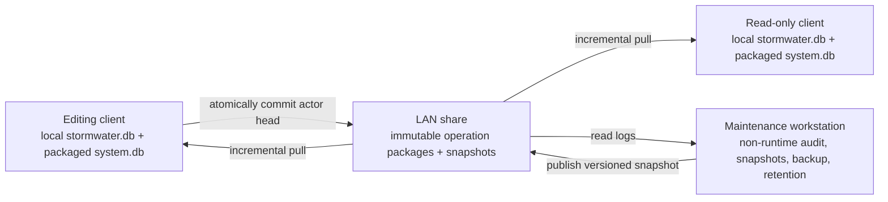
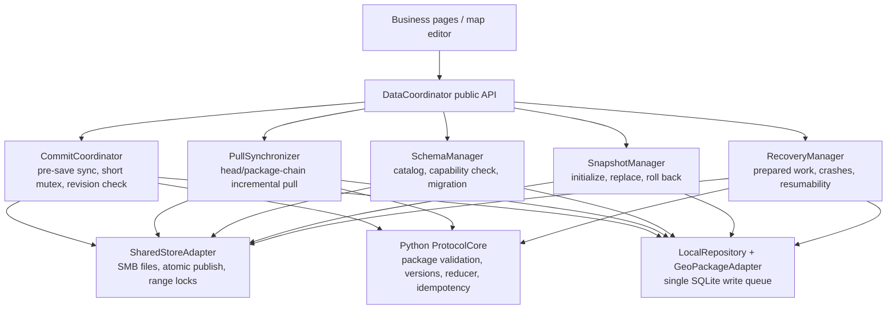
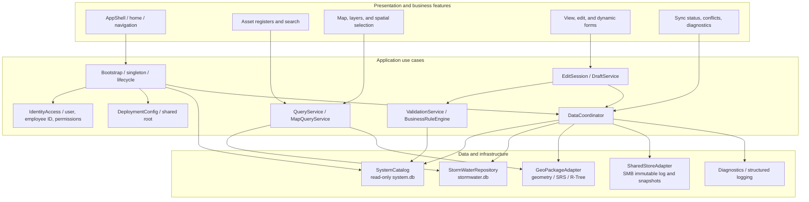
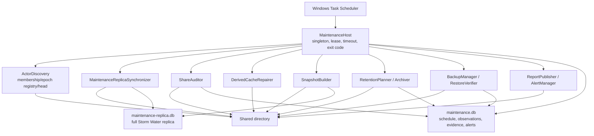

# Storm Water Desktop App: LAN Data, Synchronization, and Maintenance Workstation Design

> Document status: v1 design baseline; freeze the protocol after prototype validation  
> Last updated: 2026-07-22  
> Scope: LAN file share, no continuously running database/application server, up to 300 users, about 100 concurrent users, and no more than 20 low-frequency editors

This is the English counterpart of the Chinese design document. The two documents describe the same architecture and must be updated together when a design decision changes.

## 1. Document Goals

This document defines a LAN-only data architecture for Storm Water desktop applications that supports ordinary attributes and point, line, and polygon vector data. Each client uses a local database for query and editing performance, but a formal save requires access to the shared directory. Offline business edits are not supported.

The design covers:

- the Storm Water desktop modules for querying, mapping, editing, synchronization, and recovery;
- the read-only `system.db` distributed with the App and the writable local `stormwater.db`;
- local drafts, pending submissions, and atomic business transactions;
- immutable single-file operation packages on a LAN share;
- incremental upload/download, deduplication, retries, and restart recovery;
- attribute, geometry, deletion, uniqueness, and workflow conflicts;
- versioned snapshots, initialization, repair, and log retention;
- the maintenance workstation's five-minute job, nightly snapshot/audit/backup job, Friday retention job, and `maintenance.db`;
- atomic behavior during network loss, power loss, full disks, process crashes, and corrupted files;
- performance, observability, usability, testing, and phased delivery.

Priorities, in order, are:

1. Never lose data or silently overwrite a valid change.
2. Make every operation retryable and idempotent.
3. Do not require one computer to remain online for clients to save and synchronize.
4. Make all clients converge deterministically after receiving the same operation set.
5. Use the local database for routine work, but synchronize and revalidate before every formal save.
6. Prevent conflicts before submission where practical; make all remaining exceptions traceable and recoverable.
7. Preserve a path to encryption, while leaving v1 unencrypted.

## 2. Confirmed Constraints and Conclusions

### 2.1 Environment Constraints

- The LAN cannot be assumed to provide a continuously running server or database service.
- A reliable shared directory is available as the exchange and durable storage medium.
- Clients may exit, sleep, or crash at any time. Formal editing and synchronization are available only while the configured shared root is available.
- When the shared root is unavailable, a healthy compatible local replica may be opened in a clearly labeled degraded read-only mode. Creation, editing, workflow actions, and formal saves remain blocked; the App never queues offline business operations.
- There are no more than 300 users, normally no more than 100 concurrently online.
- No more than 20 users have edit permission, and they normally write only every several minutes or tens of minutes.
- The expected scale is 20-30 business tables, with no table exceeding roughly one million rows after five years.
- Current data contains attributes and point/line/polygon vectors. It does not contain rasters, basemaps, or attachments.
- v1 uses the `.db` suffix while preserving SQLite/GeoPackage structures internally.
- v1 does not use SQLCipher. The data-access abstraction and migration framework must allow later adoption.
- One maintenance workstation runs five-minute, nightly, and weekly jobs. It is not a server in the client save path; downtime only delays audit, snapshots, backup, and retention work.
- v1 uses full replication for the complete mutable business dataset. Every client stores every editable business table/layer and applies every committed operation for that dataset; area-, team-, owner-, and user-scoped mutable replicas are not permitted.
- Large read-only sources such as risk DuckDB databases, PMTiles, basemaps, and reference layers may remain external, shared, or partitioned because they do not participate in mutable business constraints.

### 2.2 Consistency Boundary

The system does not permit offline writes. A user may keep an edit as a local draft, but a formal save must first synchronize all currently published shared changes, acquire a short-lived save mutex for the record/business key, compare the base revision, publish an immutable operation, and apply it locally before reporting success.

The following guarantees cannot be derived automatically from distributed local databases alone:

- gap-free global sequential numbers;
- real-time uniqueness of arbitrary business values;
- inventory or balances that can never become negative;
- exclusive real-time task claiming;
- strictly serialized approval and workflow transitions.

Such cases require UUIDs, preallocated number ranges, preallocated quotas, explicit ownership, provisional states, or human approval. If they require strict real-time serialization, the no-online-coordinator constraint must be relaxed.

Full replication means every formal save validates against a complete mutable dataset, but completeness alone does not make a stale replica authoritative. Before checking a global UNIQUE rule, foreign key, assignment rule, workflow transition, or other cross-record constraint, the client must complete the authoritative current-epoch synchronization barrier, acquire the applicable record/business-key mutexes, repeat the barrier while holding those mutexes, and then validate and publish. If full-replica completeness, log continuity, or barrier completion cannot be proven, editing is blocked rather than validating against partial state.

Application permissions may restrict which records and commands appear in the UI, but they do not reduce the locally replicated mutable dataset. Therefore full replication is unsuitable if a client is not allowed to possess all mutable business data; that requirement would need a different architecture with a trusted online data service.

## 3. Core Architecture Decisions

### 3.1 No Active Database on the Share

Clients must not open the same SQLite/GeoPackage database directly over SMB/NFS. The share must not contain a mutable `master.db` that clients repeatedly update in place.

Authoritative state is:

```text
latest verified immutable snapshot referenced by snapshots/current.json
+ every committed immutable operation package reachable from a valid actor head after that snapshot's coverage
```

A snapshot is a compaction of the log, not the sole runtime authority. When the workstation is unavailable, clients can still publish and synchronize operations.

### 3.2 Overall Architecture



### 3.3 Storage Responsibilities

| Store | Location | Mutable at runtime | Responsibility |
| --- | --- | ---: | --- |
| `system.db` | Distributed with the App/workstation program | No; read-only | Schema Registry, migrations, forms, layers, rules, and capability definitions |
| `stormwater.db` | Local to each client | Yes | Queries, edits, spatial indexes, pending work, and synchronization side tables |
| Operation packages (`.opdb`) | Shared directory | No | Authoritative incremental history, transfer, audit, and recovery |
| Data snapshots | Shared directory | No | Initialization, repair, log compaction, and backup |
| `maintenance-replica.db` | Maintenance workstation | Yes | Full operation materialization, integrity checks, and snapshot source; never the master |
| `maintenance.db` | Maintenance workstation | Yes | Scheduling, first-observed times, audit, snapshots, backup, alerts, and pruning evidence |

### 3.4 App Data Coordination Module

The App must have one in-process `DataCoordinator`. It coordinates commit, pull, schema, snapshot, and recovery work. It is an internal module, not a server, and should not be split into an independent background service in v1.



| Component | Primary responsibility |
| --- | --- |
| `DataCoordinator` | Lifecycle, task queue, cancellation, priority, state events, and singleton enforcement |
| `CommitCoordinator` | Two-phase pre-save sync, record/business-key mutex, strict revision comparison, and prepared/published/applied state machine |
| `PullSynchronizer` | Membership/snapshot-epoch registry/head/package-chain discovery, download, inbox persistence, and cursor advancement |
| `SchemaManager` | Current schema/release, allowlisted catalog, capability negotiation, migration, fingerprint, and drift detection |
| `SharedStoreAdapter` | UNC/SMB access, atomic rename, flush, hashes, retries, and `LockFileEx` abstraction |
| `ProtocolCore` | Single Python implementation of operation-package encoding/validation, operation and transaction rules, deterministic reducer, and stable protocol error codes |
| `LocalRepository` | Business queries, SQLite transactions, synchronization tables, and the sole write queue |
| `GeoPackageAdapter` | Geometry, SRS, GeoPackageBinary, R-Tree, and spatial integrity |
| `SnapshotManager` | First install, snapshot choice, verified download, atomic replacement, and `.previous` rollback |
| `RecoveryManager` | Prepared/no-op recovery, orphan `.part` files, interrupted publication, and startup recovery |
| `Diagnostics` | Acknowledgements, metrics, audit events, and user-readable status |

Business pages may call application use cases, but must not directly update business tables, synchronization tables, or shared files:

```text
open_for_edit(entity_key)
save_local_draft(command)
commit(command)
refresh(reason)
initialize_or_repair()
ensure_schema_current()
get_status()
```

Mandatory rules:

- Only one `DataCoordinator` and one SQLite write queue may exist in an App process.
- Two processes must not reuse the same local actor. If the local process mutex fails, the second process reports that the App is already running.
- `commit()` has priority over periodic refresh but reuses `PullSynchronizer`; it must not implement a second sync path.
- Background pull pauses only at transaction boundaries and cannot overlap a snapshot replacement or applied transaction.
- SMB copying and lock waiting never occur inside a SQLite write transaction; local write transactions remain short.
- State-machine failures expose stable error codes. UI code must not parse raw SQLite/SMB messages.
- Python is the only coordinator and reducer implementation. Client packages and the maintenance workstation ship the same pinned Python major/minor/patch runtime, the same dependency lock, and the exact same versioned coordinator/reducer package. A runtime or package mismatch blocks publication and snapshot generation until upgraded. Golden fixtures remain mandatory for upgrade compatibility and regression testing, but there is no independent Rust reducer to reconcile.

### 3.5 Complete Storm Water Desktop Module Design

`DataCoordinator` is the consistency core, but the complete desktop product uses four layers. UI features may not bypass application use cases and access SQLite, GeoPackage, or the share directly.



| Module | Functions | Boundary |
| --- | --- | --- |
| `AppShell` | Home, navigation, windows, global notices, current user, sync status | Does not query databases or infer sync state |
| `Bootstrap` | Process singleton, package validation, startup state machine, database-open order, graceful shutdown | Never creates an empty database and presents it as valid data |
| `IdentityAccess` | Trusted `user_id`, employee number, role, and actor context | Employee number is a string; users cannot select another user's shared directory |
| `DeploymentConfig` | Packaged shared-root, product/environment IDs, refresh periods | Read-only for ordinary users; changes are deployment operations |
| `SystemCatalog` | Read `system.db` schema, tables, fields, migrations, forms, layers, capabilities | Describes App capability only; no runtime state |
| `QueryService` | Paging, filtering, sorting, joins, export reads | Always excludes `deleted=1`; pages do not construct SQL |
| `MapQueryService` | Bbox/R-Tree candidates, attribute lookup, scale ranges, selection, locate | Exact geometry work uses GeoPackage/GEOS adapters |
| `DynamicFormService` | Registry-driven forms, dictionaries, required and read-only rules | Specialized UI may replace the form but still submits a standard command |
| `EditSession` | Open for edit, retain base revision, memory state, close prompts | Holds no shared lock while the user edits |
| `DraftService` | Draft persistence, crash recovery, retention after rejected commit | Drafts are not committed data and are not normally replicated |
| `ValidationService` | Type, length, nullable, FK, CHECK, geometry type, SRS | Reads verified registry rules; never executes arbitrary shared code |
| `BusinessRuleEngine` | Storm Water state transitions and approved cross-field/table rules | Rules are versioned; complex handlers ship with the App |
| `DataCoordinator` | Sole commit, pull, schema, snapshot, and recovery entry point | Reuses section 3.4 and the sole write queue |
| `StormWaterRepository` | Query mapping, short transactions, business and side tables | Only the coordinator may call writes |
| `GeoPackageAdapter` | Point/line/polygon encoding, SRS, R-Tree, spatial integrity | Ordinary SQLite code does not construct geometry BLOBs |
| `SharedStoreAdapter` | UNC/SMB paths, atomic publication, hash, range lock, timeout, retry | Business modules do not access shared files directly |
| `SnapshotManager` | First install, repair, log-gap replacement, rollback | Preserves local actor, drafts, and incomplete outbox before replacement |
| `Diagnostics` | Structured logs, error codes, metrics, acknowledgements, support bundle | Redacts by default; exports no unauthorized business data |
| `AppUpdateCompatibility` | App/`system.db`/protocol/schema compatibility matrix | Blocks formal save when the client cannot understand the active release |

Storm Water registers, inspections, work orders, and similar domains are feature packages. A package supplies queries, commands, business rules, and optional specialized UI. It reuses the common implementation of system fields, commit, synchronization, snapshot, and recovery.

Recommended use-case API:

```text
bootstrap()
search(table_id, filter, page, sort)
query_map(layer_id, bbox, filter)
open_for_edit(table_id, global_id)
save_draft(edit_session_id, command)
validate(command)
commit(edit_session_id, command)
refresh(reason)
initialize_or_repair()
get_sync_status()
export_support_bundle()
```

### 3.6 Desktop Runtime State Machine and Task Priority

```mermaid
stateDiagram-v2
    [*] --> Starting
    Starting --> BlockedPackage: corrupt system.db/configuration
    Starting --> DegradedReadOnly: share unavailable; local replica healthy
    Starting --> BlockedShare: share unavailable; local replica untrusted
    Starting --> Installing: local DB missing or log gap
    Starting --> Migrating: schema migration required
    Starting --> InitialSync: local DB healthy and compatible
    Installing --> InitialSync: verified snapshot installed
    Migrating --> InitialSync: migration verified
    InitialSync --> Ready: startup high-water reached
    Ready --> Syncing: background refresh
    Syncing --> Ready: increment applied
    Ready --> Committing: user saves
    Committing --> Ready: published and locally applied
    Committing --> DraftBlocked: revision/permission/mutex failure
    DraftBlocked --> Ready: draft retained and reopened
    Ready --> Repairing: health check failure
    Repairing --> InitialSync: repair/replacement succeeds
    Ready --> DegradedReadOnly: share connection lost
    Syncing --> DegradedReadOnly: share connection lost
    DegradedReadOnly --> InitialSync: share restored and validated
```



- `DegradedReadOnly` permits queries against a healthy, compatible local `stormwater.db` only. It shows a persistent offline banner with the last successful synchronization time, installed snapshot ID, and data age. It disables creation, editing, deletion, assignment, submission, review, permission changes, and formal save.
- `BlockedShare` is used when the share is unavailable and the local replica is missing, corrupt, incompatible, or otherwise untrusted; it exposes diagnostics, retry, and exit only.
- `BlockedPackage`, `Migrating`, `Installing`, and `Repairing` expose only progress, diagnostics, retry, and exit.
- Only `Ready` enables formal editing. Read queries may run during background `Syncing`, but not during a local applied write transaction or database replacement.
- Recovery of the share never changes directly from `DegradedReadOnly` to `Ready`. The App first validates membership, permissions, protocol/schema, snapshot compatibility, and log floor, then completes an authoritative synchronization barrier. Editable forms remain unavailable until that barrier succeeds.
- Degraded mode never creates an offline operation outbox. Existing drafts may be viewed, exported, or recovered, but cannot be formally changed or submitted until `Ready`.
- Priority is: finish an active local atomic transaction; user commit; startup/save sync barrier; periodic pull; WAL maintenance/cleanup.
- Shutdown does not wait indefinitely for the network. Work that is not reachable through a valid actor `head.json` is uncommitted and is cancelled or retained as prepared work. Work reachable through a valid committed head is authoritative and enters local-apply recovery rather than being undone.

## 4. Local Database Format

### 4.1 Files and Connections

- `stormwater.db` is each client's writable business database. Internally it is a GeoPackage-compatible SQLite database.
- `system.db` is a read-only capability database installed and updated with the App. It contains supported schema releases, migration definitions, capabilities, dynamic forms, and generic layer configuration.
- Runtime opens `system.db` read-only/query-only. It never stores actors, cursors, outbox state, migration results, user preferences, or other mutable state.
- `system.db` says what the App understands; the verified shared `snapshots/current.json` pointer and its referenced snapshot say what the environment has activated. Formal save is enabled only when release ID, catalog hash, and required capabilities match.
- `stormwater.db` and `system.db` use separate connections. Cross-database atomic transactions are not required. Anything that must commit atomically with a business row stays in `stormwater.db`.
- `.db` is a product naming decision and does not satisfy the conventional `.gpkg` suffix. GDAL/OGR must explicitly select the `GPKG` driver.
- Attribute and vector feature tables may coexist.
- A GeoPackage-aware library owns `gpkg_contents`, `gpkg_geometry_columns`, `gpkg_spatial_ref_sys`, and related metadata.
- Python `sqlite3` may manage attributes and synchronization tables; geometry encoding, coordinate conversion, and spatial indexes go through the GeoPackage adapter.
- Prepared outbox creation and actor-sequence allocation use one local transaction and do not modify business rows. After shared publication, business rows, geometry/R-Tree, `applied_operation`, and outbox applied state use one local connection and transaction.
- Local databases may use WAL. Shared snapshots and operation packages are closed before publication and are never opened for writing by consumers.

Recommended settings:

```sql
PRAGMA foreign_keys = ON;
PRAGMA journal_mode = WAL;
PRAGMA synchronous = FULL;
PRAGMA busy_timeout = 5000;
```

Prefer `synchronous=FULL` for crash safety. Use `NORMAL` only after explicit risk review and power-loss testing.

### 4.2 Spatial Table Keys

Each spatial feature has a local integer ID and a global UUID:

```sql
CREATE TABLE asset_point (
    fid                 INTEGER PRIMARY KEY,
    global_id           TEXT NOT NULL UNIQUE,
    name                TEXT,
    status              TEXT,
    geometry            BLOB,
    record_revision     TEXT NOT NULL,
    geometry_version    TEXT NOT NULL,
    deleted             INTEGER NOT NULL DEFAULT 0 CHECK (deleted IN (0, 1))
);
```

- `fid` is local to a client and its GeoPackage/R-Tree. It is never replicated.
- `global_id` is the UUID used for synchronization, foreign keys, audit, and business references.
- The same feature may have different `fid` values on different clients.
- Each spatial table fixes its principal geometry type and SRS.
- Keep unrelated point, line, and polygon data in separate tables.
- Choose `MULTILINESTRING` or `MULTIPOLYGON` in v1 for business layers that can contain multiple parts.
- Ordinary nonspatial tables also require `global_id`; local autoincrement IDs are not synchronization identities.

### 4.3 System-Maintained Columns in Business Tables

Every synchronized business table keeps only the minimum fields required for correctness:

| Column | Requirement | Purpose |
| --- | --- | --- |
| `global_id` | Required; UUID text, NOT NULL, UNIQUE, immutable | Stable cross-client record, FK, log, and mutex identity |
| `record_revision` | Required; NOT NULL; UI read-only | Opaque token for strict pre-save comparison; reducer-computed, not a counter or timestamp |
| `geometry_version` | Required on spatial tables only | Independent geometry version for change, conflict, and recovery |
| `deleted` | Required on every synchronized business table; NOT NULL, default 0, 0/1 CHECK | Tombstone that prevents old operations from resurrecting deleted data |

Generic `created_by/created_at_utc/updated_by/updated_at_utc` columns are deliberately omitted. Submitter, actor, operation ID, and operation time live in immutable operations and audit tables. If a domain genuinely needs inspector, inspection time, or similar information, those are explicit business fields. Timestamps never determine causality or conflict order.

All business deletion sets `deleted=1` and publishes `delete_entity`; it never executes physical `DELETE`. Repositories automatically add `deleted=0` to ordinary reads. An explicitly frozen append-only table may later receive a schema-policy exception, but common runtime code does not guess.

Names are frozen in v1 and registered. An optional Storm Water prefix such as `sw_` may be used (`sw_record_revision`, `sw_geometry_version`, `sw_deleted`); this document uses concise logical names. The catalog assigns each system column a stable `field_id`, `system_managed=true`, and a `sync_role`. Dynamic forms hide or lock these columns, and commands cannot assign them directly.

Do not place per-record `dirty`, `uploaded`, `sync_status`, actor sequence, package ID, cursor, retry count, download status, or transient conflict status in business rows. Those states belong in side tables such as `outbox_operation`, `sync_cursor`, `field_version_head`, `conflict`, and `applied_operation`, updated in the same `stormwater.db` transaction. Spatial `fid` is also a local technical key.

SchemaManager creates required columns, constraints, indexes, and UI rules from table kind and delete policy. Existing tables receive missing columns only through an explicit migration, never by ad hoc DDL when the first operation arrives.

### 4.4 Synchronization Tables Stored in `stormwater.db`

“Side table” means logical and namespace isolation, not a separate file. All mutable synchronization tables below are physically stored in `stormwater.db`, enabling an atomic SQLite transaction with business rows and geometry/R-Tree. `system.db` contains definitions only.

#### `sync_actor`

One synchronization identity for each business-user × App-installation pair:

| Column | Meaning |
| --- | --- |
| `actor_id` | Installation/user UUID; new after reinstall, device change, or user change |
| `user_id` | Business user identity |
| `next_actor_seq` | Next local operation sequence |
| `schema_version` | Current local schema version |
| `created_at_utc` | Creation time |

`actor_id + actor_seq` is globally unique for the system lifetime. Never reuse a retired actor.

#### `sync_install_state`

A singleton describing the installed baseline:

| Column | Meaning |
| --- | --- |
| `installed_snapshot_id` | Snapshot used for first install or most recent replacement |
| `installed_snapshot_sha256` | Hash verified during installation |
| `installed_snapshot_coverage` | Actor coverage vector from that snapshot |
| `protocol_version/schema_version` | Local protocol and structure versions |
| `replication_profile` | Fixed to `all` for the v1 mutable business dataset; retained for protocol compatibility and diagnostics |
| `installed_at_utc` | Audit/display time only |
| `last_health_check_at_utc/result` | Last complete health check |

The installed snapshot is only the baseline. Current progress is represented by `sync_cursor`.

#### Schema Registry and Migration State

Read-only `system.db` contains `sys_schema_release`, `sys_schema_table`, `sys_schema_field`, `sys_schema_geometry`, and `sys_schema_migration` for one or more releases. Definitions have a deterministic normalized export and `schema_release_id/catalog_hash`.

Writable `stormwater.db` uses singleton `schema_install_state` for the installed release, schema version, catalog hash, schema fingerprint, and last validation time. `schema_migration_history` stores migration ID, from/to release, checksum, start/completion times, state, and stable error code. Migrations are idempotent; the same ID with a different checksum blocks business mode.

#### `outbox_transaction`

| Column | Meaning |
| --- | --- |
| `tx_id` | Business transaction UUID |
| `state` | `prepared / packaged / published / applied / compacted / voided / failed` |
| `operation_count` | Operation count |
| `created_at_utc` | Local creation time |
| `package_id` | Published operation package |
| `last_error` | Latest publication error |

#### `outbox_operation`

| Column | Meaning |
| --- | --- |
| `operation_id` | Globally unique UUID |
| `tx_id` | Parent business transaction |
| `tx_index/tx_count` | Position and total count in the complete transaction |
| `actor_id/actor_seq` | Origin actor and monotonic sequence |
| `protocol_version/schema_version` | Protocol and schema versions |
| `entity_type/entity_id` | Logical entity/layer and global UUID |
| `operation_type` | Insert, update, delete, resolve, and so on |
| `base_record_revision` | Revision seen when editing began |
| `payload` | Attribute patch and control information |
| `geometry_blob` | Optional binary geometry |
| `old_bbox/new_bbox` | Optional spatial routing metadata |

#### `local_draft`

Stores user input that has not passed pre-commit validation and therefore must not enter materialized business rows or the formal outbox. Examples include mutex timeout, changed revision, or loss of the share while editing.

| Column | Meaning |
| --- | --- |
| `draft_id` | Local UUID |
| `entity_type/entity_id` | Target record |
| `base_field_versions` | Version heads observed at edit open |
| `payload/geometry_blob` | User input |
| `state` | `editing / blocked / rebase_ready / submitted / discarded` |
| `block_reason` | `save_mutex_timeout / remote_changed / shared_unavailable / policy`, etc. |
| `created_at_utc/updated_at_utc` | Local display and recovery times |

Drafts are not committed or normally synchronized. Snapshot replacement and repair preserve them with local actor/outbox state. Conversion to an operation requires a new sync, permission/mutex acquisition, and revision check.

#### `applied_operation`

| Column | Meaning |
| --- | --- |
| `operation_id` | Primary key for idempotency |
| `actor_id/actor_seq` | Origin position |
| `tx_id` | Origin transaction |
| `result` | `applied / conflict / rejected` |
| `applied_at_utc` | Local processing time |

#### `inbox_transaction` / `inbox_operation`

Persist complete, validated remote input before reducer processing. Raw content is immutable.

| Column | Meaning |
| --- | --- |
| `tx_id/operation_id` | Transaction and operation IDs |
| `source_actor_id/actor_seq` | Origin position |
| `source_package_id` | Source operation package |
| `state` | `received / deferred / terminal` |
| `raw_payload/value_blob` | Validated original content |
| `defer_reason` | Missing dependency or incompatible version |

Downloaded and applied cursors remain distinct: safely received is not the same as successfully reduced.

#### `received_package`

| Column | Meaning |
| --- | --- |
| `package_id` | Package UUID primary key |
| `source_actor_id` | Origin actor |
| `first_seq/last_seq` | Continuous sequence range |
| `sha256` | Verified content hash |
| `state` | `received / terminal / quarantined` |
| `received_at_utc` | Local receive time |

The same package/range with the same hash is idempotent. A different hash or abnormal overlap is quarantined and alerted.

#### `field_version_head`

Each nonconflicting field normally has one row; concurrent versions may produce multiple heads:

| Column | Meaning |
| --- | --- |
| `entity_type/entity_id` | Record identity |
| `field_name` | Field, including reserved `$geometry`, `$tombstone`, `$owner` |
| `version_operation_id` | One causal maximum version |
| `actor_id/actor_seq` | Origin and deterministic tie-break metadata |
| `value_ref` | Reference to materialized or conflicting value |

Primary key: `(entity_type, entity_id, field_name, version_operation_id)`.

Applying a field operation removes explicitly referenced base heads that still exist, retains unreferenced concurrent heads, and adds the new operation ID. More than one head is a conflict. A resolution operation must reference every head it resolves.

#### `sync_cursor`

One row per source actor:

| Column | Meaning |
| --- | --- |
| `source_actor_id` | Origin actor |
| `highest_downloaded_seq` | Highest continuous sequence validated and persisted to inbox |
| `highest_terminal_seq` | Highest continuous sequence with applied/conflict/rejected terminal result |
| `last_package_id` | Most recent package |
| `last_sync_at_utc` | Latest successful time |

#### `deferred_transaction`

Stores transactions awaiting a missing predecessor, newer schema capability, or complete package. Deferred is not conflict; it retries automatically after dependencies arrive.

#### `conflict`

| Column | Meaning |
| --- | --- |
| `conflict_id` | Deterministic SHA-256 over entity, field, and concurrent heads |
| `conflict_group_id` | Deterministic group for cross-field/table transaction conflict |
| `tx_id` | Conflicting business transaction |
| `entity_type/entity_id` | Record |
| `field_name` | Field or `$geometry/$delete/$constraint/$workflow` |
| `head_versions` | All conflicting heads |
| `candidate_values` | Candidate values or references |
| `state` | `open / resolved / superseded` |
| `resolution_operation_id` | Resolving operation |

#### `snapshot_state`

Stores current snapshot ID/hash, per-actor coverage, installation time, and previous rollback snapshot.

### 4.5 Record Revision

Operations carry:

```json
{
  "actor_id": "actor-uuid",
  "actor_seq": 1024,
  "operation_id": "operation-uuid",
  "base_versions": [
    {"actor_id": "actor-a", "actor_seq": 100},
    {"actor_id": "actor-b", "actor_seq": 33}
  ]
}
```

`actor_id + actor_seq` identifies continuity and compacted history; `operation_id` identifies content and deduplicates it. Snapshot coverage proves old dots are known without retaining all old operation bodies forever.

`record_revision` is neither a local counter nor wall-clock time. It is deterministically derived from all current field heads:

```text
record_revision = SHA-256(
  canonical_sort(field_id, version_operation_id, value_hash)
)
```

The same head set always produces the same revision regardless of arrival order. If a field has multiple heads, a deterministic order may select a temporary materialized display value, but that display choice does not resolve the conflict.

### 4.6 R-Tree

- Create a GeoPackage R-Tree for every spatial table that needs range queries.
- R-Tree is local derived data. It never enters the outbox/operation packages or conflict logic.
- Geometry insert/update/delete applies the business row, R-Tree, and synchronization state in one transaction.
- Provide a per-layer R-Tree rebuild command.
- Validate periodically with `rtreecheck()` or an equivalent check.
- R-Tree only filters bbox candidates. GEOS/GDAL performs exact intersection, containment, and distance operations.

### 4.7 `system.db` Distributed with the App

`system.db` is a read-only SQLite database in the Storm Water installation. The implementation may freeze a different prefix; `sys_` below denotes product-definition tables.

| Table | Primary/key fields | Purpose |
| --- | --- | --- |
| `sys_app_package` | singleton: `product_id`, `app_version`, `system_db_version`, `build_id`, `built_at_utc`, `catalog_hash`, `signature_key_id` | Match Storm Water executable and registry |
| `sys_capability` | `capability_id + capability_version`, `enabled` | Supported field, geometry, migration, operation, reducer capabilities |
| `sys_schema_release` | `schema_release_id`, `schema_version`, `protocol_version`, `catalog_hash`, `min_app_version`, `required_capabilities_json` | Releases understood by the App |
| `sys_schema_table` | `release_id + table_id`, physical table, kind, sync/edit/delete/profile/reducer policies, dependency order | Registered synchronized tables |
| `sys_schema_field` | `release_id + field_id`, table, physical column, logical/SQLite types, nullable/default, system role, conflict policy | Stable field identity across physical rename |
| `sys_schema_geometry` | `release_id + table_id`, geometry field/column/type, SRS, Z/M, R-Tree | GeoPackage spatial metadata |
| `sys_schema_index` | `release_id + index_id`, table, name, unique flag, columns, predicate | Business indexes and uniqueness implementation |
| `sys_schema_constraint` | `release_id + constraint_id`, table, type, expression/reference, error code | FK, CHECK, and simple cross-field validation |
| `sys_schema_migration` | migration ID, from/to release, order, kind, spec, handler, checksum, copy requirement | Idempotent upgrade chain; allowlisted DSL or packaged handler |
| `sys_form` | `release_id + form_id`, table, kind, title, layout, rules | Generic view/edit form |
| `sys_form_field` | release/form/field, order, widget, visibility, read-only, required rules | Form field behavior |
| `sys_layer` | `release_id + layer_id`, table, title, style, scales, selectable/editable | Map layer behavior |
| `sys_style` | `release_id + style_id`, renderer, style JSON | Symbols, colors, labels, categorized rendering |
| `sys_dictionary` / `sys_dictionary_item` | dictionary, item code, label, order, enabled | Static packaged enumerations; runtime dictionaries remain synchronized business tables |
| `sys_business_rule` | `release_id + rule_id`, type, spec, handler, error code | Declarative rule or registered packaged handler |

Relationships are `release -> table -> field/geometry/index/constraint`. Forms, layers, and rules reference stable table/field IDs rather than physical names. A package may include the active release and a bounded set of historical releases needed for migration.

Build and publication requirements:

- Validate FKs, duplicate IDs, SQL identifiers, migration continuity, GeoPackage capability, and form references.
- Generate shared normalized `catalog.json` and `system.db` from the same source so catalog hashes match.
- Open read-only/query-only; validate product/build/catalog hash and verify the whole file SHA-256 from the signed App installation manifest.
- `spec_json` is an allowlisted declarative format, never arbitrary SQL or executable code from the share.
- Replace `system.db` only through the App installer while the App is closed.

### 4.8 `stormwater.db` Layers and Snapshot Behavior

| Category | Typical tables | In shared snapshot | Notes |
| --- | --- | ---: | --- |
| GeoPackage metadata | `gpkg_*`, R-Tree tables | Yes | Managed by GeoPackageAdapter |
| Storm Water business | Assets, pipes, drainage areas, inspections, maintenance | Yes | Concrete domain schema comes from the registry |
| Global convergence state | `field_version_head`, open conflicts/candidates, tombstones, snapshot state | Yes | Needed to continue deterministic reduction |
| Local publication state | `sync_actor`, outbox, drafts | No | Export and restore around replacement |
| Local receive state | cursors, received packages, inbox, deferred | Not copied directly | Initialize from snapshot coverage and resume pull |
| Local deduplication | applied operations and compacted coverage | Partial | Retain required coverage and recent dedupe window, not workstation history |
| Schema installation | active release, catalog hash, fingerprint | Yes | Must match snapshot internal metadata and current pointer |
| Migration execution history | local migration history | Clean baseline | Snapshot stores the baseline release, not irrelevant workstation execution details |

Before publishing, the workstation removes its actor, outbox, drafts, UI settings, and workstation paths from the candidate, then writes normalized snapshot coverage. An existing client exports and restores its own local state during replacement.

Use a reserved internal prefix such as `sw_sync_` and prohibit business schema from using it. All business and synchronization writes still share one SQLite connection and transaction. Do not depend on `ATTACH system.db` for cross-file atomicity.

## 5. Operation Model

### 5.1 Operation Envelope

Every operation contains:

```json
{
  "protocol_version": 1,
  "schema_version": 1,
  "operation_id": "uuid",
  "tx_id": "uuid",
  "tx_index": 0,
  "tx_count": 2,
  "actor_id": "uuid",
  "actor_seq": 1024,
  "user_id": "user-123",
  "entity_type": "asset_point",
  "entity_id": "uuid",
  "operation_type": "update_fields",
  "base_record_revision": "sha256:...",
  "field_changes": [
    {
      "field": "status",
      "base_field_versions": [
        {
          "actor_id": "actor-uuid",
          "actor_seq": 1001,
          "operation_id": "operation-uuid"
        }
      ],
      "value_type": "text",
      "value": "completed"
    }
  ],
  "geometry": null,
  "created_at_utc": "2026-07-21T18:30:00Z"
}
```

Wall-clock time is for display and audit only. Base field versions, explicit dependencies, and actor sequence establish concurrency and validity.

### 5.2 Supported Operation Types

| Type | Meaning |
| --- | --- |
| `insert_entity` | Create an attribute record or spatial feature |
| `update_fields` | Field-level attribute patch |
| `update_geometry` | Replace complete geometry; geometry is one atomic field |
| `update_entity` | Update attributes and geometry in one business transaction |
| `delete_entity` | Set a tombstone; no immediate physical delete |
| `restore_entity` | Restore after permission and conflict checks |
| `transfer_owner` | Transfer edit ownership |
| `resolve_conflict` | Explicitly resolve named conflicting versions |
| `append_event` | Append-only comment, history, measurement, or event |

### 5.3 Cross-Table Business Transactions

A user action may modify several tables:

```text
complete work order
  + update work-order status
  + insert inspection
  + update location geometry
  + append audit event
```

All operations share one `tx_id`:

1. After pre-save validation, one SQLite transaction writes the prepared outbox and allocates actor sequences. It does not yet change materialized business rows.
2. After authoritative shared publication, another SQLite transaction applies business rows, geometry/R-Tree, `applied_operation`, outbox applied state, and the local actor's downloaded/terminal cursor.
3. Operations for one `tx_id` cannot be split across operation packages.
4. A receiver processes only after validating the complete `tx_index=0..tx_count-1` set.
5. A receiver applies the complete set in one local transaction.
6. A missing dependency defers the entire transaction.
7. By default, any unresolvable critical conflict places the entire transaction in conflict; no partial business effect is allowed.
8. A domain that allows partial application defines smaller transaction boundaries explicitly rather than allowing the synchronizer to split a transaction opportunistically.

## 6. Submitting Local Changes

### 6.1 Commit Flow

```mermaid
sequenceDiagram
    participant U as User/App
    participant M as Shared save mutex
    participant S as Shared directory
    participant DB as Local stormwater.db

    U->>DB: Edit local draft; retain base_record_revision
    U->>S: On Save, pull every currently published increment
    U->>DB: Atomically apply increments
    U->>M: Acquire short record-level mutex
    U->>S: Re-read head vector and close the pre-lock gap
    U->>DB: Compare current_revision and base_revision
    alt Revision differs
        DB-->>U: Reject commit and retain blocked draft
    else Revision matches
        U->>DB: Persist prepared transaction/outbox
        U->>S: Publish one immutable .opdb; atomically commit head.json
        U->>DB: Atomically apply local operation and mark published/applied
        DB-->>U: Save succeeded
    end
    U->>M: Release short mutex
```

No shared lock is held while the user fills in a form. “Save succeeded” appears only after the operation is authoritative on the share and applied locally. The mutex normally lasts only seconds.

v1 uses strict record-level optimistic concurrency: if `current_record_revision != base_record_revision`, reject the formal save even when the changes touched different fields. This is simple and explainable. Field-level automatic rebase is enabled later only for explicitly approved tables.

### 6.2 Local Outcomes

- A changed revision at the sync barrier leaves business data untouched, publishes no operation, retains a blocked draft, and asks the user to refresh and confirm again.
- An unavailable share, mutex timeout, or publication failure never reports a formal save. The draft remains retryable.
- If publication succeeds and the App crashes before local apply, the shared operation is already authoritative and startup applies it idempotently.
- If prepare succeeds but publication does not, startup reacquires the mutex and revalidates. It publishes if still valid; otherwise it publishes a protocol no-op for consumed sequences and restores the input as a blocked draft.
- A successful save means the operation package is committed through the actor head and local business state, `applied_operation`, and outbox state agree.
- UI writes and background synchronization serialize through the sole local write coordinator.

Actor-sequence allocation and prepared persistence occur in the same transaction. A consumed sequence is never reused. Cancelling an invalid prepared transaction publishes a no-effect protocol operation to preserve sequence continuity.

### 6.3 State Machines

`outbox_transaction`:

```text
prepared -> packaged -> published -> applied -> compacted
    |           |            |
    +-----------+------------+-> failed -> retry/revalidate
    +------------------------> voided(no-op published)
```

- `prepared`: checks passed and input is durable locally, but it is not authoritative and materialized business state has not changed.
- `packaged`: an immutable local operation package has been built and validated.
- `published`: the immutable shared `.opdb` validates and is reachable from the committed actor `head.json`.
- `applied`: business rows, version heads, and R-Tree have been updated idempotently.
- `compacted`: a published snapshot coverage includes the transaction.
- `voided`: revalidation failed; a no-op consumes reserved actor sequences without changing business data.
- `failed`: not a business success. Keep error/retry state and show draft/save failure.

`inbox_transaction`:

```text
received -> deferred -> received -> terminal
    +-----------------------------> terminal
```

Terminal outcome is `applied`, `conflict`, or `rejected`. Deferred returns to received when dependencies or schema capability become available. Each state transition and its related data update share one SQLite transaction.

`conflict`:

```text
open -> resolved
  +----> superseded
```

There is no silent deletion path. Only a `resolve_conflict` referencing the conflicting heads resolves it. A larger replacing conflict set may supersede it.

### 6.4 Required Indexes

```text
UNIQUE outbox_operation(actor_id, actor_seq)
INDEX  outbox_transaction(state, created_at_utc)
INDEX  outbox_operation(tx_id, tx_index)
UNIQUE inbox_operation(operation_id)
INDEX  inbox_transaction(state, source_actor_id, first_actor_seq)
UNIQUE received_package(package_id)
UNIQUE received_package(source_actor_id, first_seq, last_seq)
UNIQUE applied_operation(operation_id)
INDEX  conflict(state, entity_type, entity_id)
INDEX  field_version_head(entity_type, entity_id, field_name)
UNIQUE business_table(global_id)
```

Owner, status, area, time-range, and FK indexes depend on real query plans and must be verified with `EXPLAIN QUERY PLAN`.

## 7. Shared Directory Protocol

### 7.1 Directory Layout

```text
sync-root/
  protocol-v1/
    membership/
      releases/
        <membership-seq>-<sha256>.json
      current.json
    schema/
      current.json
      releases/
        <schema-version>-<sha256>/
          manifest.json
          catalog.json
          migrations.json
          ready
    activity/
      epochs/
        <snapshot-epoch-id>/
          actors/
            actor-<uuid>.active.json
    coordination/
      maintenance.lck
      epoch-transition.lck
      actor-publication.lck
      save-mutexes/
        stripe-000.lck
        ...
        stripe-255.lck
    users/
      emp-000123/
        identity.json
        actors/
          actor-<uuid>/
            head.json
            operations/
              2026/
                07/
                  <first>-<last>-<package-id>.opdb
            acknowledgement.json
    snapshots/
      current.json
      snapshot-<snapshot-id>-<sha256>.db
    audit/
      current.json
      reports/
        <audit-seq>-<sha256>.json
    maintenance/
      current.json
      reports/
        <run-id>-<sha256>.json
      prune-plans/
        <plan-id>-<sha256>.json
    quarantine/
    archive/
```

Normative v1 file rules:

- A formal save adds only one immutable `.opdb`; it atomically replaces the actor's `head.json` and later its acknowledgement.
- A snapshot publication adds only one immutable snapshot `.db`; it atomically replaces `snapshots/current.json`.
- No operation or snapshot sidecar manifest, `.ready` marker, immutable actor index, or checkpoint file is generated.
- Membership, schema, audit, maintenance, and prune-plan artifacts are low-frequency control-plane releases and retain their separately versioned formats shown above.
- `.part` files are temporary transfer artifacts, never authority, and are removed by the publisher or recovery after a bounded diagnostic grace period.

ACL principles:

- A business user creates actors only in their own `emp-<employee-number>` directory. An editing actor writes only its own immutable operation packages, replaceable head and acknowledgement, and its own active-writer registration in the current snapshot epoch.
- Ordinary clients may read membership, authorized actors' operations, and snapshots.
- Authorized editors may request shared epoch-transition locks and exclusive record/business-key SMB byte-range locks on normalized coordination locations, but lock-file content is never business state.
- Only maintenance roles write snapshots, archive, membership, maintenance reports, prune plans, and new epoch scaffolding. Maintenance does not automatically rewrite actor-owned heads.
- Published operation packages and snapshots are immutable to editing clients.
- v1 hashes protect mainly against accidental corruption, not a malicious user with equivalent write permission. Signatures/encryption may be added later.

Membership is also versioned and maps `user_id -> emp-directory -> actor`. `current.json` is atomically replaced and points to one immutable release. Clients retain the last verified release; corrupt current does not retire every actor.

Each actor atomically publishes `acknowledgement.json`, containing protocol/schema versions, actor/boot IDs, installed snapshot, head generation/highest sequence, latest sync result, prepared count and age, blocked draft count, mutex timeout count, and latest error. Client time is display-only; the workstation records its own observation times.

Each actor publishes immutable hash-linked `.opdb` packages and atomically replaces one small `head.json`. The head replacement is the actor's transaction commit point. A final `.opdb` that is not reachable from the committed head is a complete but uncommitted orphan and must never be applied as authoritative data.

Each verified snapshot release starts a snapshot epoch identified by an immutable `snapshot_epoch_id` in the snapshot database and `snapshots/current.json`. `activity/epochs/<snapshot-epoch-id>/actors` is the flat active-writer registry for that epoch. It contains at most one immutable registration document per actor, not one file per actor generation.

An actor must register successfully before its first formal publication in an epoch:

1. Acquire a shared byte-range lock on `coordination/epoch-transition.lck`.
2. Read and validate the current snapshot epoch and membership release.
3. Publish `actor-<uuid>.active.json` through unique `.part`, flush, close, and same-directory create-if-absent rename. An existing document is success only when its actor, epoch, protocol, and membership identity match.
4. Read back the registration and confirm that it is visible in a fresh registry listing.
5. Keep the shared epoch lock through the pre-save barrier, record mutex, final registry/head barrier, and actor-head commit. If the epoch changes before the shared lock is acquired, restart in the new epoch.

The actor is prohibited from publishing if registration is unavailable, corrupt, or not visible. The registry is therefore the authoritative set of actors that are eligible to publish in that epoch; actor `head.json` remains the sole authority for which operations those actors actually committed. A save lists this one flat registry and reads its actor heads instead of scanning all membership directories.

During snapshot publication, maintenance prepares the new epoch and acquires an exclusive byte-range lock on `epoch-transition.lck`. Existing saves holding the shared lock finish first. While exclusive, maintenance re-reads the prior epoch registry and every registered actor head, carries forward every actor whose operations are not proven covered by the new verified snapshot, publishes the new epoch metadata, and atomically replaces the snapshot/current-epoch pointer. It releases the lock immediately afterward. A previously omitted actor may later register itself before its next write. This transition prevents an actor from committing to an old epoch after the new registry becomes current.

An epoch registration remains online until a later verified snapshot covers the actor's committed operations and the related operation range is below the safely published log floor. Removal is exact and maintenance-controlled; inactivity or client time alone is insufficient. Registry corruption or an actor head that cannot be validated blocks dependent formal saves and requires recovery rather than silently shrinking the barrier.

`actor-publication.lck` is one permanent coordination file. SHA-256 of canonical `actor_id` selects a 64-bit byte offset; the actor coordinator and an emergency repairer both request the same exclusive one-byte `LockFileEx` range. This gives each actor a publication/repair mutex without creating one lock file per actor. File contents and timestamps are never state.

### 7.2 Personal Directory Naming and Startup Creation

The shared root is distributed in deployment configuration, for example `\\fileserver\StormWaterSync`. Ordinary users cannot edit it. The App obtains the trusted business user's employee number and derives:

```text
<sync-root>/protocol-v1/users/emp-<canonical-employee-no>/
```

Employee number `000123` maps to `users/emp-000123/`. Use lowercase ASCII `emp-` and `actor-<UUID>`. Treat employee numbers as strings so leading zeros are preserved. If the identity system guarantees no leading zero, use its official text without arbitrary padding.

Canonicalization and path safety:

- Allow ASCII digits only, recommended `^[0-9]{1,20}$`.
- Reject `/`, `\`, `.`, `..`, spaces, environment variables, drive letters, and other path syntax.
- Derive the path only from the fixed prefix and validated employee number, never directly from a login name or user input.
- Resolve and verify the final path remains under configured `sync-root/protocol-v1/users`.
- Treat the official employee-number format as an identity contract; clients do not change it independently after production launch.

Startup sequence:

1. Read packaged deployment configuration, normalize the root, and verify protocol, reachability, and minimum permissions. Invalid or unavailable configuration opens diagnostics/retry only.
2. Obtain trusted `user_id` and canonical employee number.
3. Derive `emp-...`; create idempotently if absent. Concurrent creation is success.
4. On first creation, publish immutable `identity.json` through a unique `.part`, flush, and same-directory create-if-absent rename. Record schema version, user ID, employee number, and creation time. If another process wins, validate rather than overwrite it.
5. Validate existing identity. Mismatched user/employee number, ordinary-file target, reparse/symlink escape, or resolved path outside root blocks synchronization and alerts.
6. Read local `sync_actor`. If this installation/user has none, generate a random UUID, create its actor directory, and atomically publish an empty generation-zero head. Never reuse actors after reinstall/device/user change.
7. Validate actor membership/permissions, read the current snapshot epoch, then perform recovery and pull. Register the actor in that epoch before its first formal publication.

The `emp-` directory is an operational locator, not global identity or a version. `user_id` is the business identity; `actor_id + actor_seq` establishes operation continuity. Employee-number changes/reuse require an administrative membership migration. The App never silently renames, merges, or takes over an old directory.

Directory owner/App identity and maintenance role receive write access; other authorized clients receive only the reads required for operation logs. Prefixes and hidden attributes are convenience, not security boundaries.

### 7.3 Immutable Operation Package Format

Each formal save publishes one small, read-only SQLite container named `<first>-<last>-<package-id>.opdb`. It contains both the operation data and all metadata that previously required sidecar files:

- `package_manifest`: package ID, actor, continuous sequence range, protocol/schema versions, creation metadata, previous package relative path/hash/range, and content-table digests;
- `transactions`: transaction headers, operation counts, and content hashes;
- `operations`: operation envelopes;
- `operation_fields`: typed values;
- `operation_geometry`: geometry BLOB, SRS, and old/new bbox.

The package's whole-file SHA-256 cannot be stored inside itself. It is stored in the committing `head.json`; the next package also stores the prior package's path and SHA-256, forming a backward hash-linked chain. Package tables use deterministic schema and canonical value encoding. A receiver opens the downloaded package read-only/immutable, disables extensions, sets `trusted_schema=OFF`, enforces file-size limits, and verifies SHA-256, SQLite header/application ID, `quick_check`, package metadata, sequence continuity, and transaction hashes before inbox persistence.

Benefits include binary geometry without Base64 expansion, atomic local construction, shared readability by the pinned Python implementation, SQLite validation/indexed streaming, and exactly one accumulating immutable file per formal save. There is no per-save manifest, ready marker, actor index release, or checkpoint index.

Publication thresholds:

- An ordinary formal save immediately publishes one complete transaction; it does not wait for background aggregation.
- Bulk import may aggregate up to 100 operations or about 4 MiB into one package, never splits a transaction, and acquires ordered mutexes for all involved entities.
- Validate limits on the target LAN. Normal single-record save targets less than two seconds.

### 7.4 Actor Head and Package Chain

One employee may use multiple devices/installations, so every actor owns its own package chain and replaceable head. A small generation-zero head has sequence zero and no latest package. A committed non-empty head is shaped as follows:

```json
{
  "protocol_version": 1,
  "actor_id": "actor-uuid",
  "generation": 42,
  "highest_published_seq": 110,
  "latest_package": {
    "package_id": "package-uuid",
    "first_seq": 101,
    "last_seq": 110,
    "relative_path": "operations/2026/07/101-110-package-uuid.opdb",
    "sha256": "sha256:...",
    "size_bytes": 123456
  }
}
```

The head points directly to the newest package. That package's embedded manifest points to the previous committed package and its hash. A consumer whose cursor is behind follows this chain backward until reaching a package at or below the cursor or installed snapshot coverage, validates the required contiguous chain, reverses the selected packages, and applies them oldest first. It never lists the operation tree during the normal path.

No checkpoint is required in v1. Frequent clients normally follow only a short tail. A client below log floor installs the latest verified snapshot instead of traversing pruned history. Chain length, SMB opens, and catch-up duration are benchmarked; introducing a future checkpoint requires a protocol change and measured justification.

### 7.5 Publication Sequence and Atomicity

Publication order under the current epoch's shared transition lock and all required record mutexes:

1. Acquire the shared epoch-transition lock and the actor's exclusive byte range in `actor-publication.lck`, validate the current epoch, register this actor if needed, list the epoch's flat active-writer registry, read every registered actor head, and complete the authoritative synchronization barrier. Record the registry membership and every observed actor generation.
2. Acquire the record/business-key mutexes in canonical order. Relist the same epoch registry, re-read every registered actor head, pull and apply only sequences whose membership or observed generation changed, and compare every current record revision with the transaction's base revision. A newly registered actor is included in this second barrier.
3. Build and validate the `.opdb` locally, assign proposed actor sequences, and embed the current committed package path/hash/range as its previous-package link. A proposed sequence is not published until the head commits it.
4. Copy the package to a unique `.opdb.part` in the target directory, flush, close, reopen and validate it, calculate its SHA-256, then atomically rename it to the unique final `.opdb` name and flush the directory when supported.
5. Atomically replace `head.json` using a unique `.part`, file flush, close, same-directory rename, and directory flush when supported. The new head directly references the final package path, hash, size, and range. This replacement is the single commit/linearization point.
6. Read back and validate the new head and referenced package. Read-back confirms the result but does not create commitment. If confirmation fails because the connection is lost, the outcome is indeterminate: do not report success and do not republish blindly; reconnect and inspect the authoritative head first.
7. Apply the committed transaction to local `stormwater.db` idempotently.
8. Atomically replace the actor acknowledgement after successful local apply.
9. Release the record mutexes, actor-publication range, and shared epoch-transition lock, then report success only after the committed head and local apply have both been verified.

An operation is authoritative only when its `.opdb` is reachable through the valid committed `head.json` and a valid contiguous hash-linked package chain above the relevant snapshot coverage/log floor. A final package not reachable from the committed head is an uncommitted orphan, not an operation that consumers may apply.

A proposed `actor_seq` becomes official only when the committed head reaches it. The actor resolves its prepared publication before accepting another formal save. After recovery and diagnostic retention, it may reuse an uncommitted proposed sequence because no committed head exposed that sequence; a committed sequence must never refer to different content. Startup orphan recovery reacquires all affected record mutexes, synchronizes, and rechecks base revisions. If they still match, the actor may commit the prepared package by replacing its head. If they changed, it retains the user draft, records the stale preflight outcome, and abandons the orphan without advancing the head.

Fast refresh lists the current epoch registry and reads heads only for valid registered actors. If `highest_published_seq <= highest_downloaded_seq`, it reads no operation files. When a head advances, it follows and validates only the package-chain tail required after the local cursor.

The valid head is the commit truth. A publisher crash before head replacement leaves only an uncommitted orphan `.opdb`. A crash after a new valid head becomes visible leaves an authoritative operation even if publisher read-back or local apply did not finish; startup inspects the head and applies the operation locally by transaction ID if needed. When a current head is missing, corrupt, regressed, or inconsistent, clients retain the last verified head for diagnostics but block formal saves that could depend on the affected actor until actor-owned or explicitly authorized recovery establishes the committed generation. The workstation may verify evidence and rebuild non-authoritative discovery caches, but it does not infer or invent a committed head from an orphan package.

Consumers ignore `.part` and final `.opdb` files not reachable from a committed head. Never overwrite an existing immutable final filename. If it exists, identical hash is idempotent success; a different hash is corruption and quarantine. Pointer files use the same temporary-write/flush/atomic-replace pattern and refer only to final immutable content.

The accumulating high-frequency footprint is therefore one `.opdb` per formal save. `head.json` and `acknowledgement.json` are reused through atomic replacement, while active-writer registration occurs once per actor per snapshot epoch. Snapshot publication has its own single-file/current-pointer rule in section 11.

#### Physical File Comparison

| Event | Retired multi-file design | v1 single-file design | Accumulating files |
| --- | --- | --- | ---: |
| One formal save | SQLite payload + sidecar manifest + ready marker + immutable actor-index generation; head/activity metadata also updated | One immutable `.opdb` containing payload and manifest, then atomic replacement of `head.json` | `4 -> 1` |
| One snapshot | Snapshot database + sidecar manifest + ready marker; current pointer updated | One immutable snapshot database with internal metadata, then atomic replacement of `snapshots/current.json` | `3 -> 1` |
| Actor progress | New immutable index generations plus head | One reusable `head.json` pointing to a backward hash-linked package chain | `N -> 0` additional index files |
| Readiness/commit proof | Presence of multiple coordinated sidecars | The atomic pointer replacement is the commit point | No marker files |

For `S` saves and `P` snapshots, the retired format accumulated about `4S + 3P` immutable protocol files. The v1 format accumulates `S + P`; heads, acknowledgements, current pointers, audit pointers, and activity hints are small reused files. Temporary `.part` files exist only during transfer and are removed after completion or recovery. This reduction preserves crash correctness because a final immutable file is ignored until its atomic pointer commits it.

## 8. Incremental Synchronization

### 8.1 Scheduling

- On startup, repair local state, verify schema/snapshot/log floor, then synchronize before entering `Ready`.
- In the foreground, refresh on explicit user request and before opening an edit.
- In the background, poll roughly every 45-60 seconds with jitter while the App is active.
- Before every formal save, execute the current snapshot epoch's authoritative active-writer barrier before and after acquiring the record/business-key mutexes.
- A 1-5 minute low-frequency reconciliation audits membership against the epoch registry and validates package-chain continuity; it is not a substitute for the two save barriers.
- Pause background work while commit holds priority, while snapshot replacement/migration runs, or while another local write transaction is active.
- Shared-root loss changes a healthy compatible local replica to degraded read-only mode. There is no deferred offline business outbox.

Under normal LAN conditions, another client should display a successful save in about 10-30 seconds, P95 under 60 seconds. The workstation is not in this propagation path.

### 8.1.1 Desktop Client Synchronization Policy

The desktop App treats its local `stormwater.db` as the query replica. Normal pages, maps, dashboards, and table reads use that local database only; they must not wait for a network synchronization before every query or filter change.

1. **Startup and recovery.** At startup, and after the shared root recovers, the App validates membership, permissions, protocol/schema compatibility, snapshot/log-floor state, and completes the required initial catch-up before enabling formal editing. A full snapshot replacement is reserved for first installation, recovery, a required snapshot-epoch transition, or a log-floor/compatibility decision under section 11.3. It is never the normal one-minute refresh path.
2. **One-minute incremental pull.** While the App is open and the shared root is available, it runs one nonblocking incremental pull every 60 seconds. The pull lists the current epoch's flat active-writer registry, reads only the registered actors' small heads, and downloads/applies only operation packages beyond local cursors. If no head advanced, it does not read business rows or rewrite `stormwater.db`. The App may add bounded jitter and backoff after failures, but may not start overlapping pulls.
3. **Focus and explicit refresh.** When the App regains foreground focus, it schedules a nonblocking pull if the last successful pull is older than 60 seconds. An explicit refresh uses the same incremental path. Neither action blocks ordinary local reads unless a local apply transaction or safe snapshot replacement is already in progress.
4. **Before editing.** Opening a record for formal edit performs a targeted lightweight freshness check for the current epoch and the record's relevant revision. This prevents an editor from starting from a known stale value without turning every read-only interaction into a network operation.
5. **Before formal save.** A save always takes precedence over the periodic pull. It must complete the authoritative active-writer barrier, acquire the required record/business-key mutexes, relist the registry and re-read registered actor heads while holding those mutexes, apply the observed delta, and then revalidate base revisions and all applicable constraints before preparing and publishing its operation. This is the correctness barrier; the one-minute pull is only a latency optimization.
6. **After publication.** The publishing App applies its committed transaction to its local replica and advances its own cursors. Other Apps discover the new actor-head generation during their next incremental pull, normally within one minute and typically within 10-30 seconds when foreground refresh/focus occurs.
7. **Share outage.** If the shared root is unavailable but the local replica is healthy and compatible, the App enters clearly labeled degraded read-only mode. It continues serving local queries and shows the last successful synchronization time, installed snapshot, and data age. Creation, editing, workflow actions, and formal saves remain blocked until shared-root recovery validation and the authoritative catch-up barrier succeed.

This policy is intended for the expected low-write LAN workload (roughly 5-6 concurrent editors). Its normal 60-second work is metadata and unseen-operation based, rather than a repeated full database copy.

### 8.2 Recommended Pull Order

1. Validate deployment root and current membership/schema/snapshot pointers.
2. Determine whether local state can continue incrementally or requires a snapshot.
3. Enumerate the current snapshot epoch's flat active-writer registry and validate every entry against membership.
4. Read changed actor heads.
5. Follow each advanced head's backward package links only until the local cursor/snapshot coverage, then select the continuous packages in forward order.
6. Download each required `.opdb` to a local unique `.part`; verify head/chain hash, size, package metadata, sequence range, transaction digests, and SQLite `quick_check`.
7. Persist full transactions to inbox and advance downloaded cursor atomically.
8. Reduce complete transactions atomically; update business state, versions, conflict/deferred state, and terminal cursor.
9. Publish local acknowledgement after successful state changes.

### 8.3 Distinguishing Seen and Unseen Operations

Snapshot coverage initializes per-actor cursors. For example:

```json
{
  "coverage": {
    "actor-a": 100,
    "actor-b": 205
  }
}
```

After installing this snapshot, both downloaded and terminal cursor start at the coverage values. From then on, compare actor sequence, not database content, file modification time, or operation timestamp.

Each refresh:

1. Load the current snapshot epoch and valid actors/relative paths from cached membership.
2. List `activity/epochs/<snapshot-epoch-id>/actors` once and validate every registration against membership.
3. Initialize missing local cursors from installed snapshot coverage.
4. Read small heads for active actors; skip actors whose published sequence is not ahead.
5. When ahead, follow exact previous-package links from the head until reaching the cursor/snapshot coverage; never list the whole operation tree on the normal path.
6. On an invalid registration/head/package link, hash mismatch, gap, or low-frequency audit cycle, reconcile registry membership and the committed package chain. Filenames and orphan packages never establish commitment without a valid head. A registered actor with no valid current head blocks dependent formal saves until recovery.
7. Download continuous numeric ranges starting at `highest_downloaded_seq + 1`; skip packages already represented in `received_package`.
8. In one transaction, persist package/inbox content and advance downloaded cursor.
9. Advance terminal cursor only after applied/conflict/rejected. Deferred does not advance it.
10. `UNIQUE(operation_id)` and `applied_operation` provide second-level idempotency.

With 30 actors producing 10 operations each after a snapshot coverage of 100, the first refresh processes ranges 101-110 and independently advances all 30 cursors to 110. The next refresh skips them. If one actor stopped at 106, only that actor resumes from 107.

Cursors, heads, and package chains are actor-scoped, never employee-directory scoped. With 300 users but about 20 editing actors registered in the current snapshot epoch, the fast path performs one flat listing plus about 20 small head reads. Package files are opened only for actors whose heads advanced. The in-mutex barrier repeats that bounded listing and those head reads to preserve correctness.

### 8.4 Continuous Sequences and Gaps

- Each actor sequence is strictly increasing.
- An operation package declares a continuous `[first_seq, last_seq]`.
- A gap stops that actor's downloaded cursor but does not block independent actors.
- Persistent gaps produce diagnostics; never skip them silently.
- Membership explicitly retires actors and records their final sequence.

### 8.5 Download and Apply Atomicity

```text
shared .opdb
  -> download to local .part
  -> validate hash/size/quick_check
  -> BEGIN IMMEDIATE
       write received_package and complete transaction to inbox
       advance downloaded cursor
     COMMIT
  -> BEGIN IMMEDIATE
       reduce the complete transaction
       update materialized rows/version heads/geometry/R-Tree
       or atomically store complete conflict/deferred state
       write applied_operation
       advance terminal cursor (not for deferred)
     COMMIT
```

A crash before inbox commit rolls back receipt and cursor. A crash after inbox commit but before reduction resumes from local inbox. A crash before reducer commit rolls back business/version/conflict/cursor together; after commit, `applied_operation` deduplicates restart.

Atomic conflict means the raw operation set, candidates, version heads, conflict rows, and terminal marker commit together. Business materialization either stays entirely at the previous transaction state or follows one predefined whole-transaction display rule. Deferred transactions write no business result.

## 9. Conflict Detection and Handling

### 9.1 Prevention First

Ordinary users should rarely see a conflict resolver. Pre-save synchronization, a short mutex, and strict revision comparison prevent most conflicts. The immutable conflict log remains the safety net for crash windows, storage anomalies, and obsolete clients.

| Policy | Suitable data | Behavior |
| --- | --- | --- |
| `strict_revision_preflight` | Every editable record; v1 default | Synchronize first; reject when record revision changed |
| `single_owner` | Work packages, responsibility areas, critical reference data | One assignee edits during an assignment cycle; others read-only |
| `append_only` | Events, comments, inspections | Insert new UUID events; do not update the same value |
| `commutative_operation` | Counters and sets | Publish increment/add/remove intent, not a computed absolute value |
| `field_rebase` | Explicitly approved low-risk tables, optional after v1 | Rebase different fields; reject same-field concurrency |
| `steward_only` | Delete, approval, numbering repair, critical status | Designated role only |

Default: strict preflight everywhere; add owner/role single-writer rules for geometry, workflow, and critical reference data; use append-only for comments/events; enable field rebase only after validation. Use UUIDs for entity keys and preallocated ranges or controlled workstation allocation for human sequential numbers.

Ownership works only with nonoverlapping assignments. A work package has an immutable assignment ID/version and cannot be reassigned until the old assignment is explicitly returned or revoked.

### 9.2 Short Save Mutex

The form is unlocked while editing. After Save:

1. Hash normalized `entity_type + entity_id` with SHA-256. The first byte selects one of 256 precreated stripe files; remaining bits select a 64-bit byte offset.
2. Open the permanent stripe file and request an exclusive one-byte `LockFileEx` range with immediate-fail behavior. The storage server, not a local Boolean, owns the lock.
3. Hold the shared epoch-transition lock, complete a full current-epoch active-writer sync before locking, and record registry membership/head generations. After acquiring the record mutex, relist the registry and re-read every registered actor head, pull only the membership/head delta that appeared between the first barrier and the lock, then compare revision, prepare, publish, and apply.
4. Release the record mutex immediately after shared `.opdb`/head publication and local apply; then release the shared epoch-transition lock. Target record-mutex hold time is under two seconds.
5. A competing save waits briefly. After acquiring, it pulls the first result and normally fails the base revision check.
6. For multi-record transactions, acquire all range locks in fixed ascending SHA-256 order. Timeout commits nothing and retains the draft.

This is not an edit lock. Different entities that hash to the same byte may experience a safe short false contention. Stripe files are permanent and are never created/deleted to represent lock state.

The global acquisition order is fixed: shared epoch-transition range, actor-publication range, then sorted record/business-key ranges. Release in reverse order. Maintenance epoch rollover takes the epoch range exclusively and never waits while holding an actor or record range. Emergency actor repair follows the same order. This prevents maintenance/publication deadlocks.

Explicit `UnlockFileEx` and handle close release normal locks. A process crash normally releases OS locks, but not necessarily instantly at application level. SMB durable/resilient/persistent opens may preserve an open and lock during reconnect according to client/server/NAS configuration.

- Use immediate-fail acquisition with App-level 100-500 ms jitter and a total 3-5 second wait.
- On timeout, do not delete files, steal by timestamp, or call administrator force-unlock. Retain the draft and report another save/reconnect.
- Any connection/session error while holding the mutex aborts the save. Even after automatic reconnect, reacquire, resynchronize inside the lock, and recompare revision.
- Crash before atomic `head.json` replacement means no authoritative operation, even when a complete final `.opdb` exists. After replacement, a valid new head makes the operation authoritative even if publisher confirmation was interrupted; recovery inspects the head before deciding whether to retry and then completes only local apply and non-authoritative discovery hints.
- The workstation may alert on abnormal wait but cannot unlock by deleting a file. A genuinely retained SMB session expires server-side or is handled by storage administration.
- Do not intentionally request durable/persistent semantics for mutex files. Test actual negotiation and disconnect behavior on the target share.

Deployment tests measure release after normal close, process kill, shutdown, cable removal, Wi-Fi switch, and NAS restart. Freeze wait and alert thresholds from those results.

If the share cannot provide reliable short range locks, compare-then-submit alone has a TOCTOU race. Either accept reducer-visible conflicts or add an online coordinator; do not claim full conflict prevention.

### 9.3 Edit Open and Pre-Save Validation

On edit open:

1. Pull and apply available increments.
2. Check membership, owner, work package, role, and state.
3. Retain all base field heads and record revision, then open the editable UI without a lock.

On Save:

1. Freeze form input, acquire the shared epoch-transition and actor-publication locks, list the current epoch registry, capture every registered actor head, and pull/apply to that finite high-water barrier.
2. Acquire ordered mutexes for every related record and business-unique key.
3. Relist the epoch registry, re-read every registered head, and close both registration and generation gaps between barrier completion and lock acquisition.
4. Revalidate owner, role, constraints, and strict record revision.
5. If different, publish nothing, change no materialized data, and retain `local_draft(state=blocked)`.
6. If equal, prepare and publish one `.opdb`, commit `head.json`, apply locally, then release.
7. Explain that the record changed, nothing was submitted, and input was retained.
8. An unavailable root or incomplete barrier always blocks formal save.

The barrier is a finite actor high-water vector, not a requirement for global quiet. The record mutex blocks a same-record save while the captured vector is applied and compared.

### 9.4 Default Rules for Remaining Conflicts

- Never use last-arrival-wins.
- Never choose by client wall-clock time.
- Retain every original operation and candidate.
- Clients with the same operations derive the same conflict state.
- UI may display a deterministic provisional candidate but cannot discard another candidate or pretend resolution.
- Ordinary users do not make arbitrary conflict choices. Unresolved items become read-only and enter a data-steward/business-owner queue.

### 9.5 Field-Level Attribute Conflicts

Each changed field carries the complete base-head set observed at edit time.

- Current heads equal base: replace bases with the new head.
- A base operation has not arrived: defer the entire transaction.
- Bases are known but an unreferenced current head remains: retain it and add the new head, producing stale/concurrent conflict.
- Operations on different fields merge automatically.
- Append-only sets/events/comments merge after operation-ID deduplication.
- Counters carry increment/decrement intent, not final absolute values.
- Only explicitly declared low-risk fields may use LWW.

A multi-head field makes the ordinary record editor read-only until an approved reducer or steward resolves it.

### 9.6 Geometry Conflicts

Treat the whole geometry as `$geometry`:

- Concurrent attribute and geometry changes may merge.
- Two geometry changes based on the same old geometry conflict.
- Do not perform automatic vertex-level splicing.
- Retain every candidate geometry, preview bbox, editor, and audit time.
- A steward may choose a candidate or redraw.
- Resolution references all conflicting operation IDs and creates a new `geometry_version`.

### 9.7 Delete Conflicts

- Delete without concurrent modification sets the tombstone.
- Delete concurrent with attribute/geometry change conflicts by default.
- Delete-wins behavior requires explicit per-table policy.
- Retain tombstones until covered by a later snapshot, below log floor, and beyond the required retention window.
- Restore uses `restore_entity`, never a reused old insert.

### 9.8 Business-Rule Conflicts

Generic field merging cannot resolve UNIQUE/FK/CHECK violations, illegal workflow transitions, owner mismatch, duplicate business numbers/resources, or a failed critical operation in a cross-table transaction.

The complete transaction conflicts. A deterministic `(actor_id, actor_seq, operation_id)` order may select a provisional display candidate, but that order has no business meaning and does not close the conflict.

### 9.9 Conflict Resolution Operation

Resolution is an immutable operation containing conflict ID, all resolved operation IDs, all prior heads, selected/redrawn value, resolver and business reason, and a new version operation ID.

Strict pre-save revision normally rejects a second steward's simultaneous resolution. If crash timing still produces concurrent resolutions, the same reducer handles them; never silently overwrite.

### 9.10 Deterministic Reducer

Every client and workstation uses the same reducer version. For a complete transaction:

1. Validate protocol/schema, actor identity, transaction completeness, and operation IDs.
2. If every operation is terminal, return stored results idempotently.
3. Check actor sequences, all base heads, and cross-record dependencies.
4. Defer the entire set when a dependency is missing.
5. Generate candidate insert/delete, fields, geometry, owner, workflow, and cross-table constraint results.
6. Apply explicitly configured table reducers; otherwise generate conflict.
7. If a critical operation conflicts, store the complete candidate/head set without partial business materialization.
8. Otherwise update all business rows, field heads including `$tombstone`, geometry, and R-Tree.
9. Recompute record revision from sorted heads.
10. Store terminal applied/conflict/rejected results and advance terminal cursor.
11. Commit all steps in one SQLite transaction.

Deterministic IDs:

```text
conflict_id = SHA-256(
  protocol_version
  + entity_type
  + entity_id
  + field_name
  + all conflicting operation_id values in canonical order
)

conflict_group_id = SHA-256(
  tx_id + all conflict_id values in canonical order
)
```

SQLite UNIQUE/CHECK is the final local defense, but the distributed winner cannot be “the insert that happened to run first.” The reducer detects potential business/uniqueness conflict before materialization and maps database exceptions to deterministic errors/conflicts.

## 10. Spatial Data Synchronization

### 10.1 Encoding and Coordinate Systems

- Local geometry uses standard GeoPackageBinary.
- Operation packages use binary geometry, not Base64 JSON.
- Each spatial table has one fixed `srs_id`.
- Layer configuration explicitly defines SRS for capture, storage, display, and length/area calculation.
- One geometry column never mixes SRS values.
- Validate geometry type, emptiness, coordinate bounds, and validity before write.

### 10.2 Routing Metadata

Each geometry operation contains `old_bbox`, `new_bbox`, old/new partition keys, geometry type, SRS ID, and geometry SHA-256. Deletes include the last known bbox/partition so spatial indexes, caches, and future partition-aware tooling can invalidate the correct areas. A feature moving between areas records both old and new routing metadata even though every v1 client receives the operation.

### 10.3 Full Replication Boundary

Full replication is a frozen v1 correctness rule for mutable business data:

| Data | v1 requirement |
| --- | --- |
| Base dictionaries required by business constraints | Included in every mutable snapshot and client replica |
| Current editable business data | Fully replicated to every client |
| Editable point/line/polygon work data | Fully replicated to every client, including tombstones and conflict/version state |
| Mutable historical records still referenced by constraints or workflows | Fully replicated to every client |
| Large read-only risk/reference data, PMTiles, and basemaps | May remain external or use read-only shards; excluded from mutable constraint validation |

Every published snapshot must declare `replication_profile: all` and list the complete mutable table/layer catalog. A client enters `Ready` only when its installed snapshot catalog matches the active schema catalog, its required actor cursors are continuous from snapshot coverage through the current barrier, and no mutable table/layer is omitted. Missing layers, filtered snapshots, unknown partitions, or an incomplete operation range force initialization/recovery or a blocked state.

The embedded `package_manifest` retains layer, partition, and bbox metadata for diagnostics, efficient query invalidation, and possible future protocol evolution. In v1, clients must not use those fields to skip committed operations belonging to the mutable business dataset.

Global UNIQUE, foreign-key, workflow, assignment, and cross-table rules may rely on full local data only after the pre-save barrier has made that replica current. The reducer applies the same rules during pull and snapshot construction. Any future proposal for partial mutable replication requires a new protocol/ADR defining constraint scope, authorization, move/delete routing, snapshot entry/exit, and proof that every affected constraint domain is locally complete; it is not a configuration switch in v1.

### 10.4 Scale Metrics

Monitor feature count per layer, total/average/maximum vertex count, geometry BLOB bytes, R-Tree size, bbox candidate count, and exact geometry computation time. Row count alone is not a useful spatial capacity measure.

## 11. Snapshots, Initialization, and Repair

### 11.1 Snapshot Contents

Each retained snapshot release consists of one closed, WAL-checkpointed, immutable file named `snapshot-<snapshot-id>-<sha256>.db`. It contains:

- the complete sanitized `stormwater.db` business/version/conflict state;
- `snapshot_metadata` with snapshot ID, protocol/schema/runtime/package versions, replication profile, mutable catalog hash, creator, creation time, and validation result digests;
- `snapshot_actor_coverage` with the highest continuous covered sequence and current log floor per actor;
- current field heads, tombstones, and all open conflicts/candidates;
- valid SQLite, foreign-key, GeoPackage, geometry/SRS, and R-Tree state.

The whole-file SHA-256 and size are stored in `snapshots/current.json` because a file cannot contain its own whole-file hash. The pointer duplicates the small compatibility, catalog, coverage, and floor fields needed to decide whether a client should download the large database. After download, every duplicated value must match the internal snapshot tables.

A published snapshot does not contain the workstation's actor, unpublished outbox, local drafts, or UI state. A new client creates a new actor. An existing client replacing its database preserves its own actor, next sequence, outbox, drafts, and purely local settings.

Prefer a content-hash snapshot ID rather than a timestamp vulnerable to clock rollback.

A client auto-selects only the immutable snapshot referenced by `snapshots/current.json` whose coverage fully includes the installed snapshot baseline. Directory scanning never selects a snapshot. Candidate coverage may be behind the client's latest applied cursor if the remaining online log is continuous; replacement preserves unpublished work and then pulls forward. Incomparable concurrent snapshots require a later snapshot that covers both.

### 11.2 Snapshot Generation

Only a maintenance ACL identity may generate snapshots:

1. Start from a verified snapshot.
2. Apply every continuous operation after its coverage to a sampled high-water vector.
3. Use the exact client reducer.
4. Preserve unresolved conflicts without choosing a winner.
5. Checkpoint and create a candidate through SQLite Backup API or `VACUUM INTO`.
6. Validate SQLite, FK, GeoPackage, and R-Tree.
7. Write final internal snapshot metadata/coverage, close and revalidate the candidate, then calculate the whole-file hash and size.
8. Prepare a new `snapshot_epoch_id` and seed its registry from the prior epoch actors whose committed heads are not fully covered by the candidate.
9. Copy the candidate to a unique `.db.part` under `snapshots/`, flush, close, verify hash/size/read-only integrity, then atomically rename it to `snapshot-<snapshot-id>-<sha256>.db`.
10. Acquire the exclusive epoch-transition lock, wait for current formal saves to finish, relist the prior epoch registry, and re-read every registered head. Add any actor whose current head is above candidate coverage to the new epoch registry.
11. Fully validate the new registry, then atomically replace `snapshots/current.json`; that replacement is both the snapshot commit point and epoch-transition linearization point. It references the final immutable file and contains its hash, size, compatibility, catalog, coverage, floor, and epoch data. Read back the pointer, referenced snapshot, and registry before releasing the lock. A pre-replacement failure leaves the old pointer current. If read-back is indeterminate after replacement, reconnect and inspect the authoritative pointer before retrying or rolling back; never publish a competing transition blindly.

The workstation is not an online master. Its absence delays snapshots and maintenance but not client publication/synchronization.

Run nightly in a configured low-usage window, recommended within 00:00-04:00 local time. The job performs full synchronization, snapshot, integrity/actor-gap checks, snapshot-epoch registry maintenance, conflict reporting, and safe retention planning. It does not create backups or remove retained data. It holds a maintenance lease to prevent duplicate heavy jobs. Failure alerts and retries later; it blocks publication only for the brief exclusive epoch-pointer transition, not while building or validating the snapshot candidate.

Production retains at least seven full days of online operations, the five most recent successfully verified snapshots, and backup artifacts from the most recent ninety days. Failed, incomplete, corrupt, or unbacked snapshot candidates do not count toward five. The operation floor may advance only to a continuous prefix that is at least seven workstation-observed days old and is covered by the oldest of those retained verified snapshots. Therefore maintenance or backup failure extends retention beyond seven days rather than weakening recovery. Retire a sixth or older snapshot only after five newer snapshots are verified, independently backed up, and collectively leave a continuous restore path. The deployed coordinator reads this policy from `maintenance.businessRetention` in `portal.settings.json`; the minimum values are seven days of online operations, five snapshots, and ninety days of backups.

### 11.3 Choosing Incremental Catch-Up or Snapshot

At startup, network recovery, and before pull, read the atomically published `snapshots/current.json`:

```json
{
  "snapshot_id": "550e8400-e29b-41d4-a716-446655440000",
  "snapshot_epoch_id": "epoch-<uuid>",
  "relative_path": "snapshot-550e8400-e29b-41d4-a716-446655440000-<sha256>.db",
  "database_sha256": "sha256:...",
  "size_bytes": 123456789,
  "coverage": {"actor-a": 5500, "actor-b": 3600},
  "log_floor": {"actor-a": 5000, "actor-b": 3200},
  "schema_version": 1,
  "schema_release_id": "sha256:...",
  "catalog_hash": "sha256:...",
  "replication_profile": "all",
  "python_runtime_version": "3.x.y",
  "coordinator_package_version": "1.x.y",
  "dependency_lock_sha256": "sha256:..."
}
```

For an actor, `required_next_seq = highest_terminal_seq + 1`. A required increment has been pruned only when `required_next_seq < log_floor`. Comparing cursor directly to floor creates an off-by-one error.

| Local condition | Shared comparison | Action |
| --- | --- | --- |
| `stormwater.db` missing | Latest compatible verified snapshot | Install snapshot |
| Local DB cannot open/health check fails | Local data untrusted | Quarantine, salvage unpublished work, install snapshot |
| Protocol/schema incompatible with no safe in-place migration | Latest supported snapshot | Replace safely |
| Any actor has `required_next_seq < log_floor` | Required history pruned | Mandatory snapshot replacement |
| Client unused beyond the online window, but every required sequence is online | History still available | Incremental allowed; product may choose snapshot by estimated cost |
| Installed snapshot old, cursors still within window | Baseline only is old | Prefer incremental; do not copy full DB daily |
| Healthy and caught up to snapshot coverage | No replacement needed | Pull operations after snapshot |

A long absence triggers the log-floor check but is not itself the decision. After Friday pruning, a returning client may fall below log floor and require replacement. If every required operation remains online, incremental catch-up is still safe.

The pointer and referenced file must have compatible protocol/schema/profile; matching path, size, SHA-256, internal snapshot metadata, and mutable catalog; and `coverage[actor] + 1 >= log_floor[actor]` for every effective actor. An unreferenced final snapshot is an uncommitted candidate. Timestamps or one database version number are insufficient.

### 11.4 New Client Initialization

1. If the root or a valid snapshot is unavailable, remain uninitialized and offer retry; never create an empty business database as valid data.
2. Download a compatible complete snapshot to a unique local `.part`.
3. Verify pointer metadata, size, SHA-256, internal snapshot metadata/coverage, SQLite, FK, GeoPackage, geometry/SRS, and R-Tree.
4. Check free disk and close all database connections.
5. Atomically rename on the same local file system to `stormwater.db`.
6. Write install state, initialize source-actor cursors from snapshot coverage, and create a new local actor identity.
7. Pull increments after snapshot coverage.
8. Show initialization until the startup barrier is complete.

### 11.5 Safe Replacement for an Existing Client

1. Stop new writes and wait for the active local transaction.
2. Preserve actor, next sequence, outbox, drafts, and snapshot-uncovered local operations. If damaged, quarantine and salvage read-only; never repair in place destructively.
3. Download and verify the new snapshot to a temporary path.
4. Replay uncovered local operations/outbox into the temporary database.
5. Validate conflict and integrity state.
6. Close all old-database connections.
7. Rename old database to `.previous`.
8. Atomically install the new database.
9. Write new install state.
10. Delete `.previous` only after successful startup, validation, and proof that pending work was retained.
11. On failure, continue with the healthy old DB. If it was already damaged, keep it quarantined and remain read-only.

If unpublished work cannot be read from a damaged DB, explicitly warn of possibly unrecoverable local input and preserve the quarantine copy. Never silently claim all changes were synchronized.

Routine clients do not replace daily. Snapshots are mainly for first install, repair, and large catch-up/compaction.

### 11.6 Log Archival and Deletion

For each actor:

```text
safe_prune_seq[actor] = min(
  coverage[actor] of the oldest retained verified snapshot,
  highest continuous actor_seq first observed by the workstation at least 7 days ago
)
```

Age uses the workstation's `first_observed_at`, not client timestamps or shared-file mtime. A recovered delayed prepared operation starts its seven-day online life when the workstation first actually observes it.

Only continuous `actor_seq <= safe_prune_seq` may move from online to archive and advance log floor. A client whose next required sequence is below that floor installs the latest compatible verified snapshot and restores local draft/prepared state. Seven days is a minimum, not a deletion deadline: missing snapshot coverage, failed verification/backup, a gap, or an unresolved retention dependency keeps the operation online longer.

An operation also requires all of the following before archival:

- coverage by the oldest retained verified snapshot;
- at least seven full days of online retention measured by workstation observation;
- independent hash-verified backup of the covering snapshots and operation log;
- a gap-free actor prefix; if the actor is retired, membership records the final sequence;
- preservation of any evidence required by an open or historical conflict.

Conflict records are permanent protocol history and are never automatically merged, reduced, or deleted by retention. Before an operation payload referenced by a conflict can leave its required archive/backup lifecycle, maintenance must materialize complete immutable conflict evidence: both candidate values/geometries, hashes, operation and transaction IDs, actor/sequence coordinates, affected table/record/field IDs, and resolution events. Business/regulatory audit retention remains independent and may be longer.

The Friday retention job performs actual archival. It never clears a date directory indiscriminately and never removes operations after the oldest retained verified snapshot's coverage. Failed snapshot/backup means no floor advance or pruning that week. It uses the following crash-safe order:

1. Record first-observation evidence in `maintenance/retention-observations.json`; the first run only establishes this seven-day baseline.
2. Stage immutable archive **copies** and independent backup copies for every eligible operation package while the online originals remain readable; hash-verify every copy.
3. Create and verify independent backups for all five retained snapshots.
4. Under the exclusive epoch transition lock, publish a replacement verified snapshot with the proposed monotonic `log_floor`. The atomic replacement of `snapshots/current.json` is the authority commit.
5. Read back the pointer and replacement snapshot. Only after that succeeds, remove the redundant online operation-package copies. Archive older snapshots only after the new pointer and the five retained snapshot backups are verified.

Thus a crash before the pointer commit leaves every online package available. A crash after the pointer commit but before online cleanup leaves redundant online files, which is safe and can be retried. Archive artifacts remain preserved. Friday retention removes only backup artifacts older than ninety days, after it verifies that every protected retained snapshot still has a valid backup and that an operation backup has a verified archive counterpart.

| Lifecycle | Content | Rule |
| --- | --- | --- |
| online | At least seven days and all increments required by the five retained verified snapshots | Clients pull directly |
| archive | Covered operations below log floor plus preserved conflict evidence | Excluded from routine scans; retained for recovery/audit policy |
| snapshot | Five most recent successfully verified and independently backed-up snapshots | Failed/incomplete candidates do not count |
| backup | Independent snapshots, operation packages, current pointers, hashes, and conflict evidence | Business/regulatory retention policy |

Permanent archive deletion uses a longer policy and requires a successful restore of a covering retained snapshot plus its remaining logs. Because logs are normally smaller than snapshots, "clear" means safe movement out of online, not immediate destruction.

Local cleanup also obeys safety rules: never delete prepared/packaged/committed outbox; retain uncommitted orphan evidence until recovery or the diagnostic grace period completes; mark committed work compacted only after snapshot coverage; retain compacted dedupe grace; never drop current heads/conflicts/tombstones/cursors solely because logs were archived; compact applied-operation detail into continuous coverage only with a recent operation-ID window.

### 11.7 Snapshot-Epoch Active-Writer Registry Maintenance

"Active writer" means an actor registered as eligible to publish in the current snapshot epoch, not a user who is merely logged in. Administrator views may group actors by employee number, but protocol logic remains actor-scoped.

The workstation stores epoch/actor membership, last observed head generation and sequence, snapshot coverage, log-floor relation, first-observed times, and maintenance run ID. The normal save path lists only the current epoch's flat registry and reads those heads. With about 20 editors, this replaces a scan of as many as 300 user directories with about 20 bounded head reads.

Epoch rollover and cleanup flow:

1. Prepare the next verified snapshot and new epoch directory without changing current pointers.
2. Seed the new epoch registry with prior registered actors whose committed operations are above candidate coverage or otherwise not safely below the log floor.
3. Acquire the exclusive epoch-transition lock; formal saves use a shared lock and therefore finish before rollover proceeds.
4. Relist the prior registry and re-read every registered head. Add every actor whose current head is not fully covered; never remove an actor based only on inactivity or a timestamp.
5. Validate the new registry and atomically replace the snapshot/current-epoch pointer. Read it back before releasing the lock. A pre-replacement failure retains the old epoch; an indeterminate post-replacement result is resolved by inspecting the pointer before any retry.
6. Keep old epoch registrations until the covering snapshot, seven-day online-log minimum, archive verification, and log-floor publication all succeed. Then archive/remove exact registration filenames under an immutable maintenance plan.
7. Never delete personal/actor directories, identity, membership, committed heads, operations, conflicts, snapshots within the retained five, or audit evidence.
8. Publish actor/epoch counts, carried-forward reasons, removals, and anomalies.

A returning or newly created actor omitted from the current registry registers once before its first write. A save relists the registry after acquiring its record mutex, so a concurrent first-time registration cannot be missed. The workstation is not required for registration or ordinary save correctness.

### 11.8 Workstation Five-Minute Lightweight Audit

Production runs a lightweight sync/organization/audit task every five minutes, separate from nightly heavy work:

| Task | Frequency | Heavy work allowed |
| --- | --- | --- |
| Lightweight sync/organization/audit | Every 5 minutes | No; maintain replica incrementally, inspect, report, optionally rebuild deterministic non-authoritative caches |
| Nightly maintenance | Daily low-usage window | Yes; full catch-up, checkpoint snapshot, integrity, epoch-registry rollover/cleanup. No backup creation or pruning. |
| Retention | Friday 21:00 | Yes; create and verify backups, archive online logs, prune eligible backup artifacts older than ninety days, and advance log floor only with retained-snapshot coverage, seven-day observation, conflict-evidence preservation, and backup proof |

The five-minute audit checks root latency; protocol directories and current pointers; epoch-registration/membership/head relation; committed head/package hash-chain continuity above snapshot coverage/log floor; final `.opdb` orphans not reachable from a head; stale `.part`, overlaps, and sequence gaps; client acknowledgement metrics; current snapshot path/hash/internal-metadata relation, age, coverage/floor; and the latest nightly result.

It publishes immutable `audit/reports/<audit-seq>-<sha256>.json` then atomically updates `audit/current.json`. Reports include run ID, workstation observation time, actor/package counts, duration, share error rate, findings, consecutive counts, and prior successful audit.

Suggested alerts include two consecutive cycles of an uncommitted `.opdb` orphan or actor chain gap, prepared work older than ten minutes, multiple clients reporting mutex timeout, snapshot age beyond 26 hours/nightly failure, and repeated latency/permission/hash errors.

Daytime audit never deletes operation packages, logs, snapshots, user directories, or epoch registrations; never changes business data; and never closes SMB sessions. Automatic repair is limited to rebuilding non-authoritative derived discovery/reporting caches from valid committed heads and package chains with before/after evidence. It never writes an actor-owned head or operation package. If a heavy task holds the maintenance lease, skip rather than overlap.

Routine maintenance publishes a repair recommendation and immutable evidence package for every actor-head/package-chain anomaly; it does not apply the repair. The actor's own Python coordinator performs automatic recovery while holding the shared epoch-transition lock, its actor-publication byte range, and any affected record mutexes, then repeats synchronization and base-revision validation.

Emergency administrator repair is allowed only when actor self-recovery is impossible. It requires a maintenance lease, the shared epoch-transition lock, the actor's exclusive publication byte range, a fresh read of the actor generation immediately before replacement, a dry-run repair plan, explicit human approval, and before/after hashes. If the actor generation changes at any point, abort and rebuild the plan. Emergency repair must never replace a head with an older generation, infer commitment from an orphan `.opdb`, invent an operation, or overwrite concurrently published actor state.

### 11.9 Maintenance Workstation Modules

Use one versioned program invoked by Windows Task Scheduler:

```text
stormwater-maintenance audit-5m
stormwater-maintenance nightly
stormwater-maintenance weekly-retention
stormwater-maintenance verify-backup
stormwater-maintenance repair-derived-cache --plan <plan-id>
stormwater-maintenance emergency-actor-repair --plan <plan-id> --approved-by <admin-id>
```

The workstation and every client use the same pinned Python major/minor/patch runtime, dependency lock, and versioned coordinator/reducer package. Snapshot generation and maintenance replica reduction stop on any version mismatch. Golden fixtures and normalized-digest tests remain release gates for upgrades.



| Module | Responsibility | Prohibited |
| --- | --- | --- |
| `MaintenanceHost` | Identity, local singleton, shared lease, timeout, exit codes | Concurrent heavy jobs |
| `ActorDiscovery` | Membership/epoch-registration/head/package-chain validation and actor work set | Using mtime as authority or omitting an unverified registration |
| `MaintenanceReplicaSynchronizer` | Apply continuous actor operations to sampled high-water | Publishing business edits or acting as master |
| `ShareAuditor` | Pointer/hash/package-chain/sequence/ack/snapshot/permission/latency checks | Business changes |
| `DerivedCacheRepairer` | Rebuild only non-authoritative discovery/reporting caches; publish immutable recommendations and evidence for actor-head/package anomalies | Writing actor heads/packages, rewriting/deleting committed packages, or inventing missing operations |
| `EmergencyActorRepair` | Execute a human-approved actor repair under maintenance, epoch, and actor-publication locks with immediate generation revalidation | Automatic execution, stale plans, head regression, orphan-package inferred commits, or concurrent publisher overwrite |
| `SnapshotBuilder` | Sanitize candidate, validate, hash, atomically publish | Updating current for incomplete candidate |
| `EpochRegistryMaintainer` | Prepare epoch registries, carry forward uncovered actors, and remove covered registrations under a verified plan | Time-only removal or deleting users, actors, membership, heads, conflicts, or operations |
| `RetentionPlanner` | Safe continuous prefix from oldest-retained-snapshot coverage, seven-day observation, conflict evidence, and backup | Date-based unconditional deletion or fewer than five verified snapshots |
| `BackupManager` | Copy and hash-verify snapshots, operation packages, pointers, archive, and state; restore test | Treating an unverified copy as backup |
| `ReportPublisher` | Immutable reports and atomic current pointer | Overwriting report history |
| `AlertManager` | Aggregate, deduplicate, escalate, recover via Event Log/file/configured channel | Escalating one transient SMB delay by default |
| `MaintenanceRepository` | Local `maintenance.db` transactions and retention | Becoming business authority |

Recommended local layout:

```text
%ProgramData%/StormWater/Maintenance/
  system.db
  maintenance-replica.db
  maintenance.db
  staging/
  logs/
  previous/
```

The maintenance replica has client-equivalent business/version/conflict/reducer state but no publishing actor/outbox and no edit capability. Rebuild it from snapshot plus logs if damaged. Losing `maintenance.db` loses no business data; however, all seven-day continuous-observation ages and unproven retention evidence restart, delaying rather than accelerating pruning.

### 11.10 Workstation `maintenance.db`

`maintenance.db` is local writable SQLite, recommended WAL + `synchronous=FULL`, never opened from the share or by clients.

| Table | Key fields | Purpose |
| --- | --- | --- |
| `mw_identity` | singleton workstation/environment/tool identity | Prevent cross-environment state reuse |
| `mw_job` | job name, schedule kind, enabled, timeout, overlap policy, latest success | Job policy; Task Scheduler still triggers |
| `mw_run` | run ID, job/trigger, times/state, schema/membership IDs, high-water, metrics, error | Append-only execution history |
| `mw_pointer_observation` | pointer kind/release, hash, first/last seen, validation | Membership/schema/snapshot/audit pointer observations |
| `mw_actor_state` | actor/user, membership/head generations, sequence/floor, observation times/state | Head continuity, gap, retirement, and pruning basis |
| `mw_epoch_registration` | epoch + actor, registration hash/state, carried-forward reason, coverage/floor proof | Authoritative active-writer registry observation and cleanup evidence |
| `mw_package_observation` | package/actor/range/hash, first/last seen, validation/chain/snapshot/archive state | Evidence independent of file time |
| `mw_client_observation` | actor/boot/App/schema/snapshot/prepared/draft/sync observation | Workstation view of acknowledgements |
| `mw_replica_state` | singleton snapshot/schema/coverage/fingerprint/check state | Maintenance replica baseline |
| `mw_snapshot` | snapshot/schema/hash/run/publish/verification/backup/retention | Snapshot lifecycle |
| `mw_snapshot_coverage` | snapshot + actor, covered sequence, floor | Queryable normalized coverage |
| `mw_archive_segment` | archive/actor/range/hash/run/backup/restore state | Continuous archived log segments |
| `mw_prune_plan` | plan/run/state/required snapshot/backup/hash | Friday immutable plan and execution state |
| `mw_prune_item` | plan + actor, exact range, source-path hash, result | Idempotent actor prefix work |
| `mw_audit_finding` | stable key/category/severity/subject/first-last run/count/state/details | New, persistent, recovered, acknowledged findings |
| `mw_repair_action` | repair/finding/type/plan generation/approval/locks/before-after hash/times/result | Complete derived or emergency repair evidence |
| `mw_backup_artifact` | backup/type/source/destination/hash/verified/restore-tested/state | Backup proof |
| `mw_alert_state` | key/severity/opened/notified/count/resolved | Deduplication, escalation, recovery |
| `mw_health_sample` | sample/run/time/share latency/errors/free space/metrics | Trend and capacity telemetry |

Required indexes:

```text
INDEX  mw_run(job_name, started_at DESC)
UNIQUE mw_package_observation(actor_id, first_seq, last_seq)
INDEX  mw_package_observation(validation_state, first_seen_at)
INDEX  mw_actor_state(state, last_generation_change_at)
UNIQUE mw_epoch_registration(snapshot_epoch_id, actor_id)
INDEX  mw_epoch_registration(state, snapshot_epoch_id)
INDEX  mw_snapshot(verification_state, backup_state, published_at DESC)
INDEX  mw_audit_finding(state, severity, consecutive_count)
INDEX  mw_alert_state(resolved_at, severity)
```

Back up `maintenance.db` daily with SQLite Backup API. Aggregate/expire successful run and health samples by policy, but retain package first-observation and snapshot/backup/pruning proof until related archives have left their required retention.

### 11.11 Exact Scheduled Flows

#### Every Five Minutes: Lightweight Sync, Organization, and Audit

1. Acquire local process lock and shared maintenance lease. If nightly/weekly runs, record `skipped_overlap` and exit successfully.
2. Record share latency, permission, free space, and key-directory readability.
3. Validate membership/schema releases and their current pointers, then validate the snapshot current pointer, referenced file hash/size, and internal metadata.
4. List the current snapshot epoch registry and read new/changed registered actor heads. Follow only required package-chain tails. Rotate membership audit samples; nightly performs the full membership/head audit.
5. Validate new `.opdb` hashes, embedded package metadata, previous-package links, sequence continuity, and transaction digests; record workstation first-observed time.
6. Apply complete continuous new operations idempotently to the maintenance replica. Deferred/conflict work becomes a finding.
7. Read acknowledgements and update prepared/draft/version/sync/mutex metrics.
8. Optionally rebuild only provably derivable non-authoritative caches with before/after hashes. Publish repair recommendations for actor-owned head/package-chain anomalies.
9. Update consecutive findings and create/suppress/resolve alerts.
10. Commit local run state, publish immutable audit report, atomically update audit current, and release lease.

This job never creates a snapshot, advances floor, removes epoch registrations/logs, writes actor metadata, or edits business data. Recommended soft timeout is 90 seconds and hard timeout 180 seconds. It never overlaps its next interval. Restart uses observations and immutable shared evidence idempotently.

#### Nightly Low-Usage Window: Full Sync, Checkpoint Snapshot, and Integrity Audit

1. Acquire exclusive maintenance lease and create the nightly run.
2. Ignore the current-epoch optimization for the nightly audit and read every valid membership actor head, recording `high_water[actor]`.
3. Pull and validate every continuous range from replica coverage through high-water. Operations published above that high-water remain for the next cycle; clients need not stop.
4. Verify base dependencies and reduce with the exact same pinned Python coordinator/reducer package used by clients. Gap, hash failure, unknown schema, or Python/package version mismatch blocks snapshot publication but not the audit report.
5. Checkpoint and run SQLite, FK, business, GeoPackage, geometry/SRS, R-Tree, and normalized digest checks.
6. Create a staging candidate via Backup API or `VACUUM INTO`; remove workstation-local actor/outbox/draft/UI state; write exact coverage/floor/schema.
7. Write internal snapshot metadata/coverage, close, recheck, hash, and publish one final immutable snapshot database plus the prepared epoch registry. Acquire the exclusive epoch-transition lock, re-read prior registered heads, carry forward uncovered actors, then atomically replace `snapshots/current.json`. Later operations remain continuously replayable.
8. Update actor/epoch observations and schedule exact old-registration cleanup only after snapshot coverage, seven-day retention, archive verification, and log-floor requirements are proven.
9. Calculate—but do not execute—the next safe retention plan; update capacity, conflict backlog, and compatibility reports.
10. Publish immutable nightly report/current, commit local state, and release lease.

No global client freeze is required. The snapshot represents a verified continuous per-actor high-water prefix. Missing dependencies abandon the candidate; an incomplete or unreferenced snapshot never becomes authoritative.

#### Friday: Archive and Online Log Pruning

1. Create and verify independent backups for all retained snapshots and required operation packages. Require every protected backup to validate before any archival or cleanup work.
2. Calculate seven-day continuous prefixes from workstation first-observed times, bounded by coverage of the oldest of the five retained verified snapshots.
3. Create an immutable prune plan and revalidate gaps, retired final sequences, conflict-evidence preservation, backup, and restore-test state.
4. Stage and verify archive copies, atomically publish the replacement snapshot and log floor, read it back, then remove only the redundant online copies.
5. Remove backup artifacts older than ninety days only after protected retained-snapshot backups and archived operation counterparts validate.
6. Any failure stops or shrinks the safe range; never jump over a gap.
7. Publish results. “Clear logs” means safe removal from online, not immediate archive destruction.

### 11.12 Scheduling, Failure, and Acceptance Baseline

| Job | Default | Success | Failure effect |
| --- | --- | --- | --- |
| `audit-5m` | Every 5 minutes, 0-30 s jitter | Report published; new packages verified and applied where possible | Client real-time sync unaffected; repeated errors alert |
| `nightly` | Daily 02:00 | Full high-water catch-up, immutable checkpoint snapshot/current pointer, report | Keep old snapshot/logs; do not create backups or prune; alert after 26 h |
| `weekly-retention` | Friday at `maintenance.businessRetention.schedule.time` (default 21:00) | Protected backups created and verified, continuous prefix archived, floor atomically advanced, backup artifacts older than ninety days pruned, report | Do not advance floor, remove online logs, or remove expired backups |
| `verify-backup` | Weekly or monthly | Isolated restore passes integrity/digest | Backup cannot support pruning and alerts |

Common failure rules:

- Replace a current/head pointer only after its immutable target is complete, closed, flushed, hash-verified, and readable by final name.
- Staging/`.part` from a crash is ignored by readers and recovered/cleaned by run ID.
- The maintenance lease is an OS/SMB range lock on a precreated file, never a timestamp-based stolen lock.
- Failure never rolls back or edits immutable payloads. Complete payloads not reachable from a committed head remain uncommitted orphans and are never applied.
- Clients continue while the workstation is offline. On return it resumes from coverage; if state is lost, rebuild conservatively and reset observation age.
- Every job supports dry-run/plan, stable exit codes, structured logs, idempotent retry with the same run ID, and human review by run ID.

## 12. Extreme-Condition and Atomicity Matrix

| Failure point | Expected result | Recovery |
| --- | --- | --- |
| Power loss before local transaction BEGIN | No change | Normal startup |
| Crash after business write but before local applied COMMIT | Business rows, heads, R-Tree, and outbox roll back together | SQLite recovery; retry published operation |
| Two clients save the same record | Only one obtains the short mutex | Second pulls first result, revision check fails, draft retained |
| Save-mutex timeout | No formal post-sync commit | Retain draft and retry later |
| Lock holder crashes while copying or validating `.opdb.part` | Incomplete content is not authoritative | OS/SMB releases range; restore draft/prepared and remove stale `.part` after diagnostics |
| Lock holder crashes after final `.opdb` rename but before committed head | Complete package is an uncommitted orphan | Reacquire mutexes, synchronize, and revalidate base revisions before retry; otherwise retain the draft and abandon the orphan |
| Lock holder crashes after head replacement but before read-back/local apply | If the valid new head is visible, the operation is authoritative and discoverable through its epoch-registered actor; otherwise the old head remains authoritative | Recovery inspects the head first and applies locally by transaction ID when committed; never republish blindly |
| Shared connection fails while mutex is held | Never report save success; SMB may temporarily retain lock | Others time out safely; reconnecting client reacquires, resyncs, revalidates |
| Share fails after prepared COMMIT | Business rows unchanged; prepared/draft retained | Reacquire mutex and revalidate |
| Crash while building local operation package | Outbox still unpublished | Remove/rebuild temporary package |
| Disconnect while copying shared `.part` | Consumers ignore partial file | Retry with a new unique temporary file |
| Final `.opdb` exists; head not updated | Operation is not authoritative | Treat as orphan; never apply or infer commitment from the package alone |
| Head committed; local state or acknowledgement not updated | Operation is authoritative | Apply locally idempotently; refresh acknowledgement; transaction/operation ID dedupe |
| Interrupted `.opdb` download | Local `.part` ignored | Redownload |
| Hash or quick check failure | Never open/apply | Quarantine, reread, alert if persistent |
| Crash while persisting remote inbox | Inbox and downloaded cursor roll back | Receive complete transaction again |
| Inbox committed; crash before reducer | Raw transaction durable; business unchanged | Resume reducer from inbox |
| Crash inside reducer | Business, heads, conflict, terminal cursor roll back together | Retry complete transaction |
| Crash after reducer COMMIT but before cleanup | Terminal already reached | Deduplicate then clean temporary files |
| Actor sequence gap | Do not advance over gap | Await the missing package or administrative repair |
| Missing base field version | Do not falsely report conflict | Defer and retry after dependency |
| `highest_terminal_seq + 1 < log_floor` | Do not request pruned log | Safely install snapshot; restore drafts/prepared |
| Insufficient disk | Do not start install or transaction rolls back | Clear safe cache/expand and retry |
| Interrupted snapshot download | Current DB unchanged | Remove `.part`, retry |
| Crash before snapshot install | Current DB unchanged | Resume at startup |
| First startup fails after file swap | `.previous` retained | Roll back automatically |
| Shared directory briefly unavailable; local replica healthy | Degraded read-only queries only; no formal action | Show last-sync/snapshot age, diagnose/back off, run full recovery barrier before editing |
| Shared directory unavailable; local replica untrusted | No business data access | Show diagnostics/retry/exit only |
| Incorrect client clock | Conflict correctness unaffected | Time is display-only |
| Same package discovered repeatedly | Applies once | Package/operation/transaction dedupe |
| Out-of-order operations | Missing dependency defers | Apply deterministically after dependency |

### 12.1 Disk-Space Protection

Before downloading an operation package or snapshot:

```text
required space >= download size
                + temporary database during installation
                + WAL/transaction safety margin
                + previous rollback version
```

Snapshot replacement normally requires temporary space close to 2-3 times the database size. Fail before modifying an existing file when space is insufficient.

### 12.2 Startup Recovery

Every startup performs, in order:

1. Detect incomplete database-file exchanges.
2. Complete or roll back `.previous/.installing`.
3. Remove expired, unreferenced local `.part` files.
4. If `stormwater.db` is absent, read shared snapshot pointers and initialize.
5. Run lightweight checks: file kind/size, SQLite header, application/product ID, read-only open, required sync tables, protocol/schema, and profile.
6. After abnormal exit, SQLite/I/O errors, expired health checks, or lightweight anomalies, run `PRAGMA quick_check` before writes. Periodically run full FK, GeoPackage, and R-Tree checks.
7. Quarantine a corrupt local DB, salvage actor/outbox/uncovered operations where possible, and perform safe snapshot replacement.
8. For a healthy DB, verify outbox state against local operation-package artifacts.
9. When the share is available, compare `snapshots/current.json`, referenced snapshot internal metadata, compatibility, install state, coverage, next required sequence, and log floor.
10. Use section 11.3 to choose incremental or replacement.
11. When the share is unavailable and the local DB is healthy/compatible, enter `DegradedReadOnly`, expose only local queries, and show the persistent last-sync/snapshot-age warning. If local trust checks fail, enter `BlockedShare` with diagnostics/retry/exit only.
12. On share recovery, validate membership, permission, protocol/schema, snapshot compatibility, and log floor, then complete an authoritative current-epoch synchronization barrier before enabling formal editing.
13. Restore the coordinator and expose truthful initialization, prepared, draft, conflict, and error state.

## 13. Schema and Protocol Evolution

### 13.1 Adaptation Model

The synchronizer is metadata-driven, explicitly registered, and migration-controlled. It does not hard-code every business table, but every new table/field appears first in a verified schema release. Never scan `sqlite_master` and automatically replicate unknown tables: that could include `gpkg_*`, R-Tree internals, runtime state, temporary tables, or incomplete migrations.

- Simple attribute tables and supported point/line/polygon layers normally require catalog and migration changes, not synchronization-core code.
- New workflows, cross-table constraints, permission models, reducers, encodings, or geometry semantics require App configuration, packaged handler, or code upgrade.
- “Automatic” means create/migrate/synchronize through declared supported capability, not acceptance of arbitrary SQL schema.

### 13.2 Version Responsibilities

- `protocol_version`: operation-package, operation, package-chain/head, snapshot-pointer, and state-machine format.
- `schema_version`: business tables, fields, indexes, GeoPackage layers, and policy.
- `schema_release_id`: catalog/manifest content hash, preventing one version number from naming two structures.
- `python_runtime_version`: diagnostic metadata describing the Python build that produced a release. It is not a protocol acceptance gate. `coordinator_package_version` and `dependency_lock_sha256` identify the approved coordinator package used by clients and maintenance.
- `min_app_version` and `required_capabilities`: which Apps may safely open and write.
- Unique `migration_id`: execution recorded in `stormwater.db`.
- Packaged read-only `system.db`: supported definitions. Writable `stormwater.db`: installed release/hash/fingerprint and migration history. Workstation acknowledgements audit drift.

### 13.3 Schema Registry

The packaged, read-only `system.db` is the approved schema registry. The workstation uses its allowlisted baseline and migration handlers to build a verified immutable snapshot, embeds the selected release ID and catalog hash in that snapshot, and atomically replaces `snapshots/current.json` to activate it. There is no writable shared `system.db`, `schema/current.json`, or `ready` marker. Clients never open or mutate a shared public schema catalog.

Each synchronized table is explicit:

```json
{
  "schema_version": 12,
  "schema_release_id": "sha256:...",
  "python_runtime_version": "3.x.y",
  "coordinator_package_version": "1.x.y",
  "dependency_lock_sha256": "sha256:...",
  "min_app_version": "2.4.0",
  "required_capabilities": ["generic-table-v1", "geometry-gpkg-v1"],
  "tables": [
    {
      "table_id": "uuid-stable-across-renames",
      "entity_type": "asset_inspection",
      "physical_table": "asset_inspection",
      "kind": "attribute",
      "sync_enabled": true,
      "primary_business_key": "global_id",
      "columns": [
        {"field_id": "uuid-global-id", "name": "global_id", "type": "uuid", "nullable": false, "system_managed": true, "sync_role": "global_id"},
        {"field_id": "uuid-status", "name": "status", "type": "text", "nullable": false},
        {"field_id": "uuid-record-revision", "name": "record_revision", "type": "sha256", "nullable": false, "system_managed": true, "sync_role": "record_revision"},
        {"field_id": "uuid-deleted", "name": "deleted", "type": "boolean-int", "nullable": false, "default": 0, "system_managed": true, "sync_role": "tombstone"}
      ],
      "indexes": [["status"]],
      "edit_policy": "strict_revision_preflight",
  "replication_profile": "all",
      "delete_policy": "tombstone",
      "reducer_policy": "field_heads_default"
    }
  ]
}
```

Spatial layers additionally declare geometry column/type, SRS, Z/M, R-Tree, bbox/partition routing, and default style/display. `table_id` remains stable across physical rename; migration explicitly maps it so rename is not interpreted as delete + insert.

All tables default to not synchronized. Only allowlisted `sync_enabled=true` tables may enter operations. Map validated catalog identifiers to SQL; never concatenate unvalidated operation strings as identifiers.

### 13.4 Automatic vs Explicit Upgrade Boundary

| Change | Generic automatic support | Condition |
| --- | --- | --- |
| New attribute table | Yes | Supported types, UUID/global ID, revision, declared policies |
| New ordinary field/index/nullable/default | Yes | Forward migration and rollback/recovery plan |
| New point/line/polygon layer | Yes or configuration-only | Supported geometry/SRS/R-Tree and configurable style |
| New FK/simple CHECK | Yes | Declared dependency order and error code |
| Table/field rename | Never guessed | Explicit stable ID mapping migration |
| Drop/type/SRS/geometry-type change | Not directly | Conversion, validation, expand-and-contract |
| Workflow/approval/cross-table uniqueness/complex permission | Usually App upgrade | New validator/reducer/UI |
| New package/value/geometry encoding | Protocol upgrade | Raise protocol version and test mixed versions |

Dynamic forms and generic map rendering can introduce a simple table without a new executable. Specialized interaction or business calculation still needs an App upgrade. Synchronization automation and UI automation are separate.

### 13.5 Release and Migration Flow

1. Produce release, migration plan, test snapshot, and golden operations in test.
2. First deploy an App with the new read-only `system.db` that understands but does not yet emit new fields.
3. Workstation confirms acknowledgements satisfy minimum version/capabilities.
4. Publish a verified immutable snapshot and atomically replace `snapshots/current.json` to activate the new schema epoch.
5. Startup, background refresh, and every pre-save barrier cross-check shared catalog hash with packaged `system.db`.
6. On upgrade, stop new commits, let local transaction finish, preserve drafts/prepared, and validate the complete migration chain.
7. Perform simple compatible DDL in a local transaction. Perform complex rebuild on a temporary copy with snapshot-style validation and atomic exchange.
8. Run quick check, FK, catalog fingerprint, GeoPackage, and R-Tree validation.
9. Record history, update acknowledgement, and reopen business mode only after success. On failure restore/roll back and remain blocked.
10. Workstation publishes snapshots/new-schema operations only after compatibility policy is satisfied.

Do not execute arbitrary shared SQL. Prefer allowlisted declarative migration. Necessary custom logic ships with trusted App/tool code or a signed, hash-pinned administrative release.

### 13.6 Shared Snapshot Publication by the Workstation

The Workstation Manager is a shared-authority tool. It never opens, validates for change, or modifies a Portal Desktop installation's local `stormwater.db`.

1. The operator selects an approved baseline or migration and confirms the active shared snapshot ID shown by the Workstation Manager.
2. The Workstation reads `snapshots/current.json`, validates the referenced snapshot and membership release, then acquires `epoch-transition.lck` exclusively. Formal client saves take the same lock in shared mode, so no save can publish against the old epoch during the transition.
3. It copies the active shared snapshot to a temporary candidate and uses the packaged Python `DataCoordinator` reducer to replay every registered active actor head in the current epoch.
4. It applies only trusted, packaged baseline or migration handlers from read-only `system.db`, then validates SQLite `quick_check`, foreign keys, catalog fingerprint, and GeoPackage checks where applicable.
5. Before publication, the candidate removes only device-local identity, outbox, draft, and UI state. It retains deterministic operation history, received-package state, materialized entities, and conflict state required by the reducer. It writes exact actor coverage and a new snapshot epoch.
6. The candidate snapshot is verified, published as a new immutable file, and a new empty epoch registry is created. Only then is `snapshots/current.json` atomically replaced. Replacing that pointer is the sole commit that makes the new schema snapshot authoritative.
7. A Desktop detects the new pointer at startup or incremental synchronization. It installs a replacement only when there is no non-terminal local outbox, first archiving the previous local replica for recovery. If unpublished work exists, it blocks formal edits until reconciliation; it never silently overwrites that work.
8. Recovery from an unsuccessful release is performed by publishing a separately verified forward snapshot. The Workstation never rewrites or deletes the current snapshot as a rollback action.

### 13.7 Compatibility and Unknown Structures

- Prefer expand-and-contract: add compatible structures, switch writers, later remove old structures.
- Missing/unopenable/mismatched `system.db` blocks business mode and requests repair/reinstall; never ignore a new table and keep saving.
- A new `system.db` may include a bounded set of historical releases for rolling migration, but only shared current is writable target.
- Embedded operation-package metadata plus snapshot internal metadata/current pointer carry schema version, release ID, and minimum App version.
- Unknown table ID, field ID, value type, or release blocks/defer/quarantines; never skip and advance terminal cursor.
- A client that cannot understand a new field cannot save an old-revision representation over it.
- Field semantics, geometry type, SRS, conflict policy, and mutex scope changes are explicit migrations.
- Snapshot internal metadata and `snapshots/current.json` declare the exact release and permitted migration path.
- A corrupt `snapshots/current.json`, missing referenced snapshot, or hash mismatch retains the last verified catalog locally but blocks formal save.
- Test old/new Apps, old snapshot, new schema, and cross-version operations before release.

## 14. Performance Design

### 14.1 Write Load

The stress example is 100 updates from 30 users in five minutes: 20 formal saves/minute, about 0.33/second. Even bursts 5-10 times higher are below local SQLite transaction capability. Likely bottlenecks are snapshot size, missing database indexes, geometry vertex complexity, synchronized polling from 100 clients, and operation-package/snapshot copy and hash cost.

### 14.2 Database Rules

- Every business query has a verified index strategy.
- Explicitly create UUID unique, FK, and common status/owner/area composite indexes.
- Map queries use R-Tree before exact geometry.
- Avoid `SELECT *` and unlimited map extents.
- Use transactions for bulk import, synchronization application, and index maintenance.
- Run `PRAGMA optimize` periodically and `ANALYZE` after large loads.
- Never auto-run full `VACUUM` during interactive use.
- Centralize writes in one queue; keep read transactions short.
- Commit each remote business transaction independently. A sync window may process multiple small transactions but must not hold a long write lock.

### 14.3 Shared Directory Rules

- Fast refresh lists one current-epoch registry and reads registered small heads only. Personal directories are not scanned when heads do not move.
- Read heads with bounded concurrency of 4-8 plus jitter; do not serialize all I/O or fan out to every path at once.
- Audit all membership actor heads only on registry/package-chain anomalies or low-frequency reconciliation; list exact membership paths, not arbitrary directories.
- Formal pre-save lists the current epoch registry and checks every registered actor head twice: before and after the record mutex. Benchmark both barriers' P95 separately.
- Use complete synchronization outside the mutex and a second small head check inside it.
- Partition operation files by actor/year/month.
- Use cursors and do not revalidate completed history.
- Trigger on startup, Save, and network recovery; polling is fallback.
- Add polling jitter so 100 devices do not hit the share simultaneously.
- Publish one complete transaction immediately for interactive save. Aggregate only bulk imports, initially no more than about 100 operations or 4 MiB.

### 14.4 Initial Performance Targets

Calibrate on target hardware and representative data:

| Scenario | Initial target |
| --- | ---: |
| Query by global ID | P95 < 50 ms |
| First page of ordinary list | P95 < 150 ms |
| Bbox query with bounded candidates | P95 < 300 ms |
| Persist one local draft | P95 < 200 ms |
| Formal save with no catch-up, including shared publish | P95 < 2 s |
| Pre-save catch-up of 100 attribute operations | P95 < 3 s |
| Pre-save catch-up of 100 normal vector operations | P95 < 5 s plus geometry size/vertex limits |
| In-mutex second sync, compare, publish | P95 < 1.5 s |
| Background synchronization | No perceptible UI blocking |
| Increment propagation | Typical 10-30 s, P95 < 60 s, fallback < 5 min |
| Workstation five-minute job: 20 active writers/100 operations | P95 < 60 s, hard timeout 180 s |
| Maintenance replica catch-up of 100 ordinary operations | P95 < 10 s |
| Nightly catch-up, checks, snapshot, local hash | P95 < 60 min at maximum target dataset, plus independent backup time |

## 15. User Experience

The App clearly distinguishes local draft saved, saving, published, and revision-rejected. It shows wait-for-save state, why editing is unavailable, recheck action, recovered prepared count, publication/download/apply progress, latest successful sync, share failure, schema/corruption blocks, immediate sync/retry, and initialization/repair progress. In `DegradedReadOnly`, a persistent non-dismissable banner shows that values may be stale, the last successful sync time, installed snapshot ID/age, and a retry action.

Ordinary users see only affected records and processing status. Data stewards see conflict queues, candidate differences, and resolution tools.

“Draft saved” means input exists only locally and is not in business rows/formal outbox. “Published” means the immutable shared `.opdb`, committed actor head, and local apply all succeeded. Revision rejection always preserves input.

## 16. Observability and Audit

Clients emit structured events without full sensitive values or complete geometry: actor/client/user; snapshot epoch and registration result; package/transaction/operation IDs; state transitions/duration; bytes/count/retries; cursors/gaps; conflict type; epoch/actor/record lock acquire/reject/loss; preflight rejection; rebase and draft backlog; degraded-read-only entry/exit; SQLite error; hash/integrity; free disk; snapshot/install result.

Recommended metrics: prepared count/oldest age, draft backlog, pre-save rejection, mutex wait, sync lag, unresolved conflict rate, package corruption, apply failure, DB/WAL size, feature/vertex counts, and R-Tree query time.

The workstation additionally records replica-to-head lag, five-minute duration/skip/timeout, nightly high-water size, snapshot build/check/copy durations, latest successful snapshot age, unbacked snapshots, consecutive findings, prunable/archived bytes, share latency, and free capacity. Workstation time is operational evidence only, never operation causality.

## 17. Backup and Recovery

- Back up shared operations and snapshots independently.
- Retain at least one usable snapshot or `.previous` locally.
- Backups include immutable snapshot/operation files, their committing pointers, and independently verified hashes.
- Back up an active SQLite database through Backup API, not by copying active WAL files.
- Drill loss of a local DB using snapshot + log.
- Drill loss/corruption of the share using independent backup.
- After restore, compute normalized digests from the same operation set and verify convergence.
- Business/regulatory audit-log retention is separate from online-directory cleanup.

## 18. Security Boundary (v1)

- A `.db` suffix is not security; other tools may identify it.
- Store files in App-specific directories to reduce accidental manipulation.
- Enforce Windows/share ACLs.
- Validate GeoPackage application ID, custom product ID, and schema on startup.
- Validate SHA-256 for shared files.
- v1 protects primarily against mistakes, interruptions, and accidental corruption, not a malicious process with equivalent permission.
- Centralize data access rather than scattering direct `sqlite3.connect()` calls, preserving a SQLCipher/SEE migration path.
- Future encryption must cover local database keys and shared operation-package/snapshot encryption or signatures together.

## 19. Testing and Acceptance

### 19.1 Functional Tests

- Attribute and point/line/polygon CRUD.
- Attribute and geometry in one outbox transaction.
- Complete multi-table `tx_id` commit.
- Increment publish/pull/cursor.
- Package/operation/transaction deduplication.
- Deferred dependency completion.
- Attribute, geometry, delete, uniqueness, and workflow conflict.
- Conflict resolution and resynchronization.
- R-Tree update/rebuild.
- Snapshot initialization, upgrade, rollback.
- Seven-day minimum online-operation window, five verified snapshots, floor advance, and replacement after a real log-floor gap.
- Snapshot-epoch registration before first write, registry relist inside the record mutex, and safe epoch rollover.
- Full-replica snapshot/catalog completeness, continuous catch-up of every mutable operation, and blocked editing when any mutable table/layer or actor range is missing.
- Global UNIQUE, foreign-key, assignment, workflow, and cross-table validation after the in-mutex synchronization barrier, including conflicting saves from different users/areas.
- Permission-filtered UI and commands while the underlying mutable replica and synchronization stream remain complete.
- Degraded read-only startup, blocked formal actions, and reconnect synchronization before `Ready`.
- Compatible protocol/coordinator/dependency-lock packages across client and maintenance. Python runtime version is recorded for diagnostics and support only; it does not block a valid release or snapshot.
- Mixed old/new schema.
- Match/mismatch among `system.db`, shared catalog, and App capabilities.
- Generic form/layer continues through explicit physical table/column rename using stable IDs.

### 19.2 Fault Injection

Automate every section 12 failure, including process kill around SQLite COMMIT; disconnect at different bytes of `.opdb.part` and snapshot `.db.part` copy; crash before/after final package rename and actor-head replacement; crash before/after final snapshot rename and `snapshots/current.json` replacement; duplicate/out-of-order/missing/tampered packages; broken previous-package links; final uncommitted package/snapshot orphans; full/read-only disk and permission changes; uncheckpointed WAL and power recovery; each snapshot install step; client clock movement; competing SMB locks and crash/disconnect/reconnect; first-write epoch registration racing another save; crash before/after registration visibility; snapshot epoch rollover while saves hold shared locks; stale operation arrival during a held save mutex; draft recovery; concurrent attribute/geometry edits; missing/replaced/hash-mismatched `system.db`; client/workstation Python or coordinator-version mismatch; five-minute/nightly overlap; maintenance lease crash; actor generation changing during an emergency repair plan; maintenance-state corruption and replica rebuild; client publication while nightly samples high-water; degraded read-only entry/reconnect; and power/backup/floor failures during Friday archive.

### 19.3 Convergence Tests

Feed the same operation set to at least three clients with different order, package boundaries, duplicates, and network delay. Compare normalized business digest, field heads, tombstones, open conflicts, applied-operation set, and logical R-Tree query results. Every digest must match. This is a hard release gate.

### 19.4 Scale and Stress

- 300 registered clients, 100 concurrent pollers, 20 editing actors.
- Average four business saves/minute plus bursts/bulk import.
- One million attribute rows in one table.
- One million points and representative line/polygon vertex distributions.
- Long-lived logs, long per-actor package chains, snapshot construction, and catch-up behavior without protocol checkpoint files.
- Slow/high-latency share, brief disconnects, low disk.
- Record P50/P95/P99, CPU, memory, disk, network, and lock wait.

### 19.5 Maintenance Workstation Acceptance

- Clients publish/synchronize normally during a 48-hour workstation outage; replica catches up continuously after return.
- With 300 membership actors, 20 current-epoch active writers, and 100 operations in five minutes, lightweight work completes within timeout without deep-scanning every directory.
- A formal save lists one epoch registry and reads about 20 registered heads twice; an actor registered between barriers is included before commit.
- Epoch rollover waits for shared save locks, carries forward every uncovered actor, and never permits a committed old-epoch operation to become undiscoverable.
- Daily snapshot business digest, heads, conflicts, and R-Tree results match an independent client.
- Snapshot contains no workstation actor, outbox, draft, path, or UI state.
- Any integrity/backup failure leaves current snapshot and log floor unchanged.
- After deleting `maintenance.db`, reconstruct conservatively, reset seven-day observation ages and retention proof, and never prune early.
- Routine maintenance never writes actor heads/packages. Emergency repair aborts if the generation changes after plan creation or immediate pre-write revalidation.
- A healthy local replica remains queryable during share outage with the degraded banner, while every mutating/workflow action remains blocked until reconnect synchronization succeeds.
- Restore snapshot + archive + online logs from independent backup to selected coverage and pass digest checks.

## 20. Phased Delivery

### Phase 1: Local Data Layer

- AppShell, Bootstrap, IdentityAccess, DeploymentConfig, QueryService, EditSession/DraftService, unified error states.
- GeoPackage/SQLite migration; attribute and point/line/polygon tables; UUID and R-Tree.
- Singleton coordinator, repository, GeoPackage adapter, one write queue.
- SchemaManager, packaged read-only `system.db`, catalog/fingerprint, idempotent migration.
- Outbox, field versions, local status UI, crash recovery.

### Phase 2: Single-Client Publication

- SharedStoreAdapter, ProtocolCore, stable errors.
- Single immutable SQLite `.opdb` package format with embedded metadata and backward hash link.
- `.opdb.part -> final .opdb -> atomic head.json replacement` publication.
- Hash, retries, outbox state machine, network/repeat tests.

### Phase 3: Multi-Client Incremental Sync

- Actor cursor, continuous sequences, download, idempotent apply.
- Cross-table atomic transactions.
- Table edit policy, owner/work partition, draft, pre-save revision.
- Validate target SMB locks and lock-loss behavior.
- Deferred, approved rebase, conflict safety net, ordering/gap/convergence tests.

### Phase 4: Spatial Conflict and Full Replication

- Geometry version and bbox/partition routing.
- Geometry conflict preview/resolution.
- Full mutable-dataset replication, catalog-completeness checks, and large-vector capacity tests.
- Verify that permissions filter UI/actions without filtering synchronized mutable operations.

### Phase 5: Snapshot and Operations

- MaintenanceHost, maintenance replica/state DB, common-protocol compatibility tests.
- Snapshot generation/validation/atomic publication.
- New-client initialization and safe replacement.
- Five-minute replica catch-up, audit, immutable reports, derived repair.
- Nightly full high-water, snapshot, checks, backup, active registry.
- Friday safe prune plan, archive, floor, restore, metrics/diagnostics.
- Acceptance with 100 online/20 editors.

### Phase 6: Later Enhancements

- SQLCipher/SEE encryption.
- Operation-package signatures and key rotation.
- Finer field merge policies.
- Optional online coordination for acceleration without replacing the immutable shared-log protocol.

## 21. Decisions to Freeze Before Implementation

Create configuration or ADRs for:

1. Client technology stack, approved coordinator/dependency-lock versions, recorded Python build metadata, and GeoPackage/GEOS/PROJ bindings.
2. Unified local connection/transaction implementation.
3. Packaged/read-only `system.db`, catalog capabilities, release signer, migration format, App compatibility.
4. Business tables/layers, stable table/field IDs, geometry types, and SRS.
5. Canonical employee number, `emp-` directory, editor actor, and share ACL.
6. Exact boundary of the frozen full-replication mutable dataset and the read-only external datasets excluded from it; area/owner mutable replication is prohibited in v1.
7. Per-table edit policy among strict preflight, owner, append-only, commutative, field rebase, steward-only.
8. Per-table rebase, remaining conflict, delete/workflow rules, and steward role.
9. Which business actions are cross-table atomic transactions.
10. Acceptance results for target share's exclusive lock, disconnect release, and reconnect semantics.
11. Workstation identity/local paths/task account/ACL/nightly window/seven-day online operations/five verified snapshots/independent backup.
12. Maintenance evidence retention, five-minute timeout, consecutive-alert thresholds/channels, allowed automatic derived-cache repair, and emergency actor-repair approval procedure.
13. Operation-package size, polling interval, and performance-test hardware.
14. Client retirement, loss, and reinstall procedures.

## 22. Standards and References

- [OGC GeoPackage Encoding Standard](https://www.ogc.org/standards/geopackage/)
- [SQLite Appropriate Uses](https://www.sqlite.org/whentouse.html)
- [SQLite WAL](https://www.sqlite.org/wal.html)
- [SQLite R-Tree](https://www.sqlite.org/rtree.html)
- [SQLite Session Extension](https://www.sqlite.org/sessionintro.html)
- [GDAL GeoPackage Driver](https://gdal.org/en/stable/drivers/vector/gpkg.html)
- [Microsoft LockFileEx](https://learn.microsoft.com/en-us/windows/win32/api/fileapi/nf-fileapi-lockfileex)
- [Microsoft SMB2 Handling Loss of a Connection](https://learn.microsoft.com/en-us/openspecs/windows_protocols/ms-smb2/eb5bfe99-47fe-4e87-8e87-08a084dcefb6)
- [Microsoft SMB2 Durable Handle Request V2](https://learn.microsoft.com/en-us/openspecs/windows_protocols/ms-smb2/5e361a29-81a7-4774-861d-f290ea53a00e)

### Workstation retention operation

The Workstation Manager **Snapshots** page is the only supported control surface for business-data archive/cleanup. The policy is opt-in: set `maintenance.businessRetention.enabled` and `maintenance.businessRetention.automaticEnabled` to `true` in `Portal-Desktop/config/portal.settings.json`, then use **Enable** under **Automatic archive** to register the current user's Windows Task Scheduler job. The default schedule is Friday at 21:00 local time.

The same page manages the opt-in nightly maintenance task. The deployed `snapshot.nightly.run` coordinator task runs daily at 02:00 local time and publishes one verified checkpoint snapshot. It does not create backups or archive online operation packages.

Use **Retention plan** before the first run. It records the first workstation observation of currently reachable packages; those packages remain online for at least seven observed days. The Friday task first verifies protected backups, publishes a replacement snapshot, moves eligible online `.opdb` packages to the shared archive, and only then removes the online copies. It also removes backup artifacts older than ninety days when their retained-snapshot and archived-operation safeguards are satisfied. The system keeps at least five verified snapshots. Workstation task-history log entries are trimmed to seven days. In the Workstation Manager **Snapshots** page, set **Online package retention** and **Verified snapshots** under **Retention policy**, then select **Save policy**. Those values may be increased, but are protected by minimums of seven days and five verified snapshots; backup retention is fixed at ninety days. The saved policy governs the scheduled task; manual backup creation is not supported.
