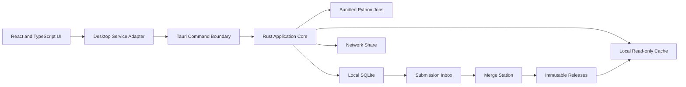

# Portal Desktop Application Design

## Data Classification And Folder Contract

The desktop application separates data by ownership, mutability, and delivery method.
File type alone does not determine the category: a SQLite database can be either a
read-only system publication or a writable business database.

1. **System data** contains users, teams, resources, permissions, and team defaults.
   The desktop application reads this database but does not administer or update it.
   Maintenance tools produce `portal_system.sqlite3`; portable packaging publishes it
   as `config/system.db`.
2. **Risk data** contains read-only analytical and inspection datasets stored in
   DuckDB. Connections must be opened in read-only mode.
3. **Map data** contains PMTiles, styles, sprites, symbols, and JSON/TOML map
   configuration. These files are immutable application inputs.
4. **Business data** contains user-created or updated workflow records. Each resource
   owns tables in `business.db`; this is the only general-purpose database
   the desktop runtime may modify.
5. **Application configuration** contains source paths and workstation settings. It
   never contains business records.

The portable distribution uses this structure:

```text
Portal-Desktop\
  Portal.exe
  runtime\
    portal-python\
      portal-python.exe
      _internal\
  config\
    portal.settings.json
    system.db                     # read-only system publication
  data\
    business.db                   # writable seed
  README.txt
  VERSION
  manifest.json
```

The per-user working structure is:

```text
%LOCALAPPDATA%\Portal\
  data\
    business.db                   # writable working database
    backups\
  exports\
  inbox\
  outbox\
  logs\
  temp\
```

The canonical business-data exchange area is separate from both the portable package
and the per-user working folder:

```text
G:\Strategic Planning\Planning\stm_risk_data\portal\data\
  master\
    current.json                 # atomically published pointer
    versions\business_NNNNNN.db  # immutable SQLite snapshots
  submissions\
    inbox\
    processed\
    rejected\
  conflicts\
    open\
    resolved\
    archive\
  locks\
  backups\
```

The `businessSync` settings section defines these paths. On a workstation's first run,
the Tauri host may copy the manifest-selected master into the local data folder after
validating path containment, SQLite format, and the optional SHA-256 digest. It records
the base version in `master-source.json`. Startup never replaces an existing local
database. The network share being unavailable therefore does not erase or block valid
local work; it only prevents obtaining a newer publication or exchanging changes.

The merge station is the only application allowed to publish a new file under
`master\versions` and replace `current.json`. A client and merge station must copy a
database to a local disk before opening it. They must never use a writable SQLite
connection against a mapped drive or UNC path.

`config/portal.settings.json` beside `Portal.exe` is the single runtime configuration
contract. Workstation-specific override files are not supported. During development,
`PORTAL_CONFIG_FILE` may point the host and Python worker to that same canonical file.
The packaged system database remains at
`config/system.db`; the settings define named risk databases,
map runtime/PMTiles/configuration roots, business database and exchange folders, media
root, exports, logs, and temporary storage. Environment tokens use the
`${PORTAL_DATA_ROOT}` form.

Large immutable reference data is external to both structures. The current shared
publication contract is:

```text
G:\Strategic Planning\Planning\stm_risk_data\
  intermediate\
    amteam\amteam.duckdb
  maptiles\
    config\
      project.toml
    build\
      staging\duckdb\stm_risk.duckdb
      pmtiles\*.pmtiles
      maplibre\                    # styles, manifests, sprites, and symbols
```

`shared.dataRoot` defines the root once; dependent paths use the
`${PORTAL_SHARED_DATA_ROOT}` token. `G:` is the initial deployment value, but a UNC
path is preferred when drive mappings are not uniform across workstations. The app
opens these files directly and read-only. They are not copied into the portable app
or `%LOCALAPPDATA%\Portal`.

At build time, the former combined `portal_management.sqlite3` seed is separated:
all `SYS_*` tables are published from `portal_system.sqlite3`, while the `RPT5W1C0_*`
tables are published from `portal_business.sqlite3`. Portable packaging renames these
files to `config/system.db` and `data/business.db`. Business rows retain user IDs but
resolve display names from the attached read-only system database, avoiding duplicated
user and team records. Portable packaging renames the system publication to
`config/system.db` is read without making a per-user copy; `data/business.db` is copied
to the user profile before it is opened for writes.

### SQLite Protection Policy

The standard SQLite library does not provide database passwords or encryption. The
portable build therefore marks `config/system.db` read-only to prevent accidental
application writes, and the release manifest records its SHA-256 digest. Approved
distributions should also be code-signed and installed or extracted into a folder whose
Windows ACL permits modification only by authorized maintainers.

`business.db` cannot use a fixed release checksum because legitimate workflow actions
change it. Protect it with user-scoped Windows permissions, transactional writes, audit
events, integrity checks, and tested backups. Encryption at rest requires a deliberate
migration to SQLite SEE or SQLCipher in every database client used by the application,
including bundled Python and any Rust-native database code. Encryption keys must come
from Windows-protected storage or an administrator-managed secret; they must not be
hard-coded in the executable, configuration JSON, or source tree. Encryption is not
enabled until that key lifecycle and merge-station compatibility are designed.

## Document Status

| Field | Value |
| --- | --- |
| Status | Desktop foundation and network publication client implemented; workflow synchronization continues |
| Version | 0.3 |
| Date | July 20, 2026 |
| Branch | `desktop` |
| Target platform | Windows 11 desktop |
| Stack | React, TypeScript, Tauri, Rust, bundled Python, SQLite, DuckDB, PMTiles |

## Purpose

This document defines the architecture and implementation path for transforming the Storm Water Asset Intelligence Portal from a browser/server application into a portable Windows desktop application.

The desktop application will retain the existing React user experience and resource model. Tauri and Rust will provide the native application shell, local data access, security boundaries, file access, and process management. Python will remain available for selected GIS, document-generation, media, data-processing, and merge workflows, but it will run only as a bundled, on-demand child process. The production desktop application will not run a local web server or listen on a TCP port.

The desktop foundation described here is implemented on the `desktop` branch. The synchronization and merge-station portions remain planned work and should continue incrementally.

## Implementation Status

The current desktop foundation provides:

- a Tauri v2 and Rust host that embeds the compiled React application;
- a portable `Portal.exe` with no installer, localhost API, or persistent background service;
- an unpacked, bundled `portal-python.exe` worker invoked by Rust through JSON over standard input and output;
- a local command dispatcher that reuses the existing Python resource logic without FastAPI or Uvicorn;
- a TypeScript desktop request adapter that sends commands through Tauri IPC;
- a validated `portal-data` custom protocol for videos, snapshots, reports, PMTiles, and byte-range reads;
- first-run initialization of separate system and business SQLite databases under `%LOCALAPPDATA%\Portal`;
- a reorganized repository with `ui`, `src-tauri`, `python/portal`, `maintenance`, `desktop`, and `docs` ownership boundaries; and
- a reproducible portable build in `dist\Portal-Desktop`.

Existing `/api/...` strings are retained only as internal command identifiers during migration. They are dispatched in-process by the bundled Python worker and are not HTTP endpoints.

## Executive Decision

The recommended target is a portable, local-first desktop application with controlled file exchange:

- React and TypeScript remain the presentation layer.
- Tauri hosts the React application in WebView2.
- Rust owns the trusted Tauri command boundary and invokes validated local Python commands; frequently used operations can move to typed Rust commands over time.
- Bundled Python executables perform specialized jobs when Python is the better tool.
- Read-only DuckDB, PMTiles, symbols, and other large reference data are published on a network share and opened there directly.
- Each workstation owns a small local writable SQLite database, normally under 10 MB.
- Workstations never open a writable SQLite database directly from the shared drive.
- Users submit versioned change packages to the shared drive.
- A separate merge-station desktop application is the only writer to the canonical shared dataset.
- The merge station publishes immutable release snapshots that clients can download.
- The application is delivered as a portable folder or ZIP. It has no installer and installs no Windows service.

This design fits the expected 20 to 30 intranet users, approximately 5 to 6 simultaneous users, infrequent writes, and the restriction that a database server cannot be deployed.

## Goals

1. Run the Portal as a normal Windows desktop application without FastAPI, Uvicorn, Vite, or another persistent local service.
2. Preserve the existing React resource pages, resource metadata, permissions, featured items, dashboards, maps, tables, reports, and help pages.
3. Support direct access to approved local and network files, including videos, snapshots, DuckDB databases, PMTiles, and generated reports.
4. Keep geospatial reference data read-only and external to the portable application.
5. Support small amounts of writable business data without a database server and without unsafe network-share SQLite access.
6. Preserve user, team, role, permission, audit, and resource-management behavior.
7. Allow existing Python capabilities to be reused without requiring Python or Conda on client computers.
8. Provide a recoverable, auditable submission and merge process for writable data.
9. Support portable deployment with no administrator access and no installer.

## Non-Goals

- Real-time multi-user editing of the same record.
- A writable SQLite database opened concurrently from a network share.
- A local HTTP API, localhost web server, or background Windows service.
- Internet-facing deployment.
- Silent last-write-wins conflict resolution.
- Treating application permissions as a replacement for Windows and network-share security.
- Rewriting all existing Python logic in Rust before the desktop application can be released.
- Preserving an HTTP or REST transport inside the production desktop runtime. Existing path strings may remain as internal command identifiers.

## Constraints And Assumptions

- Client computers run Windows 11.
- Microsoft Edge WebView2 is available on standard Windows 11 computers. A fixed WebView2 runtime can be bundled if the target environment requires strict runtime control.
- Users can run an executable from a local folder without an installer.
- The application itself runs locally. It should not be run directly from a network share.
- Shared data is reachable through the path configured in `shared.dataRoot`. The current deployment uses a mapped `G:` drive; a UNC path can replace it without a code change.
- DuckDB and PMTiles source datasets are read-only at runtime.
- Writable workstation databases remain small, normally less than 10 MB.
- Network access to the configured shared data root is required for risk and map resources.
- Only one controlled merge process writes each canonical SQLite database.
- Windows identity and network ACLs provide the actual access boundary for shared folders.

## Current Desktop Application Summary

The current repository now uses explicit desktop ownership boundaries:

- React 19 and TypeScript provide the UI in `ui`.
- Vite builds the UI and serves assets only during Tauri development.
- Rust hosts the application, owns native commands, and invokes the local Python worker.
- The bundled Python command layer provides management, authentication, dashboard, map, report, media, diagnostics, and data-query logic without opening a port.
- DuckDB supplies read-only dashboard, inspection, and spatial data.
- A read-only system SQLite publication supplies users, teams, resources, and permissions.
- A separate writable business SQLite database stores resource-owned workflow data.
- PMTiles and MapLibre provide map rendering.
- Python produces reports, spreadsheets, GIS results, and other derived artifacts.
- Each portal resource has its own directory and `resource.json` metadata file.
- Resource IDs use a three-character type prefix followed by five uppercase letters or digits, such as `RPT5W1C0`.
- Portal system tables use the `SYS_` prefix. Resource-owned tables can use the resource ID as their prefix.

The UI routes Portal data calls through `ui/src/desktop/request.ts`. Existing `/api/...` path values are local command keys passed over Tauri IPC, not browser network requests.

## Target Architecture



### Runtime Process Model

The normal client runtime contains the Tauri application and one child worker:

```text
Portal.exe
  Tauri/Rust host
    WebView2
      React application
  runtime\portal-python\portal-python.exe --serve
```

The Python process:

- is launched once during desktop sign-in and owned by `Portal.exe`;
- does not listen on a port;
- handles one validated command at a time using newline-delimited JSON over standard input and output;
- remains warm so imports, route registration, and read-only data initialization are not repeated for every resource request;
- loads from an unpacked runtime directory so startup does not incur PyInstaller one-file extraction;
- may use temporary files and Tauri progress events for large generated artifacts;
- exits when Portal closes its input stream;
- is terminated when the parent application closes unexpectedly.

After Windows identity is matched at startup, React caches the profile and selected
role for the application session. The portal catalog loads effective permissions once
for that role and includes the resource-specific permission context when a resource is
opened. Embedded resource routes trust this established desktop session instead of
calling the account-profile endpoint again. Protected Python commands still validate
the signed session token and enforce current resource/workflow permissions.

### Repository Layout

The repository preserves resource ownership with explicit desktop boundaries:

```text
Portal\
  ui\
    src\
      desktop\
        request.ts
      resources\
  src-tauri\
    Cargo.toml
    tauri.conf.json
    capabilities\
    src\
      commands\
      data\
      media\
      permissions\
      python\
      resources\
      sync\
  python\
    portal\
      app\
      runtime\
      ipc\
      data\
  maintenance\
    migrations\
    merge_station\
    backup_restore\
    release_tools\
  desktop\
    scripts\
    config\
  docs\
```

The former `frontend` and `backend` top-level directories have been retired. Their responsibilities now live under `ui`, `src-tauri`, and `python/portal`; database lifecycle utilities live under `maintenance`.

## Component Responsibilities

### React And TypeScript

React remains responsible for:

- application navigation and resource pages;
- dashboards, tables, maps, forms, modal windows, and help pages;
- client-side filtering, sorting, paging, and visualization;
- local draft state and validation feedback;
- invoking typed desktop services;
- showing progress, errors, conflicts, and synchronization status;
- adapting layouts for the Tauri desktop window.

React must not receive unrestricted filesystem or command execution access.

### Desktop Service Adapter

Use one TypeScript service layer between React components and the runtime:

```ts
interface PortalServices {
  auth: AuthService
  resources: ResourceService
  dashboards: DashboardService
  maps: MapService
  reports: ReportService
  sync: SyncService
  files: FileService
}
```

- Tauri mode calls `invoke(...)`, listens for events, and uses approved custom asset protocols.
- `portalRequest` maps existing command paths to the Rust-owned `python_request` command.
- React components should consume domain methods instead of introducing direct browser networking.

This adapter allows incremental migration without rewriting every resource at once. Domain-specific typed commands can replace the compatibility command dispatcher as responsibilities move into Rust.

### Tauri And Rust

Rust is the trusted application core and is responsible for:

- application startup, shutdown, window state, and lifecycle;
- typed Tauri commands and response models;
- user-session and selected-role context;
- resource discovery from `resource.json` files;
- resource authorization and permission context;
- safe local and UNC path resolution;
- SQLite reads and writes;
- read-only DuckDB queries where a Rust implementation is practical;
- shared reference-data path validation, manifests, and integrity checks;
- submission package creation and validation;
- Python child-process lifecycle, timeout, cancellation, and progress;
- custom protocols for approved local media, snapshots, PMTiles, and generated files;
- structured logging and diagnostics.

Rust commands must be narrow and domain-specific. The frontend must not receive a general `execute_sql`, `read_any_file`, or `run_command` capability.

### Python Jobs

Python remains appropriate for:

- DOCX, PDF, and XLSX generation;
- existing geospatial processing using GeoPandas, Shapely, Rasterio, or related libraries;
- complex DuckDB transformations already implemented in Python;
- image and video processing;
- migration and maintenance utilities;
- submission validation and merge-station workflows;
- tasks whose stable Python implementation would be expensive to rewrite in Rust.

Python code will be packaged as one or more executables using PyInstaller, Nuitka, or a controlled standalone Python distribution. Client machines will not install Python or Conda.

For small request and response payloads, use JSON Lines over standard input and output. For large tabular or binary data, exchange validated file paths to temporary Parquet, Arrow, SQLite, image, video, or report files.

### Merge Station

The merge station is a separate desktop application or maintenance mode intended for an authorized data steward. It can use Tauri plus Python or a Python desktop UI.

It is the only component allowed to update the canonical writable database. Its responsibilities are:

- scan the submission inbox;
- claim one submission atomically;
- verify package structure and checksum;
- validate schema and application versions;
- validate user and permission context;
- compare base row versions;
- apply non-conflicting changes in a transaction;
- identify and present conflicts;
- run integrity checks;
- publish a new immutable release;
- archive processed, rejected, and conflicting submissions;
- write a complete merge audit trail.

## Resource Architecture

The existing resource model should remain the organizing unit of the desktop application.

Each resource continues to own:

- a unique `resource_id`;
- name, type, category, route, description, icon, and active status;
- its React entry point;
- optional help content;
- required permissions;
- optional thumbnails and assets;
- optional Rust command module;
- optional Python job definitions;
- optional local database tables prefixed by its resource ID.

Recommended additions to each `resource.json`:

```json
{
  "resource_id": "RPT5W1C0",
  "runtime": {
    "desktop": true,
    "requires_network": true,
    "required_datasets": ["amteam"],
    "python_jobs": ["generate_cctv_report"],
    "help_path": "help/index.html"
  }
}
```

Resource metadata remains discoverable at build time and readable by React, Rust, Python, and maintenance tools. Duplicate resource IDs must fail validation and block registration or packaging.

## Desktop Command Contract

Every desktop command receives the authenticated session context from Rust, not from arbitrary query parameters supplied by the resource page.

The context includes:

- user ID;
- work email;
- employee ID;
- first and last name;
- team ID and team name;
- manager flag;
- available roles;
- currently selected role;
- resource ID;
- effective permission set for that resource.

Example command families:

```text
auth_login
auth_switch_role
session_get
resources_list_available
resource_get_context
dashboard_query
map_get_manifest
map_query_features
media_resolve
report_list
report_save
report_generate
sync_get_status
sync_submit
sync_download_release
```

The selected role must control elevated behavior. Merely having an admin role on the account must not grant admin operations while the user is operating under the normal User role.

## Data Architecture

### Data Classes

| Data class | Examples | Runtime policy |
| --- | --- | --- |
| Packaged static assets | React bundle, icons, resource metadata, help pages | Read-only, shipped with the app |
| Published reference data | DuckDB, PMTiles, symbols, lookup files | Read-only and opened directly from the configured network root |
| Local writable data | Reports, user actions, preferences, outbox | Workstation-owned SQLite |
| Canonical writable data | Merged system and workflow records | Updated only by merge station |
| User-generated files | DOCX, PDF, XLSX, snapshots, submission ZIPs | Written to approved local folders, then explicitly published |
| Logs and diagnostics | Application and job logs | Local by default; exportable for support |

### Recommended Local Directories

```text
%LOCALAPPDATA%\Portal\
  config\
  data\
    business.db
    backups\
  cache\
    media\
  outbox\
  downloads\
  temp\
  logs\
```

Temporary files must be cleaned after successful jobs and periodically at startup.

### Read-Only DuckDB And PMTiles

The shared drive is both the publication source and runtime source for large immutable
reference data. Maintenance publishes a complete, internally consistent map dataset
under `maptiles`; clients never modify it.

Recommended startup behavior:

1. Open the application window immediately with a startup splash so slow network and identity checks never leave the user staring at a blank screen.
2. Resolve `shared.dataRoot` from the portable `config/portal.settings.json` file.
3. Confirm that the shared root exists and can be read. If it is unavailable, replace the splash status with an actionable error identifying the configured path and offer Retry and Exit actions.
4. Resolve the signed-in user's email address from the Windows UPN (`whoami /upn`).
5. Match that email case-insensitively to an active `SYS_USERS.email` record in `config/system.db`. If no active account matches, show the email address, ask the user to contact the Portal developer, and do not open the portal workspace.
6. Create a local Portal session with the existing profile, roles, team, manager flag, resource permissions, and featured-item rules. Cache the returned profile for immediate header rendering. The initial selected role is User; multi-role users may switch roles in the Portal menu.
7. Validate the configured DuckDB, project configuration, manifest, and PMTiles paths.
8. Open DuckDB with `read_only = true`.
9. Read PMTiles through the validated Tauri custom protocol with byte-range support.

Publishing should use a staging folder followed by an atomic folder/version switch
when the operational process is formalized. The current maintenance publishing script
copies the approved build artifacts into the shared folder and validates required files.

### Local Writable SQLite

Each workstation writes only to its own local SQLite database. No workstation opens the canonical network database for writing.

Recommended database split:

- `portal_system.sqlite`: users, teams, resources, permissions, featured items, and system audit data.
- `cctv_reviews.sqlite`: `RPT5W1C0_` report workflow tables.
- Additional resource databases when a workflow benefits from independent release and conflict scope.
- Per-user preference storage for non-shared UI settings.

Database files should remain small, use migrations, and enable appropriate SQLite safeguards such as foreign keys. Before submission, the client should run `PRAGMA integrity_check`.

### Synchronizable Record Requirements

Records that can be edited on more than one workstation need stable synchronization metadata:

- globally unique record ID, preferably UUIDv7;
- `row_version` integer;
- `created_at_utc` and `created_by`;
- `updated_at_utc` and `updated_by`;
- `origin_device_id`;
- `deleted_at_utc` tombstone for synchronized deletes.

Hard deletion before a merge can cause deleted records to reappear. A tombstone is therefore required for synchronized data, even if the user interface describes the action as Delete.

### Change Log

Each synchronizable database should contain an outbox table similar to:

```sql
CREATE TABLE SYS_CHANGE_LOG (
    change_id TEXT PRIMARY KEY,
    table_name TEXT NOT NULL,
    record_id TEXT NOT NULL,
    operation TEXT NOT NULL
        CHECK (operation IN ('INSERT', 'UPDATE', 'DELETE')),
    base_row_version INTEGER,
    changed_fields_json TEXT,
    changed_at_utc TEXT NOT NULL,
    changed_by TEXT NOT NULL,
    device_id TEXT NOT NULL,
    submitted_at_utc TEXT
);
```

Application repositories, not React components, must write business records and their change-log entries in the same SQLite transaction.

## Submission And Release Protocol

### Network Folder Layout

```text
\\server\share\PortalData\
  inbox\
  processing\
  processed\
  rejected\
  conflicts\
  releases\
  attachments\
```

Network ACLs should allow normal users to create uniquely named submissions without modifying published releases or other users' submissions.

### Submission Package

A submission is an immutable ZIP package containing:

```text
manifest.json
portal.sqlite or resource-specific.sqlite
checksum.sha256
optional attachments\
```

Recommended manifest fields:

```json
{
  "submission_id": "UUIDv7",
  "user_email": "user@charlottenc.gov",
  "device_id": "stable-workstation-id",
  "base_release": 42,
  "schema_version": 7,
  "application_version": "1.0.0",
  "created_at_utc": "2026-07-20T15:00:00Z",
  "change_count": 12
}
```

Upload behavior:

1. Build and validate the package locally.
2. Copy it to a unique temporary network filename.
3. Flush and close the file.
4. Rename it to `*.ready.zip` on the same share.

The merge station processes only files with the ready suffix.

### Merge Algorithm

For each package, the merge station should:

1. Atomically move it from `inbox` to `processing`.
2. Verify checksum, schema version, application compatibility, device, and user identity.
3. Copy the submitted database to local merge-station storage before opening it.
4. Read ordered entries from `SYS_CHANGE_LOG`.
5. Open a local working copy of the canonical database.
6. Compare each `base_row_version` with the canonical row version.
7. Apply non-conflicting changes in one transaction.
8. Roll back the transaction if an unexpected error occurs.
9. Run `PRAGMA foreign_key_check` and `PRAGMA integrity_check`.
10. Publish a new immutable release with a checksum and ready marker.
11. Archive the package in `processed`, `rejected`, or `conflicts`.

Only the merge station writes the canonical dataset.

### Conflict Policy

The system must not silently use last-write-wins.

Example:

- Base release contains record version 4.
- User A updates it and the merge station publishes version 5.
- User B later submits an update whose base version is still 4.
- User B's change is a conflict and must be reviewed.

Recommended automatic resolution is limited to non-overlapping fields when the merge station can prove that both changes are compatible. Otherwise, a data steward chooses the accepted value and the decision is audited.

### Downloading A Release

The client must not overwrite a local database that contains unsubmitted changes.

MVP behavior:

- If the outbox is empty, download and atomically install the latest release.
- If the outbox is not empty, require the user to submit or explicitly discard local changes first.

A later release may support rebasing an outbox onto a newer canonical release.

## Authentication, Authorization, And Security

### Identity

The desktop application uses the signed-in Windows user's UPN email address as its identity. At startup, Rust obtains the email address from `whoami /upn` and the local Python domain layer matches it case-insensitively against the active `SYS_USERS.email` records in the read-only system database. The desktop application has no password prompt and does not use employee ID or the short Windows username for identity matching.

The matched Portal account remains the authority for profile data, team membership, manager status, available roles, resource permissions, and featured items. Disabled, deleted, or unknown accounts cannot open the application.

### Authorization

The existing role and resource-permission model remains useful for workflow behavior:

- User
- Admin
- System Admin
- team manager flag
- View, Edit, Review, Create, Delete, Manage, and Admin resource permissions

The client should evaluate permissions for UI behavior, and Rust should enforce the same permissions again for every command that reads protected data or changes state. The merge station must independently validate submitted operations against an authorized user and permission snapshot.

### Actual Security Boundary

Because the application is local-first and does not have a server, application permissions alone cannot prevent a technically capable user from editing a local SQLite file. The actual boundary is:

- Windows user identity;
- NTFS permissions;
- network-share ACLs;
- signed application binaries;
- signed or checksummed releases and submissions;
- merge-station validation;
- audit logs.

Normal users must not have permission to replace canonical releases, modify another user's submission, or run the merge station.

### Tauri Security

- Use a restrictive Tauri capability configuration.
- Allow filesystem access only to application data, approved export folders, and configured data shares.
- Validate all paths after canonicalization.
- Use allowlisted custom protocols for media and PMTiles.
- Do not expose shell execution to React.
- Do not interpolate user input into SQL or process command lines.
- Sign production executables when the organization can provide a code-signing certificate.

## Media And Network Files

Current `P:` and `G:` paths must be converted to configurable UNC roots. The application should store logical media paths or source-relative paths rather than workstation-specific drive letters.

Recommended resolution order:

1. Local approved media cache.
2. Configured UNC source path.
3. Optional legacy mapped-drive fallback during migration only.

React receives an opaque media URL from a Tauri custom protocol. Rust validates and opens the underlying file. This supports video seeking, snapshots, PMTiles range reads, and image loading without a local HTTP server.

Report generation in desktop mode must resolve source images through the same path service. Python should receive a validated local or UNC path from Rust and must not construct arbitrary paths from raw UI input.

## Portable Deployment

### Client Package

Recommended portable package:

```text
Portal-Desktop-1.0.0\
  Portal.exe
  runtime\
    portal-python\
      portal-python.exe
      _internal\
  config\
  data\
  licenses\
  VERSION
```

Users extract the ZIP to a local folder and run `Portal.exe`.

The client does not install:

- Python or Conda;
- Node.js or npm;
- Rust;
- DuckDB or SQLite applications;
- a web server;
- a database server;
- a Windows service.

If the standard Windows 11 WebView2 runtime is available, no additional runtime action is required. A fixed WebView2 runtime can be placed inside the portable package if required, at the cost of a larger download.

The development workstation was verified to contain WebView2 version `150.0.4078.83`. Deployment testing must still verify WebView2 on representative client computers rather than relying on this single workstation result.

### Updates

With no installer, updates should use versioned portable folders:

1. Download and verify a new application ZIP.
2. Extract it beside the current version.
3. Start the new version using the same `%LOCALAPPDATA%\Portal` data folder.
4. Run compatible database migrations with backup and rollback support.
5. Retain the previous application folder until the new version is accepted.

The executable must not update itself in place while it is running.

## Maintenance Application

The existing `maintenance` area should become the home for offline administrative tooling:

- database creation;
- schema migration;
- validation;
- backup and restore;
- resource metadata validation;
- submission inspection;
- merge-station operation;
- release publication;
- shared reference-data manifest generation;
- recovery and integrity checks.

Maintenance commands must be versioned with the database schema and tested against copies, never directly against the only canonical file.

## Logging And Audit

Client logs should be written under `%LOCALAPPDATA%\Portal\logs` using structured JSON Lines or another machine-readable format.

Each entry should include:

- UTC timestamp and local Eastern Time display value;
- application version;
- device ID;
- user ID and selected role when available;
- resource ID;
- command or job name;
- correlation ID;
- duration;
- outcome and error category.

Do not log passwords, tokens, full database rows, or confidential media paths unless explicitly required for diagnostics.

Business audit events remain in the appropriate SQLite database and are synchronized through the normal change protocol. Operational logs are separate from business audit records.

## Failure And Recovery Behavior

| Failure | Expected behavior |
| --- | --- |
| Configured shared root unavailable at startup | Keep the startup screen open, show the configured path, and offer Retry and Exit actions |
| Windows email is missing or not an active Portal account | Keep the startup screen open, show a contact-the-developer message, and prevent access to the portal workspace |
| Reference-data publication interrupted | Do not announce the new publication; keep the previous approved shared version |
| Python job fails | Terminate job, preserve logs, show actionable error, keep valid local data |
| Submission upload interrupted | Leave only a temporary file; merge station ignores it |
| Invalid checksum | Reject package and audit reason |
| Merge conflict | Do not apply conflicting row; publish no partial transaction |
| Integrity check fails | Roll back, quarantine package, retain previous release |
| App closes during local write | SQLite transaction rolls back incomplete changes |
| App closes during Python job | Rust terminates child and removes stale temp artifacts later |
| New release exists while local changes are pending | Block replacement until submit or discard decision |

## Migration Strategy

Phases 1, the command-adapter portion of Phase 2, the custom-protocol portion of Phase 3, and the Python packaging foundation in Phase 6 are implemented. The remaining items describe the next migration increments.

### Phase 0: Inventory And Baseline

- Inventory every resource, API call, database, media root, Python dependency, report, and export.
- Record current behavior and create representative test datasets.
- Validate every `resource.json` and resource ID.
- Identify APIs that can become direct Rust queries and jobs that should remain Python.

Exit criterion: every current `/api/...` dependency has an owner and target implementation.

### Phase 1: Tauri Shell

- Add Tauri v2 to the `desktop` branch.
- Package the current React build inside a desktop window.
- Add typed application configuration, logging, and diagnostics.
- Confirm WebView2, MapLibre, PMTiles rendering, modal windows, video, and file downloads.

The Tauri shell and portable packaging are implemented. Historical server behavior may be compared through tests or source history; it is not part of the desktop runtime.

Exit criterion: the existing portal UI runs reliably inside Tauri.

### Phase 2: Service Adapter

- Continue moving resource calls through the TypeScript desktop adapter.
- Replace compatibility command paths with typed domain services where that improves validation and maintainability.
- Keep command fixtures for parity testing as implementations move from Python to Rust.

Exit criterion: resource components do not depend on network URLs and use desktop services exclusively.

### Phase 3: Read-Only Data And Media

- Validate the external shared-data layout and publication manifest.
- Implement Rust read-only DuckDB access for common dashboard queries.
- Implement PMTiles and media custom protocols.
- Replace mapped drive assumptions with configurable UNC roots.
- Verify CCTV video and snapshot access and desktop report image access.

Exit criterion: read-only dashboards, maps, videos, and snapshots work without any local server. The desktop foundation already satisfies this for representative smoke-test paths.

### Phase 4: Session, Resources, And Permissions

- Port authentication/session behavior.
- Load resource metadata locally.
- Port users, teams, selected roles, permissions, featured items, and help links.
- Enforce permissions in both React and Rust.

Exit criterion: only active, authorized resources are available to the signed-in user.

### Phase 5: Local Writable Workflows

- Port management and report databases to local SQLite repositories.
- Add migrations, UUIDv7 IDs, row versions, tombstones, and `SYS_CHANGE_LOG`.
- Port the Proactive Team CCTV Review workflow and report event history.

Exit criterion: a workstation can create and update complete local workflows without a server.

### Phase 6: Python Job Packaging

- Package report, spreadsheet, image, video, and GIS jobs.
- Define JSON job schemas and progress events.
- Add cancellation, timeout, temporary-file cleanup, and job logs.

Exit criterion: no client requires a Python or Conda installation.

### Phase 7: Submission And Merge Station

- Implement submit and download commands.
- Implement the network folder protocol.
- Build the merge-station application.
- Add conflict review, integrity validation, backups, immutable release publication, and audit.

Exit criterion: changes from multiple workstations can be safely merged without opening SQLite over the network.

### Phase 8: Pilot And Legacy Server Retirement

- Pilot with a small group and representative network conditions.
- Compare desktop outputs with the current Portal.
- Exercise backup, restore, conflict, offline, and rollback procedures.
- Confirm that production has no dependency on Uvicorn, FastAPI, Vite, or service launcher scripts. The portable build already excludes them.

Exit criterion: approved users can perform normal work with no persistent backend process.

## Initial Migration Matrix

| Current responsibility | Desktop target |
| --- | --- |
| Vite production server | Bundled React assets in Tauri |
| FastAPI request routing | Rust Tauri commands plus the bounded local Python dispatcher during migration |
| CORS and API base URLs | Removed from production runtime |
| Management SQLite via SQLAlchemy | Rust repository layer plus explicit migrations; Python maintenance where useful |
| DuckDB dashboard endpoints | Rust DuckDB queries or bounded Python jobs |
| Map manifest and PMTiles endpoints | Local manifest service and custom protocol |
| Media endpoints | Safe custom protocol over approved local/UNC roots |
| DOCX/PDF/XLSX generation | Bundled Python job |
| Authentication token in browser storage | Tauri-managed local session and selected role |
| Resource URL query context | Trusted Tauri resource context |
| Server logs | Local Rust and Python structured logs |
| Central writable SQLite | Local workstation DB plus submission and merge station |

## Testing Strategy

### Automated Tests

- Rust unit tests for path validation, permissions, commands, reference-data manifests, submission packages, and conflict detection.
- React tests for service adapters, permission-driven controls, offline states, and workflows.
- Python tests for report generation, GIS jobs, merge validation, and deterministic output.
- SQLite migration tests from every supported prior schema.
- Contract tests that run representative fixtures through the local dispatcher and typed Tauri services during migration.

### Integration Tests

- Launch the packaged desktop application on a clean Windows 11 profile.
- Run without a local data server; Vite is absent from the packaged runtime.
- Test that the splash appears immediately, then test unavailable-shared-drive diagnostics, retry, and exit.
- Test automatic sign-in by Windows UPN email, case-insensitive matching, unknown users, and inactive users.
- Test large PMTiles, DuckDB, video, and snapshot files.
- Test report generation from UNC media sources.
- Test interrupted copy, submission, and merge operations.
- Test two users editing the same base record and verify conflict detection.
- Test selected-role behavior for User, Admin, and System Admin.
- Test Windows ACL denial and actionable error reporting.

### Acceptance Criteria

The desktop transformation is complete when:

1. `Portal.exe` starts from a local portable folder without an installer.
2. No local HTTP port or Windows service is opened.
3. Users do not install Node.js, Rust, Python, Conda, DuckDB, SQLite, or a database server.
4. All active portal resources load through local Tauri services.
5. Read-only map and dashboard data load directly from the configured shared data root.
6. Videos, snapshots, PMTiles, and reports work through validated local or UNC paths.
7. Writable data is saved only to workstation-local SQLite.
8. No writable SQLite database is opened directly from the network share.
9. Submission packages are checksummed, immutable, identifiable, and auditable.
10. The merge station detects stale row versions and never silently overwrites a conflict.
11. Canonical releases are immutable, versioned, integrity checked, and recoverable.
12. Resource permissions are enforced using the currently selected role.
13. Existing key reports and exports match approved baseline outputs.
14. FastAPI, Uvicorn, Vite production serving, and service launcher scripts are not required.

## Risks And Mitigations

| Risk | Mitigation |
| --- | --- |
| Local permissions are mistaken for strong security | Use Windows identity, ACLs, signed binaries, and merge-station validation |
| Writable SQLite is accidentally opened on a share | Centralize path policy in Rust and reject writable UNC database paths |
| Users overwrite unsent changes during download | Block release replacement while the local outbox is nonempty |
| Shared datasets are large or network access is slow | Keep files immutable, use PMTiles range reads, open DuckDB read-only, monitor latency, and publish versioned folders |
| Python packaging becomes too large | Split Python jobs by capability and package only required libraries |
| Existing UI command keys reflect the former HTTP contract | Keep them behind the desktop adapter and replace them incrementally with typed domain commands |
| UNC media access is inconsistent | Configure logical roots, test ACLs, cache selectively, and retain diagnostic path checks |
| Simultaneous edits conflict | Stable IDs, row versions, tombstones, and explicit merge review |
| Portable app versions drift | Versioned folders, compatibility checks, and minimum-version rules in release manifests |
| Merge station becomes a single operational dependency | Document ownership, backups, restore drills, and a recoverable standby workstation |

## Recommended First Decisions

The following decisions should be treated as approved unless later requirements require an architecture change:

1. Use Tauri v2 with the existing React and TypeScript UI.
2. Ship a portable ZIP, not an installer.
3. Do not run a persistent local service or expose a localhost API.
4. Use Rust Tauri commands for trusted application services.
5. Package Python jobs as client-side executables and launch them on demand.
6. Keep DuckDB, PMTiles, styles, and symbols outside the portable folder and open them read-only from the shared root.
7. Support both mapped and UNC roots in configuration; prefer UNC paths when drive mappings differ across clients.
8. Keep all writable SQLite databases local to a workstation.
9. Exchange immutable submission packages through the network share.
10. Use a single controlled merge station to publish canonical immutable releases.
11. Add stable IDs, row versions, tombstones, and a transactional change log before enabling synchronization.
12. Migrate incrementally through a TypeScript service adapter instead of rewriting all resources at once.

## Open Design Decisions

These items should be resolved during Phase 0 or Phase 1:

- Whether to use a Rust DuckDB crate, bundled DuckDB CLI/library, or Python for each query family.
- Whether one Python executable or several smaller job-specific executables gives the best package and update behavior.
- The authoritative UNC share roots and ACL design.
- The exact merge-station conflict review UI and data-steward ownership.
- Whether canonical data is split into system and resource-specific release packages.
- Retention periods for submissions, releases, conflicts, attachments, logs, and backups.
- Whether production must bundle a fixed WebView2 runtime.
- The application signing and release-approval process.

## Reference Guidance

- Tauri sidecars: <https://v2.tauri.app/develop/sidecar/>
- Tauri filesystem security: <https://v2.tauri.app/plugin/file-system/>
- Tauri Windows deployment and WebView2: <https://v2.tauri.app/distribute/windows-installer/>
- SQLite guidance for network filesystems: <https://www.sqlite.org/useovernet.html>
- DuckDB concurrency guidance: <https://duckdb.org/docs/current/connect/concurrency>
