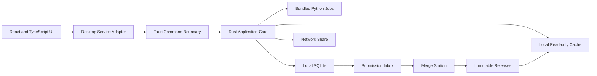

# Portal Desktop Application Design

## Data Classification And Folder Contract

The desktop application separates data by ownership, mutability, and delivery method.
File type alone does not determine the category: a SQLite database can be either a
read-only system publication or a writable business database.

1. **System data** contains users, teams, resources, permissions, and team defaults.
   The desktop application reads this database but does not administer or update it.
   Portal Manager publishes its authoritative SQLite catalog as versioned
   `system.catalog` data. Desktop validates and converts it to SQLCipher locally.
2. **Risk data** contains read-only analytical and inspection datasets stored in
   DuckDB. Connections must be opened in read-only mode.
3. **Map data** contains external PMTiles archives plus resource-owned styles,
   sprites, symbols, and layer definitions. Runtime data paths are supplied by the
   packaged JSON/TOML configuration. All are immutable application inputs.
4. **Business data** contains user-created or updated workflow records. Each resource
   owns tables in `stormwater.db`; this is the only general-purpose database
   the desktop runtime may modify.
5. **Application configuration** contains source paths and workstation settings. It
   never contains business records.

The portable distribution uses this structure:

```text
Portal-Desktop\
  Portal.exe
  runtime\
    portal-python\
      portal-python.exe
      _internal\
  config\
    portal.settings.json
    system.db                     # generated encrypted read-only runtime mirror
  data\                           # empty at distribution time
  README.txt
  VERSION
  manifest.json
```

The per-user working structure is:

```text
%LOCALAPPDATA%\StormWaterPortal\
  config\
    system-catalog.key            # Windows DPAPI-protected per-user key blob
  data\
    stormwater.db                 # writable working database
    backups\
  exports\
  inbox\
  outbox\
  logs\
  temp\
```

The canonical business-data exchange area is separate from both the portable package
and the per-user working folder:

```text
G:\Strategic Planning\Planning\stm_risk_data\portal\data\
  master\
    current.json                 # atomically published pointer
    versions\stormwater_NNNNNN.db  # immutable SQLite snapshots
  submissions\
    inbox\
    processed\
    rejected\
  conflicts\
    open\
    resolved\
    archive\
  locks\
  backups\
```

The `businessSync` settings section defines these paths. On a workstation's first run,
the Tauri host may copy the manifest-selected master into the local data folder after
validating path containment, SQLite format, and the optional SHA-256 digest. It records
the base version in `master-source.json`. Startup never replaces an existing local
database. The network share being unavailable therefore does not erase or block valid
local work; it only prevents obtaining a newer publication or exchanging changes.

The merge station is the only application allowed to publish a new file under
`master\versions` and replace `current.json`. A client and merge station must copy a
database to a local disk before opening it. They must never use a writable SQLite
connection against a mapped drive or UNC path.

`config/portal.settings.json` beside `Portal.exe` is the single runtime configuration
contract. Workstation-specific override files are not supported. During development,
`PORTAL_CONFIG_FILE` may point the host and Python worker to that same canonical file.
The active encrypted system database is mirrored to `config/system.db` after verified
cache activation; the settings define named risk databases,
PMTiles and terrain roots, business database and exchange folders, media
root, exports, logs, and temporary storage. Environment tokens use the
`${PORTAL_DATA_ROOT}` form.

Large immutable reference data is external to both structures. The current shared
publication contract is:

```text
G:\Strategic Planning\Planning\stm_risk_data\
  intermediate\
    amteam\amteam.duckdb
    cityworks\cityworks.db
    riskranking\riskranking.db
    inventory\inventory.db
  databases_local\tiles\*.pmtiles
  maptiles\build\pmtiles\*.pmtiles   # retained legacy archive, when required
```

`shared.dataRoot` defines the root once; dependent paths use the
`${PORTAL_SHARED_DATA_ROOT}` token. `G:` is the initial deployment value, but a UNC
path is preferred when drive mappings are not uniform across workstations. The app
opens these files directly and read-only. They are not copied into the portable app
or `%LOCALAPPDATA%\Portal`.

At build time, the former combined `portal_management.sqlite3` seed is separated:
all `SYS_*` tables are published from `portal_system.sqlite3`, while the `CCTV_REVIEW_*`
tables are registered in the business schema catalog. `RPT5W1C0` remains the resource
and managed-entity identifier. Portable packaging includes neither `system.db` nor
`stormwater.db`.
On first launch, Portal verifies the immutable snapshot referenced by
`businessSync.networkRoot\protocol-v1\snapshots\current.json`, verifies its SHA-256
digest, and installs it as the local `%LOCALAPPDATA%\Portal\data\stormwater.db`
replica. Business rows retain user IDs but resolve display names from the attached
read-only system database, avoiding duplicated user and team records. Portal refuses
to create a blank business database when the shared snapshot is unavailable or invalid.

### SQLite Protection Policy

The Desktop system catalog uses SQLCipher. On activation, Rust loads or creates a
random 256-bit per-user key, stores only its Windows DPAPI-protected blob under the
user profile, and gives the unwrapped key only to the bundled worker process. The
worker converts the checksum-verified published SQLite source directly to an encrypted
local version, verifies SQLCipher integrity and schema-object count, and marks it
read-only. Standard SQLite tools cannot open the ciphertext. A different Windows user
cannot unwrap the key blob, and no endpoint provisioning is required.

The Manager's authoritative `config/system.db` remains normal writable SQLite so
administration and publication continue to work. The shared catalog publication is
the trusted conversion source; the Desktop software archive contains no plaintext
copy. SQLCipher protects data at rest but does not prevent an authorized Windows user
from reading data through the running application.

`stormwater.db` cannot use a fixed release checksum because legitimate workflow actions
change it. Protect it with user-scoped Windows permissions, transactional writes, audit
events, integrity checks, and tested backups. The business database remains outside
this catalog-only encryption scope.

## Document Status

| Field | Value |
| --- | --- |
| Status | Desktop foundation implemented; map-data performance architecture approved for phased implementation |
| Version | 0.4 |
| Date | August 12, 2026 |
| Branch | `desktop` |
| Target platform | Windows 11 desktop |
| Stack | React, TypeScript, Tauri, Rust, bundled Python, SQLite, DuckDB, PMTiles |

## Purpose

This document defines the architecture and implementation path for transforming the Storm Water Asset Intelligence Portal from a browser/server application into a portable Windows desktop application.

The desktop application will retain the existing React user experience and resource model. Tauri and Rust will provide the native application shell, local data access, security boundaries, file access, and process management. Python will remain available for selected GIS, document-generation, media, data-processing, and merge workflows, but it will run only as a bundled, on-demand child process. The production desktop application will not run a local web server or listen on a TCP port.

The desktop foundation described here is implemented on the `desktop` branch. The synchronization and merge-station portions remain planned work and should continue incrementally.

## Implementation Status

The current desktop foundation provides:

- a Tauri v2 and Rust host that embeds the compiled React application;
- a portable `Portal.exe` with no installer, localhost API, or persistent background service;
- an unpacked, bundled `portal-python.exe` worker invoked by Rust through JSON over standard input and output;
- a local command dispatcher that reuses the existing Python resource logic without FastAPI or Uvicorn;
- a TypeScript desktop request adapter that sends commands through Tauri IPC;
- a validated `portal-data` custom protocol for videos, snapshots, reports, PMTiles, and byte-range reads;
- first-run initialization of separate system and business SQLite databases under `%LOCALAPPDATA%\Portal`;
- a reorganized repository with `ui`, `src-tauri`, `python/portal`, `maintenance`, `desktop`, and `docs` ownership boundaries; and
- a reproducible portable build in `dist\Portal-Desktop`.

Existing `/api/...` strings are retained only as internal command identifiers during migration. They are dispatched in-process by the bundled Python worker and are not HTTP endpoints.

## Executive Decision

The recommended target is a portable, local-first desktop application with controlled file exchange:

- React and TypeScript remain the presentation layer.
- Tauri hosts the React application in WebView2.
- Rust owns the trusted Tauri command boundary and invokes validated local Python commands; frequently used operations can move to typed Rust commands over time.
- Bundled Python executables perform specialized jobs when Python is the better tool.
- Read-only DuckDB, PMTiles, and other large reference data are published on a network
  share and opened there directly. Map styles, sprites, symbols, and routing definitions
  remain with the owning resource.
- Each workstation owns a small local writable SQLite database, normally under 10 MB.
- Workstations never open a writable SQLite database directly from the shared drive.
- Users submit versioned change packages to the shared drive.
- A separate merge-station desktop application is the only writer to the canonical shared dataset.
- The merge station publishes immutable release snapshots that clients can download.
- The application is delivered as a portable folder or ZIP. It has no installer and installs no Windows service.

This design fits the expected 20 to 30 intranet users, approximately 5 to 6 simultaneous users, infrequent writes, and the restriction that a database server cannot be deployed.

## Goals

1. Run the Portal as a normal Windows desktop application without FastAPI, Uvicorn, Vite, or another persistent local service.
2. Preserve the existing React resource pages, resource metadata, permissions, featured items, dashboards, maps, tables, reports, and help pages.
3. Support direct access to approved local and network files, including videos, snapshots, DuckDB databases, PMTiles, and generated reports.
4. Keep geospatial reference data read-only and external to the portable application.
5. Support small amounts of writable business data without a database server and without unsafe network-share SQLite access.
6. Preserve user, team, role, permission, audit, and resource-management behavior.
7. Allow existing Python capabilities to be reused without requiring Python or Conda on client computers.
8. Provide a recoverable, auditable submission and merge process for writable data.
9. Support portable deployment with no administrator access and no installer.

## Non-Goals

- Real-time multi-user editing of the same record.
- A writable SQLite database opened concurrently from a network share.
- A local HTTP API, localhost web server, or background Windows service.
- Internet-facing deployment.
- Silent last-write-wins conflict resolution.
- Treating application permissions as a replacement for Windows and network-share security.
- Rewriting all existing Python logic in Rust before the desktop application can be released.
- Preserving an HTTP or REST transport inside the production desktop runtime. Existing path strings may remain as internal command identifiers.

## Constraints And Assumptions

- Client computers run Windows 11.
- Microsoft Edge WebView2 is available on standard Windows 11 computers. A fixed WebView2 runtime can be bundled if the target environment requires strict runtime control.
- Users can run an executable from a local folder without an installer.
- The application itself runs locally. It should not be run directly from a network share.
- Shared data is reachable through the path configured in `shared.dataRoot`. The current deployment uses a mapped `G:` drive; a UNC path can replace it without a code change.
- DuckDB and PMTiles source datasets are read-only at runtime.
- Writable workstation databases remain small, normally less than 10 MB.
- Network access to the configured shared data root is required for risk and map resources.
- Only one controlled merge process writes each canonical SQLite database.
- Windows identity and network ACLs provide the actual access boundary for shared folders.

## Current Desktop Application Summary

The current repository now uses explicit desktop ownership boundaries:

- React 19 and TypeScript provide the UI in `ui`.
- Vite builds the UI and serves assets only during Tauri development.
- Rust hosts the application, owns native commands, and invokes the local Python worker.
- The bundled Python command layer provides management, authentication, dashboard, map, report, media, diagnostics, and data-query logic without opening a port.
- DuckDB supplies read-only dashboard, inspection, and spatial data.
- A read-only system SQLite publication supplies users, teams, resources, and permissions.
- A separate writable business SQLite database stores resource-owned workflow data.
- PMTiles and MapLibre provide map rendering.
- Python produces reports, spreadsheets, GIS results, and other derived artifacts.
- Each portal resource has its own directory and `resource.json` metadata file.
- Resource IDs use a three-character type prefix followed by five uppercase letters or digits, such as `RPT5W1C0`.
- Portal system tables use the `SYS_` prefix. Resource-owned tables can use the resource ID as their prefix.

The UI routes Portal data calls through `ui/src/desktop/request.ts`. Existing `/api/...` path values are local command keys passed over Tauri IPC, not browser network requests.

## Target Architecture


```mermaid
flowchart LR
    UI[React and TypeScript UI]
    ADAPTER[Desktop Service Adapter]
    TAURI[Tauri Command Boundary]
    RUST[Rust Application Core]
    PY[Bundled Python Jobs]
    LOCALDB[Local SQLite]
    CACHE[Local Read-only Cache]
    SHARE[Network Share]
    INBOX[Submission Inbox]
    MERGE[Merge Station]
    RELEASES[Immutable Releases]

    UI --> ADAPTER
    ADAPTER --> TAURI
    TAURI --> RUST
    RUST --> LOCALDB
    RUST --> CACHE
    RUST --> PY
    RUST --> SHARE
    LOCALDB --> INBOX
    INBOX --> MERGE
    MERGE --> RELEASES
    RELEASES --> CACHE
```

### Runtime Process Model

The normal client runtime contains the Tauri application and one child worker:

```text
Portal.exe
  Tauri/Rust host
    WebView2
      React application
  runtime\portal-python\portal-python.exe --serve
```

The Python process:

- is launched once during desktop sign-in and owned by `Portal.exe`;
- does not listen on a port;
- handles one validated command at a time using newline-delimited JSON over standard input and output;
- remains warm so imports, route registration, and read-only data initialization are not repeated for every resource request;
- loads from an unpacked runtime directory so startup does not incur PyInstaller one-file extraction;
- may use temporary files and Tauri progress events for large generated artifacts;
- exits when Portal closes its input stream;
- is terminated when the parent application closes unexpectedly.

After Windows identity is matched at startup, React caches the profile and selected
role for the application session. The portal catalog loads effective permissions once
for that role and includes the resource-specific permission context when a resource is
opened. Embedded resource routes trust this established desktop session instead of
calling the account-profile endpoint again. Protected Python commands still validate
the signed session token and enforce current resource/workflow permissions.

### Repository Layout

The repository preserves resource ownership with explicit desktop boundaries:

```text
Portal\
  ui\
    src\
      desktop\
        request.ts
      resources\
  src-tauri\
    Cargo.toml
    tauri.conf.json
    capabilities\
    src\
      commands\
      data\
      media\
      permissions\
      python\
      resources\
      sync\
  python\
    portal\
      app\
      runtime\
      ipc\
      data\
  maintenance\
    migrations\
    merge_station\
    backup_restore\
    release_tools\
  desktop\
    scripts\
    config\
  docs\
```

The former `frontend` and `backend` top-level directories have been retired. Their responsibilities now live under `ui`, `src-tauri`, and `python/portal`; database lifecycle utilities live under `maintenance`.

## Component Responsibilities

### React And TypeScript

React remains responsible for:

- application navigation and resource pages;
- dashboards, tables, maps, forms, modal windows, and help pages;
- client-side filtering, sorting, paging, and visualization;
- local draft state and validation feedback;
- invoking typed desktop services;
- showing progress, errors, conflicts, and synchronization status;
- adapting layouts for the Tauri desktop window.

React must not receive unrestricted filesystem or command execution access.

### Desktop Service Adapter

Use one TypeScript service layer between React components and the runtime:

```ts
interface PortalServices {
  auth: AuthService
  resources: ResourceService
  dashboards: DashboardService
  maps: MapService
  reports: ReportService
  sync: SyncService
  files: FileService
}
```

- Tauri mode calls `invoke(...)`, listens for events, and uses approved custom asset protocols.
- `portalRequest` maps existing command paths to the Rust-owned `python_request` command.
- React components should consume domain methods instead of introducing direct browser networking.

This adapter allows incremental migration without rewriting every resource at once. Domain-specific typed commands can replace the compatibility command dispatcher as responsibilities move into Rust.

### Tauri And Rust

Rust is the trusted application core and is responsible for:

- application startup, shutdown, window state, and lifecycle;
- typed Tauri commands and response models;
- user-session and selected-role context;
- resource discovery from `resource.json` files;
- resource authorization and permission context;
- safe local and UNC path resolution;
- SQLite reads and writes;
- read-only DuckDB queries where a Rust implementation is practical;
- shared reference-data path validation, manifests, and integrity checks;
- submission package creation and validation;
- Python child-process lifecycle, timeout, cancellation, and progress;
- custom protocols for approved local media, snapshots, PMTiles, and generated files;
- structured logging and diagnostics.

Rust commands must be narrow and domain-specific. The frontend must not receive a general `execute_sql`, `read_any_file`, or `run_command` capability.

### Python Jobs

Python remains appropriate for:

- DOCX, PDF, and XLSX generation;
- existing geospatial processing using GeoPandas, Shapely, Rasterio, or related libraries;
- complex DuckDB transformations already implemented in Python;
- image and video processing;
- migration and maintenance utilities;
- submission validation and merge-station workflows;
- tasks whose stable Python implementation would be expensive to rewrite in Rust.

Python code will be packaged as one or more executables using PyInstaller, Nuitka, or a controlled standalone Python distribution. Client machines will not install Python or Conda.

For small request and response payloads, use JSON Lines over standard input and output. For large tabular or binary data, exchange validated file paths to temporary Parquet, Arrow, SQLite, image, video, or report files.

### Merge Station

The merge station is a separate desktop application or maintenance mode intended for an authorized data steward. It can use Tauri plus Python or a Python desktop UI.

It is the only component allowed to update the canonical writable database. Its responsibilities are:

- scan the submission inbox;
- claim one submission atomically;
- verify package structure and checksum;
- validate schema and application versions;
- validate user and permission context;
- compare base row versions;
- apply non-conflicting changes in a transaction;
- identify and present conflicts;
- run integrity checks;
- publish a new immutable release;
- archive processed, rejected, and conflicting submissions;
- write a complete merge audit trail.

## Resource Architecture

The existing resource model should remain the organizing unit of the desktop application.

Each resource continues to own:

- a unique `resource_id`;
- name, type, category, route, description, icon, active status, and release status;
- its React entry point;
- optional help content;
- required permissions;
- optional thumbnails and assets;
- optional Rust command module;
- optional Python job definitions;
- optional local database tables prefixed by its resource ID.

Recommended additions to each `resource.json`:

```json
{
  "resource_id": "RPT5W1C0",
  "presentation": {
    "thumbnail_light": "assets/portal-thumbnails/proactive-team-cctv-review.png",
    "thumbnail_dark": "assets/portal-thumbnails/proactive-team-cctv-review-dark.png"
  },
  "runtime": {
    "desktop": true,
    "requires_network": true,
    "required_datasets": ["amteam"],
    "python_jobs": ["generate_cctv_report"],
    "help_path": "help/index.html"
  }
}
```

Resource metadata remains discoverable at build time and readable by React, Rust, Python, and maintenance tools. Duplicate resource IDs must fail validation and block registration or packaging.

The authoritative system catalog adds a publication gate independent of the active
flag. New or discovered resources are unreleased until a System Admin explicitly
releases them. Active unreleased resources are available only while the current
session is operating in the System Admin role and are labeled as previews. User and
Portal Admin roles cannot list or open them, and Public access cannot bypass either
the active or released gate. Inactive resources remain hidden from every Desktop
role. Release and withdrawal events are audited and require a new system catalog
publication before other Desktop clients receive the change.

Resource thumbnail presentation follows the branded illustration, metadata,
validation, and migration requirements in `docs/dashboard-integration.md`. Each
resource must declare its own light and dark assets; filename inference and reuse of
another resource's thumbnail are not permitted.

## Desktop Command Contract

Every desktop command receives the authenticated session context from Rust, not from arbitrary query parameters supplied by the resource page.

The context includes:

- user ID;
- work email;
- employee ID;
- first and last name;
- team ID and team name;
- manager flag;
- available roles;
- currently selected role;
- resource ID;
- effective permission set for that resource.

Example command families:

```text
auth_login
auth_switch_role
session_get
resources_list_available
resource_get_context
dashboard_query
map_get_manifest
map_query_features
media_resolve
report_list
report_save
report_generate
sync_get_status
sync_submit
sync_download_release
```

The selected role must control elevated behavior. Merely having an admin role on the account must not grant admin operations while the user is operating under the normal User role.

## Data Architecture

### Data Classes

| Data class | Examples | Runtime policy |
| --- | --- | --- |
| Packaged static assets | React bundle, icons, resource metadata, map styles and symbols, help pages | Read-only, shipped with the app |
| Published reference data | DuckDB, PMTiles, terrain, lookup files | Read-only and opened directly from the configured network root |
| Local writable data | Reports, user actions, preferences, outbox | Workstation-owned SQLite |
| Canonical writable data | Merged system and workflow records | Updated only by merge station |
| User-generated files | DOCX, PDF, XLSX, snapshots, submission ZIPs | Written to approved local folders, then explicitly published |
| Logs and diagnostics | Application and job logs | Local by default; exportable for support |

### Recommended Local Directories

```text
%LOCALAPPDATA%\Portal\
  config\
  data\
    stormwater.db
    backups\
  cache\
    media\
  outbox\
  downloads\
  temp\
  logs\
```

Temporary files must be cleaned after successful jobs and periodically at startup.

### Read-Only DuckDB And PMTiles

The shared drive is both the publication source and runtime source for large immutable
reference data. Maintenance publishes a complete, internally consistent map dataset
under `maptiles`; clients never modify it.

Recommended startup behavior:

1. Open the application window immediately with a startup splash so slow network and identity checks never leave the user staring at a blank screen.
2. Resolve `shared.dataRoot` from the portable `config/portal.settings.json` file.
3. Confirm that the shared root exists and can be read. If it is unavailable, replace the splash status with an actionable error identifying the configured path and offer Retry and Exit actions.
4. Resolve the signed-in user's email address from the Windows UPN (`whoami /upn`).
5. Match that email case-insensitively to an active `SYS_USERS.email` record in `config/system.db`. If no active account matches, show the email address, ask the user to contact the Portal developer, and do not open the portal workspace.
6. Create a local Portal session with the existing profile, roles, team, manager flag, resource permissions, and featured-item rules. Cache the returned profile for immediate header rendering. The initial selected role is User; multi-role users may switch roles in the Portal menu.
7. Validate the configured DuckDB, project configuration, manifest, and PMTiles paths.
8. Open DuckDB with `read_only = true`.
9. Read PMTiles through the validated Tauri custom protocol with byte-range support.

Publishing should use a staging folder followed by an atomic folder/version switch
when the operational process is formalized. The current maintenance publishing script
copies the approved build artifacts into the shared folder and validates required files.

### Asset Risk Map Data And Performance Architecture

The Storm Water Asset Risk Map uses a hybrid read-only data architecture. PMTiles
serves stable, display-oriented layers, while configured DuckDB sources serve
operational and risk layers that require current attributes or interactive filtering.
The application must preserve this separation; a configured direct DuckDB layer must
never silently fall back to a similarly named PMTiles layer.

The August 12, 2026 diagnostic review established the following implementation
baseline. These measurements explain the design priorities; they are not release
budgets and must be refreshed after each phase.

| Diagnostic | Observed baseline |
| --- | --- |
| Direct map sources | 11 configured DuckDB datasets; 10 had R-trees, but the current guarded predicate planned sequential scans |
| Selective spatial query | Removing the redundant null guard changed representative plans to `RTREE_INDEX_SCAN`; one 197-row query improved from about 55 ms to 2 ms |
| Broad spatial query | A representative 2,622-row network query was faster as a sequential scan, confirming the need for adaptive planning |
| Geometry conversion | A 20,349-feature warm query improved from about 579 ms with Python WKB/Shapely conversion to about 77 ms with DuckDB transformation and GeoJSON generation |
| Database startup | Warm open-and-spatial-load cost ranged from about 81 to 249 ms; a cold network open reached about 3.4 seconds |
| Current vector publication | One approximately 614 MB PMTiles archive contained 67 layers and about 17,000 addressed tiles; reported bounds extended far beyond the intended service area |

The following rules are approved:

1. Resource-owned style JSON, sprites, symbols, layer definitions, and source-to-layer
   mappings remain part of the Asset Risk Map resource.
2. Runtime file locations remain in `config/portal.settings.json`. React, Rust, and
   Python must not contain hard-coded workstation, mapped-drive, or UNC paths.
3. PMTiles archives and DuckDB databases remain immutable, read-only runtime inputs.
4. Direct DuckDB layers remain outside PMTiles. PMTiles generation must include only
   the layers approved for tile publication.
5. File identity, version, and integrity metadata must be published with each map-data
   release so caches can be invalidated without relying on filenames alone.

#### PMTiles Binary Transport And Caching

PMTiles byte ranges must not travel through the JSON Python command channel. Encoding
binary ranges as JSON arrays creates avoidable copies, serialization cost, memory use,
and contention with DuckDB requests.

The target transport is:

```text
MapLibre PMTiles request
  -> validated Tauri custom protocol
  -> Rust path allowlist and range validation
  -> direct file-range response
```

Rust must process `Range` requests, return `206 Partial Content` with correct range
headers, and stream the requested bytes without reconstructing them through Python.
As a transitional safeguard, any Python PMTiles endpoint must return a file response
rather than a Python byte iterator, but the final runtime path bypasses the Python
worker completely.

Every published archive must expose stable cache validators such as `ETag` and
`Last-Modified`. The resource must use a versioned URL or immutable version token based
on the publication manifest, file hash, or file identity. A new publication changes
the token; unchanged archives remain cacheable. PMTiles and terrain reads must not
share the serialized Python request queue used by DuckDB JSON queries.

#### DuckDB Spatial Query Contract

Spatial filtering must operate on the stored geometry in its native coordinate system
so DuckDB can use an R-tree. The standard high-selectivity predicate is:

```sql
ST_Intersects(geometry, ST_GeomFromText(?))
```

Do not prepend a redundant `geometry IS NOT NULL` guard or wrap the indexed geometry
column in `ST_Transform` in the `WHERE` clause when either form prevents an
`RTREE_INDEX_SCAN`. The query region is transformed to the source coordinate system
before binding. Projection and GeoJSON creation occur after filtering in DuckDB:

```sql
ST_AsGeoJSON(
  ST_Transform(geometry, 'EPSG:2264', 'EPSG:4326', always_xy := true)
)
```

This replaces per-feature WKB decoding, Shapely transformation, and Python GeoJSON
construction for map responses. It also keeps the spatial index eligible while moving
set-oriented geometry work into DuckDB.

R-tree selection is adaptive rather than unconditional. High-zoom or selective
requests use the R-tree path. Broad extents may use a sequential scan when random
reads from a network database are slower than a contiguous scan. Each high-density
direct layer declares an approved minimum zoom, maximum query extent, or equivalent
density threshold. Small layers, including a culvert source with only a few thousand
records, do not require an R-tree unless measured growth or latency justifies one.

Attribute predicates must preserve column types:

- equality and range filters compare directly against typed columns;
- numeric filters must not wrap indexed columns in `CAST` or `TRY_CAST` when the
  source schema is already numeric;
- case-insensitive equality may use a maintained normalized search column when needed;
- substring `contains` searches are not assumed to benefit from an ART index;
- ART indexes are reserved for selective point lookups and measured filter paths;
- Hilbert ordering and zonemap-friendly ordering remain publication-time optimizations.

Release verification must run `EXPLAIN ANALYZE` for representative narrow and broad
viewports against the actual configured databases. It must confirm the intended scan
type, feature count, truncation behavior, and elapsed time instead of assuming that an
existing index is being used.

#### Query Batching, Connections, And Metadata

One map movement must issue one logical viewport request for all visible direct
DuckDB datasets, not one independent Python command per layer. The map service groups
the request by resolved database path, opens each database once for the batch, loads
the spatial extension once per connection, executes the approved layer queries, and
returns results keyed by dataset or source ID.

The runtime may retain a short-lived read-only connection per active batch or use a
small bounded connection cache. It must not hold a permanent connection that prevents
maintenance from atomically replacing a published database. A cached connection is
discarded whenever the resolved path, file identity, size, modification time, or
publication version changes.

Table schema and geometry metadata are cached by:

```text
(resolved database path, publication/file signature, table name)
```

The cache is invalidated by a changed signature and must never allow metadata from an
older database publication to validate a replacement file.

The existing single Python worker remains acceptable for bounded compatibility jobs,
but PMTiles never uses it. Viewport batches have generation IDs, and obsolete map
generations are coalesced before entering the worker queue where practical. If batching
and coalescing do not meet the measured target, map queries may move to a dedicated
read-only worker or a small bounded worker pool. Unbounded per-layer processes and
connections are prohibited.

#### Viewport Fetching And MapLibre Updates

The frontend maintains the geographic coverage of each successful direct-data result.
A pan or small zoom change reuses that result while the visible bounds remain inside
the cached buffered bounds. It refetches only when the viewport exits the retained
coverage, the layer filter changes, the source publication changes, or the layer is
explicitly refreshed. Grid- or tile-aligned request bounds may be used to improve cache
reuse across small map movements.

Map movement refreshes are debounced by approximately 150 to 250 milliseconds and are
processed by one scheduled refresh pipeline. `moveend`, `zoomend`, and style events
must not create duplicate requests for the same generation. A newer generation marks
older work stale; stale results are neither rendered nor allowed to block newer work
when they can be coalesced before execution.

Primary and split-map views share one fetched result for the same dataset, viewport,
filter, and publication version. Cache state must still track each map/source binding
so updating the primary map cannot incorrectly suppress the split-map update.
`GeoJSONSource.updateData()` may be used when stable unique feature IDs and a measured
diff make incremental updates cheaper. Full `setData()` remains valid for a complete
replacement.

Direct GeoJSON responses keep explicit maximum-feature limits. A truncated response
must include the limit and returned count, and the UI must show that the displayed
result is incomplete. If a dense direct layer remains too costly after the approved
index, SQL transformation, batching, and viewport-cache work, the next escalation is
a dynamic MVT endpoint backed by DuckDB. It is not automatically moved into a
pre-generated PMTiles archive.

#### PMTiles Publication Layout

A single archive containing all dense layers causes each requested vector tile to
carry unrelated data and increases range size, decode work, and memory use. The target
publication separates stable vector layers into a small number of thematic archives:

1. core storm assets;
2. buildings, parcels, and impervious surfaces;
3. planning and project layers;
4. transportation, hydrography, and reference layers.

The exact catalog remains configuration-driven. Archive boundaries may be adjusted
only after measuring tile sizes and common visibility combinations. Each archive and
source layer declares useful minimum and maximum zoom levels based on density and use
case. Dense labels and polygons must not be visible below a useful zoom merely because
the source contains lower-zoom tiles.

The publication job must clip, reject, or quarantine features outside the configured
Mecklenburg build bounds. It produces a per-layer report containing source database,
source table, feature count, geometry type, source bounds, published bounds, zoom
range, archive name, and tile-size statistics. An archive with implausible geographic
bounds fails publication review.

Every published vector feature exposes the reserved string attribute
`__portal_feature_id`. The value comes only from a verified non-null, unique internal
row identifier such as `OBJECTID`, `FID`, or `OID`; business identifiers such as asset
or facility IDs are not substitutes. When no valid internal column exists, Portal
Manager generates a deterministic internal hash from the source row and geometry.
The manifest records the source internal-ID column or generated strategy so the
Desktop can resolve a selected tile feature back to the authoritative DuckDB row.

Map identify follows a two-stage workflow. The first stage uses only the rendered
PMTiles feature and opens the inspector immediately with the layer, geometry type,
`feature_id`, and tile-published summary attributes. The second stage begins only
when the user selects **Details**. It sends the trusted source-layer ID and reserved
feature ID to the resource backend, which resolves the active PMTiles manifest and
the matching active local DuckDB version. The backend then performs a parameterized,
read-only lookup using the recorded internal-ID column or deterministic hash strategy.

The full-details response includes every source field, including null values, except
raw geometry values and binary payloads. Geometry metadata is returned separately;
binary fields are identified as omitted. The inspector provides loading, retry, field
search, and a return to the lightweight map summary. It must never accept a database
path or table name from the browser, silently query a stale shared source, or fall
back to a different data version when the active local source cannot be resolved.
The Details action is available only for PMTiles features that contain
`__portal_feature_id`; direct DuckDB GeoJSON layers already carry their query result
and do not use this second lookup.

Publication uses a staging location, validates every archive and manifest, then
atomically switches the active version. The prior version remains available for
rollback. Direct DuckDB source mappings are validated separately and are not inferred
from PMTiles contents.

#### Map Rendering Efficiency

The interactive MapLibre instance uses `preserveDrawingBuffer: false`. Image and PDF
exports use a temporary or off-screen export map configured for capture, then dispose
it after the artifact is created. Export requirements must not impose a permanent
rendering cost on normal navigation.

The layer panel is rebuilt only after style load or an actual layer visibility/style
change. Frequent `idle` events must not repeatedly scan the full style and trigger
equivalent React state updates. Stable source, layer, group, and visibility lookup maps
are precomputed and reused. Default visibility and label density are governed by zoom
rules so hundreds of style layers do not all participate in low-zoom rendering.

Existing 2D/3D safeguards remain in force. Switching modes preserves the user's valid
center and zoom, applies terrain and building layers only within supported zoom ranges,
and must not produce a blank map or unexpectedly reset to a regional extent.

#### Performance Telemetry And Release Gates

Map requests produce structured timings with at least:

- request generation and refresh reason;
- queue wait;
- database open/connection reuse;
- schema-metadata lookup and cache status;
- query and geometry-conversion time;
- serialization time, response bytes, and feature count;
- scan type when captured by diagnostics;
- truncation status;
- frontend fetch and MapLibre update time;
- stale, cancelled, or coalesced request count.

PMTiles diagnostics include archive version, requested range size, response time, and
cache validator. Logs must identify source and dataset IDs without exposing arbitrary
filesystem paths to the UI.

Performance verification runs against the configured `G:` or UNC network paths, not
only local fixture databases. Tests include cold and warm file caches, narrow and broad
viewports, rapid pan/zoom sequences, split-map mode, 2D/3D switching, export, and a
representative set of simultaneously visible layers. Before implementation begins,
the team records the current baseline and approves numeric budgets for time to first
map, settled viewport refresh, interaction responsiveness, memory, and maximum response
size. A release fails when it materially regresses an approved budget, displays an
unreported truncated result, or allows obsolete viewport work to replace current data.

#### Performance Implementation Sequence

The accepted work is implemented and verified in this order:

1. **Transport and query foundation:** move PMTiles ranges to direct Rust transport;
   make spatial predicates R-tree eligible; transform geometry and generate GeoJSON
   in DuckDB; add schema caching and structured timings.
2. **Viewport and concurrency:** add coverage-aware caching, debounce and generation
   coalescing; batch visible direct layers by database; share results between primary
   and split maps.
3. **PMTiles publication:** split the archive by theme; add immutable version tokens,
   cache validators, geographic-bound checks, tile statistics, and atomic publication.
4. **Rendering and selective escalation:** disable retained drawing buffers on the
   interactive map; optimize layer-panel updates and zoom visibility; refine typed
   attribute filters; add dynamic MVT only for layers that still fail the measured
   budget.

Each phase is independently releasable. The current source mapping and prior immutable
map publication remain available as rollback inputs until the replacement passes
functional parity, integrity, and performance tests.

### Local Writable SQLite

Each workstation writes only to its own local SQLite database. No workstation opens the canonical network database for writing.

Recommended database split:

- `portal_system.sqlite`: users, teams, resources, permissions, featured items, and system audit data.
- `stormwater.db`: writable business tables, including the `CCTV_REVIEW_*` report workflow tables owned by resource `RPT5W1C0`.
- Additional resource databases when a workflow benefits from independent release and conflict scope.
- Per-user preference storage for non-shared UI settings.

Database files should remain small, use migrations, and enable appropriate SQLite safeguards such as foreign keys. Before submission, the client should run `PRAGMA integrity_check`.

### Synchronizable Record Requirements

Records that can be edited on more than one workstation need stable synchronization metadata:

- globally unique record ID, preferably UUIDv7;
- `row_version` integer;
- `created_at_utc` and `created_by`;
- `updated_at_utc` and `updated_by`;
- `origin_device_id`;
- `deleted_at_utc` tombstone for synchronized deletes.

Hard deletion before a merge can cause deleted records to reappear. A tombstone is therefore required for synchronized data, even if the user interface describes the action as Delete.

### Change Log

Each synchronizable database should contain an outbox table similar to:

```sql
CREATE TABLE SYS_CHANGE_LOG (
    change_id TEXT PRIMARY KEY,
    table_name TEXT NOT NULL,
    record_id TEXT NOT NULL,
    operation TEXT NOT NULL
        CHECK (operation IN ('INSERT', 'UPDATE', 'DELETE')),
    base_row_version INTEGER,
    changed_fields_json TEXT,
    changed_at_utc TEXT NOT NULL,
    changed_by TEXT NOT NULL,
    device_id TEXT NOT NULL,
    submitted_at_utc TEXT
);
```

Application repositories, not React components, must write business records and their change-log entries in the same SQLite transaction.

## Submission And Release Protocol

### Network Folder Layout

```text
\\server\share\PortalData\
  inbox\
  processing\
  processed\
  rejected\
  conflicts\
  releases\
  attachments\
```

Network ACLs should allow normal users to create uniquely named submissions without modifying published releases or other users' submissions.

### Submission Package

A submission is an immutable ZIP package containing:

```text
manifest.json
portal.sqlite or resource-specific.sqlite
checksum.sha256
optional attachments\
```

Recommended manifest fields:

```json
{
  "submission_id": "UUIDv7",
  "user_email": "user@charlottenc.gov",
  "device_id": "stable-workstation-id",
  "base_release": 42,
  "schema_version": 7,
  "application_version": "1.0.0",
  "created_at_utc": "2026-07-20T15:00:00Z",
  "change_count": 12
}
```

Upload behavior:

1. Build and validate the package locally.
2. Copy it to a unique temporary network filename.
3. Flush and close the file.
4. Rename it to `*.ready.zip` on the same share.

The merge station processes only files with the ready suffix.

### Merge Algorithm

For each package, the merge station should:

1. Atomically move it from `inbox` to `processing`.
2. Verify checksum, schema version, application compatibility, device, and user identity.
3. Copy the submitted database to local merge-station storage before opening it.
4. Read ordered entries from `SYS_CHANGE_LOG`.
5. Open a local working copy of the canonical database.
6. Compare each `base_row_version` with the canonical row version.
7. Apply non-conflicting changes in one transaction.
8. Roll back the transaction if an unexpected error occurs.
9. Run `PRAGMA foreign_key_check` and `PRAGMA integrity_check`.
10. Publish a new immutable release with a checksum and ready marker.
11. Archive the package in `processed`, `rejected`, or `conflicts`.

Only the merge station writes the canonical dataset.

### Conflict Policy

The system must not silently use last-write-wins.

Example:

- Base release contains record version 4.
- User A updates it and the merge station publishes version 5.
- User B later submits an update whose base version is still 4.
- User B's change is a conflict and must be reviewed.

Recommended automatic resolution is limited to non-overlapping fields when the merge station can prove that both changes are compatible. Otherwise, a data steward chooses the accepted value and the decision is audited.

### Downloading A Release

The client must not overwrite a local database that contains unsubmitted changes.

MVP behavior:

- If the outbox is empty, download and atomically install the latest release.
- If the outbox is not empty, require the user to submit or explicitly discard local changes first.

A later release may support rebasing an outbox onto a newer canonical release.

## Authentication, Authorization, And Security

### Identity

The desktop application uses the signed-in Windows user's UPN email address as its identity. At startup, Rust obtains the email address from `whoami /upn` and the local Python domain layer matches it case-insensitively against the active `SYS_USERS.email` records in the read-only system database. The desktop application has no password prompt and does not use employee ID or the short Windows username for identity matching.

The matched Portal account remains the authority for profile data, team membership, manager status, available roles, resource permissions, and featured items. Disabled, deleted, or unknown accounts cannot open the application.

### Authorization

The existing role and resource-permission model remains useful for workflow behavior:

- User
- Admin
- System Admin
- team manager flag
- View, Edit, Review, Create, Delete, Manage, and Admin resource permissions

The client should evaluate permissions for UI behavior, and Rust should enforce the same permissions again for every command that reads protected data or changes state. The merge station must independently validate submitted operations against an authorized user and permission snapshot.

### Actual Security Boundary

Because the application is local-first and does not have a server, application permissions alone cannot prevent a technically capable user from editing a local SQLite file. The actual boundary is:

- Windows user identity;
- NTFS permissions;
- network-share ACLs;
- signed application binaries;
- signed or checksummed releases and submissions;
- merge-station validation;
- audit logs.

Normal users must not have permission to replace canonical releases, modify another user's submission, or run the merge station.

### Tauri Security

- Use a restrictive Tauri capability configuration.
- Allow filesystem access only to application data, approved export folders, and configured data shares.
- Validate all paths after canonicalization.
- Use allowlisted custom protocols for media and PMTiles.
- Do not expose shell execution to React.
- Do not interpolate user input into SQL or process command lines.
- Sign production executables when the organization can provide a code-signing certificate.

## Media And Network Files

Current `P:` and `G:` paths must be converted to configurable UNC roots. The application should store logical media paths or source-relative paths rather than workstation-specific drive letters.

Recommended resolution order:

1. Local approved media cache.
2. Configured UNC source path.
3. Optional legacy mapped-drive fallback during migration only.

React receives an opaque media URL from a Tauri custom protocol. Rust validates and opens the underlying file. This supports video seeking, snapshots, PMTiles range reads, and image loading without a local HTTP server.

Report generation in desktop mode must resolve source images through the same path service. Python should receive a validated local or UNC path from Rust and must not construct arbitrary paths from raw UI input.

## Portable Deployment

### Client Package

Recommended portable package:

```text
Portal-Desktop-1.0.0\
  Portal.exe
  runtime\
    portal-python\
      portal-python.exe
      _internal\
  config\
  data\
  licenses\
  VERSION
```

Users extract the ZIP to a local folder and run `Portal.exe`.

The client does not install:

- Python or Conda;
- Node.js or npm;
- Rust;
- DuckDB or SQLite applications;
- a web server;
- a database server;
- a Windows service.

If the standard Windows 11 WebView2 runtime is available, no additional runtime action is required. A fixed WebView2 runtime can be placed inside the portable package if required, at the cost of a larger download.

The development workstation was verified to contain WebView2 version `150.0.4078.83`. Deployment testing must still verify WebView2 on representative client computers rather than relying on this single workstation result.

### Updates

With no installer, updates should use versioned portable folders:

1. Download and verify a new application ZIP.
2. Extract it beside the current version.
3. Start the new version using the same `%LOCALAPPDATA%\Portal` data folder.
4. Run compatible database migrations with backup and rollback support.
5. Retain the previous application folder until the new version is accepted.

The executable must not update itself in place while it is running.

## Maintenance Application

The existing `maintenance` area is the design home for offline administrative tooling,
but the operator-facing implementation is hosted by the single
`PortalManager.exe` application. Portal Desktop remains focused on
end-user resource use and does not grow a second administration window or schema
editor. The maintenance modules include:

- database creation;
- schema migration;
- validation;
- backup and restore;
- resource metadata validation;
- submission inspection;
- merge-station operation;
- release publication;
- shared reference-data manifest generation;
- recovery and integrity checks.

### Administration and schema-maintenance boundary

The workstation manager exposes two separate protected navigation modules:

1. **Portal Administration** maintains users, teams, roles, resources, permissions,
   dictionaries, holidays, and the source data used to publish the read-only
   `config/system.db` catalog.
2. **Database Maintenance** maintains the typed physical business-table catalog,
   date-based schema drafts, table/field/index definitions, migration plans, tests,
   schema releases, snapshots, backups, conflicts, and recovery.

These modules share one Rust task boundary, one trusted Python coordinator, one audit
model, and the same maintenance lease. They are not separate data engines and do not
edit a live database through the UI. The Schema page is a controlled catalog editor:
it generates a structural diff, estimates impact, runs a migration against a local
production-shaped copy, records approval, and publishes an immutable release. The
coordinator then applies that release to each local `stormwater.db` copy through the
normal transition and rollback flow.

Portal Desktop may read the installed catalog and apply an approved compatible release,
but it must not modify `system.db`, publish a release, execute arbitrary SQL/DDL, or
accept migration code from the network share. Maintenance commands are versioned with
the database schema and tested against copies, never directly against the only
canonical file. Destructive table/field changes require a verified backup, maintenance
lease, typed confirmation, and recovery evidence.

## Logging And Audit

Client logs should be written under `%LOCALAPPDATA%\Portal\logs` using structured JSON Lines or another machine-readable format.

Each entry should include:

- UTC timestamp and workstation-OS-local display value;
- application version;
- device ID;
- user ID and selected role when available;
- resource ID;
- command or job name;
- correlation ID;
- duration;
- outcome and error category.

Do not log passwords, tokens, full database rows, or confidential media paths unless explicitly required for diagnostics.

Business audit events remain in the appropriate SQLite database and are synchronized through the normal change protocol. Operational logs are separate from business audit records.

## Failure And Recovery Behavior

| Failure | Expected behavior |
| --- | --- |
| Configured shared root unavailable at startup | Keep the startup screen open, show the configured path, and offer Retry and Exit actions |
| Windows email is missing or not an active Portal account | Keep the startup screen open, show a contact-the-developer message, and prevent access to the portal workspace |
| Reference-data publication interrupted | Do not announce the new publication; keep the previous approved shared version |
| Python job fails | Terminate job, preserve logs, show actionable error, keep valid local data |
| Submission upload interrupted | Leave only a temporary file; merge station ignores it |
| Invalid checksum | Reject package and audit reason |
| Merge conflict | Do not apply conflicting row; publish no partial transaction |
| Integrity check fails | Roll back, quarantine package, retain previous release |
| App closes during local write | SQLite transaction rolls back incomplete changes |
| App closes during Python job | Rust terminates child and removes stale temp artifacts later |
| New release exists while local changes are pending | Block replacement until submit or discard decision |

## Migration Strategy

Phases 1, the command-adapter portion of Phase 2, the custom-protocol portion of Phase 3, and the Python packaging foundation in Phase 6 are implemented. The remaining items describe the next migration increments.

### Phase 0: Inventory And Baseline

- Inventory every resource, API call, database, media root, Python dependency, report, and export.
- Record current behavior and create representative test datasets.
- Validate every `resource.json` and resource ID.
- Identify APIs that can become direct Rust queries and jobs that should remain Python.

Exit criterion: every current `/api/...` dependency has an owner and target implementation.

### Phase 1: Tauri Shell

- Add Tauri v2 to the `desktop` branch.
- Package the current React build inside a desktop window.
- Add typed application configuration, logging, and diagnostics.
- Confirm WebView2, MapLibre, PMTiles rendering, modal windows, video, and file downloads.

The Tauri shell and portable packaging are implemented. Historical server behavior may be compared through tests or source history; it is not part of the desktop runtime.

Exit criterion: the existing portal UI runs reliably inside Tauri.

### Phase 2: Service Adapter

- Continue moving resource calls through the TypeScript desktop adapter.
- Replace compatibility command paths with typed domain services where that improves validation and maintainability.
- Keep command fixtures for parity testing as implementations move from Python to Rust.

Exit criterion: resource components do not depend on network URLs and use desktop services exclusively.

### Phase 3: Read-Only Data And Media

- Validate the external shared-data layout and publication manifest.
- Implement Rust read-only DuckDB access for common dashboard queries.
- Serve PMTiles byte ranges directly from the validated Rust custom protocol; binary
  map data must bypass the JSON Python command channel.
- Batch direct map-layer queries by viewport and database, preserve R-tree-eligible
  predicates, and perform projection and GeoJSON generation in DuckDB.
- Add publication-aware metadata caches, viewport-generation coalescing, and map
  performance telemetry as defined in Asset Risk Map Data And Performance Architecture.
- Implement the remaining media custom protocols.
- Replace mapped drive assumptions with configurable UNC roots.
- Verify CCTV video and snapshot access and desktop report image access.

Exit criterion: read-only dashboards, maps, videos, and snapshots work without any
local server; PMTiles does not enter the Python worker; representative direct layers
use the intended adaptive spatial plan; and map performance passes the approved cold-
and warm-network release budgets.

### Phase 4: Session, Resources, And Permissions

- Port authentication/session behavior.
- Load resource metadata locally.
- Port users, teams, selected roles, permissions, featured items, and help links.
- Enforce permissions in both React and Rust.

Exit criterion: only active, released, authorized resources are available to normal
users and Portal Admins; active unreleased resources are available only to the
selected System Admin role with an explicit preview label; inactive resources remain
unavailable to every Desktop role.

### Phase 5: Local Writable Workflows

- Port management and report databases to local SQLite repositories.
- Add migrations, UUIDv7 IDs, row versions, tombstones, and `SYS_CHANGE_LOG`.
- Port the Proactive Team CCTV Review workflow and report event history.

Exit criterion: a workstation can create and update complete local workflows without a server.

### Phase 6: Python Job Packaging

- Package report, spreadsheet, image, video, and GIS jobs.
- Define JSON job schemas and progress events.
- Add cancellation, timeout, temporary-file cleanup, and job logs.

Exit criterion: no client requires a Python or Conda installation.

### Phase 7: Submission And Merge Station

- Implement submit and download commands.
- Implement the network folder protocol.
- Build the merge-station application.
- Add conflict review, integrity validation, backups, immutable release publication, and audit.

Exit criterion: changes from multiple workstations can be safely merged without opening SQLite over the network.

### Phase 8: Pilot And Legacy Server Retirement

- Pilot with a small group and representative network conditions.
- Compare desktop outputs with the current Portal.
- Exercise backup, restore, conflict, offline, and rollback procedures.
- Confirm that production has no dependency on Uvicorn, FastAPI, Vite, or service launcher scripts. The portable build already excludes them.

Exit criterion: approved users can perform normal work with no persistent backend process.

## Initial Migration Matrix

| Current responsibility | Desktop target |
| --- | --- |
| Vite production server | Bundled React assets in Tauri |
| FastAPI request routing | Rust Tauri commands plus the bounded local Python dispatcher during migration |
| CORS and API base URLs | Removed from production runtime |
| Management SQLite via SQLAlchemy | Rust repository layer plus explicit migrations; Python maintenance where useful |
| DuckDB dashboard endpoints | Rust DuckDB queries or bounded Python jobs |
| Map manifest and PMTiles endpoints | Local manifest service and custom protocol |
| Media endpoints | Safe custom protocol over approved local/UNC roots |
| DOCX/PDF/XLSX generation | Bundled Python job |
| Authentication token in browser storage | Tauri-managed local session and selected role |
| Resource URL query context | Trusted Tauri resource context |
| Server logs | Local Rust and Python structured logs |
| Central writable SQLite | Local workstation DB plus submission and merge station |

## Testing Strategy

### Automated Tests

- Rust unit tests for path validation, permissions, commands, reference-data manifests, submission packages, and conflict detection.
- React tests for service adapters, permission-driven controls, offline states, and workflows.
- Python tests for report generation, GIS jobs, merge validation, and deterministic output.
- SQLite migration tests from every supported prior schema.
- Contract tests that run representative fixtures through the local dispatcher and typed Tauri services during migration.

### Integration Tests

- Launch the packaged desktop application on a clean Windows 11 profile.
- Run without a local data server; Vite is absent from the packaged runtime.
- Test that the splash appears immediately, then test unavailable-shared-drive diagnostics, retry, and exit.
- Test automatic sign-in by Windows UPN email, case-insensitive matching, unknown users, and inactive users.
- Test large PMTiles, DuckDB, video, and snapshot files.
- Test PMTiles byte ranges through Rust and verify that no binary payload enters the
  Python command channel.
- Run `EXPLAIN ANALYZE` for narrow and broad map extents and verify the approved
  R-tree or sequential-scan path for each representative direct layer.
- Test batched direct-layer requests, coverage-cache reuse, rapid stale viewport
  generations, split-map result sharing, and reported feature truncation.
- Test thematic PMTiles manifests, archive bounds, source-layer inventory, immutable
  version tokens, and rollback to the prior publication.
- Measure cold and warm map startup, pan/zoom settle time, memory, and 2D/3D switching
  against the configured network source.
- Test report generation from UNC media sources.
- Test interrupted copy, submission, and merge operations.
- Test two users editing the same base record and verify conflict detection.
- Test selected-role behavior for User, Admin, and System Admin.
- Test Windows ACL denial and actionable error reporting.

### Acceptance Criteria

The desktop transformation is complete when:

1. `Portal.exe` starts from a local portable folder without an installer.
2. No local HTTP port or Windows service is opened.
3. Users do not install Node.js, Rust, Python, Conda, DuckDB, SQLite, or a database server.
4. All active portal resources load through local Tauri services.
5. Read-only map and dashboard data load directly from the configured shared data root.
6. Videos, snapshots, PMTiles, and reports work through validated local or UNC paths.
7. Writable data is saved only to workstation-local SQLite.
8. No writable SQLite database is opened directly from the network share.
9. Submission packages are checksummed, immutable, identifiable, and auditable.
10. The merge station detects stale row versions and never silently overwrites a conflict.
11. Canonical releases are immutable, versioned, integrity checked, and recoverable.
12. Resource permissions are enforced using the currently selected role.
13. Existing key reports and exports match approved baseline outputs.
14. FastAPI, Uvicorn, Vite production serving, and service launcher scripts are not required.
15. PMTiles range reads are served by Rust without entering the Python JSON command
    channel.
16. Configured direct DuckDB layers never silently fall back to PMTiles, and their
    source paths are resolved only through application configuration.
17. Representative narrow and broad spatial queries use the approved measured plan,
    and feature truncation is reported to the user.
18. Rapid pan, zoom, split-map, and 2D/3D operations do not allow a stale viewport
    result to replace current map data.
19. Each map publication passes archive inventory, geographic bounds, version,
    integrity, tile-size, and rollback validation.

## Risks And Mitigations

| Risk | Mitigation |
| --- | --- |
| Local permissions are mistaken for strong security | Use Windows identity, ACLs, signed binaries, and merge-station validation |
| Writable SQLite is accidentally opened on a share | Centralize path policy in Rust and reject writable UNC database paths |
| Users overwrite unsent changes during download | Block release replacement while the local outbox is nonempty |
| Shared datasets are large or network access is slow | Keep files immutable, use PMTiles range reads, open DuckDB read-only, monitor latency, and publish versioned folders |
| PMTiles binary data blocks the serialized Python worker | Serve validated range requests directly from Rust and version immutable archives |
| A spatial index exists but the query plan performs a sequential scan | Use index-eligible predicates, inspect `EXPLAIN ANALYZE`, and choose an adaptive narrow/broad plan |
| Rapid viewport changes queue obsolete DuckDB work | Debounce, batch, assign generations, and coalesce stale requests before execution |
| One PMTiles archive carries unrelated dense layers | Publish a small set of thematic archives with layer-specific zoom and bounds validation |
| Map export requirements slow normal interaction | Use a temporary export map and disable preserved drawing buffers on the interactive map |
| Python packaging becomes too large | Split Python jobs by capability and package only required libraries |
| Existing UI command keys reflect the former HTTP contract | Keep them behind the desktop adapter and replace them incrementally with typed domain commands |
| UNC media access is inconsistent | Configure logical roots, test ACLs, cache selectively, and retain diagnostic path checks |
| Simultaneous edits conflict | Stable IDs, row versions, tombstones, and explicit merge review |
| Portable app versions drift | Versioned folders, compatibility checks, and minimum-version rules in release manifests |
| Merge station becomes a single operational dependency | Document ownership, backups, restore drills, and a recoverable standby workstation |

## Recommended First Decisions

The following decisions should be treated as approved unless later requirements require an architecture change:

1. Use Tauri v2 with the existing React and TypeScript UI.
2. Ship a portable ZIP, not an installer.
3. Do not run a persistent local service or expose a localhost API.
4. Use Rust Tauri commands for trusted application services.
5. Package Python jobs as client-side executables and launch them on demand.
6. Keep DuckDB and PMTiles outside the portable folder and open them read-only from
   the shared root; keep map styles, sprites, symbols, and routing definitions with the
   Asset Risk Map resource while resolving data files through configuration.
7. Support both mapped and UNC roots in configuration; prefer UNC paths when drive mappings differ across clients.
8. Keep all writable SQLite databases local to a workstation.
9. Exchange immutable submission packages through the network share.
10. Use a single controlled merge station to publish canonical immutable releases.
11. Add stable IDs, row versions, tombstones, and a transactional change log before enabling synchronization.
12. Migrate incrementally through a TypeScript service adapter instead of rewriting all resources at once.

## Open Design Decisions

These items should be resolved during Phase 0 or Phase 1:

- Whether non-map DuckDB query families should use a Rust DuckDB crate, a bundled
  DuckDB library, or bounded Python jobs. The map transport decision is fixed: PMTiles
  ranges are Rust-owned, while direct DuckDB map queries first use the approved batched
  read-only path and move only if measured performance requires it.
- Whether one Python executable or several smaller job-specific executables gives the best package and update behavior.
- The authoritative UNC share roots and ACL design.
- The exact merge-station conflict review UI and data-steward ownership.
- Whether canonical data is split into system and resource-specific release packages.
- Retention periods for submissions, releases, conflicts, attachments, logs, and backups.
- Whether production must bundle a fixed WebView2 runtime.
- The application signing and release-approval process.

## Reference Guidance

- Tauri sidecars: <https://v2.tauri.app/develop/sidecar/>
- Tauri filesystem security: <https://v2.tauri.app/plugin/file-system/>
- Tauri Windows deployment and WebView2: <https://v2.tauri.app/distribute/windows-installer/>
- SQLite guidance for network filesystems: <https://www.sqlite.org/useovernet.html>
- DuckDB concurrency guidance: <https://duckdb.org/docs/current/connect/concurrency>
