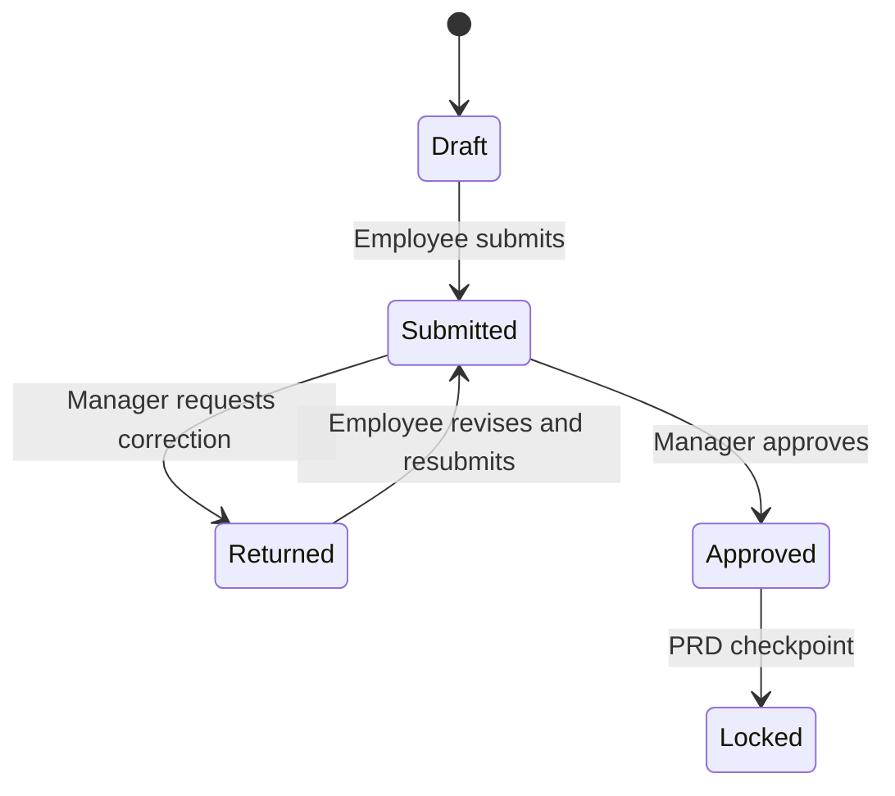
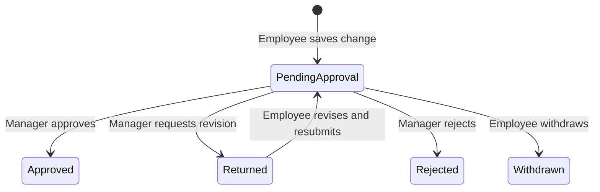

# Weekly Time Reporting and Inspection Deliverables
## System Design Report

**Document Status:** Draft for Business and Technical Review
**Prepared for:** City of Charlotte – Storm Water Services
**Date:** July 30, 2026

**Related architecture:** This resource design is governed by `LAN_OFFLINE_VECTOR_DATA_SYNC_DESIGN_EN.md` and its Chinese counterpart `LAN_OFFLINE_VECTOR_DATA_SYNC_DESIGN.md`. If this document conflicts with the coordinator protocol, repository publication, full-replication, schema migration, retention, or recovery rules in those documents, the LAN data-sync design takes precedence.

---

## 1. Executive Summary

This document proposes a design for two related resources within the Storm Water Portal:

1. **Weekly Time Reporting** – a flexible resource for employees to report field work, leave, and other work activities, with manager review and approval.
2. **Inspection Deliverables** – a task-based resource for measuring whether reports and cost estimates are completed within the required timeframe after field inspection work is completed.

The two resources are related operationally but represent different performance measures:

- Weekly Time Reporting measures an employee’s work activity at a weekly level. Under normal conditions, an employee assigned to a full three-day field schedule may have a target of approximately 21 field hours per week.
- Inspection Deliverables measures the timeliness of specific post-inspection deliverables. A cost estimate is expected to be completed within 14 calendar days after the actual field inspection completion date, subject to the approved holiday-extension rule.

The recommended solution follows the current Portal desktop architecture:

- Packaged, read-only `system.db` provides current user and team identity, Portal resources, permissions, featured-resource configuration, and the approved business-schema catalog.
- Local `stormwater.db` contains synchronized mutable business records, effective-dated operational configuration, workflow events, calculation inputs, and historical results.
- Read-only Cityworks and other enterprise source data are consumed from the workstation-published Portal source database identified by `portal_sources.current.json`.
- All formal business writes and synchronization are performed through the Python data coordinator. React and Rust do not write business tables directly.

The design follows these primary principles:

- Employees report their own time, but only approved entries are used in performance calculations.
- Employees may propose calendar changes for any past, current, or future week, but only manager-approved changes alter the authoritative schedule.
- Business rules must be configurable and versioned rather than hard-coded.
- Every calculated result must be explainable, reviewable, and auditable.
- Incomplete or unresolved data must not be presented as poor employee performance.
- Every synchronized business record must use the Portal coordinator identity, revision, tombstone, and conflict rules.
- Sensitive data must be limited to information that is appropriate for full replication to every authorized Portal desktop.

---

## 2. Purpose and Objectives

The proposed system is intended to:

- Provide one consistent weekly reporting experience for field work, leave, and other work activities.
- Let employees maintain their own calendars without arbitrary week restrictions while preserving manager approval as the authoritative control.
- Support future work categories without creating a new resource for every type of work.
- Allow administrators to determine which employees may use the resource.
- Route employee submissions to the appropriate manager for review.
- Calculate weekly field-hour results fairly when holidays, leave, staffing conditions, or other exceptions apply.
- Track the timeliness of inspection reports and cost estimates separately from weekly field-hour totals.
- Provide transparent calculation details for employees, managers, administrators, and PRD reviewers.
- Preserve historical organizational relationships, approvals, rules, and final results.

---

## 3. Scope

### 3.1 In Scope

- Employee access eligibility
- Weekly time entry
- Field work, leave, and other work categories
- Manager review, approval, and return for correction
- City-observed holiday configuration
- Weekly field schedule configuration
- Employee calendar-change requests, manager approval, and historical recalculation
- Weekly target calculation and adjustment
- PRD-related weekly results
- Inspection deliverable due-date calculation
- Cost estimate completion tracking
- Audit history and result locking
- Role-based access and manager assignment

### 3.2 Out of Scope

- Replacing Workday as the official leave request and approval system
- Payroll processing
- General employee timekeeping for compensation
- Automatically deciding unresolved business policies
- Treating all work categories as field hours
- Combining weekly field-hour performance and deliverable timeliness into one score without an approved PRD rule

The Portal must clearly state:

> Leave entries in this Portal are used for workload and PRD calculations only. They do not replace the official leave request and approval process in Workday.

---

## 4. Resource Model

### 4.1 Weekly Time Reporting

**Primary subject:** Employee
**Primary time period:** Work week
**Primary key concept:** Employee plus week

This resource provides one reporting entry point for:

- Field Work
- Leave
- Training
- Conference attendance
- Emergency Response
- Office Assignment
- Special Assignment
- Other future activity types

The user interface and approval process are shared, but each entry type may have different fields and different effects on calculations.

### 4.2 Inspection Deliverables

**Primary subject:** Inspection or inspection task
**Primary time period:** From actual field completion through deliverable completion
**Primary key concept:** Inspection ID

This resource tracks:

- Actual field inspection completion date
- Report completion date
- Cost estimate completion date
- Calculated due dates
- Timeliness status
- Approved extensions or exceptions

### 4.3 Shared Holiday Calendar

The City-observed holiday calendar is maintained inside the existing Portal Management resource (`ADMBSHVR`). It is not a separate home-page resource. The calendar supports:

- Weekly target adjustments when a holiday affects a scheduled field day.
- Inspection deliverable due-date extensions under the approved holiday rule.

Only authenticated users may read a calendar. Only users whose currently selected role is Admin or System Admin may create, revise, validate, or delete calendars. Authorization is enforced by the Python coordinator command handler and must not rely on hidden React controls.

Exactly one holiday calendar record may exist for a calendar year. Its active holiday rows participate in calculations immediately after a successful save; there is no separate draft or publication state.

### 4.4 Portal Resource Registration

The implementation should register two Portal resources:

1. **Weekly Time Reporting**, expected to use a `RPT` resource type and an eight-character self-declared resource ID.
2. **Inspection Deliverables**, expected to use a `TAB` resource type when its primary interface is an operational table, or `RPT` if the final product is primarily a report.

The final IDs must be generated and declared in separate resource metadata files before logical table ownership is registered. Physical business-table names use stable domain prefixes rather than embedding resource IDs. Resource registration must fail when another resource already owns the same ID.

Each resource metadata file should declare:

- Resource ID, name, type, category, URL, active status, and description
- Required permissions and supported commands
- Help-page URL
- Owned business tables and schema release
- Read-only enterprise source dependencies

When a user opens either resource, Portal passes the selected user, employee ID, team, manager flag, selected role, and effective resource permissions. The resource must use this session context rather than performing a second Windows-account lookup.

---

## 5. Relationship Between the Two Performance Measures

Weekly Field Hours and Inspection Deliverable Timeliness must remain separate calculations.

| Measure | Weekly Field Hours | Inspection Deliverable Timeliness |
|---|---|---|
| Measurement subject | Employee | Inspection/task |
| Time grain | Week | Individual deliverable |
| Primary purpose | Work activity/workload measure | Completion timeliness measure |
| Starting point | Scheduled work week | Actual field inspection completion |
| Common example | Approximately 21 hours in a normal three-day field week | Cost estimate within 14 calendar days |
| Holiday effect | May adjust or exclude the weekly target according to policy | May extend the due date according to policy |
| Output | Weekly employee result | Deliverable status |

The operational connection is:

> Completion of field inspection work establishes the starting date for the inspection deliverable deadline.

The employee’s total weekly field hours do not add to, subtract from, or otherwise change the 14-calendar-day period.

---

## 6. Recommended System Architecture

### 6.1 Logical Data Separation

#### `system.db`

`system.db` is packaged with the Portal release and opened read-only at runtime. Existing `SYS_*` tables remain authoritative for:

- Current users and employee numbers
- Current teams, team hierarchy, and current team manager
- User roles and selected-role support
- Portal resources and resource metadata
- Team- and user-based resource permissions
- Team and user featured resources
- Schema tables, fields, indexes, releases, and migrations
- System audit information created during controlled administration or release maintenance

#### `stormwater.db`

`stormwater.db` is the local synchronized business replica. It should contain:

- Time entries
- Weekly submissions
- Category-specific entry details
- Business workflow events
- Effective-dated schedule templates, employee calendar-change requests, and approved weekly overrides
- Effective-dated reporting eligibility, manager assignments, and approval delegations
- Holiday calendars
- Staffing periods
- Published metric and deadline rules
- Weekly performance results
- Inspection deliverable cases and exceptions
- Performance exceptions
- Calculation inputs, explanations, approvals, and locking history

These records are mutable business data and must be maintained through the coordinator so they are synchronized, revision checked, conflict detected, and included in verified snapshots and backups.

#### Read-only source data

Cityworks inspection and work-order facts must not be copied into editable business tables unless the Portal creates a genuinely new business fact. Inspection Deliverables should query the workstation-published source database selected by the source manifest configured in `portal.settings.json` (currently `portal_sources.current.json`). No resource may contain a hard-coded drive path, server name, IP address, or database location.

### 6.2 Data Ownership Principle

`system.db` answers:

> Who is the current user, what is their current organization and selected role, which resources exist, and what resource permissions do they have?

`stormwater.db` answers:

> What mutable configuration applied for a business date, what did the user submit, how was it reviewed, and what result was calculated?

The workstation-published source database answers:

> What facts currently exist in Cityworks or another enterprise source system?

### 6.3 Cross-Database References

Business tables should reference stable identifiers such as:

- Portal user ID and immutable employee number
- `team_id`
- Manager user ID
- `resource_id`
- Cityworks `INSPECTIONID` or `WORKORDERID` when linking to read-only source facts

Names and email addresses should not be duplicated as authoritative values in every business table. The application should retrieve current display information from `system.db`.

Because these values cross separate databases, SQLite cannot enforce all relationships with foreign keys. The Python coordinator must validate references during every formal command.

Required checks include:

- The employee exists and is active for the relevant date.
- The employee has permission to use the resource.
- The manager is authorized to review that employee for the relevant date.
- Referenced teams, work types, rules, and holidays are active.
- The employee-manager relationship is effective on the submission date.
- A calendar-change reviewer is the employee's effective manager, an active delegated reviewer, or another explicitly authorized reviewer for the affected dates.

### 6.4 Coordinator and Synchronization Contract

Every synchronized mutable table must be registered in the `SYS_SCHEMA_*` catalog through an approved schema release and migration. Every synchronized record must include:

| Field | Requirement |
|---|---|
| `global_id` | Immutable UUID and primary cross-client identity |
| `record_revision` | Coordinator-managed opaque revision used for optimistic concurrency |
| `deleted` | Coordinator-managed tombstone; formal deletes are not physical client-side deletes |
| `geometry_version` | Required only for spatial tables |

Local autoincrement values may be used as implementation details, but they must not be used as synchronization identities or cross-client foreign keys.

The current coordinator uses:

- Full replication of all mutable business tables
- Local SQLite reads from `stormwater.db`
- Coordinator-only formal writes
- Strict record-revision checks
- Immutable operation packages on the shared network repository
- One-minute non-overlapping incremental synchronization while Portal is open
- Verified snapshots, backups, retention, and conflict records maintained by the workstation process

### 6.5 Full-Replication Privacy Constraint

Portal permissions control what a resource displays and which commands a user may execute. They do not remove records from the local synchronized database. Every client receives the complete mutable business dataset.

Therefore:

- Do not store medical information, detailed leave reasons, supporting documents, or other information that a general Portal desktop is not permitted to possess.
- Leave records should use only the minimum operational fields required for workload calculations, such as date, hours, and a broad approved type.
- If policy requires strict row-level confidentiality, Weekly Time Reporting cannot use the current full-replication architecture for that confidential data. It would require a trusted online service or another centrally enforced security boundary.

### 6.6 Future Server Option

If strict data isolation, substantially higher write concurrency, or enterprise integration later requires a server, the same logical model can move to a City-approved SQL Server or PostgreSQL database with separate schemas:

- `system.*`
- `stormwater.*`

This is a future option rather than a requirement for the initial desktop implementation.

### 6.7 Runtime, Deployment, and Workstation Responsibilities

The portable Portal release and each user's writable data must remain separate:

- `system.db` is delivered with the approved Portal configuration and is replaced only by a controlled system-database or full release.
- `stormwater.db` is not packaged as an authoritative business database in the portable distribution.
- On startup, Portal checks the configured shared-data location and synchronizes the local `stormwater.db`; if the local replica does not exist, it bootstraps from the active verified snapshot.
- Resource reads use the local replica and close bounded read-only connections promptly.
- The network repository root is read from `businessSync.networkRoot` in `portal.settings.json`.
- The workstation manager publishes schema baselines and migrations, source-data releases, verified snapshots, retention actions, independent backups, activity views, and conflict information.
- Online operation packages follow the configured seven-day minimum retention, verified snapshots retain the configured five-copy target, and independent weekly backups retain the current 90-day policy.

The resource should expose synchronization and source freshness in plain language, for example:

> Last available data: Jul 30, 2026, 11:30 AM EDT.

When the shared repository is temporarily unavailable, the current coordinator design may allow a clearly labeled degraded read-only mode against the last synchronized local replica. Create, edit, review, approve, delete, and other formal commands remain disabled until synchronization is available.

---

## 7. Identity, Organization, and Access Model

### 7.1 Core Employee Data

The existing `SYS_USERS` and `SYS_TEAMS` data include:

- Employee number
- Email address
- First name
- Last name
- Team
- Team manager
- User roles
- Active status

At application startup, Portal matches the signed-in Windows identity to the user directory by work email address and retains the resulting session. Resources receive that session from Portal and do not repeat account validation.

Business records should use the stable Portal user ID and immutable employee number. Email address remains the Windows-account matching attribute, but names and email addresses must not be business keys.

User IDs must remain stable when `system.db` is rebuilt or published in a new Portal release. Re-seeding must not assign a different user ID to an existing employee.

### 7.2 Effective-Dated Assignments

Current values in `system.db` are suitable for sign-in and current resource access, but not for historical calculations. Effective-dated assignments are mutable reference records and therefore belong in `stormwater.db`.

#### `employee_team_assignments`

| Field | Purpose |
|---|---|
| Coordinator system fields | `global_id`, `record_revision`, and `deleted` |
| `assignment_id` | Stable assignment identifier |
| `user_id` / `employee_number` | Assigned employee |
| `team_id` | Assigned team |
| `effective_from` | Assignment start date |
| `effective_to` | Assignment end date; nullable |
| `is_primary` | Indicates the primary team |

#### `employee_manager_assignments`

| Field | Purpose |
|---|---|
| Coordinator system fields | `global_id`, `record_revision`, and `deleted` |
| `assignment_id` | Stable assignment identifier |
| `user_id` / `employee_number` | Employee being reviewed |
| `manager_user_id` / `manager_employee_number` | Assigned manager |
| `effective_from` | Relationship start date |
| `effective_to` | Relationship end date; nullable |

#### `approval_delegations`

| Field | Purpose |
|---|---|
| Coordinator system fields | `global_id`, `record_revision`, and `deleted` |
| `delegation_id` | Stable delegation identifier |
| `manager_user_id` | Manager granting authority |
| `delegate_user_id` | Temporary reviewer |
| `resource_id` | Resource covered by the delegation |
| `effective_from` / `effective_to` | Delegation period |
| `status` | Draft, Active, Expired, or Revoked |
| `reason` | Required business explanation |

Delegation expands review authority only. It does not grant Manage, Delete, or Admin permission unless those capabilities are separately assigned through Portal resource permissions.

### 7.3 Resource Eligibility

Portal resource access must reuse `SYS_RESOURCES` and `SYS_RESOURCE_PERMISSIONS`. Do not create a second generic resource-authorization system.

If Weekly Time Reporting requires business eligibility beyond ordinary Portal access, use an effective-dated `reporting_eligibility` table owned by the Weekly Time resource.

#### `reporting_eligibility`

| Field | Purpose |
|---|---|
| Coordinator system fields | `global_id`, `record_revision`, and `deleted` |
| `resource_id` | Weekly Time Reporting resource ID |
| `user_id` / `employee_number` | Eligible employee |
| `effective_from` / `effective_to` | Eligibility period |
| `status` | Active, Suspended, or Ended |
| `reason` | Optional business explanation |

### 7.4 Roles

The resource evaluates the user's selected role and effective permissions passed by Portal. A user account may have multiple roles, but only the currently selected role controls the session.

| Selected role or capability | Primary Permissions |
|---|---|
| User with View/Create/Edit | Create, edit, submit, and view their own entries, calendar-change requests, and results |
| Manager flag plus Review | Review assigned employees, approve or return calendar changes and weekly submissions, and view team results |
| Manage | Maintain operational configuration within the resource |
| Admin or System Admin | Manage authorized configuration and preview effective user access |
| Delete | Perform only explicitly allowed business deletes, subject to record state |

Current Portal permissions include View, Create, Edit, Review, Manage, Delete, and Admin-style authority. Business commands must check both the selected role and the required resource capability. Hiding a button is not authorization.

### 7.5 Administrative User Preview

Admin and System Admin users may use the Portal's current user-preview function to verify another user's effective resources, featured items, manager scope, and resource behavior. Preview mode must:

- Recalculate access from the selected user's role, team, hierarchy, and direct permissions.
- Pass the previewed session context to the resource.
- Display a persistent preview banner.
- Disable all coordinator commands and other state-changing actions.
- Return immediately to the administrator's actual session when preview ends.

---

## 8. Weekly Time Reporting Data Model

### 8.0 Physical Naming and Schema Ownership

The logical names in this document are descriptive. Physical table names use the stable `WEEKLY_TIME_` domain prefix, while the registered resource ID remains separate catalog metadata.

Examples:

- `WEEKLY_TIME_ENTRIES`
- `WEEKLY_TIME_SUBMISSIONS`
- `WEEKLY_TIME_SCHEDULE_CHANGES`
- `WEEKLY_TIME_SCHEDULE_OVERRIDES`
- `WEEKLY_TIME_WORKFLOW_EVENTS`
- `WEEKLY_TIME_RESULTS`
- `INSPECTION_DELIVERABLE_CASES`
- `INSPECTION_DELIVERABLE_EXCEPTIONS`

Shared operational reference tables must have one declared owning resource. The owning resource controls their schema and commands; other resources consume them through registered relationships.

### 8.1 Shared Dictionary Catalog

Weekly time types are maintained through the generic Portal dictionary catalog rather than a dedicated table or administration page. The same catalog can support future code lists without adding resource-specific schema or navigation.

#### `SYS_DICTIONARIES`

| Field | Purpose |
|---|---|
| `id` | Internal dictionary identifier |
| `dictionary_key` | Stable machine key, such as `weekly_time_type` |
| `name` | Administrator-facing dictionary name |
| `description` | Optional purpose and usage guidance |
| `is_active` | Controls whether the entire dictionary is available |
| Audit timestamps | Created and updated timestamps |

#### `SYS_DICTIONARY_ITEMS`

| Field | Purpose |
|---|---|
| `id` | Internal item identifier |
| `dictionary_id` | Parent `SYS_DICTIONARIES` record |
| `item_code` | Stable machine-readable value saved by resources |
| `label` | User-facing text that administrators may revise |
| `sort_order` | Display order within the dictionary |
| `is_active` | Hides a value from new selection while preserving historical references |
| `metadata_json` | Optional dictionary-specific flags for future behaviors |
| Audit timestamps | Created and updated timestamps |

The initial `weekly_time_type` dictionary contains Field work, Office work, Leave, Meeting, Training, Conference attendance, Emergency response, Special assignment, and Other. Leave is displayed third.

Administrators maintain dictionaries and their values from one **Dictionaries** page in Portal Management. Machine keys and item codes are immutable after creation; labels, descriptions, status, and display order remain editable. Values are disabled instead of deleted so historical records remain understandable.

The catalog belongs in read-only `system.db`. Changes are distributed through the existing Portal system-database release process. Mutable weekly time entries remain coordinator-managed business data in `stormwater.db` and store the selected stable `item_code`.

### 8.2 Shared Time Entry Table

#### `time_entries`

| Field | Purpose |
|---|---|
| Coordinator system fields | `global_id`, `record_revision`, and `deleted` |
| `entry_id` | Unique entry identifier |
| `submission_global_id` | Parent weekly submission |
| `user_id` / `employee_number` | Employee submitting the entry |
| `entry_type_code` | Stable `SYS_DICTIONARY_ITEMS.item_code` from the `weekly_time_type` dictionary |
| `entry_date` | Date of activity or leave |
| `start_time` / `end_time` | Optional start and end time |
| `hours` | Calculated or entered duration |
| `notes` | Employee notes |
| `source_type` | Manual, Imported, or Calculated |

When start and end times are entered, the system should calculate hours. Manual hours may be allowed for partial-day leave or activities for which exact start/end times are not appropriate.

An entry inherits editability and workflow state from its parent weekly submission. Do not maintain a second independent approval status on every entry unless a confirmed business requirement allows entry-level approval.

### 8.3 Category-Specific Detail Tables

#### `field_work_details`

- Coordinator system fields
- `entry_global_id`
- `activity_type`
- `inspection_id`
- `work_order_id`
- `location`
- `travel_included`
- `field_completion_indicator`

#### `leave_details`

- Coordinator system fields
- `entry_global_id`
- Broad operational `leave_type`
- `workday_reference`
- `affects_scheduled_field_time`
- `official_request_confirmed`

Do not collect medical information, supporting documents, or detailed leave explanations in this full-replication dataset.

#### `other_work_details`

- Coordinator system fields
- `entry_global_id`
- `activity_type`
- `business_purpose`
- `related_project_or_event`

The shared table supports consistent submission and approval. Detail tables prevent unrelated category-specific fields from making the primary table difficult to maintain.

### 8.4 Weekly Submission

#### `weekly_time_submissions`

| Field | Purpose |
|---|---|
| Coordinator system fields | `global_id`, `record_revision`, and `deleted` |
| `submission_id` | Unique submission |
| `user_id` / `employee_number` | Submitting employee |
| `week_start_date` / `week_end_date` | Reporting week boundaries |
| `status` | Draft, Submitted, Returned, Approved, or Locked |
| `submitted_at` | Employee submission time |
| `reviewed_by` / `reviewed_at` | Manager review |
| `employee_comments` | Optional employee explanation |
| `manager_comments` | Review comments |

Individual entries may be edited in draft status, but the weekly submission provides a clear unit for manager review.

The table must enforce one active logical submission per employee and `week_start_date`. Revisions after a return update the same logical submission through coordinator operations rather than creating parallel weekly records.

---

## 9. Employee-Editable Calendar and Approved Schedule Model

The system must know which days an employee was expected to perform field work. A holiday or leave day should not automatically reduce the target if it did not affect a scheduled field day.

Employees may propose changes to their own calendars for any past, current, or future week. The application should not impose a special date-window rule merely because a week is historical or future. Manager approval is the control that determines whether a proposed change becomes part of the authoritative schedule.

The recommended model separates:

- An effective-dated schedule template that supplies the ordinary recurring schedule.
- Employee calendar-change requests that contain proposed changes and approval state.
- Approved weekly schedule overrides that alter the authoritative schedule only after approval.
- A resolved schedule snapshot stored with each calculated or locked weekly result.

This approach keeps calendar editing simple for employees while preserving manager control, reproducible calculations, and historical auditability.

#### `field_schedule_templates`

| Field | Purpose |
|---|---|
| Coordinator system fields | `global_id`, `record_revision`, and `deleted` |
| `user_id` / `employee_number` | Employee |
| `effective_from` / `effective_to` | Template validity |
| `weekday` | Scheduled weekday |
| `scheduled_hours` | Planned field hours |
| `status` | Draft, Published, or Retired |

#### `weekly_schedule_overrides`

| Field | Purpose |
|---|---|
| Coordinator system fields | `global_id`, `record_revision`, and `deleted` |
| `user_id` / `employee_number` | Employee |
| `week_start_date` | Work week |
| `scheduled_date` | Planned field date |
| `scheduled_hours` | Planned field hours |
| `action` | Add, Replace, or Cancel |
| `schedule_change_request_global_id` | Approved request that authorized the override |
| `approved_by` / `approved_at` | Manager approval audit |

Only the coordinator may create an authoritative weekly override, and only from an approved calendar-change request. Proposed or returned changes must never be copied into this table.

#### `schedule_change_requests`

| Field | Purpose |
|---|---|
| Coordinator system fields | `global_id`, `record_revision`, and `deleted` |
| `request_id` | Stable business identifier |
| `user_id` / `employee_number` | Employee whose calendar is changing |
| `status` | Pending Approval, Approved, Returned, Rejected, or Withdrawn |
| `employee_reason` | Employee explanation for the proposed change |
| `submitted_at` | Time the request entered manager review |
| `reviewed_by` / `reviewed_at` | Manager review audit |
| `manager_comments` | Required when returned or rejected |
| `withdrawn_at` | Employee withdrawal time, when applicable |

#### `schedule_change_items`

| Field | Purpose |
|---|---|
| Coordinator system fields | `global_id`, `record_revision`, and `deleted` |
| `schedule_change_request_global_id` | Owning request |
| `scheduled_date` | Date being changed |
| `action` | Add, Replace, or Cancel |
| `original_scheduled_hours` | Approved value visible when the request was submitted |
| `proposed_scheduled_hours` | Employee-proposed value |
| `original_activity_type` | Original approved schedule classification, when applicable |
| `proposed_activity_type` | Proposed schedule classification, when applicable |

The item records preserve a before-and-after comparison for manager review. They are proposals, not authoritative schedule rows.

### 9.1 Calendar Editing Workflow

The employee experience should favor one clear action:

1. The employee opens any week and edits one or more calendar dates.
2. Saving the change creates and immediately submits one calendar-change request.
3. The calendar displays the proposed values with a **Pending Approval** indicator while continuing to use the approved schedule for official calculations.
4. The employee may withdraw a pending request or revise and resubmit a returned request.
5. The manager approves, returns, or rejects the request.
6. Approval atomically creates the authoritative weekly overrides, records workflow events, and evaluates calculation impact.

Pending, returned, rejected, and withdrawn requests do not change official targets or approved results. The UI may preview the possible target effect, but it must label the preview as non-authoritative.

Multiple edits saved together should normally form one request so the manager can review the employee's intended weekly calendar as a coherent change. The coordinator must prevent overlapping active requests from silently changing the same employee and date.

A request must not cross an effective manager-assignment boundary. If one save contains dates owned by different effective managers, the coordinator should split it into separately reviewable requests or reject it with a clear instruction.

### 9.2 Manager Review Context

Before making a decision, the manager should see:

- The original approved calendar and proposed calendar.
- The affected dates, weeks, scheduled hours, and target preview.
- Existing weekly submissions and performance-result states for affected weeks.
- Whether an affected result is approved or locked.
- The employee's reason and prior request history.

Managers may bulk approve requests only when none of the selected requests affects a locked result or contains a validation warning. Returned and rejected requests require a manager comment.

### 9.3 Historical and Locked Weeks

Approving a calendar change for a past week must not silently rewrite a historical result:

- If no weekly result exists, the approved override becomes authoritative for the next calculation.
- If an unlocked result exists, approval marks it `NEEDS_RECALCULATION` and queues deterministic recalculation.
- If an approved but unlocked result exists, it must be recalculated and returned to the required review state.
- If a locked result exists, approval requires an explicit **Reopen and recalculate** confirmation by an authorized manager. The coordinator performs the reopen, override creation, recalculation marking, and workflow-event publication as one formal command.
- If the manager does not confirm reopening, the calendar-change request cannot be approved for that locked week.

The previously approved calculation and resolved schedule remain explainable through workflow events, result snapshots, and immutable coordinator operations.

When a submission is submitted or approved, the coordinator resolves the template, approved overrides, holidays, and applicable rule. The resolved schedule and calculation inputs are preserved with the result so a later template or calendar change does not alter historical outcomes without the controlled recalculation process.

### 9.4 Coordinator Commands and Authorization

The resource should expose narrow coordinator commands rather than a generic table-update operation:

| Command | Required authority | Result |
|---|---|---|
| `SUBMIT_SCHEDULE_CHANGE` | Employee with Create/Edit for their own calendar | Creates the request and items in Pending Approval |
| `WITHDRAW_SCHEDULE_CHANGE` | Request owner while Pending Approval | Marks the request Withdrawn |
| `RESUBMIT_SCHEDULE_CHANGE` | Request owner after Return | Replaces the proposal details and returns it to Pending Approval |
| `RETURN_SCHEDULE_CHANGE` | Effective manager or delegate with Review | Returns the request with required comments |
| `REJECT_SCHEDULE_CHANGE` | Effective manager or delegate with Review | Closes the request as Rejected with required comments |
| `APPROVE_SCHEDULE_CHANGE` | Effective manager or delegate with Review | Creates approved overrides and initiates required recalculation |
| `APPROVE_AND_REOPEN_SCHEDULE_CHANGE` | Authorized manager with Review and reopen authority | Approves a request affecting locked results and atomically reopens and marks them for recalculation |

Each command must validate selected role, effective manager scope, resource permissions, request revision, affected schedule revisions, and result-lock state. React must not reproduce or bypass these authorization decisions.

---

## 10. Holiday Configuration

City-observed holidays are maintained through Portal Management and the Python DataCoordinator. The synchronized business entities are stored in the coordinator-managed records in `stormwater.db`; the application must not perform direct SQL CRUD against domain-specific holiday tables.

#### Coordinator entities

| Entity type | Purpose |
|---|---|
| `ADMBSHVR.holiday_calendar` | One authoritative annual calendar record with its label, notes, and update audit |
| `ADMBSHVR.holiday` | Individual non-working holiday associated with an annual calendar |

Calendar values include `calendar_id`, `calendar_year`, `label`, `notes`, create/update audit fields, and coordinator revision metadata. Calendar status, version, and publication fields are not part of the active model. Holiday values include `holiday_id`, `calendar_id`, `holiday_name`, one canonical `holiday_date`, `holiday_hours`, `day_type`, `adjust_weekly_target`, `extend_due_date`, `notes`, `is_active`, and coordinator revision metadata. The holiday date is the date employees treat as the non-working City holiday. Legacy `actual_date` and `observed_date` values are read using `observed_date` as the canonical date and are normalized when the record is next saved.

#### Lifecycle and operations

1. **Create**: Admin or System Admin creates the single calendar for a year, optionally copying holiday rows from another year. Creating a second calendar for the same year is rejected.
2. **Maintain**: Holidays may be added, edited, deactivated, or deleted. Successful saves are immediately authoritative.
3. **Validate**: The coordinator reports missing active holidays, duplicate active names or dates, and dates outside the selected year. Validation is a data-quality check, not a publication gate.
4. **Delete year**: Admin or System Admin may delete an annual calendar after explicit confirmation. The coordinator atomically deletes the calendar and all of its holiday rows.

Copying a prior year shifts dates by the year difference for convenience, but the administrator must review moving holidays before relying on the new calendar.

The read-only endpoint for business resources remains `GET /api/holidays/published?year=YYYY` for compatibility, but it returns the sole annual calendar and does not imply a publication workflow. Administration commands are under `/api/admin/holidays/calendars`. Future weekly reporting calculations must save the calendar ID, calculation timestamp, and resolved holiday dates used. Approved result snapshots preserve reproducibility without creating multiple annual calendar versions.

---

## 11. Business Rules and Versioning

#### `metric_rules`

| Field | Example |
|---|---|
| Coordinator system fields | `global_id`, `record_revision`, and `deleted` |
| `metric_rule_id` | Unique rule identifier |
| `metric_code` | WEEKLY_FIELD_HOURS |
| `rule_version` | 1.0 |
| `effective_from` / `effective_to` | Rule validity |
| `standard_field_days` | 3 |
| `hours_per_field_day` | 7 |
| `standard_weekly_target` | 21 |
| `partial_day_method` | PRORATED |
| `minimum_eligible_time` | Business-defined threshold |
| `holiday_treatment` | INCLUDE, ADJUST, EXCLUDE, or REVIEW |
| `leave_treatment` | Configurable by leave type |
| `staffing_treatment` | INCLUDE, ADJUST, EXCLUDE, or REVIEW |
| `status` | Draft, Published, or Retired |

Rules must have effective dates and versions. A change to a future target must not silently recalculate previously approved or locked results.

Rule configuration should be bounded and typed. Administrators may select approved options and numeric parameters, but they should not enter arbitrary executable formulas or Python expressions.

#### `staffing_exceptions`

| Field | Purpose |
|---|---|
| Coordinator system fields | `global_id`, `record_revision`, and `deleted` |
| `exception_id` | Stable exception identifier |
| `team_id` | Affected team |
| `effective_from` / `effective_to` | Affected period |
| `exception_type` | Approved bounded type |
| `recommended_treatment` | Include, Adjust, Exclude, or Review |
| `status` | Draft, Approved, Expired, or Revoked |
| `approved_by` / `approved_at` | Approval audit |
| `reason` | Business explanation |

---

## 12. Weekly Calculation Logic

### 12.1 Calculation Sequence

For each eligible employee and work week, the Python coordinator should execute a deterministic calculation:

1. Confirm that the employee was active and eligible for the resource.
2. Resolve the employee’s team and manager for the relevant date.
3. Retrieve the employee’s scheduled field days and hours.
4. Retrieve approved field-work entries.
5. Retrieve approved leave and other applicable exceptions.
6. Identify active City holidays affecting scheduled field time.
7. Identify approved team staffing conditions.
8. Select the effective metric rule version.
9. Determine whether the week should be included, adjusted, excluded, or sent for review.
10. Calculate the actual field hours and adjusted target.
11. Generate a human-readable calculation explanation.
12. Route the result for manager review.
13. Lock the approved result at the appropriate PRD checkpoint.

React may preview calculations for usability, but only the coordinator-generated calculation is authoritative. The coordinator must save the rule version, holiday calendar ID, resolved holiday dates, resolved schedule, relevant input record revisions, and a structured explanation.

### 12.2 Calendar-Change Recalculation

An approved calendar-change request is a calculation input change. The coordinator must identify every affected employee-week and:

1. Save the approved schedule overrides.
2. Record the calendar approval and any required reopen event.
3. Mark existing affected results `NEEDS_RECALCULATION`.
4. Recalculate from the approved schedule, approved time records, holidays, exceptions, and effective rule version.
5. Route recalculated results back through the applicable manager review or locking workflow.

The coordinator must complete these actions atomically within the formal business command. A calendar approval must never leave authoritative overrides published while the affected result still appears current.

### 12.3 Target Calculation

When the applicable policy is proportional adjustment:

\[
\text{Adjusted Target Hours}
=
\text{Base Target Hours}
\times
\frac{\text{Eligible Scheduled Field Hours}}
{\text{Standard Scheduled Field Hours}}
\]

For a normal three-day field schedule:

- Standard scheduled field hours: 21
- One full seven-hour scheduled day removed: adjusted target of 14
- One half-day removed: adjusted target of 17.5

These examples demonstrate system capability and must not be treated as final policy unless the business owner approves proportional adjustment.

### 12.4 Weekly Result States

- `ON_TRACK`
- `BELOW_TARGET`
- `PENDING_REVIEW`
- `EXCLUDED`
- `INCOMPLETE_DATA`
- `NOT_APPLICABLE`

The system must not classify the following conditions as below target:

- The employee has not submitted the week.
- The manager has not completed review.
- Leave information is unresolved.
- A staffing exception requires a decision.
- A source synchronization failed.
- The week is excluded.
- Applicable schedules or rules are missing.

---

## 13. Weekly Performance Result

#### `weekly_performance_results`

| Field | Purpose |
|---|---|
| Coordinator system fields | `global_id`, `record_revision`, and `deleted` |
| `result_id` | Unique result |
| `user_id`, `employee_number`, and `week_start_date` | Employee and week |
| `actual_field_hours` | Approved hours counting as field work |
| `base_target_hours` | Original target |
| `adjusted_target_hours` | Final calculated or approved target |
| `eligible_field_hours` | Eligible scheduled field time |
| `completion_rate` | Actual divided by adjusted target, when applicable |
| `evaluation_status` | Included, Adjusted, Excluded, or Pending Review |
| `performance_status` | On Track, Below Target, etc. |
| `calculation_details` | Structured calculation explanation |
| `rule_version` | Rule used |
| `holiday_calendar_id` | Annual holiday calendar used |
| `resolved_holidays` | Holiday dates applied by the calculation |
| `review_status` | Pending, Approved, Returned, or Locked |
| `approved_by` / `approved_at` | Approval audit |
| `calculated_at` | Calculation timestamp |

The table must enforce one current logical result per employee and week. Historical changes remain available through immutable operation packages and business workflow events; approved result snapshots preserve the human-readable values needed for audit.

When a manager opens a result, the Portal should display:

- Original target
- Adjusted target
- Actual result
- Date range used
- Scheduled field dates
- Applied holidays, leave, and exceptions
- Final calculation method
- Rule version, holiday calendar ID, and resolved holiday dates
- Approver and approval date

---

## 14. Inspection Deliverables Design

### 14.1 Read-only Inspection Source

Cityworks remains authoritative for inspection facts. The resource should query the locally published source database referenced by `portal_sources.current.json` and use the Cityworks `INSPECTIONID` as the enterprise source key.

The initial implementation should not create an editable duplicate `inspections` table in `stormwater.db`. It should read:

- Inspection ID and type
- Assigned or inspected-by employee
- Team or submit-to values
- Planned date
- Actual field start and completion dates
- Report or cost-estimate completion source fields
- Current inspection status
- Source database publication timestamp or snapshot identifier

The business owner must identify the authoritative Cityworks field for each date before calculations are implemented.

### 14.2 Portal-owned Deliverable Case

#### `inspection_deliverable_cases`

| Field | Purpose |
|---|---|
| Coordinator system fields | `global_id`, `record_revision`, and `deleted` |
| `deliverable_id` | Unique deliverable |
| `inspection_id` | Related Cityworks inspection ID |
| `deliverable_type` | Report, Cost Estimate, or another type |
| `trigger_date` | Normally actual field completion date |
| `initial_due_date` | Trigger date plus 14 calendar days |
| `adjusted_due_date` | Due date after approved holiday adjustment |
| `completion_date` | Actual completion |
| `timeliness_status` | On Time, Overdue, Pending, Excluded, or Review |
| `extension_reason` | Reason for adjusted deadline |
| `rule_version` | Deadline rule version |
| `approved_by` / `approved_at` | Exception approval |
| `source_publication_id` | Source version used for the calculation |
| `source_input_snapshot` | Minimum source values needed to explain the result |

Only Portal-owned decisions, exceptions, calculation outcomes, and workflow state are synchronized to `stormwater.db`. Current descriptive inspection facts are joined from the read-only source database.

### 14.3 Deliverable Exceptions

#### `inspection_deliverable_exceptions`

| Field | Purpose |
|---|---|
| Coordinator system fields | `global_id`, `record_revision`, and `deleted` |
| `deliverable_global_id` | Related synchronized deliverable case |
| `exception_type` | Approved bounded exception type |
| `requested_due_date` | Proposed adjusted due date |
| `reason` | Required business explanation |
| `status` | Draft, Submitted, Approved, Returned, or Rejected |
| `submitted_by` / `submitted_at` | Request audit |
| `reviewed_by` / `reviewed_at` | Review audit |
| `review_comments` | Reviewer explanation |

An approved exception updates the case's effective due date through a coordinator command. The exception record and workflow event preserve why the date changed; users must not directly overwrite a calculated due date.

### 14.4 Cost Estimate Deadline

The currently understood rule is:

> Cost estimates should normally be completed within 14 calendar days following the actual field inspection completion date. City-observed holidays may extend the deadline according to the approved business rule.

The field inspection duration occurs before the deadline period begins. If a field inspection spans multiple days, the final actual field completion date should be used as the trigger.

### 14.5 Holiday Extension

The implementation must apply the exact holiday-extension policy approved by the business owner. Possible interpretations include:

- Extend only when the calculated due date falls on a City-observed holiday.
- Add one day for every City-observed holiday occurring anywhere within the 14-day period.
- Move a due date falling on a non-working day to the next business day.

This policy must remain configurable until confirmed.

### 14.6 Recommended First Resource

Inspection Deliverables should be implemented before Weekly Time Reporting because:

- It can reuse the existing workstation source-data publication.
- It stores less sensitive personal information.
- Its Portal-owned mutable data is smaller and has a clearer enterprise source key.
- It validates resource metadata, coordinator commands, schema migrations, review permissions, and audit events before introducing weekly employee time data.

---

## 15. User Experience and Desktop Portal Logic

### 15.1 Employee Experience: My Weekly Time

The employee should:

1. Open any past, current, or future reporting week.
2. View planned field days and the current target.
3. Propose calendar changes when the planned schedule is incorrect.
4. See approved and pending calendar values as visually distinct layers.
5. Select **Add Entry**.
6. Select an entry type.
7. Complete the dynamic fields for that type.
8. Save the entry as a draft.
9. Review system validation messages.
10. Submit the week to the manager.
11. View calendar approval, weekly approval, returned comments, and the resulting weekly calculation.

Calendar changes should be intentionally lightweight: saving a calendar change submits it for approval without requiring a separate draft-and-submit sequence. The employee can withdraw a pending request and revise a returned request. Rejected requests remain visible in history but cannot be edited.

Recommended validations:

- Overlapping time entries
- End time before start time
- Missing required details
- Unusually long duration
- Duplicate inspection or work-order references
- Leave entered without Workday confirmation, when required
- Entry outside the selected reporting week

### 15.2 Dynamic Entry Form

The form should begin with **Entry Type** and display only relevant fields:

- **Field Work:** date, start/end time, activity, inspection/work order, location, travel indicator, notes.
- **Leave:** date, hours, leave type, effect on scheduled field work, Workday confirmation.
- **Other Work:** date, start/end time or hours, activity type, business purpose, related project/event.

### 15.3 Manager Experience: Weekly Time Review

The manager should see:

- Calendar-change requests awaiting review
- Original and proposed calendars with target impact
- Past weeks that require recalculation
- Locked weeks that require explicit reopen confirmation
- Employees who have not submitted
- Submitted weeks awaiting review
- Scheduled field time
- Reported field work
- Leave and other exception entries
- Original target
- System-recommended adjusted target
- Actual approved field hours
- System result and warnings
- Items requiring a policy decision

The manager should be able to:

- Approve, return, or reject calendar-change requests
- Bulk approve uncomplicated calendar changes
- Reopen and recalculate an affected locked week through one explicit command
- Approve a weekly submission
- Return it for correction
- Review individual entries
- Approve applicable exceptions
- Accept or override the system-recommended treatment
- Enter a required reason for any manual target change
- Bulk approve submissions with no warnings
- Lock final results at the appropriate PRD checkpoint

### 15.4 Administrator Experience

Administrators should be able to manage:

- Resource eligibility
- Employee and manager assignments
- Approval delegation
- Time entry types
- Metric rules
- City-observed holidays
- Staffing exceptions
- Effective dates and published versions
- Audit history

### 15.5 Recommended Portal Pages

The first version should avoid creating seven separate Portal resources. Recommended navigation is:

1. **Weekly Time Reporting** resource
   - My Week
   - My Calendar and Change History
   - History and Results
   - Manager Review, including Calendar Changes and Weekly Submissions, shown only with Review permission and manager scope
   - Resource Settings, shown only with Manage or Admin authority
2. **Inspection Deliverables** resource
   - My Queue
   - Team Queue, shown only to managers or authorized reviewers
   - Exceptions and Due Dates
   - Resource Settings, shown only with Manage or Admin authority

Holiday, entry-type, rule, eligibility, and delegation screens are modes within the owning resource or Portal Management. They do not need separate home-page resource cards unless the business later identifies a distinct audience or permission boundary.

---

## 16. Workflow and Status Design

Weekly submission, calculation, exception, and deliverable states should be managed separately. Individual time entries normally inherit the weekly submission state.

Calendar-change requests use a separate, simpler workflow:

`Approved`, `Rejected`, and `Withdrawn` are terminal request states. A later calendar change creates a new request rather than mutating an approved request.

Calculation state is separate:

- `CURRENT`
- `NEEDS_RECALCULATION`
- `PENDING_POLICY_REVIEW`
- `BLOCKED_INCOMPLETE_DATA`

Performance outcome is also separate:

- `ON_TRACK`
- `BELOW_TARGET`
- `EXCLUDED`
- `NOT_APPLICABLE`

This prevents a submission workflow status from being confused with a performance outcome.

Recommended principles:

- Employees can edit time entries only while the related weekly submission is draft or returned.
- Employees may propose calendar changes for any past, current, or future week.
- Pending calendar changes are visible but do not affect official calculations.
- Only manager-approved calendar changes create authoritative schedule overrides.
- Approved records require a controlled reopen action.
- Reopened records must be resubmitted and reapproved.
- Locked records cannot be changed through normal entry screens.
- Corrections to locked periods require an authorized adjustment with a complete audit trail.

---

## 17. Approval and Audit Design

#### `workflow_events`

| Field | Purpose |
|---|---|
| Coordinator system fields | `global_id`, `record_revision`, and `deleted` |
| `event_id` | Unique event |
| `entity_type` | Time Entry, Weekly Submission, Calendar Change, Exception, Result, or Deliverable |
| `entity_global_id` | Related synchronized record |
| `action` | Submit, Withdraw, Return, Approve, Reject, Reopen, Recalculate, or Lock |
| `actor_user_id` / `actor_employee_number` | Person performing the action |
| `action_at` | Event timestamp |
| `previous_status` / `new_status` | Status transition |
| `reason` | Required for return, override, rejection, or reopen |

Immutable coordinator operation packages provide the technical history of every formal write. `workflow_events` provide the business-readable history users need in the UI. The two histories complement rather than replace each other.

At approval or locking time, the result should preserve historical display snapshots:

- Employee name
- Employee number
- Team
- Manager
- Rule version
- Holiday calendar ID and resolved holiday dates
- Base and adjusted targets
- Applied exception IDs
- Approved calendar-change request IDs
- Resolved schedule before and after recalculation, when applicable
- Calculation explanation

Snapshot fields support historical explanation but do not replace the authoritative current employee directory.

---

## 18. Security and Privacy

The desktop application has no FastAPI service or REST backend. Authorization must be enforced by the Python coordinator command handler using the selected user, selected role, manager scope, and resource permissions passed by Portal. React control visibility is only a convenience.

Key controls:

- Employees may access only their own detailed time and leave records.
- Managers may access only employees within their authorized scope and effective assignment period.
- Administrators may configure the system, but the current full-replication architecture cannot guarantee that locally replicated rows are technically absent from their machine.
- PRD reviewers should receive only the level of detail required for their role.
- General users should not see individual employee performance or leave information.
- Every approval, override, and configuration change should be logged.

Where possible, leave reporting should use the minimum necessary detail. Sensitive medical information should not be collected in notes.

The business owner must acknowledge the following architectural boundary before Weekly Time Reporting is approved for production:

> Portal's v1 business-data coordinator fully replicates all mutable business tables to each client. It supports command authorization and UI filtering, but it is not a row-level confidential data store.

---

## 19. Concurrency and Technology Considerations

The current Portal production design already avoids direct concurrent writes to one shared SQLite file:

- Each desktop reads and writes its own local `stormwater.db`.
- React invokes Tauri commands; Rust invokes the packaged Python coordinator.
- The coordinator is the only formal writer.
- Formal saves publish immutable operation packages to the network repository.
- Clients incrementally apply committed operations to their local replica.
- Record revisions and shared locks detect conflicting edits.
- The workstation manager publishes verified snapshots, maintains retention and backups, validates schema releases, and exposes conflicts and activity.

No writable SQLite or DuckDB database may be opened directly from the shared network drive by a resource. Read-only enterprise data is consumed from workstation-published SQLite or DuckDB sources and closed after each bounded read.

This architecture is appropriate for the current small intranet user population and modest write frequency. A centralized service remains the future option if confidentiality, write volume, or centralized enforcement exceeds the coordinator design.

---

## 20. Reporting Requirements

### 20.1 Employee View

- Current week target
- Approved calendar and pending calendar-change overlay
- Calendar-change status and history for any past, current, or future week
- Approved actual hours
- Pending entries
- Applied adjustments
- Submission and review status
- Personal historical results

### 20.2 Manager View

- Calendar-change approval queue and impact preview
- Past-week recalculation and locked-week reopen warnings
- Submission completion by employee
- Weekly actual versus target
- Adjusted and excluded weeks
- Unresolved exceptions
- Below-target results only after data and review are complete
- Inspection deliverables approaching or past due

### 20.3 PRD/Audit View

- Approved and locked results
- Rule version
- Calculation details
- Exception treatment
- Approval history
- Correction and reopen history
- Clear distinction between performance results and incomplete data

---

## 21. Recommended Implementation Phases

### Phase 1: Architecture, Privacy, and Rule Confirmation

- Confirm that the fully replicated coordinator dataset is acceptable for the minimum weekly reporting fields.
- Exclude medical details, supporting documents, and confidential leave narratives.
- Confirm employee eligibility and manager responsibilities.
- Confirm which activities count as field hours.
- Confirm whether travel and field documentation count.
- Confirm treatment of holidays, leave, partial days, and staffing shortages.
- Confirm the exact holiday extension method for the 14-day deliverable deadline.
- Identify the authoritative Cityworks fields for field completion, report completion, cost estimate completion, and assignment.
- Decide whether Inspection Deliverables is registered as a `TAB` or `RPT` resource.

### Phase 2: Resource and Schema Foundation

- Generate and reserve the two self-declared resource IDs.
- Add separate metadata and help files for both resources.
- Register the resources, URLs, categories, supported commands, and permissions in `system.db`.
- Assign stable business-domain physical table names without embedding resource IDs.
- Register every mutable table, field, index, and relationship in `SYS_SCHEMA_*`.
- Author and test the typed schema through the workstation manager's hybrid
  Portal/Alembic workflow, then publish an approved baseline schema release.
- Add coordinator command handlers, validation rules, and workflow-event creation.
- Verify full synchronization, revision conflicts, snapshots, backups, and schema migration on test replicas.

### Phase 3: Inspection Deliverables First

- Implement bounded read-only queries against the source database selected by `portal_sources.current.json`.
- Implement the deliverable case and exception tables.
- Implement 14-calendar-day calculation.
- Implement approved holiday extension logic.
- Add personal, team, due, overdue, exception, and review modes according to effective permissions.
- Preserve the source publication identifier and minimum calculation inputs.
- Validate source refresh timestamps and unavailable-source behavior.

### Phase 4: Weekly Time Prototype

- Start with field-work entries, effective schedules, employee-editable calendars, weekly submissions, and manager review.
- Allow employees to submit calendar changes for any past, current, or future week.
- Implement calendar-change requests, request items, approved weekly overrides, withdrawal, return, rejection, and bulk approval.
- Implement deterministic recalculation and explicit **Reopen and recalculate** handling for locked historical weeks.
- Add coordinator-generated calculations and human-readable explanations.
- Implement resource eligibility, assignments, delegations, holidays, rules, and staffing exceptions.
- Use representative normal, partial-week, holiday, returned, conflict, and reassignment test cases.
- Confirm that every command checks the selected role, effective manager scope, and resource capability.

### Phase 5: Expansion and Production Hardening

- Add only the minimum approved leave and other-work fields after privacy review.
- Validate calculations with managers.
- Add result locking.
- Add monthly, quarterly, and annual summaries.
- Document correction and appeal procedures.
- Exercise offline read-only behavior, operation replay, conflict handling, schema migration, snapshot recovery, and retention.
- Confirm that resource reads use bounded local connections and that all formal writes use the coordinator.
- Complete user acceptance, privacy, security, backup, recovery, and workstation operating procedures.

---

## 22. Open Business Questions

The architecture supports the following choices, but they must be confirmed before final implementation:

The calendar policy is already decided and is not an open question: employees may propose changes for any past, current, or future week; manager approval makes the change authoritative; pending changes do not affect calculations; and locked historical results require explicit reopen and recalculation.

1. Does the approximately 21-hour weekly target apply to every eligible employee or only to specific job assignments?
2. Which activities count as field hours: travel, field documentation, meetings at field locations, or other related work?
3. When a holiday affects a scheduled field day, should the week be adjusted, excluded, or reviewed?
4. How should vacation, sick leave, training, and partial-day leave affect the target?
5. How should reduced team staffing affect an individual employee’s weekly evaluation?
6. What minimum amount of eligible scheduled field time is required before a week can be evaluated?
7. If a manager changes a system-recommended target, who may approve the override?
8. For the 14-calendar-day cost estimate rule, does a holiday extend the deadline only when it falls on the due date, or whenever it falls within the 14-day period?
9. If the due date falls on a weekend, does it remain the due date or move to the next business day?
10. If follow-up field work is required, does the deliverable clock restart, pause, or remain unchanged?
11. Does the business approve full replication of the proposed minimum weekly reporting dataset to every Portal desktop?
12. Which exact Cityworks fields are authoritative for actual field completion, report completion, cost estimate completion, employee assignment, and inspection status?

---

## 23. Recommended Final Design Decision

The recommended solution is:

> One **Weekly Time Reporting** resource with a unified entry, employee-editable calendar, and manager-approval experience, configurable entry types, category-specific details, and versioned calculation rules; and one **Inspection Deliverables** resource for task-based completion deadlines. Employees may propose calendar changes for any week, but only approved changes become authoritative. Both resources use the current Portal desktop session, Python data coordinator, synchronized `stormwater.db`, read-only `system.db`, and workstation-published enterprise source data.

The system should preserve the separation between:

- Current identity/access data in `system.db` and mutable business data in `stormwater.db`
- Portal-owned decisions and read-only Cityworks source facts
- Current directory data and effective-dated historical assignments
- Raw entries, workflow state, calculation state, and performance outcomes
- Proposed calendar changes, approved schedule overrides, and resolved historical schedules
- Weekly workload measures and inspection deliverable timeliness
- Automated recommendations and manager-approved outcomes
- UI visibility and coordinator-enforced authorization

Physical business-table names must use stable business-domain prefixes and must not embed resource IDs. Resource ownership remains in `SYS_SCHEMA_TABLES.resource_id` and stable logical table IDs. Structural changes are authored as typed Manager drafts and executed by the Portal-controlled Alembic migration layer; every physical rename must be published through the existing `SYS_SCHEMA_*` release and migration workflow. Mutable holidays, rules, schedules, eligibility, delegations, and workflow history belong in synchronized `stormwater.db`; they must not be edited in packaged read-only `system.db`.

This design supports the current field-hour requirement while allowing the Portal to expand to other work activities without redesigning the resource. It also keeps calculations reproducible and auditable within the current offline-first architecture. Production approval of Weekly Time Reporting remains conditional on accepting the full-replication privacy boundary or moving confidential fields behind a centrally enforced service.
